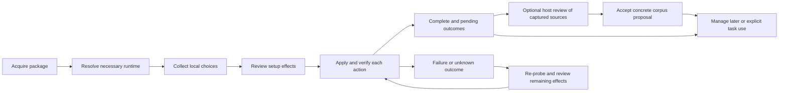

# Agent-bios installation interface research and design

## Recommendation

Use a short, goal-led setup flow over one deterministic installation plan. Keep the complete text interface available without Textual; enhance selection and preview when a compatible Textual runtime already exists or the person explicitly chooses it. Use the host agent for semantic review of imported instructions, and retain Corpus Studio for sustained browsing and editing. App registration and use of corpus in a particular task remain separate choices.

This gives each operation an appropriate interface without requiring an account, a new UI package, or corpus activation just to install agent-bios. It also preserves the product's defining constraint: agent-bios manages its own instruction resources while native global and project instruction files remain user-owned.

The recommendation is an architecture and interaction proposal. It is not approval to deploy a new installer, change current defaults, or register anything in a native host. The accompanying clickable design performs no installation. Public npm releases must not be described as containing this proposal before the corresponding implementation is released.

## Evidence and comparison method

Nine AI CLI applications were examined through official documentation and public source. Codex and Gemini were inspected at release-tag commits; most other open implementations were inspected at a recorded development commit. A development commit is evidence of that source tree, not a guarantee about an installed release. Claude's public repository does not expose its current first-run implementation, so its sequence is documentation-backed and its UI library remains unverified. OpenHands CLI is an inspectable historical pattern: its pinned README explicitly marks it no longer actively maintained.[^claude][^openhands]

No external installer, OAuth flow, model request, or host registration was executed for this comparison. The evidence establishes branches and persistence mechanisms, not observed completion rates, user satisfaction, accessibility quality, or installation reliability. Earlier agent-bios tests and exported screens describe this checkout only. They do not turn this comparative study into a live benchmark.

The comparison separates stages that are often conflated under “installation”:

| Stage | Question it answers | Typical effect |
| --- | --- | --- |
| Acquisition | How does someone obtain the program before its command exists? | Package download or archive extraction |
| Runtime preparation | Can the executable and its dependencies run? | Binary, Python environment, PATH or package changes |
| Host/account setup | Which execution host, provider or account is usable? | Host settings or credentials |
| Project/personal setup | Which local resources and preferences are relevant? | Project trust, source initialization or user settings |
| First useful action | What can the person do now? | A task, a selected capability or a context preview |
| Reconfiguration/recovery | How does a later change or interruption resume? | Targeted repair or configuration update |

For each stage, the review records whether it is conditional, what it writes, what requires a network or model, and how cancellation changes the outcome. Sequences describe the visible branch or dialog priority, not a universal order across all platforms or a claim that asynchronous initialization cannot overlap. A source-backed behavior, a proposed adaptation and an unverified outcome are kept distinct. The companion source index preserves revisions and exact links.

## What the applications actually do

| Application | Observed sequence | Useful pattern | Boundary not to copy |
| --- | --- | --- | --- |
| Codex CLI | Platform installation → welcome → authentication when needed → directory trust when needed → task composer | Conditional onboarding; explicit trust scope; retry a failed trust write | The host owns credentials and execution trust; agent-bios does not[^codex] |
| Claude Code | Native/package-manager installation → login, API-key approval or provider setup → applicable project controls → task; instruction initialization is separate | Separate executable installation, account readiness and project content creation | Do not assume a universal theme/auth/trust order or infer a current framework from old screenshots[^claude] |
| Gemini CLI | Install/run package → resolve saved state → trust dialog when needed, with project capability preview → required authentication → task | Show discovered effects before consent; distinguish folder, parent and restricted mode | Project-trust privileges are not corpus-selection privileges[^gemini] |
| Hermes Agent | Bash runtime/dependency bootstrap → Python setup menus → Quick, Full or Blank Slate configuration → start/diagnose | Explicit setup modes; targeted reconfiguration; machine-readable installation stages | Broad dependency/service setup and retained essential skills have different scope from no active corpus[^hermes] |
| Q00/Ouroboros | Bash bootstrap → runtime-specific setup → in-agent `ooo setup`; optional separate model/settings interface | Runtime preparation, host-guided setup and ongoing settings are distinct surfaces | Host discovery can lead to broader registration/refresh than agent-bios permits[^ouroboros] |
| OpenCode | Binary/package installation → contextual provider/auth/model dialogs → explicit project `/init` → task | Repair a missing capability in context and return to the task | `/init` writes project AGENTS.md; agent-bios import preserves its sources[^opencode] |
| Goose | Binary installation → configuration now or later → small initial provider path or manual setup → provider test → session | A deferred setup is a named state; rerunning configuration opens a broader hub | Its readiness probe can make a model request, unlike local dependency inspection[^goose] |
| Aider | Isolated Python installation → project and supplied credentials/model → conditional onboarding → task; extras at first demand | Reuse available capabilities; ask for an optional dependency where it becomes useful | Do not adopt default-model assumptions or project identity writes[^aider] |
| OpenHands CLI | Binary/uv installation → essential first-run settings modal → validate/save → workspace; later settings expose more | Small initial form, dependent inputs, explicit save/cancel | Its mandatory model gate is inappropriate for agent-bios's local-only path; the examined CLI is unmaintained[^openhands] |

### Installation UI and runtime UI are different architectural choices

The source does not support choosing a framework simply because another agent's main screen looks attractive. Codex's onboarding uses Rust/Ratatui. Gemini's dialog layer uses React and an Ink fork. OpenCode's TUI uses OpenTUI/Solid, Goose's configuration uses Rust `cliclack`, and Aider uses prompt_toolkit/Rich. These are implementation observations, not comparative usability scores.[^frameworks]

Hermes is particularly instructive: its shell bootstrap, custom curses setup menus, React/Ink conversation TUI and separate desktop bootstrap are different components. Ouroboros likewise combines shell bootstrap, Typer/Rich setup commands, an agent-readable setup procedure and a separate Textual settings application. Its setup skill describes expected host behavior; that is weaker enforcement than an executable transaction controller.[^hermes-ui][^ouroboros-ui]

Textual supports an inline mode beneath the shell prompt as well as full-screen applications. Its documentation excludes Windows from inline support; agent-bios currently targets macOS and Linux. Inline rendering is therefore a plausible candidate, but split-terminal height, screen-reader behavior and keyboard handling still need testing. A library capability is not evidence that a particular wizard is usable.[^textual]

### Defaults and escape paths encode product policy

Codex can end onboarding when directory trust is declined; Gemini can retain restricted mode. Hermes's Blank Slate deliberately retains essential capability and a management skill. Ouroboros's piped shell route can choose a runtime differently from an interactive script invocation. These are useful reminders to inspect the exact branch behind a label or one-line command, rather than treating “minimal,” “cancel,” or “interactive install” as universal contracts.[^codex][^gemini][^hermes-minimal][^ouroboros-selection]

For agent-bios, declining corpus must be a valid successful outcome. Detecting a host cannot authorize registering into it. A source file being captured cannot mean its contents were reviewed or applied. These requirements come from agent-bios's decisions, not from an average of competitors' defaults.[^repo]

## Methods used to design the interface

**Comparative journey audit.** Normalize the stages above before comparing screens. A single command that installs dependencies, configures a host and starts a background service has not eliminated those operations; it has moved their decisions or defaults. This prevents a misleading ranking by command count.

**Question protocol.** Every question must identify the decision it changes, why the answer is needed now, the valid skip path, the resulting state and the owner of any effect. GOV.UK's question-page guidance supports focused questions, visible Back behavior and reuse of entered answers. Its guidance comes from web services, so terminal layout and key choices require adaptation rather than literal imitation.[^questions]

**Progressive disclosure.** Show the choices needed for the current goal, with a clear route to the complete inventory and technical details. This reduces the initial decision surface without hiding material effects. The underlying principle is established interface guidance; no agent-bios completion-rate improvement is claimed without a user study.[^disclosure]

**Review and repair.** Present a readable summary before an operation, let someone edit one section, and return them to review with prior input preserved. GOV.UK's check-answers pattern is a useful model for that return path.[^review]

**CLI contracts.** Human interaction must coexist with flags, JSON, meaningful exit behavior and interruptibility. The Command Line Interface Guidelines recommend explicit noninteractive paths and honest progress/error reporting. They explicitly do not cover full-screen terminal applications, so they support our CLI boundary rather than proving our Textual layout.[^clig]

**Scenario walkthrough followed by participant testing.** Source review can reveal a missing path or contradictory state. It cannot establish that a novice understands the result. The acceptance scenarios below define what a prototype must demonstrate before the rich renderer becomes the default for eligible terminals.

## Agent-bios requirements and current gaps

The accepted requirements are selectable dependencies, no active corpus or specific selections, source-preserving personal corpus creation, and optional per-task Codex app use. The native-global preservation and explicit app invocation decisions remain controlling constraints. The invocation is `$agent-bios`; the corpus concept and `agent-bios corpus` CLI remain unchanged.[^repo]

The current setup already separates dependency actions, selection, app registration, source capture and final Apply. It has a numbered interface and complete non-TTY command paths. The important remaining problems are about the journey, not just rendering:

1. **Python precedes the dependency chooser.** `install.sh` refuses to enter the private installer without Python 3.11+. A Python-based chooser cannot solve that first prerequisite itself. Acquisition and a minimal shell preflight need their own path.
2. **The first decision is a dependency inventory.** Users encounter tool names before choosing what they intend to use. Requirements should be explained in relation to the chosen route while the full inventory remains available.
3. **Package identifiers are primary labels.** A choice such as `@agent-bios/core/builder-base` is precise but asks a new user to understand implementation naming. Show a human description first and retain the exact identifier in details and machine output.
4. **Project entry requires a JSON list.** That syntax is appropriate for automation, not the primary human path. Use a path field and explicit detected-source choices.
5. **A configuration preview exposes machine detail too early.** Revision hashes and file inventories are valuable evidence, but the main review must summarize actions, destinations and pending work. Preserve exact details behind an inspection control.
6. **Installation success is only one result.** A bridge link may need native discovery confirmation, captured instructions may await semantic review, and the current app task may still have no added corpus. Present those states individually.[^repo-code]

“No active corpus” must also be described accurately. The current package retains its private bundled library even when it emits no corpus instruction body or management bootstrap. The interface must not promise a corpus-free download or empty on-disk library. A true component-download installer would be a separate distribution design.

## Decision criteria

The hard constraints are pass/fail: preserve native instruction files; install only selected dependencies; permit no active corpus; keep capture separate from model judgment; keep app registration separate from task use; preserve a local noninteractive path; and disclose partial effects honestly. A visually appealing option that fails one of these is not admissible.

The remaining criteria are ordinal design judgments, not measured product scores:

| Priority | Criterion | Observable question |
| --- | --- | --- |
| 1 | Decision and state clarity | Can the person explain what will change, what remains pending and what this task will receive? |
| 2 | Reachable first use | Can someone without the UI package or a model account finish the applicable local path? |
| 3 | Low unnecessary decision load | Does each question affect this route now, and can optional work be deferred? |
| 4 | Recoverability | Can a partial failure be explained and resumed without blindly repeating effects? |
| 5 | Accessibility and automation | Are keyboard, narrow-terminal and non-TTY paths complete? |
| 6 | Implementation coherence | Do all interfaces call the same planning, validation and execution owners? |

### Alternatives

| Alternative | Strength | Cost or mismatch | Judgment for this product |
| --- | --- | --- | --- |
| Full settings dashboard from the first command | Rich comparison and direct editing | Requires its UI runtime early; exposes many irrelevant choices; poor fit for app-only/no-corpus setup | Retain for ongoing management, not the sole entry |
| Sequential prompts for everything | Small bootstrap and familiar terminal behavior | Large source/catalog review becomes cumbersome; long transcripts obscure changing state | Keep as a complete baseline, improve ordering and summaries |
| Entire setup delegated to a host agent | Natural semantic questions; uses the person's existing workspace | Requires a host/account before local setup; open-ended agent action cannot replace deterministic effect boundaries | Use for instruction interpretation and task-local use |
| Staged setup with optional rich rendering and host handoff | Matches the different owners and prerequisites; supports local-only completion and complex review | Requires a shared controller and explicit handoff/recovery states | Recommended architecture |

This is not a claim that Textual defeats every prompt library. Questionary/InquirerPy can implement attractive prompt sequences, but adding another UI dependency does not by itself solve acquisition, source scope, deferred semantics or task identity. Existing Textual investment makes it the first rich-renderer candidate; the complete text path remains a product feature rather than an emergency-only fallback.

## Proposed journey

### Acquisition and necessary runtime preparation

Document three starting states explicitly:

| Starting state | Entry and required follow-up |
| --- | --- |
| Matching agent-bios package already available | Run `agent-bios install --interactive` |
| npm available | Obtain the released package through npm, then run its interactive installer; do not mistake npm delivery requirements for requirements of app context use |
| No npm or Python, including an app-only user | Obtain the released archive through the official repository/download page, extract it and invoke `bash install.sh install --interactive`; the proposed shell preflight must resolve Python or stop with an actionable restart command |

The repository named by `package.json` is `kangminlee-maker/agent-bios`. Do not invent a new installer URL or claim a standalone bootstrap is published. Shipping this journey requires an actual release artifact and tested acquisition instructions. Until then, this checkout is the implementation boundary and Python installation remains a prerequisite.

The shell preflight should inspect the minimum runtime, show a supported package-manager action and its destination when available, and execute it only after an explicit choice. If no supported recipe exists, give specific platform guidance and the exact command to rerun. Do not install a package manager merely to display the wizard, borrow undocumented Python paths from the Codex app, or require the Codex CLI for app-only use.

Textual is not part of mandatory bootstrap. If it is already compatible, use the enhanced renderer. Otherwise, continue through the complete text route. Offer Textual as a selectable capability for terminal browsing or an explicitly requested UI enhancement. If it is installed before setup review, later cancellation must state that the UI package remains.

A piped download is not evidence of interactive stdin. Do not silently choose a host or block unattended execution waiting for input. The download/bootstrap path can print the command for an interactive follow-up; explicit flags remain the automation route.

### Setup questions and their owners

| Question | Choices and skip path | Effect of the answer |
| --- | --- | --- |
| Where will you start? | Codex app, Codex CLI, Claude Code, or connect later | Scope relevant dependency suggestions and next commands; only an explicit app command-connection choice requests the discovery link |
| Which supplied corpus should future selected launches use? | None, a chosen subset, or deliberate Select all | Populate selection mode/targets; none is the initial human choice, not an error |
| Prepare existing instructions as well? | Optional global/project source checkboxes; Skip is valid | Collect explicit roots and files for capture; this is independent of supplied-corpus selection |
| Which missing capabilities should be installed? | Feature-scoped choices, with complete inventory and current states visible | Populate exact dependency actions; declining can leave a feature pending without blocking independent storage |
| Apply this plan? | Edit a section, cancel, or apply | Execute the reviewed setup effects; expose exact commands/paths on demand |

Supplied corpus and personal capture must be composable. Someone can select one supplied bundle and capture two local files, or capture files while selecting no active corpus. All app tasks still start with managed delivery off. First-run theme, model-tier and provider questions are omitted unless the chosen operation actually needs them.

The human labels should describe work, for example “Coding and verification,” “Multi-agent work,” or “Office documents.” Details retain the authoritative package/domain identifiers. Selection widgets should support keyboard navigation, Space to toggle and an explicit Select all action. Already-installed dependencies are statuses, not checked installation boxes that imply uninstalling them is possible.

### Review and completion copy

The main review answers four questions: what will be installed, what will be connected, which source files will be copied for review, and what delivery policy will be saved. It should not require reading a digest to understand the operation.

Illustrative review copy:

```text
Ready to apply

Install                Learning validator in the managed environment
Connect                $agent-bios command in Codex app
Supplied corpus        Coding and verification
Prepare for review     2 selected instruction files
Native originals       Preserved
This app task          No additional corpus selected

[Edit dependencies] [Edit sources] [Cancel] [Apply setup]
```

The final primary action says what it does. Editing a section should return to review, not force the person through every subsequent question. Preserve entered values and show newly required questions only when the change creates a real dependency.

Completion is a set of outcomes, not a universal readiness badge:

```text
Private runtime        Installed and verified
App command link       Created; confirm discovery in the app
Instruction capture    Saved; semantic review pending
This app task          No new managed context delivered

Next action            Review the 2 captured files in your agent
[Copy review request] [Manage local corpus]
```

The copied request embeds the real capture identity and scope, for example: `$agent-bios Review captured instructions <capture_id> from <source_scope> and prepare a proposal; do not apply it yet.` The person does not need to type a digest. Without a registered bridge, offer `agent-bios import prompt <capture_id>` and the resulting handoff text instead. Local management uses `agent-bios corpus`.

If no sources were selected, omit the pending-review row. If no bridge was selected, do not advertise a command that was not registered. A plain terminal command and text to enter in an agent conversation need different labels.

## Personal import and task use

Capture permission does not authorize an unseen semantic rewrite. After local capture, carry a resumable reference, source scope and requested host into the agent workflow. Show the selected redacted source text and the proposed items, consumption modes and reasons. Accepting that concrete proposal is a separate boundary from approving package installation unless the exact transformation was already authorized.

No authenticated host is required to retain a capture. When review cannot run yet, keep it pending with an actionable resume instruction. A changed original or stale corpus revision invalidates the old acceptance; it must not silently update under the earlier review.

The consumption preview should distinguish native context from the managed addition. Moving a copied rule from always to relevant does not remove the native original's loading or cost. Do not promise optimal total context, eliminate duplicate rules without knowing their effective source, or edit original files to make an optimization claim come true. The model can propose a better placement for the managed copy and explain unresolved duplication.

The app's task control belongs to the actual conversation. It should obtain the real task identity through the supported host context, not ask a novice to invent a UUID or assume an integrated terminal inherits it. If identity is missing, direct the person to invoke the skill from the app conversation and report the limitation rather than recording a false success.

Suggested task actions are “Preview this task's selection,” “Use this selection here,” and “Stop further managed delivery.” Off does not erase prior text. Resumed or forked conversations can inherit earlier content even if their local receipt starts off; only a genuinely fresh conversation can provide a clean starting context. Management, capture and instruction review are not automatic task activation.

## Execution, interruption and recovery

Use one plan/controller under the text, Textual and agent-facing interfaces. The current `run_setup` combines questions and effects; extract their shared contract instead of copying its branches into a new set of screens. Keep installation, source validation, corpus transactions and app receipts in their existing owners.[^repo-code]

The plan must bind selected operations, executable/recipe identity, destinations, source digests and relevant revisions. Per-action progress should include planned, running, succeeded, failed and unknown outcomes. An interrupted external package manager may have succeeded before its receipt was written. Re-probe actual location, version and capability before deciding what to retry. A changed recipe or material destination requires a fresh review.



There can be three distinct write-acceptance boundaries: necessary runtime preparation, the selected setup plan, and a later semantic import. They are conditional, not three confirmations every person must pass. App-only setup with an available Python and no import does not need UI-package installation or a semantic review. Per-task use is an additional context choice, not another installation.

Before setup Apply, cancelling performs none of that plan's mutations. After execution starts, cancellation means stop at a safe boundary and report completed effects. Do not claim an atomic rollback across package managers, private installation and host registration. Keep successful external installs, preserve unowned native entries, and expose app-registration or capture failures even when the runtime installed correctly.

Progress should identify the actual stage and preserve diagnostics. Use indeterminate activity when duration or bytes are unknown; do not present a made-up percentage. The default result can be concise while details retain commands, exit outcomes and recovery evidence. Authentication or a model-powered connectivity check remains an explicit host-owned action, not part of read-only inventory.

## Framework decision and implementation scope

The first implementation candidate is **one shared setup controller, a complete standard-library text renderer, and an optional compact Textual renderer**. Full-screen document comparison and sustained editing stay in Corpus Studio. The Textual renderer can use inline mode where terminal capability tests support it, with a full-screen review only when additional space is useful. No new prompt framework is justified yet.

This choice has a real cost: two renderers must remain behaviorally aligned, and bootstrap plus recovery need explicit protocols. Reusing the existing Textual environment reduces dependency sprawl but does not eliminate controller work. Hermes's stage protocol is a useful precedent for structured progress shared by multiple frontends; agent-bios should use its own narrower effect model.[^hermes-stage]

The proposal does not introduce a browser settings server, new model SDK, automatic shell interception, or host-global instruction deployment. Ouroboros's browser settings dispatch demonstrates a possible future surface, but it adds machinery unnecessary for the present local and in-agent paths. Terminal automation limitations are not evidence that the Codex app itself cannot run a terminal UI.

Preserve existing explicit CLI options and machine output. A renderer replacement must not silently change bare noninteractive installation defaults. Compare equivalent explicit plans across renderers; saved configuration remains the starting point for reconfiguration. Avoid adding several synonymous public commands merely because another product has `setup`, `configure` and `init`.

Implementation sequence:

1. Define the shared question/plan model and classify outcomes; keep the current text path passing.
2. Implement and test package acquisition guidance and the pre-Python boundary. Make optional UI installation genuinely optional.
3. Add the compact Textual renderer and human-readable review, preserving machine details and non-TTY behavior.
4. Add exact review handoff, pending-state presentation and effective-consumption explanation.
5. Add evidence-driven retry and test the complete journeys before changing eligible-terminal defaults.

No runtime or payload implementation is included in this research change.

## Acceptance and user validation

| Scenario | Required result |
| --- | --- |
| App-only, Python available, Textual absent, no corpus | Completes without installing a UI package or Codex CLI; explicit bridge selection only |
| Package/Python/npm absent | A real acquisition route and supported runtime action or actionable manual stop; no assumption that the missing program runs itself |
| One supplied bundle plus local capture | Both choices survive review; capture remains pending; app task is still off |
| Capture only, no authenticated model | Local setup completes; exact later resume path exists; no “personal corpus ready” claim |
| Original changes during review | Old proposal cannot apply; changed sources are surfaced and re-reviewed |
| Cancel before Apply or after a bootstrap | Setup effects remain unapplied; any completed bootstrap is disclosed |
| Package-manager success followed by lost receipt | Readiness is re-probed before retry; no blind repeat or silent new recipe |
| Foreign app skill occupies target | Native entry remains intact; partial outcome names the unavailable bridge |
| App off after use, resume or fork | No claim of erasing existing/inherited context; current identity is real |
| Narrow terminal, keyboard-only, non-TTY | Complete choices and escape path; no color-only meaning or unexpected prompt in automation |

Run a moderated pilot across first-time app users, CLI-oriented users and returning users. The initial proposed sample is two people from each group, a formative design choice rather than a statistically representative sample. Ask them to complete the scenarios without explanation and then state which files changed, whether the current task received corpus, and what remains unfinished.

Record completion, wrong-scope choices, help requests, backtracking, recovery success and elapsed time. Timing is descriptive until the conditions are controlled. Compare the compact text and rich renderer on equivalent plans; do not make participants repeat an identical learned task and treat the second attempt as a fair speed result. Alternate renderer order and use equivalent tasks.

Native-file modification, unintended task delivery, hidden dependency installation and false recovery success are release-blocking failures. The intended usability condition is that every pilot participant can correctly explain current-task delivery and pending import after the result screen. If that fails, revise the state language before polishing layout. If the rich renderer does not improve selection/review tasks enough to justify its bootstrap and maintenance costs, retain it as an optional path.

## Why this recommendation fits

Agent-bios's value is controlled use of instruction resources across existing environments. The design should make that control understandable at the moment an action is chosen. A large first-run dashboard increases the amount of product knowledge required before value; an entirely agent-driven installer makes local setup depend on an account; a permanent transcript of questions makes source comparison difficult. The recommended flow assigns each of those tasks to a surface that can support it while one backend continues to own the effects.

The persuasive claim is therefore bounded: this structure satisfies the stated ownership, optionality and session-control requirements while borrowing inspectable patterns from several products. Faster completion and lower confusion are testable hypotheses. They are not facts manufactured from a framework choice or from attractive screenshots.

## Sources

All online sources were inspected on 2026-09-12. Exact source revisions and source-level limitations are recorded in the companion JSON index. The links below support the claims where their footnotes appear.

[^codex]: OpenAI, Codex CLI 0.154.0, commit `6b9826e3aa83b1a5947db50f4332cb9c65f1b340` (2026-09-09): [installer](https://github.com/openai/codex/blob/6b9826e3aa83b1a5947db50f4332cb9c65f1b340/scripts/install/install.sh), [onboarding controller](https://github.com/openai/codex/blob/6b9826e3aa83b1a5947db50f4332cb9c65f1b340/codex-rs/tui/src/onboarding/onboarding_screen.rs), [directory-trust choices](https://github.com/openai/codex/blob/6b9826e3aa83b1a5947db50f4332cb9c65f1b340/codex-rs/tui/src/onboarding/trust_directory.rs).
[^claude]: Anthropic, current [setup](https://code.claude.com/docs/en/setup), [authentication](https://code.claude.com/docs/en/authentication), [settings](https://code.claude.com/docs/en/settings) and [instruction initialization](https://code.claude.com/docs/en/memory). Public repository inspected at `df52d04a4e65195c1621fe6222e0564bcccb1804` (2026-09-11); this is not a CLI implementation pin. [Repository README](https://github.com/anthropics/claude-code/blob/df52d04a4e65195c1621fe6222e0564bcccb1804/README.md).
[^gemini]: Google, Gemini CLI 0.59.0, commit `fb0d535af931b27c51e87e5e6ade72905b1e8390` (2026-09-08): [installation](https://github.com/google-gemini/gemini-cli/blob/fb0d535af931b27c51e87e5e6ade72905b1e8390/docs/get-started/installation.mdx), [dialog priority](https://github.com/google-gemini/gemini-cli/blob/fb0d535af931b27c51e87e5e6ade72905b1e8390/packages/cli/src/ui/components/DialogManager.tsx), [trust preview](https://github.com/google-gemini/gemini-cli/blob/fb0d535af931b27c51e87e5e6ade72905b1e8390/packages/cli/src/ui/components/FolderTrustDialog.tsx), [auth state](https://github.com/google-gemini/gemini-cli/blob/fb0d535af931b27c51e87e5e6ade72905b1e8390/packages/cli/src/ui/auth/useAuth.ts).
[^hermes]: Nous Research, Hermes Agent source `76a0c9d4c43cf55b3fbc9d71f49940dad505fc5f` (2026-09-12): [installation documentation](https://github.com/NousResearch/hermes-agent/blob/76a0c9d4c43cf55b3fbc9d71f49940dad505fc5f/website/docs/getting-started/installation.md), [bootstrap](https://github.com/NousResearch/hermes-agent/blob/76a0c9d4c43cf55b3fbc9d71f49940dad505fc5f/scripts/install.sh), [setup controller](https://github.com/NousResearch/hermes-agent/blob/76a0c9d4c43cf55b3fbc9d71f49940dad505fc5f/hermes_cli/setup.py).
[^hermes-ui]: Hermes source at the same revision: [curses implementation](https://github.com/NousResearch/hermes-agent/blob/76a0c9d4c43cf55b3fbc9d71f49940dad505fc5f/hermes_cli/curses_ui.py), [conversation TUI manifest](https://github.com/NousResearch/hermes-agent/blob/76a0c9d4c43cf55b3fbc9d71f49940dad505fc5f/ui-tui/package.json), [desktop bootstrap manifest](https://github.com/NousResearch/hermes-agent/blob/76a0c9d4c43cf55b3fbc9d71f49940dad505fc5f/apps/bootstrap-installer/package.json).
[^hermes-minimal]: Hermes, [Quick and Blank Slate implementation](https://github.com/NousResearch/hermes-agent/blob/76a0c9d4c43cf55b3fbc9d71f49940dad505fc5f/hermes_cli/setup_quick.py#L184-L294).
[^hermes-stage]: Hermes, [machine-readable stage protocol](https://github.com/NousResearch/hermes-agent/blob/76a0c9d4c43cf55b3fbc9d71f49940dad505fc5f/scripts/install.sh#L321-L355).
[^ouroboros]: Q00, Ouroboros source `1c96832803add472b7b1ec6a01d92a266c60cd82` (2026-09-10): [Quick Start](https://github.com/Q00/ouroboros/blob/1c96832803add472b7b1ec6a01d92a266c60cd82/README.md#L145-L171), [setup CLI](https://github.com/Q00/ouroboros/blob/1c96832803add472b7b1ec6a01d92a266c60cd82/src/ouroboros/cli/commands/setup.py), [refresh scope](https://github.com/Q00/ouroboros/blob/1c96832803add472b7b1ec6a01d92a266c60cd82/src/ouroboros/cli/commands/setup_refresh.py).
[^ouroboros-ui]: Ouroboros, [setup skill](https://github.com/Q00/ouroboros/blob/1c96832803add472b7b1ec6a01d92a266c60cd82/skills/setup/SKILL.md), [Textual settings app](https://github.com/Q00/ouroboros/blob/1c96832803add472b7b1ec6a01d92a266c60cd82/src/ouroboros/config_tui/app.py), [settings dispatch](https://github.com/Q00/ouroboros/blob/1c96832803add472b7b1ec6a01d92a266c60cd82/src/ouroboros/config_tui/launcher.py), [dependencies](https://github.com/Q00/ouroboros/blob/1c96832803add472b7b1ec6a01d92a266c60cd82/pyproject.toml).
[^ouroboros-selection]: Ouroboros, [interactive and noninteractive runtime selection](https://github.com/Q00/ouroboros/blob/1c96832803add472b7b1ec6a01d92a266c60cd82/scripts/install.sh#L1107-L1248).
[^opencode]: Anomaly, OpenCode source `95daf90670b7c039c436c85537da5fbfe2205b41` (2026-09-11): [getting started](https://github.com/anomalyco/opencode/blob/95daf90670b7c039c436c85537da5fbfe2205b41/packages/web/src/content/docs/index.mdx), [startup dialog](https://github.com/anomalyco/opencode/blob/95daf90670b7c039c436c85537da5fbfe2205b41/packages/tui/src/app.tsx#L539-L549), [provider flow](https://github.com/anomalyco/opencode/blob/95daf90670b7c039c436c85537da5fbfe2205b41/packages/tui/src/component/dialog-provider.tsx), [focus and cancellation](https://github.com/anomalyco/opencode/blob/95daf90670b7c039c436c85537da5fbfe2205b41/packages/tui/src/ui/dialog.tsx#L104-L135).
[^goose]: Goose source `50666ae0b9a51e260b52b7efbab2e4e020346e94` (2026-09-11): [installer configure branch](https://github.com/aaif-goose/goose/blob/50666ae0b9a51e260b52b7efbab2e4e020346e94/download_cli.sh#L349-L435), [configuration controller](https://github.com/aaif-goose/goose/blob/50666ae0b9a51e260b52b7efbab2e4e020346e94/crates/goose-cli/src/commands/configure.rs), [provider test](https://github.com/aaif-goose/goose/blob/50666ae0b9a51e260b52b7efbab2e4e020346e94/crates/goose/src/providers/provider_test.rs#L7-L45).
[^aider]: Aider source `5dc9490bb35f9729ef2c95d00a19ccd30c26339c` (2026-05-22): [installation guide](https://aider.chat/docs/install.html), [conditional onboarding](https://github.com/Aider-AI/aider/blob/5dc9490bb35f9729ef2c95d00a19ccd30c26339c/aider/onboarding.py), [optional dependency helper](https://github.com/Aider-AI/aider/blob/5dc9490bb35f9729ef2c95d00a19ccd30c26339c/aider/utils.py#L298-L329).
[^openhands]: OpenHands CLI source `954f2ba646e8d749261a8f2b2b7e3031fa39be9f` (2026-08-11): [status and installation](https://github.com/OpenHands/OpenHands-CLI/blob/954f2ba646e8d749261a8f2b2b7e3031fa39be9f/README.md#L30-L76), [first-run controller](https://github.com/OpenHands/OpenHands-CLI/blob/954f2ba646e8d749261a8f2b2b7e3031fa39be9f/openhands_cli/tui/textual_app.py#L283-L341), [settings modal](https://github.com/OpenHands/OpenHands-CLI/blob/954f2ba646e8d749261a8f2b2b7e3031fa39be9f/openhands_cli/tui/modals/settings/settings_screen.py), [dependent fields](https://github.com/OpenHands/OpenHands-CLI/blob/954f2ba646e8d749261a8f2b2b7e3031fa39be9f/openhands_cli/tui/modals/settings/components/settings_tab.py#L25-L155).
[^frameworks]: [Codex TUI manifest](https://github.com/openai/codex/blob/6b9826e3aa83b1a5947db50f4332cb9c65f1b340/codex-rs/tui/Cargo.toml); [Gemini CLI manifest](https://github.com/google-gemini/gemini-cli/blob/fb0d535af931b27c51e87e5e6ade72905b1e8390/packages/cli/package.json); [OpenCode TUI manifest](https://github.com/anomalyco/opencode/blob/95daf90670b7c039c436c85537da5fbfe2205b41/packages/tui/package.json); [Goose CLI manifest](https://github.com/aaif-goose/goose/blob/50666ae0b9a51e260b52b7efbab2e4e020346e94/crates/goose-cli/Cargo.toml); [Aider UI imports](https://github.com/Aider-AI/aider/blob/5dc9490bb35f9729ef2c95d00a19ccd30c26339c/aider/io.py#L15-L31).
[^textual]: Textual, [App basics and inline mode](https://textual.textualize.io/guide/app/#run-inline), current documentation; [SelectionList](https://textual.textualize.io/widgets/selection_list/).
[^questions]: GOV.UK Design System, [Question pages](https://design-system.service.gov.uk/patterns/question-pages/), current guidance including question protocols, Back behavior and conditional progress indicators.
[^disclosure]: Jakob Nielsen, Nielsen Norman Group, [Progressive Disclosure](https://www.nngroup.com/articles/progressive-disclosure/), 2006-12-03.
[^review]: GOV.UK Design System, [Check answers](https://design-system.service.gov.uk/patterns/check-answers/), current guidance, especially returning directly to review after an edit.
[^clig]: Aanand Prasad, Ben Firshman, Carl Tashian and Eva Parish, [Command Line Interface Guidelines](https://clig.dev/), current guidance on interactivity, automation, output and recovery; scope explicitly excludes full-screen applications.
[^repo]: Agent-bios [decision record](/Users/kangmin/Documents/agent-bios-personal/decisions/decisions.jsonl): `D-20260907-fe9379`, `D-20260908-6ff727`, `D-20260910-e95ac7`, `D-20260912-f51c10`, `D-20260912-5f6998`; [current delivery contract](/Users/kangmin/Documents/agent-bios-personal/SURFACES.md).
[^repo-code]: Checkout at the recorded HEAD with the existing working-tree changes: [setup flow](/Users/kangmin/Documents/agent-bios-personal/compose/corpus_setup.py), [shell entry](/Users/kangmin/Documents/agent-bios-personal/install.sh), [private installer](/Users/kangmin/Documents/agent-bios-personal/compose/corpus_install.py), [import](/Users/kangmin/Documents/agent-bios-personal/compose/corpus_import.py), [app bridge and receipts](/Users/kangmin/Documents/agent-bios-personal/compose/corpus_app.py), [public usage](/Users/kangmin/Documents/agent-bios-personal/README.md), [delivery metadata](/Users/kangmin/Documents/agent-bios-personal/package.json).
