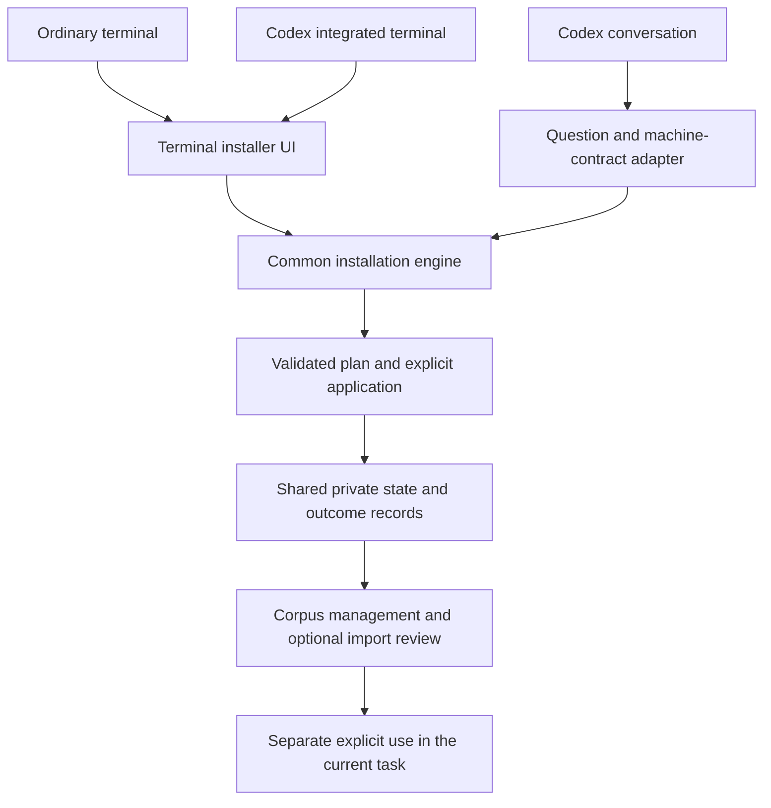

# Terminal installation with complete Codex app routes

## Recommendation and scope

Terminal installation is the primary journey. The Codex desktop app has two supported presentations: its human-operated integrated terminal runs the same terminal installer, while its conversation gathers choices and invokes the same installation engine through a noninteractive contract. These presentations share plans, validation, execution, state and recovery. They do not become separate installers.

This record refines the interface recommendation in the preceding research record. Its nine-product evidence and ownership constraints remain the research basis. The terminal-first priority is the explicit user direction; the machine contract and app cold-start path below are proposed implementation work, not capabilities claimed to be shipped.

## Primary terminal journey

Keep `agent-bios install --interactive` as the human entrypoint. The target sequence is runtime inspection, starting environment, supplied-corpus selection, independent source capture, relevant dependency choices, readable plan review, selected execution and a completion summary with pending work.

Textual is the preferred enhanced renderer where it is compatible. An unavailable Textual runtime does not prevent installation: the complete text interface remains available. A person may explicitly choose the richer terminal capability and its managed dependency installation. Python is a different prerequisite; its absence must be handled before the Python installer starts, through a minimal shell preflight or actionable platform instructions.

The terminal UI owns human interaction, not filesystem effects. It never directly writes corpus state or edits native instruction files. Large source/catalog inspection can open a full document view, while simple choices remain compact. The same effect review and cancellation boundary applies in text and rich modes.

## Codex app route A: integrated terminal

Someone who prefers a visible terminal can run the identical installer inside the app. Official documentation describes an integrated terminal scoped to the current project or worktree, so the application container does not justify another installer implementation. The terminal's working directory still needs to be shown when choosing project instruction sources.

Do not equate this human-operated terminal with an agent's command-execution tool. A non-TTY tool call cannot safely be treated as a person waiting to answer a terminal wizard. The adapter must use structured noninteractive operations rather than attempting to drive the interactive dialogue through incidental stdin behavior.

A terminal can manage storage, capture and registration without a task identity. It must not guess the corresponding app task for use/off operations. Actual context delivery is normally requested from the conversation that will receive it.

## Codex app route B: conversation

### Before agent-bios is installed

The cold-start entry is an ordinary installation request with an identified official release/source, not `$agent-bios`: the skill and its helper do not exist yet. Distribution instructions should provide a copyable app installation request that identifies the package, target machine and requirement to review effects.

The app agent obtains or locates that verified package, inspects the runtime prerequisites and gathers the same choices as the terminal UI. It invokes the common engine's noninteractive planning operation, presents the resulting effects in conversation, and applies only the concrete authorized plan. It must not independently invent package-manager recipes or edit native configuration as a substitute for a missing backend operation.

App-only use does not require an independently installed Codex CLI, another model login, or Textual. Package acquisition and Python still need actual supported routes. Do not rely on undocumented interpreter paths inside the desktop application. If local execution is unavailable, provide the exact reviewed terminal handoff and retain the pending state; do not bypass application permissions or claim an app installation succeeded.

The initial implementation should target supported local execution on the intended machine. Remote/cloud executors must be identified explicitly: writing their HOME is not automatically a registration in the desktop machine's HOME.

### After installation

An explicitly selected app connection registers the `$agent-bios` discovery metadata. Installation should return the verified runtime entrypoint, absolute private roots and any created bridge helper path. That enables the current conversation to continue through the confirmed runtime even when native skill discovery has not refreshed.

The result must distinguish runtime verification, discovery-link creation and native app discovery. A fallback runtime command remains useful when bridge registration is declined or a foreign entry must be preserved. A registered helper must resolve the confirmed release rather than an arbitrary PATH copy.

Once discovered, `$agent-bios` is the ordinary app entry for storage status, reconfiguration, corpus selection, captured-instruction review and task-local use. It should gather intent and call deterministic services, not reimplement the installer in a long sequence of model-authored shell commands.

Native choice tools can improve the dialogue when available; ordinary questions remain a fallback. Do not promise custom app widgets or a particular multi-select control that the host does not expose. Large list/document editing can be handed to the same terminal UI without making every app journey depend on it.

## Shared contract

The following are logical operations to implement under the existing install entry, not a list of currently available command spellings:

| Operation | Responsibility |
| --- | --- |
| Inspect | Runtime/feature availability, available corpus and bounded source discovery; report the actual execution machine and roots |
| Plan | Validate selected dependency IDs, selection mode/targets, optional registration and source capture; derive exact effects |
| Apply | Execute one accepted plan after revalidating source, destination, recipe and revision bindings |
| Status | Return successful, pending, failed and unknown installation outcomes without guessing readiness |
| Resume | Re-probe uncertain external outcomes and review any materially changed operation before continuing |

A plan needs an engine-issued identity and relevant state/release bindings. Both interfaces present that same plan; they do not independently calculate which files or packages should change. Results include structured per-action progress plus a concise human summary. Machine calls never wait for input, and they must not silently select a host merely because no TTY is available.

Setup approval covers its dependency, private-installation, registration and capture effects. Later acceptance of model-authored corpus content is a separate concrete operation unless it was already authorized. App task use is separate again. These are effect boundaries, not a requirement to repeat confirmation after every question or harmless read.

## State and identity boundaries

| Concern | Requires a current task ID? | Meaning of completion |
| --- | --- | --- |
| Installation and its status | No | Selected local operations completed or explicitly pending |
| Source capture and corpus management | No | Private state updated; running-task context not changed |
| App discovery registration and its status | No | Owned metadata/link prepared; native discovery is separately observed |
| Current-task status, use or off | Yes | Operation is bound to the real receiving task |

If identity is missing, only the task-specific operation is blocked. Never invent an ID, choose the most recent task, or mistake a working directory for task identity. Off stops subsequent managed delivery; it does not erase prior or inherited conversation text.

Supplied-corpus selection and personal capture are composable. A capture can remain pending without a model account. Its resume request includes the real capture identity and source scope. The native originals remain intact and can continue loading independently, so moving the managed copy does not establish a reduction in total native context.

## Current machinery and missing work

The current numbered `run_setup` combines question flow and execution. The installer exposes noninteractive storage operations, while the app bridge helper supports session, corpus, import, learn, bootstrap-procedure access and TUI. It does not expose a complete installation planning/application contract or solve first installation before the private runtime exists.

Required implementation order:

1. Extract the common installation plan and execution authority while preserving existing explicit CLI behavior.
2. Complete the terminal journey and pre-Python boundary; retain the complete text path and optional Textual renderer.
3. Add app cold-start instructions and a non-TTY adapter over the same contract.
4. Return verified runtime/helper handoff data and expose storage, discovery and pending-review outcomes separately.
5. Test both entry paths against the same plans, including interruption and existing-file conflicts.

Do not implement a second app-specific installer, a new HTTP/MCP server merely to reach local code, or an app backend that starts another Codex process to perform ordinary installation. Those choices add authorities and dependencies without solving the current boundary.

## Acceptance scenarios

- Terminal-only installation completes without an app connection or model login.
- Codex's integrated terminal and an ordinary terminal produce the same plan for the same explicit choices.
- App-first installation succeeds without an existing `$agent-bios` skill or Codex CLI when the required package/Python path is available.
- App command tools complete planning and execution without a TTY or stdin prompts.
- The app can continue through a verified runtime entrypoint while discovery remains unverified.
- Missing task identity does not block installation, but prevents misdirected use/off.
- A foreign skill entry is preserved and reported; runtime success is not reported as app-connection success.
- Source capture, semantic import acceptance and current-task delivery remain distinct.
- Switching frontends does not duplicate installation or hide a previous partial outcome.

## Why this design is recommended

It makes the primary terminal path complete and predictable while giving the app a genuine conversation route. The common backend prevents source-preservation, dependency and retry behavior from diverging across interfaces. The app adds useful language interaction and real task context; it does not need to reproduce terminal input or become another execution authority.

The cost is an explicit machine contract and equivalence tests, plus a cold-start path that cannot depend on the skill being installed. This is necessary work for complete app support. Visual consistency alone would leave those failure modes unresolved.

## Evidence

- [Prior comparative research](2026-09-12T1152--588260e--installer-research-and-design.md) and its fixed-source references.
- [Current setup controller](/Users/kangmin/Documents/agent-bios-personal/compose/corpus_setup.py), [installer](/Users/kangmin/Documents/agent-bios-personal/compose/corpus_install.py), [app helper](/Users/kangmin/Documents/agent-bios-personal/compose/app_bridge/scripts/bridge.py), [app skill](/Users/kangmin/Documents/agent-bios-personal/compose/app_bridge/SKILL.md), [app state and identity](/Users/kangmin/Documents/agent-bios-personal/compose/corpus_app.py).
- OpenAI, [Integrated terminal](https://learn.chatgpt.com/docs/integrated-terminal), inspected 2026-09-12. This establishes the app terminal surface, not a guarantee that every agent execution tool exposes a human-operated TTY or task ID.

This record adds a proposed design only. Runtime implementation, deployment and native app registration are unchanged.
