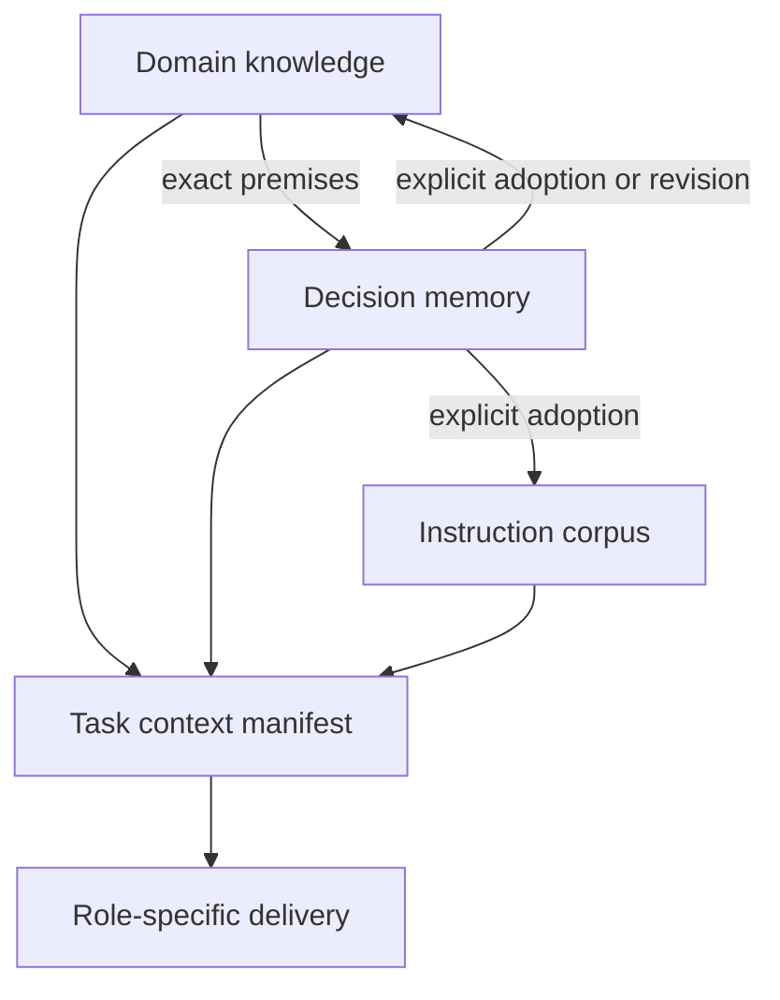

# Instructions, knowledge, and decision memory: minimal architecture

Design baseline for the requested expansion. This specifies the intended contracts, not implemented behavior. New field names are illustrative. The current operated lexicon and public interfaces retain their meanings until the implementation change that introduces the new capabilities.

## The decision

Keep three semantic capabilities with separate ownership: **instruction corpus, domain knowledge, decision memory**. Share stable references, immutable version references, and explicit evidence links. Compose their selected material for a task through a derived context manifest. Do not introduce a universal content schema, common mutable state machine, or global transaction across them.

The organizing rule is: **separate what changes independently; connect what must be understood together**. Split a document only when independent citation, applicability, or revision requires it. Store a relationship only when it answers an actual decision question.

The arrows to the manifest mean selected references, not moving ownership or merging source stores. The adoption arrows require a separate content change; recording a decision does not modify either catalog.

## Five contracts worth keeping

1. **Role is preserved.** Instructions govern behavior; knowledge supplies domain meaning and evidence; history records particular work. Retrieval, repetition, or review does not promote one role into another. Existing corpus `kind`, `surface`, and activation semantics remain instruction-specific.
2. **Identity and version are distinct.** A stable reference identifies the material; a version reference fixes its bytes and canonical metadata. Historical citations never follow a moving latest pointer. An exact reference resolves to matching content or an explicit unavailable result, never replacement content. Importing that revision preserves its identity; the receiving store records local availability separately.
3. **Scope and acceptance are explicit.** Storage ownership, domain applicability, and authority to adopt content are different. Material received from a source is not automatically accepted for a task. Unknown applicability and unresolved disagreement remain visible.
4. **Relationships are asserted, not guessed.** A source reference records evidence; a premise reference records stated reliance; a replacement records an explicit change in an earlier choice. Shared sessions, workstreams, or timestamps do not create these relationships.
5. **Views are derived.** Search indexes, timelines, current-work summaries, onto inputs, and context manifests refer to owned source records. They are rebuildable views; a new semantic conclusion in a summary must be recorded as an interpretation before being treated as accepted knowledge.

These contracts establish attribution and predictable failure behavior. They do not establish external truth, complete dependency discovery, or identical model outputs.

## What each capability owns

| Capability | Smallest useful source unit | Change rule | Delivery meaning |
| --- | --- | --- | --- |
| Instruction corpus | Existing rule, guide, procedure, or host adapter item | Existing authoring, selection, snapshot, and resume contracts | Authorized instructions through the existing adapter |
| Domain knowledge | A coherent document, section, table, or bounded assertion | Publish a new immutable revision; explicitly select/adopt it for a scope | Reference material with applicability and source evidence |
| Decision memory | A decision or a meaningful event, linked to stable workstreams | Append a new record for adoption, outcome, correction, withdrawal, or replacement | Historical evidence and the recorded state of ongoing work |

A source document may contain several roles. Its original bytes can be retained once; the interpretation and delivery of selected portions carry their roles. Knowledge/history must not be passed through the existing instruction compiler simply by adding two `kind` values.

The common minimum is conceptual, not a mandatory shared database row:

| Information | Meaning |
| --- | --- |
| Stable reference and immutable version | Which material, and exactly which edition |
| Owner namespace and access scope | Which provider owns it and where retrieval is permitted |
| Origin and local availability receipt | Attributable source metadata, plus a separate record of when this store obtained it |
| Body and source references | The actual content and the evidence behind it |

Provider-specific version tokens remain opaque. They must identify fixed content and support integrity checking. Existing `CorpusRef`, authoring-state `revision`, and snapshot `ContentRef` are different identifiers; none is renamed or reused as a universal revision.

## Domain knowledge without compulsory atomization

Label the body's meaning as a **commitment, definition/model, claim, or criterion**. Use readable sections initially; add machine fields only where a query or validator consumes them. A commitment says what someone adopts or wants, not what has been observed. A criterion asks what must be checked, not what has been established.

Durable versus changing knowledge is a maintenance property. It does not create two ontologies or two incompatible stores. A rate schedule can contain effective periods and exceptions in one versioned table. A structural principle can carry its scope and adoption rationale in prose. Both use the same identity/evidence contract.

Three times must retain different meanings:

- **Domain applicability**: when and under which conditions the content applies. This lives with the content; dates alone cannot encode every exception.
- **Availability**: when its revision entered this store. Imports never backdate this to the source's publication date.
- **Acceptance**: when an owner selected a revision for a stated use. A decision/event records this separately from ingestion.

For past decisions, retrieve the cited revision. For a present assessment of an earlier period, use the currently accepted edition and evaluate that period's applicability. Initially, keep complete schedule revisions rather than implement generic interval correction across atomic facts.

No global rule says that a newer source outranks an older one. When relevant sources disagree, preserve both and an unresolved finding unless an explicit domain interpretation settles their use. Acceptance is a scoped choice, not a universal truth certificate.

**Onto boundary:** retain the existing eight domain documents and nine lenses. Use the documents themselves as versioned knowledge items, or generate them from another canonical source, choosing one authoring authority per document. Onto receives a pinned projection and returns findings tied to those versions. It neither refreshes external facts nor grants acceptance. Freshness and authority questions initially use existing domain questions and lens concerns.

## Decision memory without a general argument graph

Use three small record shapes within this capability:

- **Workstream**: stable ID, name, purpose/scope. It can outlive a session, branch, or repository. Records carry multiple workstream IDs when necessary. Names can change without changing identity.
- **Decision**: scope, question/context, choice, recorded alternatives and rationale, stated premises, and optional expected consequences/revisit condition. Missing historical rationale or alternatives is marked as missing rather than invented. Keep an unresolved discussion as a note until it contains a decision.
- **Event**: what was adopted, withdrawn, replaced, observed, corrected, or requested for reassessment; its target, attributable actor/source, evidence, recorded time, and occurrence time if known. Initial adoption can be recorded alongside the decision in one atomic local write.

Decision and event IDs identify immutable records. A correction is another record, not an edit to the original. It targets the erroneous assertion: correcting a mistaken acceptance record means that acceptance was not established; withdrawing an actual acceptance means the choice changed later. Both preserve earlier records. Expected consequences stay in the decision; observed outcomes go in events. Adoption, implementation, and verification are separate facts, not a mandatory linear workflow.

Only three semantic connections need initial structured support:

| Connection | Contract |
| --- | --- |
| `basis` | Exact source or prior material cited as a premise; can point to knowledge, instructions, decisions, or artifacts. A delivered context member is not automatically a premise. |
| `target` | The record(s) an event concerns. Its event meaning distinguishes an observation, reassessment, withdrawal, or conflict. |
| `replaces` | Explicitly named earlier decision(s) displaced by an adopted choice within the same bounded scope. New knowledge revisions do not use this to erase past decisions. |

Workstream membership is an association, not a fourth kind of causality. Generic option/argument entities, automatic relation extraction, and inferred impact edges are omitted initially.

Concurrent independent records append independently. A duplicate ID with different bytes fails. Missing references remain unresolved and cannot silently certify an active choice. Two adopted choices do not overwrite one another: a scoped view returns both, and any recorded conflict remains visible until a resolution names what it replaces or withdraws. Semantic conflict detection is a review task, not guaranteed by timestamp sorting.

Initial automated replacement is whole-decision replacement with equal declared scope. Partial replacement requires explicitly reformulating bounded decisions and recording the resolution; it does not invoke a generic scope algebra. If two resolutions compete, neither becomes the winner merely by arriving later.

The current-work reducer must define deterministic handling of explicit adoption, targeted correction, withdrawal, and replacement. Missing targets, contradictory lifecycle assertions, and replacement cycles produce an unresolved state for affected decisions. They cannot silently erase another candidate. Textual summaries display this result rather than inventing a resolution.

## Reading, changing, and using context

**Initial policy: retain a working edition; refresh knowledge deliberately at operation boundaries.** Keep the host's existing instruction snapshot pin unchanged. A knowledge operation and its resulting decision use one declared set of knowledge versions. Discovering a material update or receiving a request for current information initiates a new knowledge selection and context manifest before the next dependent decision. No update rewrites a completed decision's references.

This is not a claim of continuous freshness. There is no background monitor in the first implementation. A task requiring current external knowledge must obtain an appropriate source check or surface that freshness is unverified. Only the affected answer/action is withheld when its required evidence is missing; unrelated work can continue. A checksummed old source is still old.

History is queried for the selected workstreams at each operation boundary; the returned records are fixed in that operation's manifest. The manifest is a small receipt: existing instruction `ContentRef`, selected knowledge versions, selected history IDs, scope/workstreams, and assembly time. A derived excerpt or summary also records its own bytes and source references. Later retrieval creates a new manifest rather than modifying the old one.

A manifest certifies what was assembled. Host delivery evidence is separate, and an explicit premise in a decision is separate again. It does not claim model consumption or total context capture. Relevant unresolved source/conflict/availability conditions travel with the response instead of being dropped from a summary.

Writes retain their provider's local concurrency boundary. Replacing the accepted knowledge edition checks the expected prior selection and updates its adoption evidence atomically in that provider. A racing edit is refused or preserved as a candidate, not silently accepted. Appending a history event does not invalidate every corpus edit plan.

For cross-capability promotion, write the destination revision first as unselected and record the request with its exact reference. Select it through the destination capability's authority. Only that provider's successful atomic selection receipt establishes completed adoption; history records completion by referencing that receipt. A crash leaves a request pending until reconciliation reads the destination's authoritative receipt. Existing but unselected content is not evidence of adoption. Past adoption and present selection remain different facts. No distributed transaction or automatic promotion is required.

## Compatibility and implementation boundary

Preserve the existing corpus APIs and native launch/resume pins. Add knowledge and memory providers beside them, with role-specific reference renderers and a small context composition boundary. Code sharing follows demonstrated duplication; it does not require migrating the instruction store first.

Specific traps verified at HEAD `35c75ca`:

- [Catalog identity](/Users/kangmin/Documents/agent-bios-personal/compose/corpus_catalog.py:8) survives content edits; [snapshot identity](/Users/kangmin/Documents/agent-bios-personal/compose/corpus_store.py:1466) also binds compilation/selection inputs.
- [Native delivery](/Users/kangmin/Documents/agent-bios-personal/compose/corpus_session.py:474) gives corpus text instruction authority. Knowledge/history use reference-material delivery.
- [Store history](/Users/kangmin/Documents/agent-bios-personal/compose/corpus_store.py:1561) means recovery checkpoints; decision memory must not repurpose it.
- The [current recorder](/Users/kangmin/Documents/agent-bios-personal/decisions/record-decision.py:98) is author-side. Reuse its capture principles; a shipped feature cannot import `decisions/` runtime code. Its existing requirement to close an alternative remains intact; incomplete historical imports use a separate adapter.

The first implementation slice should add versioned knowledge references and explicit decision/event capture, then compose scoped references for a real task. Existing ontology and package gates will need new assertions and negative controls when those runtime paths land. Update the ontology lexicon in that implementation change rather than describing unimplemented machinery as current fact.

## Deliberate exclusions

These are design decisions, not untracked TODOs. Reopen only when the named condition occurs.

| Excluded initially | Why the core works without it | Revisit trigger |
| --- | --- | --- |
| A universal schema, graph database, or global writer/lock | Each capability owns different semantics; references connect them | A necessary cross-provider operation cannot be expressed with refs and local writes |
| Atomizing all prose and a formal ontology language | Coherent versioned material can answer the first questions | Independent updates/citations or excessive impact noise require smaller units |
| Full bitemporal query engine and generic partial-scope algebra | Complete schedule editions and exact decision citations cover the initial cases | Repeated interval/exception queries cannot be answered reliably or economically |
| All transcript capture and option/argument graphs | Significant decisions and outcomes preserve the required flow | Missing source detail or repeated shared arguments prevent an important answer |
| Automatic causal inference, source ranking, or conflict resolution | Explicit evidence and unresolved states avoid false certainty | A bounded domain supplies a tested policy and its review cost is justified |
| Continuous refresh, blanket expiry periods, and universal confidence scores | On-demand source checks and differentiated unknowns suffice | A real domain freshness requirement or measured failure demands more |
| New onto lenses or package redesign | Existing documents/questions provide the integration surface | A material evaluation gap cannot be covered by existing concerns |
| Cross-device sync, CRDTs, and distributed transactions | Local ownership and immutable refs keep the semantics extensible | Concurrent multi-device operation becomes an actual requirement |
| Exhaustive automated impact discovery | Explicit `basis` links give bounded, honest impact results | Measured material omissions justify additional extraction |
| Whole-product renaming, combined studio UI, automatic migration | Existing corpus identity and user state can remain stable | A validated workflow demonstrates that the current terminology/UI obstructs use |

Deletion is not ignored: removing retained sensitive evidence must also address derived copies. The first version can perform explicit local removal and report unavailable historical references; indefinite retention and a compliance automation framework are not promised.

## Design acceptance

Use the companion scenario review to verify the boundaries before implementation. The minimal architecture is sufficient when it can distinguish applicable versus merely latest knowledge, preserve the stated basis of a prior decision, connect parallel work without inventing causality, and reject silent promotion or overwrite. No extra entity or service is admitted solely to make the model look complete.
