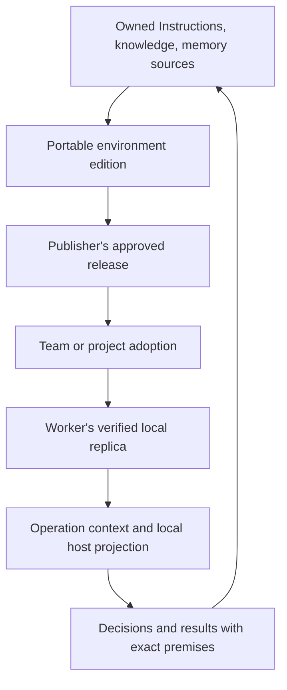

# Shared work environments: composition, storage, and synchronization

## Architectural decision

Make an **owned, versioned work environment** the unit workers select and share. An environment composes separately owned Instructions, Domain knowledge, and Decision memory. A local operation materializes that environment into exact references and rendered context; it does not become another source of truth.

Retain the previous design's role boundaries, immutable versions, scoped acceptance, explicit premises, and derived views. Replace its task-only center and blanket synchronization deferral. This is a proposed architecture; the current product does not yet implement these shared-environment contracts.



The sequence distinguishes authority and evidence. Pulling data does not adopt it, and adoption does not prove local readiness or host delivery.

## 1. Minimum stored concepts

| Concept | Owned information |
| --- | --- |
| Namespace | Stable owner identity, configured provider, and permissions for reading, contributing, publishing, and adopting |
| Material revision | Stable material ID, immutable canonical contents/metadata, exact version/digest, role, and explicit references |
| Environment edition | Stable environment ID and owner, intended purpose/scope, pinned composition, required material/capabilities, and permitted evolving memory sources |
| Mutable reference | A publisher's release selection, a team's adopted edition, or a local draft head; each has one authoritative writer boundary and an opaque concurrency token |
| Local receipt | What was obtained, adopted, or materialized here, when, under which observed authority, and with which exact result |

These are contracts rather than a mandatory single database schema. Environment editions and receipts can themselves be immutable documents. Providers retain role-specific payloads and local transaction ownership. A namespace name or content hash alone does not establish a publisher's authority; clients bind it to an authenticated, configured provider.

An illustrative storage boundary is:

```text
Shared namespace
  immutable objects and edition manifests
  publisher/adoption references with conditional updates
  authoritative operation receipts and withdrawal/deletion records

Worker-local state, isolated by namespace
  verified source cache and locally observed publication/adoption references
  draft candidates and pending contributions
  local availability/materialization receipts
  host-specific compiled snapshots, session pins, and recovery journals
```

Credentials and native permission grants remain in their existing host/provider stores. There is no protocol for copying an entire user's agent-bios state directory into another worker's installation.

## 2. Environment identity, composition, and inheritance

An environment edition identifies:

- its stable environment ID, owner, purpose, and applicability;
- exact Instructions source/package versions and knowledge editions;
- authorized memory source identities, workstream selectors, and any pinned historical baseline;
- required versus optional components and host capability requirements;
- exact parent editions, plus explicit additions or replacements where it reuses another environment.

Role, industry, company, and project describe applicability. They do not create automatic precedence. Composition resolves to a flattened manifest of exact source versions. Two selected versions of the same required material remain unresolved until an explicit composition choice resolves them. Semantic disagreements between distinct claims require review; a structurally valid manifest does not settle them.

Initially, reuse means pinned inclusion. New upstream editions are candidate updates. No automatic semantic merge or floating parent inheritance is provided. A personal change produces a separately identified derivative with its base and modifications visible. The unchanged company-approved edition and a personal derivative are never reported as the same effective composition. The company may separately approve a derivative.

Tools and execution permissions remain host capabilities. An environment may require a named capability; selecting the environment does not install credentials or grant permission. If a required capability or isolation condition is unavailable, materialization reports the affected requirement as unmet.

## 3. Static editions and evolving work memory

Instructions and knowledge are pinned in the edition initially. Updating them creates a candidate environment edition, followed by the owner's approval/adoption process. A worker's unilateral refresh cannot silently retain the claim of matching the previous approved edition.

Decision memory may evolve without publishing a new environment edition for every event. The edition fixes the **authorized source and selection scope**, while each operation fixes the **observed frontier and selected records**. A source frontier is an immutable checkpoint or equivalent exact record-set identifier, not a device timestamp.

A new memory record may cite Instructions or knowledge outside the operation's pinned composition. Its premise reference is historical evidence, not authority to replace those pins. If continuing that decision requires the changed premise, report the required environment update or unresolved compatibility before the dependent action; do not silently mix the old approved edition with the new assumption.

An operation manifest records the environment edition, resolved static references, memory frontier(s), selected history records, source/rendered digests, local adapter identity, observed authorization/offline policy, and declared omissions or unresolved conditions. Workstreams select decision subjects; state queries then include the state-relevant events targeting those decisions and their lifecycle assertions within the declared sources/frontiers, even when those events belong to another workstream. Only after this closure is state reduced and excerpts selected. A restricted event may remain private, but the provider must return an authorized current-state result or explicitly say that current state cannot be established. An exact frontier alone does not certify complete visible history.

When continuing current work, a successor resolves a fresh authorized memory frontier under the same environment policy. Reconstructing an earlier source selection requires its manifest and available source versions. Retrieving exact earlier rendered context additionally requires retained rendered bytes: a digest cannot reconstruct them. An authorized manifest plus rendered bytes may be shared as an immutable audit artifact, not as portable source authority or a resumed native session. If retention or access prevents this, exact reconstruction is unavailable. “Same environment edition” means the same approved composition policy; “same materialized context” additionally requires the same resolved frontiers, references, and rendered bytes.

Existing host instruction pins retain their meaning. If a new adopted edition requires different Instructions and the host cannot change them safely in the current session, preserve the old pin's audit identity and establish a suitable new activation. Continuing the old activation is allowed only while its own material and use remain authorized. Receiving the new edition is not evidence that the old session switched. Additional native globals, project instructions, or user messages remain separate context; disclose their known presence and do not claim the environment captures all model inputs.

Known incompatible native Instructions or required company-isolation failures are unmet activation requirements, not merely notices. Crossing to an incompatible organizational context requires a fresh session with compatible native globals/project Instructions, or an evidenced host isolation boundary. A new conversation alone does not prove that conflicting global instructions were excluded. Ordinary additional context is not automatically incompatible; unknown host context remains a stated limitation.

## 4. Portable sources, local realizations

Synchronize canonical source revisions, environment manifests, shareable decisions/events, and authority receipts. Preserve namespace identity and source revision when importing; append a separate local availability receipt.

Do not synchronize local locks, native session IDs, installation paths, credentials, incomplete journals, or host-compiled snapshots as portable source authority. Current corpus snapshots incorporate host/CWD/compiler/store inputs. Another worker compiles the same source edition for its supported host and records that local result. Sharing an explicitly authorized audit artifact does not import private additional context or grant executable status to that artifact.

The current instruction store, baseline, and native pin remain behind an adapter. A portable reference to an Instructions source edition is not a rename or reinterpretation of the existing authoring-state revision or ContentRef. The separate Instructions migration handoff owns changes to those names and their compatibility readers.

Provider and edition formats declare their schema/version contract. A reader that cannot interpret required policy, event, or component semantics reports unsupported material rather than ignoring the fields and claiming readiness. Exact imported revisions remain unchanged; compatibility conversion creates a separately identified derived representation.

Required dependencies and historical citations have different closure rules. Required material must be present, authorized, and exact before a complete materialization is reported. Source citations may identify unavailable or non-distributable evidence, but an answer requiring that evidence remains explicitly unverified. Do not recursively copy every cited document merely to distribute an environment.

Closure is checked at the recipient: the publisher's access does not establish the next worker's access. Known missing required references, unsupported adapters, incompatible editions, and unresolved required conflicts cannot be silently replaced by optional defaults or personal memory. Optional omissions are listed. An intentionally empty memory scope is a successful empty selection; a denied or failed lookup is a different result.

## 5. Synchronization and authority protocol

One configured authority owns each namespace's shared heads. Local replicas and offline drafts do not claim to be that authority. Transport may initially be manual or a simple server; the following semantics are required regardless of implementation.

1. **Commit a local candidate.** Author from an explicit base. Validate and write immutable revisions. Advance only the local draft reference; this can complete offline.
2. **Stage publication.** Authenticate to the namespace, upload missing objects using create-if-absent semantics, and verify their identity and integrity. Validate the declared required dependency closure before exposing the candidate through a release head.
3. **Commit publication.** Send an operation ID, head ID, expected concurrency token, and exact target. Bind the operation ID to the namespace, authenticated principal, operation/head, expected token, and target, or their canonical request digest. An identical retry returns the recorded outcome; reuse with different request contents fails. The authority atomically changes the head and records a durable result receipt. A stale token leaves the candidate intact and returns a conflict; no last-arrival overwrite occurs. An uncertain response is retried or queried with the same operation ID. The current head matching a target is not itself proof of this operation's success.
4. **Pull and verify.** Observe head revisions and fetch exact objects into staging. Only fully verified material enters the usable local cache. Pull changes neither the team's adoption decision nor an active session.
5. **Adopt.** An authorized team/project owner selects an exact environment edition under its declared process. Adoption has its own conditional head update and atomic receipt. Publisher release and organizational adoption are separate authority decisions.
6. **Materialize and activate locally.** Resolve requirements, access, pinned material, and the allowed memory frontier; create the operation manifest; compile locally; record host delivery evidence separately. Adoption can succeed while a worker remains not ready. Failed materialization preserves the old pin's audit identity, but continued use must still satisfy that activation's current observed permissions and isolation requirements. Revocation may prohibit further affected operations without erasing text already delivered.

No cross-provider atomic transaction is required. Component revisions are staged/published first, then one environment edition references them, then a single adoption reference chooses that edition. A required remote dependency can subsequently become inaccessible; a published manifest is therefore not a perpetual availability guarantee.

Publication, withdrawal, and deletion receipts are durable protocol state. Recovery consults the authoritative operation receipt rather than inferring success from blob presence or replaying a mutation blindly. Orphan staged objects are harmless candidates until their retention policy permits cleanup.

## 6. Concurrent contribution and history

Concurrent edits to one knowledge or environment edition produce separate immutable candidates. The shared head advances conditionally. A losing candidate requires explicit reconciliation; clocks do not decide content authority.

Independent decision/event records have unique IDs and can be unioned after authorization and referential validation. This merges the record set, not the choices described by it. Concurrent incompatible adoptions or resolutions remain visible. Duplicate ID plus different bytes is corruption/conflict. Records with missing state-relevant targets remain unresolved until dependencies arrive.

Device event time, server receipt order, and causal relations remain separate. Server cursors may drive incremental transfer; only explicit premise/target/replacement links determine history semantics. One event associated with multiple workstreams is stored once and indexed in each scope.

The prior distinction between correction and withdrawal remains essential: correcting a falsely recorded acceptance differs from withdrawing an actual earlier choice. The reducer must define unresolved outcomes for contradictory lifecycle assertions, missing targets, or replacement cycles. It cannot hide competing successors after removing their common predecessor.

## 7. Offline use, access changes, and deletion

Each namespace/environment must declare its offline-use policy. If cached use is allowed, a worker records the last observed adoption revision and authorization observation; it cannot claim to match a newer unseen team head. If current online authorization is required, offline activation of that protected material is unavailable. These policies are requirements to select, not invented default time limits.

Composition may further restrict a source's access, export, retention, or offline conditions; it cannot relax them. Derive and record the effective conditions from the required component set. Unresolved policy incompatibility is an unmet requirement. A restricted optional component may be omitted with an explicit omission. An environment owner's approval cannot grant rights the underlying source owner did not grant.

Authorization is rechecked on server operations and as required by local materialization policy. A shared environment reference grants neither source access nor export rights. Cache and index lookup retain namespace/access boundaries even if an implementation later deduplicates identical bytes.

Distinguish withdrawal of an adoption, removal of a published pointer, and deletion of retained content. An authorized deletion records a durable rejection/tombstone sufficient to prevent an offline replica from silently restoring deleted content. Sync checks incoming candidates against that state. Reusing a stable name does not remove the tombstone's applicability to the deleted revision.

On learning of revocation/deletion, prevent new protected materialization and remove owned cached/derived copies according to policy. Track rendered contexts, excerpts, indexes, and export caches sufficiently to identify owned copies. Previously delivered prompts and uncontrolled offline/exported copies cannot be promised erased. Historical references then resolve as unavailable where retention is no longer permitted. A hash proves matching bytes, not permission to keep them.

## 8. Use-variable and failure matrix

| Situation | Required result |
| --- | --- |
| Worker B replaces A | Select the owned environment and authorized workstream scope; discover decisions without A's private session |
| Two different hosts use one edition | Same selected source policy; separate adapter/materialization receipts and known additional context |
| Same role in two companies | Reuse allowed professional material; isolate company sources and memory |
| Personal modification | Distinct derivative, visible base/change set, no inherited company-approval claim |
| Two workers edit the same base | Retain both candidates; conditional head conflict, explicit resolution |
| Offline independent decisions synchronize | Add authorized records once; preserve incompatible choices and causal evidence |
| Environment upload stops halfway | No release/adoption head points to an incomplete required closure |
| Publication response is lost | Retrieve the original operation receipt; do not infer from current head equality |
| Pull succeeds but adoption fails | Cache the edition; preserve previous adoption |
| Adoption succeeds but required local source is inaccessible | Report adopted but not ready; preserve the old pin, permitting continued use only if still authorized |
| Team updates while a worker is offline | Apply declared offline policy; report the last observed edition and limits |
| Memory advances during an operation | Keep that operation's frontier fixed; resolve another frontier for the next operation |
| Required decision source is empty versus denied | Record successful empty selection versus an unmet requirement |
| Deletion races with returning offline data | Tombstone/rejection prevents silent resurrection; historical availability is explicit |
| A W2 correction targets a decision selected through W1 | Include its state effect before workstream excerpts, or report current state unavailable |
| Company B is selected over residual Company A context | Refuse complete activation until a compatible fresh or evidenced isolated context exists |
| An operation ID is retried with another target | Reject request mismatch; do not reuse the earlier success receipt |
| An exact historical rendering was not retained or cannot be shared | Reconstruct available sources only; report exact rendered context unavailable |
| Live memory requires a premise outside the pinned edition | Report a required environment update or unresolved compatibility; do not promote the premise automatically |
| An older client cannot interpret a required schema or policy | Report unsupported requirements; do not silently drop their meaning |

These are implementation acceptance scenarios. No transport implementation or model behavior was executed by this design review.

## 9. What remains deferred

Keep the earlier exclusions for universal schemas, compulsory atomic claims, global source ranking, automatic causal/semantic resolution, new onto lenses, and whole-product UI redesign. Also defer live collaborative editing, CRDTs, peer-to-peer federation, universal dependency solving, automatic rollout scheduling, and a new enterprise identity platform.

The blanket deferral of cross-device synchronization is superseded: **the transport implementation can be staged, but ownership, portable editions, conditional publication/adoption, required closure, receipts, conflict retention, offline policy, and deletion propagation are design requirements now**. Revisit advanced mechanisms only when a concrete workflow or measured cost exceeds these contracts.

First implement one explicitly transferred company environment with a shared professional base. Prove it works for two workers and a replacement, handles an offline contribution and competing edit, and refuses a falsely complete activation when a required source is inaccessible. Preserve existing instruction pins throughout. That vertical slice tests the product purpose directly.

## Review dispositions

Two delegated reviews of this draft required bounded state closure across workstream memberships, explicit treatment of incompatible native context, retained/authorized audit bytes for exact reconstruction, non-relaxation of source policies, request-bound operation IDs, and a distinction between preserving an old pin and authorizing its continued use. These corrections are included above. They add contractual checks to the same objects and protocol; no additional service is introduced.
