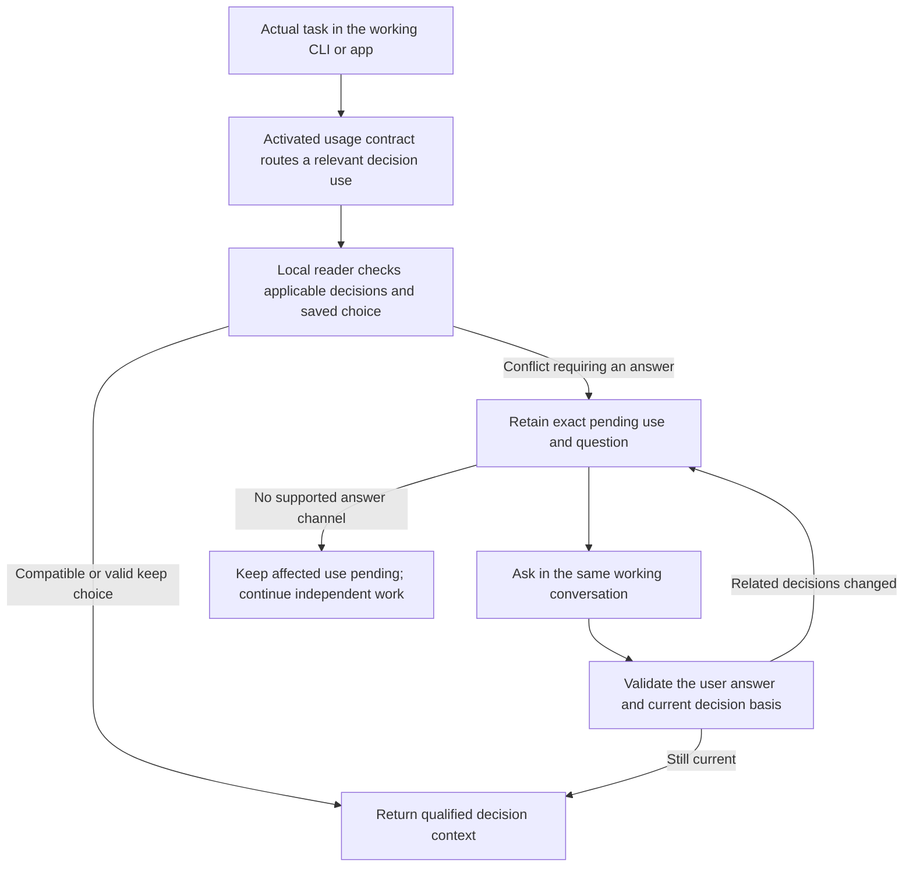

# agent-bios Team work environments — consolidated design SSOT

This is the current **target-design** reference for the Team environment
expansion. It consolidates the research, decisions, complete operational scope,
UI direction and consistency repairs recorded through this revision. A reader
does not need to reconcile the earlier design sequence to determine the rules
below. [CURRENT.md](CURRENT.md) is its navigation pointer, not a second design.

For this initiative's target design, this document supersedes the normative
role of the earlier design/recommendation documents listed in the
[source inventory](2026-09-15T1026--35c75ca--ssot-sources.json). Those artifacts
remain evidence of rationale, alternatives, reviews and historical prototypes.
They cannot override this consolidated text through an old diagram or example.
This does not itself modify implemented APIs or repository working rules. The
user explicitly waives backward compatibility for the coming implementation:
old command aliases, schemas/readers, native resume and mixed-version operation
need not remain supported. The current Instructions compatibility documentation
describes the present release, not a requirement for the new target. Use an
explicit controlled cutover and selected-data disposition rather than a general
backward-compatibility layer. Existing source work and user-owned data are not
authorized for silent deletion by this waiver.

**Status vocabulary:** user requirements are required outcomes; design rules
are the current means of satisfying them; defaults/hypotheses remain changeable
through design review and the affected Team's governance. Written design,
simulated behavior, runtime enforcement and observed human usability are separate
evidence levels. Nothing here certifies the whole future product as implemented.

## Contents

[S01 Purpose](#s01) · [S02 Concepts](#s02) · [S03 Knowledge](#s03) ·
[S04 Decisions](#s04) · [S05 Environment/preparation](#s05) ·
[S06 Consumption](#s06) · [S07 Governance](#s07) · [S08 Storage/sync](#s08) ·
[S09 Team lifecycle](#s09) · [S10 First work/data origins](#s10) ·
[S11 Studio](#s11) · [S12 Acceptance](#s12) · [S13 Exclusions](#s13) ·
[S14 Evidence and maintenance](#s14).

<a id="s01"></a>
## S01. Purpose and requirements

The canonical product purpose remains in [AGENTS.md](../../AGENTS.md).
Its wording is reproduced here as the design criterion:

> agent-bios exists to let workers compose, share, and inherit team work environments
> from Instructions, Domain knowledge, and Decision memory, so they can perform
> their roles within the standards and context of their team, industry, and organization.
>
> A team is the basic unit for selecting, adopting, and sharing a work environment.
>
> The goal is efficient work and continuity. Shared environments provide reusable
> defaults that workers can adapt to their repository and personal working needs;
> they are not a mechanism for enforcing uniform working methods.
>
> Workers should be able to select an environment appropriate to their role and
> team, collaborate from shared standards and decision context, and continue
> the work when a worker, model, session, or device changes. Shared context does
> not require identical outputs or erase personal, team, and organizational boundaries.

Selecting appropriate material should let a worker perform a role in a Team's
context: the same worker can act as a developer or accounting worker and can
work with different Teams' standards. Personal work also needs no Team creation or
product signup; Team sharing introduces its own enrollment and authority.
Team, organization, industry, role and
project scope must remain distinguishable. Team is the basic sharing/adoption
unit; it does not force a company hierarchy or one environment per Team.

The stable requirement IDs below preserve the complete user scope. Detailed
historical origin traces remain in the source inventory's requirements board.

| ID | Required outcome | Owning sections |
| --- | --- | --- |
| U01 | Select, compose, share and inherit appropriate work environments; preserve purpose in the repository charter and decision ledger | S01–S02, S05–S06, S14 |
| U02 | Team is the basic selection/adoption/sharing unit | S02, S09 |
| U03 | Distinct Instructions, Domain knowledge and Decision memory; product-wide Instructions terminology | S02, S14 |
| U04 | Simple, robust, extensible structure; explicit exclusions; zero-base usability review, including a TUI entry where available options, current selection and the next effect are understandable | S11–S14 |
| U05 | Durable principles plus changing applicable knowledge and required updates | S03 |
| U06 | Ontology or competency questions, onto 8+1 lenses/domain package, model/form/validation authoring | S03, S11 |
| U07 | Decision context, alternatives, reasons, premises and consequences beyond Git history | S04 |
| U08 | Parallel/intersecting workstreams and continuity across workers/sessions | S04–S06 |
| U09 | Efficient useful consumption with essential meaning preserved | S06 |
| U10 | Complete Studio, including advanced source editing, search, derivatives, bulk operations, administration and recovery | S11 |
| U11 | Current/new/child work and context recovery with truthful actual-delivery state | S05–S06, S10–S11 |
| U12 | Scoped rights, allocation, review, publication, adoption and execution | S07 |
| U13 | Complete Team creation/read/update/delete, enrollment, members/devices, connections and ownership continuity | S09 |
| U14 | Corrections, derivatives, retention/deletion, access changes and recovery | S03–S04, S07–S09, S11 |
| U15 | Complete local/P2P foundation without GitHub | S08–S09 |
| U16 | Eligible GitHub connection recommended and initially selected, optional and independently removable | S08–S09 |
| U17 | Closed networks and one or two weekly exchange opportunities with useful permitted local work | S06, S08–S09 |
| U18 | Authorized peer copies improve recovery; expose actual coverage and outstanding exchange | S08–S09 |
| U19 | Use personal/local and Team environments without a mandatory product account; stable person/Team identity with easily attached Team-selected authentication such as Google/Slack | S02, S07, S09, S11–S13 |
| U20 | Separate repository/personal/Team Instructions, knowledge and decision collections; repository → personal → Team for Instructions/knowledge, user arbitration in the working CLI/app at conflicting decision use, one authoring home per source, and qualified derived reading | S03–S06, S08, S10–S12 |
| U21 | Supplied, authored/imported and session learning/distilled knowledge or decisions enter through traceable role-specific capture, validation and destination acceptance | S03–S06, S08, S11–S13 |

Research notes, handoffs and visualizations are design deliverables, not an
implicit requirement for research, diagram or handoff services in the product.

<a id="s02"></a>
## S02. Small conceptual model

**Separate what changes independently; connect what must be understood together.**

| Concept | Owns | Must remain distinct from |
| --- | --- | --- |
| Instructions | Behavioral rules, procedures, triggers and their appropriate host delivery | Retrieved facts or recorded past choices |
| Domain knowledge | Commitments, domain meaning, models, factual claims and criteria with applicability/evidence | Instructions, approval or universal truth |
| Decision memory | Actual scoped decisions, stated reasons and meaningful lifecycle/outcome events across workstreams | Commit/transcript logs or inferred intent |
| Team | Stable sharing/adoption identity, membership and governed environment choices | Display name, repository, all source ownership or all worker context |
| Environment edition | An immutable, owned composition of exact Instructions/knowledge references and authorized memory selection policy | One worker's installation, current memory contents or automatic permissions |
| Operation preparation and receipts | Scoped selection, resolved evidence, usable bodies, gaps and actual local/host outcomes | Source authority, global completeness or model comprehension |

References connect role-specific stores; they do not require a universal row,
database, editor or state reducer. A document may contain several roles: keep
its source bytes and distinguish the selected portions' meaning and delivery.
Adding knowledge/memory as instruction compiler kinds would give them the wrong
authority. Promote a lesson into Instructions or knowledge only through the
destination owner's explicit revision/adoption process.

Stable identity, immutable revision, owner namespace, domain scope, origin,
local acquisition and acceptance are distinct. Imports preserve exact source
identity and add local availability evidence. Exact references resolve to the
matching revision or an explicit unavailable result, never a moving substitute.
Hashes prove byte identity, not ownership, trust, permission or freshness.

Search, graphs, timelines, summaries, dashboards and prepared context are
derived views with named source owners. A generated interpretation is not an
accepted domain claim or Team decision. Existing instruction catalog identity,
authoring revisions, compiled snapshots and native session pins retain their
specific meanings; none becomes a universal version identifier.

<a id="s03"></a>
## S03. Domain knowledge and authoring

Use coherent documents, sections, tables or bounded assertions. Split only when
independent citation, applicability or revision requires it. Preserve a table's
headers, units, effective conditions and exceptions with its values. Add machine
fields where an actual query/editor/validator consumes them.

| Meaning | Example type | Required interpretation |
| --- | --- | --- |
| Commitment | Team direction or adopted principle | An intention/choice, not an observed fact |
| Definition/model | Domain concepts, relationships and structure | Scoped meanings and qualifications |
| Claim | A rule, parameter or factual assertion | Evidence, applicability and material uncertainty |
| Criterion | A competency or validation question | A check to perform, not a proven answer |

Durable versus changing is a **maintenance property**, not two ontologies or
stores. The user's tax example separates the general calculation structure
from changing rates/relief conditions; this is a modeling example, not tax advice.
Both use the same revision/evidence route. Complete schedule editions suffice
initially; no generic temporal-interval engine is required.

Keep domain applicability, local availability, scoped acceptance and source/review
evidence separate. Record relevant period, jurisdiction/entity conditions,
exceptions, source and required update obligations. Missing answer-changing
conditions yield a scoped unknown. A recent review does not prove current truth;
no universal rule makes the newest source authoritative.

Historical explanation uses the decision's exact cited edition. A present
assessment of an earlier period uses the selected applicable edition and that
period's conditions, disclosing current evidence limitations. Future-effective
rules and late corrections create new revisions; neither rewrites old premises.
Material new evidence is a candidate update. Dependent use rechecks adequacy and
follows environment update/adoption policy; source refresh does not silently
change a Team pin. Conflicting evidence remains qualified until a scoped
interpretation settles its use.

Onto integration retains its eight domain documents and **8+1 lenses**. Each
document is a canonical versioned source or a projection with one authoring
owner. Support competency questions before requiring a complete graph. A useful
question names the decision it can change, necessary scope/evidence, expected
answer form and counterexample. Authoring/review selects pinned targets, domain
package, questions and relevant lenses; results remain findings tied to those
versions. Onto does not refresh external facts, grant acceptance or certify
truth, and nine-lens review is not run on every read. Model/form editors remain
in scope; their minimum operations are in S11.

| Lens | Existing domain-package home / purpose |
| --- | --- |
| Logic | `logic_rules.md` — logical obligations |
| Structure | `structure_spec.md` — allowed structure |
| Dependency | `dependency_rules.md` — dependency obligations |
| Semantics | `concepts.md` — concepts and meanings |
| Pragmatics | `competency_qs.md` — questions the model must help answer |
| Evolution | `extension_cases.md` — extension/change cases |
| Coverage | `domain_scope.md` — required scope and boundaries |
| Conciseness | `conciseness_rules.md` — unnecessary complexity |
| Axiology (+1) | Purpose, principles and context across the package; no mandatory ninth document |

This is the retained integration mapping, not a new universal domain schema.

<a id="s03-sources"></a>
### Supplied knowledge, additions and learned material

Supplied knowledge, external packages, manually authored material, repository
documents and learning/distillation output use the same knowledge role contract.
Their **origin** differs; it grants no default priority or authority. Keep owner,
home scope, applicability, acceptance and physical storage distinct from origin.
The existing compose/domains.json classifies Instructions; its domain labels are
not the future business-domain knowledge database or an ownership model.

| Route | Initial home and effect | How it becomes usable as a shared standard |
| --- | --- | --- |
| Product-supplied domain package | Publisher-owned immutable selectable source | Verify permitted package/version; explicitly include and adopt its exact references where required |
| Added external package | Declared external source and license/conditions | Same verification/selection contract; installing or cloning grants no Team approval |
| Personal/Team/repository authoring | Explicit owned collection, applicability and draft revision | Validate and publish under that source owner; Team/environment adoption remains separate |
| Extension of supplied knowledge | A distinct source/derivative with exact base, additions/replacements and owner | Never modify publisher-owned installed bytes in place; new base versions are candidate updates |
| Session learning or distillation | Private or otherwise permitted typed candidate with exact source evidence | Route through the capture/acceptance contract below; do not silently become an always rule or current accepted fact |

The initial target product must provide at least one real, scoped, reviewed domain
package and an add/import/author route. Content selection, licensing and evidence
are implementation deliverables, not fictional fixture data counted as a shipped
knowledge base. Packages can contain ordinary documents/tables, ontology members
or meaningful question sets. Eight-plus-one review organization does not require
every source to become a formal ontology or a global claim graph.

<a id="s04"></a>
## S04. Decision memory and concurrent work

| Record | Minimum useful meaning |
| --- | --- |
| Workstream | Stable ID, editable name, purpose/scope; can outlive a session, branch or repository |
| Decision | Question/context, scoped choice, recorded alternatives/reason, exact stated premises, optional expected consequences/revisit condition |
| Event | Attributable adoption, correction, withdrawal, replacement, observation or reassessment; exact target, evidence, recorded time and occurrence time when known |

Unresolved discussion remains a note. Missing historical reasons/alternatives
remain missing; later explanations are labeled later interpretations. A commit
can support what changed, not establish an unrecorded why. Initial decision and
its acceptance can be recorded in one atomic local write where authorized.
Acceptance, implementation and verification remain separate facts rather than
a compulsory linear status pipeline.

Store immutable decisions/events. Correct an erroneous assertion with another
targeted record. Correcting a false acceptance assertion differs from withdrawing
a choice actually accepted earlier. Expected outcomes remain in the decision;
observed outcomes belong in events. Historical explanations preserve what was
known/stated then while showing permitted later qualifications separately.

Only three causal relations need initial structured support: `basis` for exact
stated reliance, `target` for an event's subject, and `replaces` for an explicitly
displaced choice in bounded scope. Delivered context is not automatically a
premise. Membership in several workstreams is an association, not causality;
one record may be indexed in several lanes without duplication. Device time,
receipt order and explicit causal links retain different meanings.

Independent authorized records can be unioned. Identical IDs with different
bytes are corruption/conflict. Combining records does not resolve incompatible
choices. Whole-decision replacement with equal declared scope is the initial
automated case; partial changes require explicitly bounded decisions/resolution,
not inferred scope algebra. Missing targets, cycles, competing successors and
contradictory lifecycle assertions produce qualified unresolved state. Arrival
time or a clean textual merge cannot select the semantic winner.

Current state is established **before** ranking/clipping: resolve required
subjects and sources/frontiers; follow state-relevant events, including events
in other workstreams; reduce qualified state; then rank and bound the body.
Filtering cannot conceal a withdrawal and revive an earlier decision.

For restricted corrections, sufficient evidence is either verified required
event closure or a provider-authorized, verifiable **qualified state artifact**.
The latter binds trusted issuer/authority, permitted subject/query/scope/audience,
exact frontier and coverage, supported interpretation contract, actual state
body and material unknowns, control/retention evidence and offline conditions.
It may disclose a permitted effect without confidential reasons or protected
record identities/counts. It grants no new rights and does not claim hidden
bodies were delivered, independently reconstructed or globally latest. Invalid,
unsupported, stale or wrong-scope proof leaves state unresolved; an arbitrary
summary or self-declared signing key is insufficient. This serializes the
existing authorized reader result rather than creating another knowledge store.

<a id="s04-scopes"></a>
### Repository ADR and Team ADR

A decision has an explicit **home scope** and its source's decision authority.
Use Team scope for a shared Team choice; repository scope for a choice belonging
to an identified repository. Personal/projectless work can remain personal until
another home is deliberately selected. Home scope is not a claim about every
context to which the decision applies, its owner, or the disk holding a copy.

| Kind | Example subject | Ownership and use |
| --- | --- | --- |
| Repository ADR | This repository's API/storage/build decision | Its configured repository collection authority owns acceptance. Several Teams may reference it without becoming its editors. |
| Team ADR | Shared review, operating or cross-repository architecture choice | Team decision authority owns the choice; applicability may include several repositories/workstreams. |
| Personal decision | A bounded choice before Team/repository affiliation | Personal source ownership and permitted use; no implicit Team-wide acceptance |

Persist a stable owner-qualified repository/source ID when durable repository
binding is requested. Path, remote URL, branch, commit, Team and workstream are
separate references. Verified clones/worktrees can refer to one repository while
retaining different observed commits/dirty bytes. A fork does not gain a second
independent writer under the copied source ID: explicitly bind it to the original
read source or establish a derived source/repository authority. A remote move or
same-name repository does not rewrite/capture the original identity. Ad hoc
inspection requires no registration or automatic repository metadata write.

Local ADR numbers/titles are not global IDs: repo A's ADR-001 and repo B's ADR-001
stay distinct. A record with multiple applicability/workstream associations is
stored once under its source, not copied into several independently editable
Team/repo decisions. Reference/copy receipts retain the source identity.

Existing Markdown ADRs may be read as recorded source evidence immediately where
permitted. Their accepted-status assertion is qualified by the collection's
actual acceptance contract; neither a bare Git commit nor a status string proves
Team approval. Do not force old decisions to be reapproved as newly made simply
to read them. A configured repository authority can attest an exact accepted
revision; otherwise preserve the claimed historical state and what is unverified.
A branch switch, renamed file or disappearance is not automatically a withdrawal
or deletion event. Actual lifecycle effects originate at the configured owner.

During work, read the separately selected repository, personal and Team sources
with exact per-source frontiers and qualifications. S05 defines the default
repository → personal → Team order for Instructions/knowledge. Conflicting
applicable decision records instead use the user-arbitration contract in S05;
no scope order selects a decision winner. Neither route rewrites another owner's original decision.
A repository/personal choice can override Team work content without a Team waiver.
Source-body access and actual shared-source edits remain separately authorized.

<a id="s05"></a>
## S05. Environment selection, preparation and actual use

An environment edition identifies its stable ID/owner/purpose/applicability;
exact Instructions and knowledge revisions; authorized memory sources/selectors
and optional historical baseline; required/optional components and host needs;
exact parents and explicit additions/replacements. Team may adopt several
environments. Allowed professional material can be shared across Teams without
merging their private sources or decision scope.

Composition uses pinned source references and the S05 scoped order. The effective
manifest records the applied order, explicit selections and the source behind each
unit. It is a derivative of the three layers, not a single adopted Team source.
Parent updates remain candidates, never floating inheritance; a source's original
owner/version is retained when its content is included in a different layer.

Instructions/knowledge are pinned by edition. Memory evolves without a new
environment edition for every event: the edition pins source/selection policy,
each operation fixes its observed frontier and record selection. A frontier is
an exact checkpoint/set identity, not a wall-clock timestamp. An event citing a
newer premise does not change static pins; incompatible dependent work needs an
environment update or an explicit unmet condition.

Keep three independent preparation questions:

| Dimension | Evidence and result |
| --- | --- |
| Selection basis | Exact adopted environment, permitted candidate/derivative, or scoped ad hoc sources; adoption evidence only when applicable |
| Work support | For an actual task request: required coherent bodies, qualified memory state, editions/frontiers, applicability, known controls and gaps. Without a task request: not assessed, not an empty or successful task-support result |
| Action eligibility | Actor, requested operation/scope, grants, source/Team constraints, approvals and permitted offline evidence |

Before a concrete task request exists, assess only selected-environment access,
essential orientation remaining after scoped priority/exclusions, and the intended
session-start conditions.
Starting a session does not require a goal form or an inferred business target.
Its task support remains not assessed; the host worker and user establish the
actual request later, then perform request-bound knowledge/memory preparation.

Ordinary local work can use a selected repository/personal override or local
candidate without Team adoption or a research-only restriction. Preserve actual
provenance and source status; do not label it an unchanged Team edition or fabricate
shared acceptance. Source denial still applies to protected bytes actually used. Changes to basis, relevant premises or operation scope establish
a new preparation boundary. Do not compress every combination into one global
Team-ready flag.

The operation manifest retains exact composition/frontiers, selected subjects,
source/rendered digests, actual bodies or their permitted retention location,
adapter identity, recipient/work scope, observed authority/offline conditions,
material gaps and omissions. Store detailed provenance once; show readable source
aliases and meaningful qualifications to the worker. New recipients need their
own supported body/reader route. A replica holding data is not a host recipient.

Distinguish prepared, requested delivery, observed delivery/activation and
observed use. A manifest proves assembly; a hash cannot reconstruct lost bytes;
a parent's receipt proves no child delivery. Exact historical rendering requires
retained permitted rendered bytes. Native project/global inputs explicitly bound as repository/personal sources
participate through a supported host projection without duplicate injection.
Other native context remains additional and is not silently claimed by the
prepared environment. Known incompatible context
or Team isolation requirements block affected activation until a compatible
fresh or evidenced isolated context exists. A new conversation alone does not
prove isolation. Preserve the previous pin's attributable evidence where retained,
without requiring the new implementation to execute/resume an old pin. Allow continued
use only while its actual permissions and conditions still permit it.

<a id="s05-scope-composition"></a>
### Separate sources, repository-first application

The product improves work efficiency through reusable defaults and local adaptation.
It does not enforce one uniform working environment. **Repository → personal →
Team** is the default content-application order for Instructions and knowledge,
and a display/discovery order for decision sources. Actual conflicting decisions
require the user choice and lifetime contract below; their winner is not automatic.

Each selected repository, person and Team has distinct Instructions, knowledge and
decision-memory collections. Store and display these **nine scope/role positions**
separately. An empty or inapplicable position is valid. The effective environment
is a derived composition with any pending/user-resolved decision conflicts over them, not a tenth editable source or an unchanged
Team edition. Several selected source references can belong to one position.

Collection scope determines an entry's application layer. Source ID, original owner,
authoring home, applicability and publication/adoption evidence remain separate.
A supplied package or industry source is included by an explicit reference in a
chosen collection; origin does not create an extra priority layer. Referencing
Team material from a repository does not relabel its author or grant new rights.

Application is by relevant coherent unit, not by choosing one entire winning
collection. Non-overlapping lower-layer material remains available. For an explicit
Instructions/knowledge overlap under the same applicable subject/conditions, prefer the repository unit,
otherwise the personal unit, otherwise the Team unit. If no repository is present,
resolution starts at personal; no Team is needed for either local layer. An explicit worker selection
or composition-order setting can change the default and is retained with the
preparation; content cannot silently redefine the resolver's order.

| Role | What precedence selects | What it does not rewrite |
| --- | --- | --- |
| Instructions | The applicable rule/procedure for a conflicting concern; unrelated lower rules accumulate | Original source text or another worker's selected environment |
| Knowledge | Preferred work reference or parameter for the same question and applicable conditions | Factual truth, validity periods, source evidence or a known uncertainty |
| Decision material | Compatible material is combined; conflicting applicable choices require user arbitration and a current input-bound resolution | Another source's historical decision, reasons, acceptance, withdrawal or replacement state |

P01 binds explicit keys/references and bounded role-specific overlap rules. Identical
titles or semantically similar prose alone do not establish identity. A whole
document/section/table may be the unit where finer matching is not declared; do not
build a universal semantic merge engine or force atomic schemas onto all prose.
For ordinary unkeyed prose, preserve separately labeled layers and deliver the
Instructions/knowledge application order to the reader/host. A recognized decision
conflict is routed to the user rather than resolved by that order;
missing machine keys do not revert to no precedence or force a setup questionnaire.
Automatic identity-based deletion/replacement needs the bounded mapping above;
undeclared possible overlaps remain visible rather than being silently discarded.
Within one layer, Instructions/knowledge use explicit selection/order when provided;
otherwise expose
the unresolved conflict at the affected action/query. No Team review is required to
choose a repository/personal alternative. Decision conflicts use the explicit user
resolution rule even within a layer when incompatible current choices remain.
Without a task request, do not require
every possible future knowledge or decision conflict to be resolved before startup.

Absence means no contribution and permits lower-layer inheritance. Explicitly
turning off a source or scope/role position excludes that selection until reenabled;
it must not return after restart/recomposition. It does not implicitly disable
other layers, so another layer can still supply that concern. A whole-role opt-out
is a separate explicit selection if offered. Unknown, denied, corrupt or missing
selected material is not absence: no silent fallback may claim the inaccessible
higher selection was satisfied.

Resolve source-internal identity/lifecycle state and applicable selection metadata
under their actual access rules, then determine effective units and derive the
required body/companion set **from that result**. A decision conflict has no
selected winner until the applicable user-resolution rule has been satisfied. Do not require every body in the
original Team package. An overridden or disabled lower Team unit cannot block
startup merely because it is denied, unavailable or labeled mandatory. If its bytes
remain a real dependency of a winning unit, that actual dependency retains its
conditions. A required winning startup unit must resolve, or the user explicitly
changes the selection. Task-specific support remains a later request-bound read.

Local selection or locally authored repository/personal content may replace Team
working defaults without Team consent, a Team waiver, readoption, or a research-only
restriction. Adoption records what the Team shares; it is not a license to use a
local environment. A Team declaration of mandatory work content cannot elevate its
rank or turn an otherwise independent local override into a governed shared action.

Actual source access, editing/publication, permitted host disclosure/export,
retention, credentials and shared-state mutations keep their resource-specific
authorization. These are operational rights, not a loophole for restoring Team
content priority. Copying protected Team bytes to a repository retains their source
conditions; writing independent repository content does not acquire Team-body
rights and does not need them. Changing Team originals/grants is a different action
from changing the local effective content.

Keep winning, shadowed, disabled and unresolved references attributable. For
conflicting decisions, keep the comparison set and user-resolution evidence rather
than applying an automatic shadow winner. The UI
offers original collections and the effective result separately; a shadowed record
is still an original record, not a deleted or withdrawn decision. Query ranking may
prefer the effective basis, but cannot erase needed provenance or lifecycle evidence.
Optional exact prepared/delivered snapshots can be retained for continuity with
their source references; they are not fed back as authoritative originals. A new
override/order/selection affects future preparation, never a previously delivered
session pin or its historical premises.


<a id="s05-decision-arbitration"></a>
### Conflicting decisions: user choice and its lifetime

Instructions and knowledge keep repository → personal → Team application. Decision
records are different: when an actual use would rely on incompatible applicable
decisions, notify the user and obtain their choice. Scope priority, a newer timestamp,
a saved environment order or an LLM preference cannot choose the winner. The rule
also applies when a consumer recognizes a conflict in unkeyed prose; list order
is not authorization to resolve it automatically.

Source-internal lifecycle and applicability are resolved first. A superseded or
withdrawn record is not revived as an eligible option. Compatible records, duplicate
references to the same decision, unrelated questions and a legitimate empty result
are not conflicts requiring a vote. Retain all source identity/history regardless
of the choice. Filtering/ranking must not silently hide an identified conflict to manufacture a
no-conflict result. Explicitly changed source-selection contexts are evaluated
independently, not through an old context's answer.
The choice is for this user's application, not a rewrite or Team
readoption of the original records.

At a relevant conflict, the **actual working CLI/app conversation** presents the
question and receives the answer. Studio, its TUI and its browser GUI manage sources
and inspect history; they are not the decision-use question destination or a required
detour. This includes a task supplied at launch: deliver the request to its intended
working host, then resolve the conflict at that host's actual use.

Show the authorized question/conditions and alternative decisions with source scope, exact edition and the useful recorded reasons or their
absence. Do not disclose restricted alternative text/identities. A qualified owner
state artifact may supply sufficient permitted comparison evidence. Incomplete or
unverifiable required evidence is a distinct gap; an old selection or a user click
does not make it complete or create access rights.

The user explicitly chooses an available application or supplies a bounded
resolution for this concern, and chooses one of two modes; neither
is silently preselected as consent:

| Mode | Current use | Later use with unchanged relevant decisions |
| --- | --- | --- |
| Keep this choice until the decisions change | Apply the selected decision to this logical use | Reuse that choice after current-basis/access checks |
| Ask whenever used | Apply the selected decision to this logical use | Ask for the application on each new logical use; keep the ask policy until its basis changes |

While the ask policy is unchanged, later prompts need only request the application;
the user can change the mode explicitly. When the related basis changes, obtain a
fresh application and mode if incompatible alternatives remain. If the conflict
has disappeared, return the normal qualified result and leave the obsolete
preference invalidated. Closing, declining, timing out or canceling without a user choice leaves that use
pending; it does not select the first/repository option or permanently veto work.
An unattended consumer unable to obtain a user response returns `pending_user` for
the affected use and allows independent work to continue.

“Whenever” means a new logical use of the decision for the question/conditions,
not each pagination step, view repaint, transport retry or process reconnect.
The owning operation mints/retains its use/question identity. Resume the same
pending question or answer for the same use and unchanged basis; do not invent a
new request to bypass or multiply the prompt. A changed basis cannot reuse an old
answer even when the logical-use identity is unchanged. Create a new question
version for a changed basis; do not mutate a sealed question/request payload.

The private application-preference record contains the actual principal, bounded
question/concern and conditions, repository/Team/selected-decision-source context, complete
participating decision set, selected decision/ref or explicit resolution text, chosen mode and attributable
user-answer evidence. Bind **every relevant participant**, not only the selected
winner: source/record IDs, exact revisions and relevant lifecycle/applicability
state, plus comparison coverage and relevant change-continuity evidence. A session
ID is not its lookup key; unchanged choices can survive new sessions and workers
using the same authorized principal/context.

A participant's revision/status/premise change, withdrawal/replacement, or addition/
removal in the relevant comparison set invalidates its stored choice and mode before
the next affected use. Recheck after answering and immediately before admitting
that use. A stale answer produces a refreshed question, not an automatic fallback.
Retain invalidated history; a recorded A → B → A or add → remove change must not
resurrect an older preference merely because old body hashes match again.

Use a fingerprint of the **relevant** set/state and its change lineage, not just
the chosen body hash and not an equality check on an entire Team database revision.
Unrelated decisions, independent Instructions/knowledge selections, UI locale/
display aliases and a new session do not reset the
choice. A real participant record revision does, even if the changed field is its
title. Source frontiers establish coverage/freshness; an unrelated frontier advance
may preserve the relevant set after revalidation. P01 binds the provider's actual
revision/change evidence. If that evidence cannot establish valid reuse, keep the
reuse result unresolved rather than claiming permanence.

Offline use follows the verified local decision set and the source's permitted
offline conditions, without an invented always-online requirement. Unseen remote
changes cannot be detected instantly. On receiving a relevant update, invalidate
the saved resolution before the next use; label the observed basis where material.
Do not rewrite already-applied uses, delivered snapshots or historical premises.

Persist preferences, pending questions/answers, use receipts and invalidations in
private durable operational state under applicable namespace/access/retention
controls. They are not a new shared ADR or a Team vote. They survive ordinary
restart; consistent backup/recovery includes them and must not revive invalidated
choices. A selected preference grants no original-source edit/export permission.
If deliberately transported to another authorized device of the same principal,
revalidate source/change evidence and access before reuse; it is not shared with
other Team members by default.

Startup and source browsing do not arbitrate potential future conflicts. A source
map may indicate a conflict and offer inspection, without a control that chooses
what an agent will apply later. S06 owns delivery of the actual-use question in the
working host, including when the task was supplied at startup. Inspecting a completed
use recovers its historical result; it does not admit a new use of that result.


<a id="s06"></a>
## S06. Efficient consumption and continuity

| Moment | Instructions | Domain knowledge | Decision memory |
| --- | --- | --- | --- |
| Select/orient | Compact applicable rules and procedure triggers | Scope/purpose and topic/question map; essential orientation where declared | Authorized selected namespace and bounded directory; no task inferred |
| Start/resume relevant work | Applicable procedure | Small coherent support body with definitions, conditions, exceptions and sources | Qualified current choices, open questions/conflicts and outcome qualifications |
| Explain/reconsider | Owning procedure details | Exact evidence/table/model or containing section | Recorded why/alternatives, correction chain and exact historical premises |
| Delegate/rehydrate | Compatible recipient projection | Necessary bounded bodies and usable expansion route | Necessary state body under an identified frontier and recipient rights |

First entry may show selected source maps, permitted recent checkpoints and
owner-declared essential orientation. It does not issue task-specific knowledge/
memory support or decision-state queries without an actual task request. A recent
record and its proposed next step are evidence, not the current user intention.

Behavioral guidance owns recognition and routing to readers. Knowledge/history
are reference context, not upgraded behavioral instructions. Decision application
uses the common reader and the working-host interaction contract below; opening a
Studio material screen is never a prerequisite. Each role has its own reader
semantics; the small shared envelope carries work/scope, required subjects,
role/view, question/exact selector, budget and optional pinned continuation.
Results carry usable body, scope/edition/frontier, material gaps/qualifications,
exact expansion references and bounded omissions/end indication.

Resolve access before exposing candidates or metadata. Derive the named required
set from the effective units after scoped priority and explicit exclusions, actual
task/reference requests and authorized work-scope queries; combine with optional
search candidates before ranking. A shadowed/disabled Team unit does not regain
priority through its mandatory flag or missing-body check.
Include knowledge companions and memory closure before fitting output. Declared
dependency inclusion can be enforced; all unstated semantic needs cannot.

Bound both retrieval processing and returned context. Prioritize scope/material
limitations, required support/state, useful optional content, then expandable
detail. If required work cannot fit or be established, return incomplete with
continuation/narrowing/remedy; affected judgment waits while unrelated permitted
work can continue. Do not strip an exception, withdrawal or uncertainty to fit.
No universal token count, confidence score or ranking policy is selected without
evidence. Empty, denied, unavailable, unsupported, unresolved and truncated remain
distinguishable. End-of-pagination is not proof of all semantic relevance.

Cursors bind role/view/selector, version/frontier and access context; another
page never silently follows a newer head. Refresh is another read; revocation
can invalidate a cursor. Cache immutable bytes subject to retention, and derived
text by exact sources, question/conditions and renderer/reducer version. Preserve
namespace/access boundaries. Recheck current applicability and material known
qualifications even when byte hashes match.

Resume, scope/Team changes, known material updates, challenged premises,
compaction/uncertain retention and child creation trigger appropriate bounded
re-reading/re-delivery. A matching cached body can be omitted only under an
explicit current-caller declaration that the body and qualifications are retained;
receipts/hashes alone do not prove this. First use, uncertain retention and a
new child require actual bodies. Unsupported child readers need permitted direct
body delivery or an explicit gap. Deltas remain optional and require a known
retained baseline including changed corrections/qualifications. Reconcile different
premises/frontiers before combining delegated results.

A worker can discover authorized relevant decisions without knowing a previous
worker's session IDs. Task matching can suggest scope, not grant access. Retrieval
quality, relevance and model comprehension remain empirical/review obligations.

<a id="s06-consumer-interaction"></a>
### Decision consumption in the working CLI/app

Use a small activated usage contract/guide, one local decision-use owner, and a thin
interaction adapter for each supported host. No central question server, Studio
session, product login or online carrier is required. The local owner can be
exposed by a typed CLI/API and a selected stdio MCP adapter; these are entrances
to the same state and rules, not independent preference databases.

Explicitly activating decision consumption delivers a compact, runtime-owned usage
contract for its reader: when to consult it, how to continue pending questions and
when to revalidate a prior use. It needs no selected Instructions content source;
zero Instructions still permits activated memory use. Management source selection
alone does not activate delivery. Project this contract through the supported
session/task adapter, without adding to the canonical always source or editing
native globals. It contains no K/M bodies and does not promote them to instruction
authority. Details remain in a reachable guide. Inactive/plain tasks and unverified
children are not silently covered.



| Responsibility | Smallest owner and boundary |
| --- | --- |
| Recognize when decision context matters | The explicitly activated reader's compact usage contract; detail in a reachable guide. No nonempty Instructions source, full memory dump or task inference is required. |
| Inspect | The role reader returns authorized history/alternatives with unresolved status; inspection does not choose an applied decision. |
| Prepare/admit use | The common decision-use owner derives the relevant set through the memory reader and returns a qualified result, `pending_user`, or a specific evidence/access gap. It owns the S05 lifetime rules. |
| Ask and resume | The current working host presents the bound question, obtains the actual user response and resumes that same use. The host adapter supplies response evidence; an LLM-generated answer field does not establish a user choice. |
| Remind or check a known boundary | Optional supported hooks restore a compact router or revalidate an exact typed use. They own neither the preference policy nor general semantic conflict detection. |

The logical protocol has inspect, prepare-use and answer/resume operations; exact
public spellings are frozen in P01. The result carries the bounded concern,
actual source context, relevant-basis fingerprint, tool-owned use/question version,
authorized alternatives and qualifications or admitted body/reference. Separate the
stable concern/preference key from the changing basis, question and destination.
Inspection is read-only. Preparing/admitting an actual use and accepting its answer
may write private operational state; these are not mislabeled pure previews.
Store pending state before asking. Do not hold a source/store lock while the user
thinks; on return, recheck and commit the answer/result atomically. A crash or lost
response recovers the same pending or completed use through its existing identity.

Choose the interaction route by actual capability, not by the product name:

1. Prefer a qualified native form elicitation inside the consuming tool when the
   client supports it. It asks for the application and, when required, keep/ask mode.
   It requires no separate web form, browser redirect or Studio visit.
2. Otherwise use the host's native question tool, or an ordinary question in the
   same conversation. A supported adapter must observe the actual user event/answer
   independently of the agent's proposed tool arguments and bind it to the exact
   question. A missing widget alone does not rule out ordinary conversation.
3. With no supported user-response channel, return the durable `pending_user` state.
   Resume it when the user returns through a supported working-host route. No default
   source selection, new management approval UI or mandatory online service fills
   this gap. An unchanged valid keep preference can still be used without a prompt.

An adapter qualifies the actual host/version/configuration and wire protocol,
including answer source and continuation behavior. Standard support or a registered
tool is not proof that an installed CLI/app handles the interaction. Never count an
automatic timeout answer, hook-generated reply, tool-permission approval, model
quotation or `user_confirmed` flag as this user's decision. If the route cannot
distinguish automatic from human input, it cannot certify a new user choice; use
another qualified route or leave the use pending. Use the existing local principal
and supported host event boundary; this is not a new OAuth/login or tamper-proof
consent service. The answer creates no source, execution or Team-governance rights.

Hooks are optional carriers, not the baseline question mechanism. A supported
synchronous pre-use hook can remind or reject a known typed operation with an
invalid use reference. It must return promptly; it does not open nested stdin or
launch another agent to ask. Revalidation also lives in the owner, so a missing,
disabled or timed-out hook cannot make a pending broker use become admitted.
Post-use/stop/async events do not provide before-use user choice. Hook-generated
messages, even if presented as a new user turn by a host, are not human answers.
Do not intercept every tool call or require a Team check for unrelated work.

**Coverage limit:** reference text already in model context cannot be recalled or
its every use in hidden reasoning observed. Before a new application of cached/raw
decision text, the router requires prepare-use again; known changes, compaction and
child use restore the necessary context and checks. A retained-body declaration
does not make a decision choice current or satisfy ask-mode for a new use. The owner
enforces managed admissions and managed effects that explicitly depend on their
use reference. Arbitrary prose answers or tools outside that boundary remain a
behavioral/observational obligation. Claim the measured route coverage, not universal
prevention. Preserve actual historical deliveries, and qualify unsupported child or
host routes rather than borrowing the parent's receipt.

The [dated mechanism research](2026-09-15T1026--35c75ca--consumption-mechanism-review.md)
records official host evidence and excluded alternatives. Its API details do not
replace qualification of the chosen implementation route.

<a id="s06-intake"></a>
### Capture, learning and session distillation

Use one small intake contract around role-specific bodies:

```text
permitted source snapshot
  -> attributable capture / extracted interpretation
  -> typed candidate in an allowed namespace
  -> source/destination validation and authority decision
  -> exact committed knowledge revision or decision/event (or Instructions)
  -> separate environment selection/adoption and a later consumer operation
```

Candidate is a lifecycle state, not a fourth business-content store or a claim
of truth. Default intake is private **only where source retention permits it**;
protected Team material stays in an allowed protected namespace or is not retained.
Do not put it in an unguarded personal learning log. A selected Team, current CWD
or domain label cannot decide the destination authority automatically.

The intake envelope records tool-minted capture/request/run identity, actual
principal/sponsor evidence, permitted source set and exact complete records/spans,
source revision/frontier, capture time, known occurrence/effective conditions,
proposed role/meaning and home/applicability scope, candidate owner, intended
destination and disclosure/retention qualifications. A model proposes semantics;
it does not invent verified identity, time, approval, evidence or receipt fields.
Unknown role/authority stays an unclassified permitted candidate.

Learning can propose a local knowledge addition or a behavioral rule. Distillation
may extract an actual stated decision, its recorded why, or a proposed generalization.
These are different outputs. A specific repo decision must not be discarded merely
as too specific; a domain condition/date must not be erased to make prose universal.
Missing reasons remain missing, later interpretations are labeled, and repeated
experience is not external truth or another independent approval.

Pin the source frontier and selected destination baseline for each extraction run.
An ongoing session is not a completed immutable transcript: capture only identified
complete records/byte spans; later appended material belongs to another boundary.
Detect changes to selected bytes. Use run-owned outputs, not a shared mutable
out directory. Bind the capture intent to source snapshot, destination/scope,
principal/access generation and exact request so a late result cannot follow a
newly selected Team. Recheck rights before retaining or sending results after
logout/revocation/cancellation. A nonce is not authority on its own.

The same sealed request/payload retries to its existing result; a mismatch fails.
Copied captures/excerpts or multiple models summarizing the same source do not
increase independent recurrence. Similar wording is not exact identity: semantic
merging requires an explicit mapping that preserves distinct origins, periods and
scope. Redaction is a required floor where applicable, not permission to disclose;
a redacted transform has its own digest and provenance. Do not send private source
text to an external extractor without its actual source/recipient authorization.

Publishing a candidate binds its exact version, destination/base, role/effect,
scope expansion, validation and governing policy. The destination owner's receipt
establishes commit; upload, matching text or a candidate's promoted tag does not.
If an actor is already authorized to make the scoped decision, use that authority;
no universal extra human confirmation is introduced. Team-wide generalization of
repo experience requires an explicit permitted applicability/authority change.
One capture can support several separately authorized destinations without a
single promoted-everywhere flag. Retain the original candidate and transformation
chain under retention policy, including rejected/unknown outcomes.

Capture alone changes no active context or accepted Team standard. A published
knowledge/Instructions revision is a candidate environment update. An authorized
decision event becomes visible at a subsequent permitted memory frontier. Preserve
previous task premises; do not rewrite them from a later distillation. A missing
provider outcome is reconciled using the same request, not a duplicate decision.

The current light collector feeds selected future personal Instructions snapshots,
while the heavy session-distill pipeline creates author-side Instructions candidates.
Neither is a generic K/M intake service. The target must replace/route these effects
explicitly; backward compatibility is not required. Shipped extraction must own a
packaged runtime subset/adapter and cannot depend on an unshipped author ledger.

<a id="s07"></a>
## S07. Authority, approvals and operations

Source ownership, Team adoption, membership and actual task execution have
different owners/effects. These rights govern actual source/credential/shared-state
operations, not permission to compose a local work environment. Selecting an environment/role, copying bytes, being a
Team maintainer or holding a review grant confers no unrelated powers. An
environment may require a host capability, but it does not install credentials
or grant that capability.

<a id="s07-identity"></a>
### Identity and optional authentication

Use stable internal identities with replaceable authentication credentials.
**No product account or external login is required for personal/local use.**
Internal IDs are created automatically; users need not register, choose a unique
username or type IDs. Display names are editable labels. Device/account changes
must not rewrite decision authors, source owners or Team identity.

| Identifier/binding | Meaning and lifecycle |
| --- | --- |
| `principal_id` | Opaque stable local/owned actor reference, with namespace/authority context where used across providers. A person can have several verified device or external credentials; agents have their own actor plus accountable sponsor. |
| `team_id` | Opaque stable Team identity, independent of display name, GitHub repository, Google domain or Slack workspace. A workspace can support several agent-bios Teams. |
| Device credential | An independently identified device and replaceable proof-of-possession key/credential linked through enrollment. Rotation, revocation and storage generation do not create a new person or reviewer. |
| External identity binding | Within a named trusted auth connection, verified issuer/subject plus any required tenant/workspace scope linked to the principal. Provider/client audience and claim semantics are validated, not inferred from an email. |
| Membership and grants | The existing Team-to-principal association and separately scoped rights. Authentication alone creates neither membership nor publication/adoption power. |

Locally generated high-entropy opaque IDs are sufficient; UUIDv4 is an acceptable
implementation candidate, not a finalized public syntax. Do not derive permanent
person/Team IDs from names, email, mutable URLs or a currently active key hash.
An ID string is not proof that its holder controls the identity. Existing local
OS-user boundaries can protect personal work; shared operations require the
Team's verified enrollment/credential and source-authority checks.

One local profile can be enrolled into several Teams with explicit bindings.
It is not a public global person directory: disclose only the authorized Team
identity/membership information. Separate profiles/namespace identities are allowed;
merging or linking them requires verified evidence and preserves original record
IDs/attribution. Several keys, local profiles or Google/Slack accounts do not prove
several independent humans. Reviewer independence remains based on the Team's
accountable-person enrollment and exclusions; no global uniqueness guarantee is
claimed.

#### Account-free start and Team enrollment

Personal first use creates the local profile automatically, with optional display
name and a protected local credential when a sharing/recovery operation needs one.
There is no mandatory synthetic Team or cloud account. Inspect permitted material,
author personal sources/drafts and prepare permitted work under the same source
conditions. An external model/host may have its own account requirements; the
product does not remove those.

A Team can operate without external SSO: exchange its verified invitation/root,
prove the participant's device credential, verify the actual participant through
the Team's accepted out-of-band procedure, collect the exact consent and commit
membership/grants under S09. QR/code display or an offline invitation package can
carry this exchange; an unverified copied name/code is insufficient. The founding
review/solo distinctions remain unchanged. Loss of all identity credentials and
recovery evidence is not recoverable from a display name alone.

The minimum enrollment flow is:

```text
local credential or trusted external sign-in
    -> verified principal binding
    -> exact Team admission / existing membership resolution
    -> operation-specific rights and source conditions
```

An optional provider can simplify identity verification, while invite acceptance,
membership registration and grant execution retain their distinct evidence.
Recommended admission default is explicit invitation/approval. A Team may declare
bounded automatic admission/grants for qualified provider claims through its
existing governed delegation policy. Login success, an email suffix or Slack
workspace membership alone cannot invent that policy or confer privileged roles.

#### Pluggable Google, Slack and OIDC connections

Support one small authentication adapter contract: begin a request bound to the
Team/connection/intent and return verified identity evidence or a qualified
failure. The adapter does not decide Team membership, issue unrelated source
rights, or become the shared-head finalizer. Google and Slack are first named
presets; other standards-compatible OIDC issuers can use the same boundary after
capability/claim validation. No custom universal identity graph or password
account server is required.

| Preset | Verified identity and Team qualification | Provider facts checked on 2026-09-14 |
| --- | --- | --- |
| Google | Match the configured issuer and stable `sub`; validate intended client/audience. Use verified `hd` where the Team requires a managed Workspace domain. Email/name are labels, not identity or managed-domain proof. | Google documents OIDC, stable `sub`, and hosted-domain checking. [Google OIDC](https://developers.google.com/identity/openid-connect/openid-connect) |
| Slack | Match trusted issuer/subject and required verified workspace claim in the configured connection. Slack workspace ID is an eligibility input, not agent-bios Team identity. | Slack documents OIDC `sub` and `https://slack.com/team_id`, separate sign-in scopes from other OAuth scopes, and a secret-authenticated code exchange. [Sign in with Slack](https://docs.slack.dev/authentication/sign-in-with-slack/) |
| Manual/device | Resolve the enrolled principal through a fresh bound proof of its permitted credential and Team trust/continuity evidence. | This is the product's proposed account-free authentication path, not an OAuth provider. |

Use OIDC for sign-in identity; requesting OAuth access to Drive, Slack messages,
GitHub content or a directory is a separate consent/capability flow. Default
sign-in asks only for required identity claims, with optional profile/email when
needed. No message reading, posting, directory enumeration or sync authorization
is implied. Workspace/domain restriction and provider hints are not a substitute
for validating the returned signed claims. Ordinary sign-in does not establish
continuous employment/group membership; any directory-driven admission/revocation
requires a separately configured authoritative integration and offline policy.

Validate the configured issuer/trust keys, supported signatures, intended audience,
expiry and other required claims; bind state/nonce and the callback to the exact
Team, connection, principal-link intent and request. Use supported code/PKCE and
system-browser flows as appropriate; do not assume identical native support from
every provider. Reject unexpected issuer, wrong workspace/audience, replay,
unsupported semantics and changed request context before linking an identity.

Provider setup still needs real application registration, allowed redirects and
consent configuration. Presets guide those steps; they do not promise zero
administrator setup. Google documents desktop code/PKCE and loopback mechanisms.
[Google native-app flow](https://developers.google.com/identity/protocols/oauth2/native-app)
Slack's documented token exchange requires the app's client secret.
[Slack token exchange](https://docs.slack.dev/reference/methods/openid.connect.token/)

Therefore the connection must declare where its callback and any confidential
exchange execute. A supported native/public-client route can execute locally.
A confidential connector uses a Team-controlled protected process or existing
trusted identity service; it may be co-located with an authority deployment but
retains a separate responsibility. Do not ship shared client secrets in desktop
or browser clients, peer packages or Team source repositories. This optional
online authentication component does not centralize Team content or become a
mandatory always-online dependency for otherwise permitted offline work. A
managed product-hosted broker is not selected or required by this design.

#### Team setup, linking, recovery and offline use

W06/W07 offer **authentication methods** separately from membership/grants and
P2P/GitHub synchronization. Initial Team setup can continue with manual invitation
and device verification. Adding a connection uses a guided flow:

1. Choose Google, Slack or a supported OIDC issuer; show the operator responsible
   for the connection and its protected credential/callback location.
2. Set the actual client/issuer and permitted domain/workspace; provide the exact
   callback value and minimum provider setup guidance. Store secrets in protected
   operator storage, not the replicated public configuration.
3. Choose accepted sign-in methods, admission mode and any action-specific fresh
   authentication/offline conditions. Adding a method does not silently make it
   mandatory or permit fallback around an already-required method.
4. Test a real connection/claims result where online access is allowed, preview
   who would qualify and the exact policy effects, then apply the governed change.
   Configuration saved, provider check pending and policy effective are distinct.

Ordinary members see the Team's allowed options, such as an enrolled-device path,
Google or Slack sign-in, rather than an application registration form. Invitations
route directly to that Team/intent. Connection outage, unknown membership, expired
credentials and denied authority have distinct remedies. A provider's successful
login must never silently create a duplicate person or Team.

Linking a new external account/device to an existing principal requires proof
of control of the existing principal and the new credential in a bound request,
or the already-established governed recovery procedure. Same email/name is not
account linking. If a binding conflicts with another principal, preserve that
conflict rather than auto-merge. Provider replacement, unlinking and loss of the
last permitted credential require affected Team policy/recovery evaluation.
Removing one Team connection does not unlink another Team or rewrite historical
attribution. Revoking an external grant/token may have provider-specific broader
scope; do not assume a per-Team UI disconnect can safely revoke it globally.

For offline work, retain only permitted Team-issued membership/credential/control
evidence bound to the principal, device, scope, issuing authority and validity
conditions. The device proves possession for subsequent operations. This is a
separate Team-authorized offline path, not an expired ID token kept valid forever.
Known revocation, a newly required auth method or source restriction invalidates
its affected future use according to policy. A Team requiring fresh provider
verification can block that protected action while unrelated permitted personal
or Team work continues. Unseen provider changes remain unobserved, not guessed.

Provider "offline access" refresh tokens still require contacting that provider
for refresh; they are not disconnected authentication.
[Google refresh flow](https://developers.google.com/identity/protocols/oauth2/native-app)
Private device keys,
client secrets, bearer access/refresh tokens and recovery secrets never enter
normal peer source packages or GitHub sync. Export only the permitted verified
binding/control evidence needed by recipients. Recover lost devices through
existing enrolled devices, protected recovery material or governed custodians as
configured; do not silently downgrade required SSO or restore revoked credentials.

<a id="s07-local-access"></a>
### Local lock, signout and disconnected access

Keep provider browser session, local access session, device enrollment,
Team/source rights, required material and each transport's reachability separate.
Google login alone is not completed Team/device enrollment. Once enrollment and
permitted offline evidence are established, Google need not be reachable for
otherwise allowed local work or reachable internal-peer exchange. An unreachable
GitHub endpoint cannot be synchronized just because identity is valid.

Lock/signout targets the named local profile on this installation and every
app-managed window, bridge and handle deriving from that local access session.
It does not silently target another profile/device or a separately authorized
service. Present this scope in the action. The local access owner has explicit
`active`, `locked` and `signed_out` states plus an invalidation generation;
these are not Team membership states or existing Instructions `enabled` flags.

| Action | Required effect and return path |
| --- | --- |
| Google browser logout | Do not invent Team exit or device revocation. Observe provider facts separately; apply actual known controls and any fresh-auth requirement. |
| Lock agent-bios | Durably invalidate protected session handles, seal credential use and hide protected bodies; retain profile/work selection where permitted. Return requires an explicit permitted local unlock or sign-in with fresh proof. |
| Sign out of agent-bios | End the local access session, invalidate its managed handles and usable session tokens; clear active identity selection and seal any retained enrollment credentials. Explicit allowed sign-in is required; window reopen/background token refresh cannot silently undo signout. |
| Explicit enrolled-device sign-in/unlock | Create a new access session only with valid local proof, applicable source/Team/device evidence and allowed method/validity. IDs alone are insufficient; it cannot satisfy a required fresh provider check. |
| Unlink an external binding | Govern that exact binding change; preserve person/history IDs. Local disablement and shared unlink/revocation may have different confirmed/pending results. |
| Retire device / forget / leave Team | Execute their distinct S09 effects and continuity/retention obligations. Local cessation is not proof of remote revocation, shared departure or all-copy deletion. |

Both lock and signout stop current protected access without needing an Internet
round trip for their enforceable local effect. Credentials may remain sealed for
later explicit offline reentry when policy permits; retention is not background
permission. Explicit restriction survives process restart. Normal account-free
personal use remains available through its actual local OS/profile boundary; do
not impose optional SSO on existing personal Instructions or create a hidden Team.

A new managed protected operation requires current local access generation,
request-bound principal/device/recipient proof, eligible Team/source rights and
lifecycle under permitted control evidence, the requested auth method/freshness,
and necessary bodies/runtime. Check connectivity only where that operation needs
it. Report locked/signed-out, missing/revoked/expired credential, insufficient
control evidence, fresh-auth required, missing body or unreachable carrier
separately. Known restrictions and unsafe clock/control rollback do not gain a
new grace period. Public or otherwise independently permitted work remains separate.

The local barrier is the durable restrictive state/generation transition. Reject
new and queued-but-undispatched protected calls using old handles after it; all
managed clients use the same owner-side check. Stop supported streams/callbacks,
prevent late results from repopulating protected UI or restoring access, and keep
outcome evidence protected for later authorized recovery. If persistence fails,
deny affected operations now, report the incomplete durable outcome and recover
conservatively from a detected incomplete transition. Do not claim restart-safe
signout without its recorded state.

A request already dispatched to a shared authority can still commit under that
authority's rules. Local signout is not retroactive cancellation or approval
withdrawal. A separate cancellation/retraction races with commit at its owner;
recover its actual receipt using the same request ID. No new protected outbox
sends may use a signed-out session. Independently delegated background jobs have
their own explicit principal, scope and lifecycle rather than borrowed user tokens.

Session-derived child handles lose future managed access with that session.
Separately issued task delegations follow their own explicit lifecycle. Already
delivered text in native/remote contexts cannot be recalled; stop only the actual
managed routes and disclose unsupported cancellation. A member-PC finalizer is
separately authorized: Studio signout neither grants its authority nor silently
stops it. A deliberately session-attached deployment must declare and honor that
attachment. Existing Instructions `off`, installer reset and host logout retain
their own meanings; they are not implementations of this access barrier.

Grants bind authenticated principal/provider, resource scope, allowed actions,
issuer, revision, optional expiry and delegation ceiling. People, groups and
identified service/agent principals are supported. UI role templates are editable
grant bundles, not an implicit rank hierarchy. Preserve `read`, `use`, `contribute`,
`review`, source/environment `publish`, Team `adopt`, scoped `decide`, and bounded
`grant`, `policy`, `transfer`, `suspend`, `retain/delete`, `export` actions.
Read permission alone does not authorize export or feeding protected material
to an arbitrary host. Agent execution retains an accountable sponsor and bounded
delegation; no invented independent human approvals.

An issuer cannot exceed its explicit delegation ceiling. Child/service grants
cannot exceed the effective parent's scope, actions, recipient restrictions or
lifetime; upstream withdrawal constrains dependent future use under the applicable
offline policy. Editing a role template does not mutate existing grants, and
assignment-management rights alone do not grant source-body access.

Effective privilege expansion through group membership is governed even when
the grant row does not change. The recommended default requires an approved
member set plus applicable current/permitted-offline membership evidence. Dynamic
membership eligibility requires explicit bounded delegation to a named provider;
a group manager is not implicitly a grant authority. Known removals override old
approved lists. Expiry/revocation/source constraints apply to both modes. Approval
counts resolve distinct accountable eligible people, not keys, accounts, groups
or repeated agent runs.

For a policy requiring independent human review, exclude the requester,
recorded accountable authors and agents acting under their sponsorship from
the independent count. Machine validation is evidence or an explicitly governed
automation route, not a human vote.

The governing policy specifies operation scope, eligibility/independence, checks,
approval threshold, expiry and execution authority. Proposed starting policy is
one independent human review for shared high-impact changes where appropriate;
it is not a universal user requirement or permission to weaken an established
resource policy. Local repository/personal content selection and overrides are
not shared changes and require no Team vote or exception. Ordinary Team work
content cannot reclassify such an override as privilege expansion.
Read/preview/permitted use need no extra content vote per read.
Contribution saves proposals; review does not publish, adoption does not edit a
source, and recording a decision does not make it authoritative. Grant expansion
and policy weakening are judged under the existing policy and delegation ceiling.
Pre-authorized containment may restrict access without creating a privilege
expansion route; preserve required recovery/ownership capacity.

A sealed request binds operation, owner, requester/actors/accountable author,
exact payload and target, expected head/base, policy and relevant evidence,
requested effect and rationale. Approval binds that exact request and eligible
reviewer. Changing defining inputs requires a new request/approval basis. At
execution, recheck authority, eligibility, source constraints, policy, expiry,
validation and expected head. A prior allowed preview or approval is not an
evergreen grant. Old receipts remain historical evidence after revocation.

The authority serializes a pending approval's retraction against commit. An
offline signature proves its attributable statement, not current execution
eligibility; a self-reported signing time cannot establish that an approval
preceded a relevant withdrawal. Apply the policy's supported evidence at execution.

Shared mutation states retain `draft → in review → approved → executing → committed`
and changes requested/rejected/withdrawn/expired/stale/blocked/conflict/unknown;
multi-provider groups can partially complete. Silence and elapsed time are not
approval. A single user intent may orchestrate already-authorized phases; it
does not require repeated confirmation clicks or merge their authority/effects.

Each shared head has an authority-owned conditional commit with an exact
request-bound operation ID and durable atomic result receipt. Retry/query an
unknown outcome using the same ID; reusing it for another payload fails. Current
head equality or uploaded blob presence is not proof of a request's success.
Conflict preserves candidates. Cancellation can be too late/unknown; reversal
is a new governed effect. No cross-provider all-or-nothing promise: publish
components, then the environment, then separately adopt, with per-owner receipts.

<a id="s08"></a>
## S08. Local/P2P storage, optional GitHub and disconnected work

The **complete operating foundation is local/P2P**. GitHub is a recommended,
initially selected setup option where policy permits, and a useful carrier/store
of permitted shared state. Core founding, authoring, review/changes, use,
exchange and recovery have non-GitHub routes. Selection is not connection,
account authorization, repository creation or upload. Removing GitHub does not
remove Team identity or the non-GitHub routes. A hosted-only service cannot be
the product's only operating path.

| Boundary | Retained material / behavior |
| --- | --- |
| Portable owned source | Exact source objects and manifests, permitted decision/events, policy/control/checkpoints and verified operation receipts |
| Worker-local state | Authorized verified cache, observed references, private drafts/outbox, availability evidence and host-specific compilation/recovery journals |
| Authorized peers | Retained permitted object sets and control continuity for declared Team/environment/work scope; independently verifiable copies |
| Optional carriers | GitHub, permitted direct/internal links, or explicitly transferred offline packages; same identity, verification and authorization semantics |

Do not synchronize whole personal installation directories, credentials, native
session IDs, local locks or incomplete local journals as portable authority.
Rebuild local host realizations from permitted canonical sources. Authorized audit
artifacts can retain exact rendered bytes without becoming executable sessions.

Replica custody, approval and shared-head ordering are distinct. The current
minimal ordering proposal is one logical finalizer per authority scope/head with
conditional sequencing, which can run on an authorized member device. It is not
a blockchain, universal consensus network or per-copy voting system. Signed
objects and copies do not confer finalization rights. Failure of a finalizer
can delay new shared writes while permitted reads, drafts and existing work
continue. Verified governed succession must preserve authority continuity and
prevent the old writer from independently finalizing; absent required evidence,
shared writes wait rather than inventing a failover. GitHub/copy count does not
remove this availability tradeoff.

Retain accepted authority epoch/checkpoint and predecessor continuity. Conflicting
authoritative successors are fork evidence and stop automatic adoption in the
affected scope; largest version, latest arrival, longest chain or majority of
cached files cannot resolve them. Rollback to old content is a new authorized
transition. Backups of authority state are passive, not extra active writers.
Planned succession needs successor consent/readiness, exact handoff and old-writer
fencing; copying a key is not authorized transfer. Protect signing/authority state
from ordinary worker-agent access even when hosted on a member's computer.

Track actual custody by exact required body/control inventory, accountable
peer/device, observation/acknowledgment and scope. A connected peer, nominal
copy count or checkpoint hash is not a complete retained copy. More authorized
independent failure domains improve recovery; they do not prove it. Three copies
is a configurable proposed target, not quorum or a universal minimum. One copy
cannot provide device-loss redundancy; missing targets should not automatically
block unrelated permitted work.

Custody commitments identify storage generation and retention limits as well as
the exact object set. Keep evictable caches separate: insufficient space means
declining retention, not silently evicting promised bodies. A reset/replacement
generation invalidates old custody assumptions. Protect unique outboxes with
independent backup; correlated peer loss remains possible. Reconstructing from
another peer is stronger recovery evidence than counting old acknowledgments.

Each actually used source declares applicable access/disclosure/retention and
offline authorization conditions. Composition preserves those resource conditions;
Team working defaults or overridden/disabled content do not govern independent
repository/personal use through this mechanism. No universal validity duration is imposed. Closed networks
and one/two weekly exchanges are supported use cases, not hard-coded intervals.
An authorized internal/offline finalizer and approvals can operate when their
evidence/policy permit: offline does not universally mean proposals only.
Unknown remote revocation cannot be detected instantaneously; report the last
verified frontier/control state and applicable validity. Known restrictive controls
must affect new dependent use even if unrelated body transfer fails.

A sole writer knows its own scope's state, not another owner's unseen changes.
Track the relevant owners' qualified checkpoint observations instead of inventing
a global clock. Clock rollback, old-disk restoration or lost trust/control state
cannot renew an offline allowance; unsupported validity requires refresh or
verified re-enrollment. No permitted information path means no convergence in
that direction. Offline readiness also requires locally/internal-network usable
host/model, readers, tools, schemas and validators where the task needs them;
downloaded source files alone do not make an external-only dependency available.

Transfer envelopes bind authority/namespace, permitted recipient/scope, exact
inventory/hash/size, prerequisites, supported semantics, checkpoints, requests
and receipts. Trust comes from authenticated enrollment or independently verified
authority continuity, not the package's own public key. Signing is not encryption;
protect confidentiality as required. Unsupported required policy/event semantics
remain unsupported, never silently discarded.

Support complete/bootstrap, incremental and return-contribution packages. Deltas
use acknowledged exact inventory/checkpoint, not "since Tuesday". A missing or
damaged baseline can use a permitted complete transfer; never require an endless
chain of unavailable deltas. Required working bodies and sufficient qualified
memory state must be locally reachable. Restricted citation evidence may stay
unavailable, but an answer needing it remains unverified.

Exchange sequence: persist the outbox; stage permitted bounded input without
executing imported scripts; verify trust/control continuity and restrictions;
verify object prerequisites and sufficient state evidence; atomically promote
verified local availability; resolve contributions under owning authority;
return exact acknowledgment/acceptance receipts; deliberately prepare/use.
Exported, received, verified, accepted and committed are different outcomes.
Preserve unique drafts/outboxes while outcomes are unknown. Resume interruption
with the same request and verified objects. Duplicate imports are idempotent;
conflicting bytes, advanced bases and incompatible decisions remain explicit.

Withdrawal, pointer removal, logical closure and physical purge differ. Durable
controls/tombstones prevent returning offline data from silently resurrecting
deleted content. Governed cleanup tracks permitted source/derived caches,
indexes, excerpts and exports; confirmed, denied, unreachable and unknown removal
remain separate. Previously delivered or uncontrolled copies cannot be promised
erased. History can truthfully become unavailable. Deletion does not authorize
rewriting old records or hiding unknown outcomes.

<a id="s08-source-storage"></a>
### Concrete source storage and authoring homes

The target stores knowledge and decision material as **versioned source bundles**:
JSON metadata and typed records, Markdown prose, and declared table/attachment
members. Human authoring and exact machine references coexist without duplicating
who owns the current truth. A local SQLite state database holds owner-scoped
mutable references, operation/receipt mappings, outbox/control state and explicitly
rebuildable indexes. The database also retains private decision-use choices/modes, pending question
and answer identities, and invalidation/change evidence. It is not the cross-device
exchange format or an entirely disposable cache. Portable verified bundles/checkpoints/receipts are
exchanged through P2P/packages or optional GitHub.

Recommended logical collection homes (target bindings, not existing runtime data):

```text
<workenv-root>/namespaces/
  repository/<repository-id>/
    instructions/    knowledge/    memory/
    state.sqlite
  personal/<principal-id>/
    instructions/    knowledge/    memory/
    state.sqlite
  team/<team-id>/
    instructions/    knowledge/    memory/
    state.sqlite
```

Each role collection retains its own source/binding manifests, immutable
`objects/<revision-digest>/manifest.json`, applicable `body.md`/table/attachment
members, and draft/candidate identities. A namespace DB partitions role/source
references, operations and derived indexes; no universal cross-layer writer is
introduced. Scope/role collections remain separately addressable even if the
provider uses a shared transactional storage implementation. This is separate
logical storage, not a requirement for nine database servers or duplicate source
bytes. Repository-authored files may remain in their configured repository homes;
managed collection entries then reference qualified snapshots rather than another
independently editable source. The effective composition/snapshot has a distinct
derived home and never replaces these original collection heads.

Use the existing local state base plus a distinct workenv-owned subtree by default,
with a configurable root. Namespaces separate ownership and permitted copies;
there is no automatic global deduplication that exposes another source's existence.
Protection/retention conditions cover metadata, prose, attachments and derivatives.
Private keys and bearer secrets stay in protected credential storage outside
source bundles. The diagram shows logical members, not a promise to store every
protected body as unencrypted plaintext.

A source namespace manifest binds stable source ID, owner/publication authority,
role, source home scope, applicability, **one authoring home**, supported schema
and disclosure/retention conditions. Collection bindings add the application layer
(repository/personal/Team), selected source refs/revision or frontier, enabled state
and any explicit role-specific overlap keys/selection. A revision manifest binds record/source IDs,
parent versions where relevant, provenance, scope/conditions and exact member
inventory. The revision digest is derived from the canonical manifest/member
identity, not embedded in its own hash input. Markdown formatting/table members
are part of the exact revision. The specific canonical encoding/signing and
storage-protection binding is frozen and tested at implementation P01.

Prepare and durably verify immutable members before an owner transaction changes
accepted references and associates the exact operation receipt. A crash before
that transaction can leave unaccepted objects; object presence never establishes
commit. SQLite transaction scope does not include separate filesystem writes:
publication must test staged-object durability and head/receipt consistency at
those boundaries. Database-loss recovery requires the necessary trusted checkpoints,
receipts and retained objects; do not guess acceptance from all files found on disk.
Local drafts, outboxes and authority sequencing state require backup/recovery;
only explicitly derived indexes can be discarded/rebuilt. Consistent database
backup is separate from semantic peer synchronization. A restart with the original
DB intact, restoring a consistent local backup after DB loss, reconstructing peer
objects, and validating a controlled cutover require distinct evidence. The local
backup includes its declared private drafts/candidates, outbox and unknown-request
mappings, decision-use preferences/pending answers/invalidations, and necessary
objects/control state. Verify complete restored coverage,
reject missing/mixed backups, qualify the recovery frontier and unknown later work,
and keep restored authority/access passive until its real current conditions hold.
No universal zero-loss or RPO guarantee is introduced.
[SQLite transactions](https://www.sqlite.org/transactional.html),
[SQLite backup](https://www.sqlite.org/backup.html).

| Source authoring home | Canonical writer | Exact reading/distribution representation |
| --- | --- | --- |
| Supplied/external package | Declared package publisher | Immutable versioned package cached as permitted source objects; installation is not Team adoption |
| Repository-authored source | The bound repository files and their declared revision/acceptance process | Immutable snapshots and verified/qualified acceptance evidence; Studio proposes changes to that source |
| Managed source | The configured namespace provider | Immutable knowledge revisions or decision/events plus their owner receipts; Markdown exports are projections |

For repository authoring, conventional locations such as docs/adr/ and
docs/knowledge/ can be selected, but are not mandatory and are never silently
created on repository discovery. An optional opted-in repository manifest can
bind IDs and paths. Editing a managed ADR's Markdown export creates a new proposal;
it does not modify a second accepted record. Conversely, repository-authored
Markdown must not have an independently editable managed twin claiming the same
current decision. Switching authoring homes is an explicit source migration with
one writer and preserved provenance, not continuous dual writing.

<a id="s09"></a>
## S09. Team creation, membership, update and retirement

Team lifecycle rules govern that Team's resources and shared operations. They do
not govern independent repository/personal work merely because a Team is selected
or associated with the repository. Retained Team material follows its actual
resource conditions; unused Team content cannot impose a local-work gate.

Team identity is stable across renames and connection changes. A Team can have
several environments, and a worker can join several Teams. Company/industry/
project applicability adds context without mandatory hierarchy or automatic
inheritance of rights. Creation never silently produces adopted knowledge or
fictional past decisions.

| Operation family | Minimum inputs and outcome |
| --- | --- |
| Create | Name/purpose, relevant applicability, founding principal/responsibilities, governance and recovery proposal, initial sharing/connectivity/retention conditions; stable Team ID and explicit founding state |
| Join | Verified Team/issuer invitation and terms, recipient consent and permitted membership registration; consent, invitation receipt and active membership remain distinct |
| Read | Authorized Team/environment selection, membership/rights and relevant adoption/custody/operation state; no restricted detail leaked to unauthenticated invitees |
| Update | Exact affected identity/settings/grants/policy/connection changes, before/after effects and required governing approvals; stable Team ID and bound outcome receipt |
| Copy/derive | New Team identity/governance with only permitted selected sources/configuration; no copied members, credentials, approval authority or invented history |
| Devices/ownership | Enroll/retire keys/devices and transfer stewardship/finalization under continuity policy; protect unique drafts, required owners/reviewers and recovery capacity |

Creation can be one reviewable flow rather than a fixed page count. Keep required
choices visible or reachable: eligible GitHub recommendation, P2P-only/internal/
package alternatives, permitted network/export destinations, offline conditions,
custody target and designated responsibilities. A selected option performs no
remote mutation. Team founding, identity verification, source access, first
environment and first work are separate evidenced outcomes with continuous
identity. Pending setup should identify what can proceed and what remains unmet.

Founding has a bounded bootstrap to avoid needing an established Team's approval
before that Team exists. The shared founding path establishes the proposed policy
with independently verified participant acceptance/review; nomination or a UI
button cannot manufacture another person. The bootstrap only establishes this
new identity's initial authority. It cannot weaken source rights or become an
established Team's emergency bypass. Canceling an unused founding setup is a
bounded separate path that preserves actual external effects and pending outcomes.
Personal/local work does not claim independent shared-Team approval.

The authenticated founder seals the Team ID, exact initial policy/grants,
nominees, finalizer binding and recovery responsibilities. Independently identified
nominated humans verify/accept that exact proposal; the designated authority
checks identity, required acceptances and capabilities and commits the initial
governance checkpoint. Before that commit, only permitted setup, drafts and
invitation artifacts are available. Revising the proposal invalidates earlier
pending acceptances, and competing completions serialize for the same Team ID.
After initial governance commits, that Team ID never reenters founding mode.
An explicitly selected solo profile is self-founded/self-reviewed and carries
no independent approval claim; absence of a reviewer cannot select it silently.

Founder cancellation is limited to an unused incomplete setup on which no
committed protected governance, member/grant, environment or decision effect
depends. Invalidate its exact pending proposal/invitations and retain a terminal
identity marker so delayed acceptance cannot reactivate it. This does not need
a never-enrolled reviewer's approval and does not delete an external repository;
unique drafts and uncertain external effects keep their explicit disposition.

Joining/leaving, invitations, grant changes and ownership succession preserve
explicit delegation ceilings and applicable review. Do not remove the last
required owner, reviewer/recovery capacity or sole finalizer without a permitted
disposition. A small Team losing a participant may face pending protected actions;
never invent an approver. Show the policy's actual succession/recovery route and
what useful authorized work remains available.

GitHub setup binds account, repository identity, permitted namespace and effects
before provisioning. Existing work-project and Team-sync repositories are separate
concepts even if deliberately configured to the same physical repository. Handle
partial provisioning durably: reconcile an unknown result with the same operation,
retain the created repository association, and separately authorize cleanup.
Disconnecting one Team neither revokes another Team's shared credential nor deletes
its repository. Changes affecting materialization invalidate affected preparation.

| Lifecycle action | Meaning and constraints |
| --- | --- |
| Archive | Reversibly stop ordinary Team mutations, new adoptions and new Team work; retain permitted history and necessary governance/retention routes |
| Continue archived work | Only the existing logical work/scope named by applicable continuation policy; replacing/rehydrating a recipient requires its own allowed conditions and current source rights |
| Restore | Governed return to operation under the same ID; recheck grants, rights, custody and host requirements rather than reviving everything automatically |
| Leave | End this principal's membership/dependent delegations with continuity obligations satisfied; independently held grants need their own disposition |
| Forget on this device | Remove permitted local view/data; membership/other replicas remain; disposition unique drafts/outbox and preserve required anti-replay controls |
| Permanently close | Terminal identity-level closure for future Team work, with durable closure marker and surviving evidence stewardship; same name later requires a new Team ID |
| Evidence recovery/retention after closure | Only separately authorized retained-evidence reading, recovery, preservation/cleanup under source/retention conditions; never reactivate Team work |
| Purge | Separately governed removal of exact owned copies with actual per-owner outcomes; closure/local forgetting is not global physical deletion |

Identify logical continuation using existing host/workstream/operation evidence;
a `continuation_of` label alone grants no permission. New recipient creation is
neither automatically new work nor automatically permitted continuation. Changed
scope, broader decisions or new environment use need their own allowed operation.
No mandatory task-tracker service is required.

Permanent closure follows archive/no-new-work → inspect exact closure plan →
request/review → authoritative commit. The plan covers surviving ownership,
retention/purge, outboxes and unknown operations, required custody and repository
disposition. An unreachable peer is not evidence it has no unique work. Confirm
the exact Team identity/effects, but typed confirmation is not authorization.
GitHub retention is normally independent; archival/deletion is separately scoped.
Cleanup failure does not undo a committed Team closure.

Required ownership, authority and surviving evidence-stewardship disposition
must complete before terminal closure; merely listing an intended successor
is insufficient. Physical purge may remain separately pending under its own
receipts. If even minimal replay-control retention conflicts with governing
deletion policy, expose that incompatibility rather than promise both effects.

<a id="s10"></a>
## S10. W01/W09 data origins and first work

W01 is a **derived preparation**, not a remote task database. At first entry it
prepares a selected environment and session start using observable context. Only
after an actual user/host task request exists does it assess task-specific support.
W09 holds the planned/actual recipient and delivery evidence. Neither requires an
existing remote repository, predecessor session, registered task or goal form.
W01/W09 name preparation/delivery semantics that a host can call directly; they
do not require opening their Studio screens. A task already in a CLI/app continues
there, including decision-use questions and answers.

The scope may be personal with no Team or adopted environment. Resolve that
explicit personal basis and its permitted sources rather than manufacturing a
Team. Team selection/adoption fields are absent where inapplicable; W01/W09 can
prepare and deliver authorized personal work through their supported host route.

| Input | Legitimate source | Limitation |
| --- | --- | --- |
| Observed position/progress | Authorized cwd/repository/revision observation and bounded recent records already tied to that scope | Show observation time, last confirmed stage and coverage; a commit/receipt does not establish whole-task completion, current intention or the next requested action |
| Work request/scope, when provided | Actual user/host request or explicitly accepted connected task | No request is a valid first-entry state; do not infer it from a folder, old record, suggested next step or launch mode |
| Team/environment | Authorized selected provider/local replica and actual adoption evidence | Repository membership or a public package does not prove Team adoption |
| Working-project evidence | Explicitly selected local files or permitted connected project source; bounded inspection | Code/logs establish observed artifacts, not unrecorded rationale |
| Knowledge and decisions | Selected scoped readers, exact revisions/frontiers and qualified results | Search failure/denial is not an empty history |
| Previous preparation | Actual retained operation manifest/receipts when available | Receipt alone does not prove current body retention or model use |
| Recipient | Supported host adapter or explicit target selection followed by actual target evidence | Do not invent session IDs or treat storage peers as recipients |

Discover environment/source candidates from authorized host/project context and
disclose the observed and selected scope. Do not ask for a goal or business target
on the first screen. The user and worker establish concrete work in the host;
clarify missing intent only when task-specific preparation is actually requested.
Do not silently search all personal transcripts, remote repositories or Teams.
Observation, user-supplied context, imported decision records and generated
interpretation retain their different provenance and authority.

A work-project repository supplies bounded project evidence; the optional Team
sync repository carries permitted Team objects/checkpoints. Neither implies the
other or its rights. Selecting a folder/URL does not initialize agent-bios inside
the project, collect its complete history, upload it or enroll another Team.
A spreadsheet, policy document or brief can be the work object with no repository.
Reuse actual host-supplied scope where supported rather than requiring retyping.

Identify the actual inspected revision or selected bytes and observation time.
For local editing, preserve dirty/untracked selected files; HEAD alone does not
identify that working tree and a remote URL is only a locator until inspected.
Bounded per-file references suffice without snapshotting the whole project.
Recheck materially changed evidence before dependent action. Reading code,
configuration or test definitions is not observation of deployed behavior or
successful test execution; record those only with corresponding execution evidence.

The following task-specific paths apply after an actual request is available.
First entry can display only observed location and bounded checkpoints; it does
not manufacture this request or claim the current task is understood.

**Brownfield:** inspect bounded existing project evidence and authorized Team
memory. If project decisions are absent, report that within the checked scope.
Offer to record a present decision/interpretation from now; do not manufacture
the project's earlier why or require exhaustive archaeology before useful work.

**Greenfield:** use applicable effective scoped material and the actual request,
even without a project/repository. Relevant Team decisions may exist; a new project
does not make Team memory empty. A permitted local candidate or scoped selection
can support ordinary work without Team adoption, retaining its actual provenance
and candidate/unadopted status. Later Team adoption is its own shared effect.
Record actual new choices as they occur.

| Observed state | Meaning |
| --- | --- |
| Not checked | Scope has not been inspected; no absence claim |
| Authorized lookup succeeded with none | Legitimate empty result within that scope |
| Required body not local | Missing material with permitted recovery route; not missing historical rationale |
| Denied/unreachable/unsupported source | Specific unmet dependent requirement, without restricted-detail leakage |
| Permitted complete local evidence while disconnected | Work under last verified basis and offline conditions; no global-latest claim |

W09 follows target planned → required material prepared → delivery requested →
observed result. That state order can occur within one named action; it is not a
mandatory sequence of user confirmations. Unsupported adapters expose permitted manual/export routes
without claiming native activation; user attestation and adapter observation
retain distinct evidence strength. Current/new/child/continuation targets all
retain actual rights, body requirements and isolation checks.

<a id="s11"></a>
## S11. Studio, navigation and complete operational UI

The shell is **agent-bios · Studio**, spanning all three content roles and Team
environments. It owns no competing private source store. Its operation meanings
are shared with TUI/CLI/host routes, while representation fits the user's job.

A work brief supports an actual known task; first entry instead shows observable
context, environment selection and session-start choices. The shared-environment
notebook/catalog remains an authoring/maintenance candidate. Neither
is proven universally optimal. A contextual hub offers five spoke groups; it
is navigation, not a central server or mandatory first step. Direct authorized
links remain valid. Do not require new task registration or a Studio visit to
use a host-provided work context.

| Arrival | Entry |
| --- | --- |
| No known Team/invitation | Continue personally → local material/work preparation, or create Team/open a received invitation |
| Invitation | Permitted invitation/enrollment detail; no pre-authorized private management view |
| Known Team with an environment | Contextual home or directly requested work/material |
| Known Team without environment | First environment W02; no hidden adopted fixture |
| Exact work/source/review link | Requested authorized target, with scoped unavailable outcome where necessary |
| Existing host work | Direct preparation/recipient operations in the working host; optional W01/W09 inspection |

| Spoke / family | User question and main path |
| --- | --- |
| Work · W01 | Which standards/context support this task? Inspect knowledge W03, why W04, missing material W08 or recipient W09; working-host readers call the same owners directly |
| Work · W09 | Who receives which actual context? Deliver/rehydrate/hand off, preserving work identity and evidence |
| Environment/material · W02 | What does our Team share? Compose exact references; edit owned Instructions through its source route; review changes W05 |
| Environment/material · W03 | Where does this knowledge apply and what supports it? Body/conditions/evidence, model/form/questions, revision and validation |
| Environment/material · W04 | How did this choice arise? Qualified current state, parallel lanes, recorded why and targeted events |
| Environment/material · W10 | Find/move/edit the right material within scope; inspect per-item owner/version, plan and partial outcomes |
| Review · W05 | What exact effect is proposed and what does approval authorize? Preserve separate publish/adopt/use outcomes |
| Team · W06 | Found this Team with reviewable identity, governance and P2P/GitHub conditions |
| Team · W07 | Manage membership, rights, settings, devices and lifecycle with exact affected objects |
| Exchange/recovery · W08 | What is local, unshared, missing or uncertain? Verify/reconcile, then return to the same preparation |

Navigation preserves origin, Team/environment, work/recipient scope, exact
selected version, draft/request identity and return position. Back and home are
different. Browsing another Team does not switch an active task or grant access.
W01 → W08 preserves the original missing-body set until actual sufficient
verification. W05 returns to the same sealed candidate; it cannot silently rebase
approvals. Recheck changed rights/qualifications when returning. Protected metadata
remains protected even when explaining an unavailable route.

Show three relevant dimensions from S05: selected basis, work support and
action-specific eligibility. Material conditions/unknowns remain beside the claim;
raw hashes/manifests can expand. Review-only scenarios cannot contribute unless
an explicit separate grant exists. UI visibility and execution use the same rules,
with fresh execution evaluation rather than trusting an old displayed answer.

<a id="s11-tui-entry"></a>
### TUI entry: scope, choices and predictable effects

The first screen must let a user answer three questions before acting: **what
can I do, what have I selected, and what will the next action do?** This is an
explicit U04/U10/U11 acceptance requirement, not a request to rearrange the current
buttons. These questions are authoring and acceptance criteria, not user-facing
headings, mandatory panels or stages. Default-menu wording and ordering remain
testable presentations. Product copy names objects, their concrete state and
actions. Do not display the design rationale, generic correctness disclaimers or
a running explanation of selection semantics during ordinary use.

The existing launcher combines execution presets, instruction authoring, session
distillation, shell integration and language in one mode menu. Its professional
role labels also hide differences in execution and Instructions loading. The
current Instructions editor begins with library/CRUD controls, and setup separates
selection from its eventual effect summary. Those source observations explain the
redesign; they do not establish measured novice confusion or installed behavior.

The target uses one information grammar across distinct entrances. It does not
force every entrance through one home or install a new navigation authority.

| Actual entrance | First useful screen | Reused evidence and boundary |
| --- | --- | --- |
| Generic Studio with no requested job | Short contextual hub: choose a job and see what opening it enables | Personal use is valid; Team/environment/project are not mandatory preceding forms |
| Host launcher with a known tool | W01 environment/startup preparation with observed location and bounded recent records | Only the tool/context are known. A proposed new session is a start-mode default, not proof of new business-work intent |
| Actual supplied task request | Working-host preparation/recipient operation; optional W01 inspection | Use the actual request in its intended CLI/app, including actual-use questions; no duplicate form or Studio detour |
| Existing work/recipient or exact source/review/recovery link | Corresponding W01/W09 or exact authorized spoke | Preserve explicit target, draft/request and return route; do not substitute a new task |
| Install/onboard | Setup choices with their expected local effects | Installed/available, selected for future use and actually delivered are separate states |
| Locked/signed-out protected scope | Minimal permitted access/reentry route | No protected title/count leakage or automatic login; unrelated permitted personal work remains available |

The following four semantic concerns guide design and review. They do not prescribe
four visible groups, their titles or a sequential screen flow:

1. **Observed context and selected scope:** current local location/repository and
   the last permitted recorded checkpoint, separately from the selected person/Team
   scope. Disclose what was observed, when and with what coverage. This is not a
   current goal, inferred business target or completion statement. No goal/target
   input is required or prefilled. The scope selector is a change point, not a
   mandatory configuration step. Team administration need not select an environment;
   material reading need not invent a project. A last-used Team may be offered as
   a labeled suggestion, never inferred from a folder or silently assigned to work.
2. **Choices:** agent-bios functions on the generic hub and environment/start
   configuration in the launcher; these are not a questionnaire about business work.
   Describe each by purpose and next outcome. Keep language, shell connection,
   dependency installation and troubleshooting discoverable as settings/support,
   outside the peer list of professional roles or ordinary work actions.
3. **Selection:** what is explicitly selected for this preparation, with a way to
   change it. Distinguish browse focus, proposed defaults, a selected draft and
   observed use. The full available inventory and the selected set are different
   views. No selected content is hidden merely because its category is collapsed.
4. **Next effect:** what the named next action does, to which target and scope,
   with material gaps, authority conditions and expected cost/network or file
   effects where applicable. After execution, replace the prediction with the
   observed stage/result. A displayed ready state is still rechecked by its owner.

The generic hub exposes product navigation such as **prepare/continue**, **environments
and material**, **review changes**, **manage Team**, and **exchange/recovery**.
These are product operations a user can choose, not inferred business intentions.
Environment composition is discoverable in the second group alongside Instructions,
knowledge and decisions. Learning/distillation is an intake route there, with
processor/source/destination choices before execution; it is not another professional
role. Creation or joining is discoverable while working personally. Actions that
are restricted or unsupported explain that at an authorized level and offer a
valid next route; private inventory counts are never used as enticing menu badges.

W01 separates **work environment** from **execution configuration**. The first
contains three separately visible repository/personal/Team collections for each
of Instructions, knowledge and decision material, plus their derived effective basis. The second contains the actual intended tool,
model/configuration, delegation/review mode and execution authority where supported.
A developer/accounting role comes from the selected environment, not from an
LLM preset label. Preserve useful preset capabilities through this distinction;
there is no requirement to retain old mode names or menu nesting.

A known cwd or prior session does not identify what the user wants to do now.
The default first screen has read-only observed location and recent-record context,
not a “to-do/target” form. No recorded progress is a current instruction. New-session
mode is labeled as a selected/proposed launch option; existing recipient choices
require actual bound evidence and supported continuation. With no current request,
preserve environment/startup eligibility and leave task support unassessed in the
underlying state. The first screen need not announce that non-result repeatedly;
it must not claim task support was established.

Show the three scope rows and three role columns separately, retaining empty/
inapplicable/unchecked/access-limited states. A compact matrix or narrow stacked
equivalent shows original names/editions, including shadowed lower sources. The
actual order (repository → personal → Team by default) is a product setting, not
a design lecture. An optional applied-material view explains the winning source
for an actual Instructions/knowledge overlap and keeps originals reachable. A
decision conflict instead shows its source comparison. Application and keep/ask
questions occur in the actual working host under S06, not this management/start
surface. No future-use consent is collected here. The normal start surface
retains concrete product labels/actions without meta explanation panels.

Selected material summaries use plain role labels and state their actual meaning:
behavioral Instructions, knowledge with applicability, and decisions with home/work
scope. Show owner/edition or unresolved status at the depth needed to choose.
For knowledge/memory, a configured source or query is not an already fetched body.
Display `not checked`, qualified empty, missing local body and unavailable separately.
No invented count, acceptance or past rationale fills an empty first screen. With
no agent-bios Instructions selected, do not imply the host has no native instructions.

Concrete action labels and the selected settings identify the **actual boundary**;
a separate next-effect panel is not required. Opening preparation
does not launch a tool; saving a draft does not publish/adopt; supplying a source
does not mean its body reached a recipient. New-session versus current/child target,
file permission, delegated/model calls and shared effects cannot disappear inside
an advanced drawer. Exact command lines, hashes and detailed provider diagnostics
can expand. Avoid unsupported cost estimates and a global green readiness badge.
If a host/provider action may use network access, state that for that action;
viewing the hub, changing a selection or recommending GitHub does not initiate it.

Direction keys move focus; an explicit selection updates only the named view or
preparation. Enter follows the focused control's verb: open, select, preview,
save, submit or start. There is no hidden global launch shortcut. A normal
start action may validate its selected inputs and current authority internally,
then dispatch directly. If blocked, show the relevant reason and remedy. Request
a separate review/confirmation only when a consequential choice, authority or
policy actually requires it; never to recite the authoring criteria.
Existing recipients keep their observed pins when another Team is browsed.

Changing a relevant scope, source, tool or permission invalidates the affected
internal assessment and any preview that was displayed. Recheck at the next action;
this does not force another screen or confirmation. Keep the user's draft; never display
the old success beside a new target. Loading/failure/late results remain bound to
their original request and scope. Unknown outcomes offer **check this request**,
not an indistinguishable fresh start. Navigation and surface closure preserve
durable drafts and operation identity under their owning contracts.

For a compact 80×24 target, avoid permanent catalog, editor, preset table and
status dashboard panes. Keep a short observed-context line and show either product
navigation or the current configuration/detail body; an open view has a named return/
change route. Reserve space for the material qualification and named next action.
Details can occupy the body in place and return to the same selection. Wider
terminals may place related product objects, such as environment and execution
settings, side by side; the same state and
keyboard order remain understandable in one column. Under narrower/shorter sizes,
use paged in-place detail or a truthful limited-size route without clipping the
target, blocked/unknown condition or action. Do not shrink Korean text to fit.

Focus indication, committed selection marks and observed-result labels use text/
symbols in addition to color. Error messages attach to their field/action; keyboard
help lists only current reachable actions. Terminal cell width, wrapping, scrolling,
resize, paste, actual Korean IME and screen-reader/SSH behavior need actual terminal
tests. A browser rendering is a design hypothesis, not proof of those behaviors.

Setup follows the same choices → selected effects → exact action → observed
result semantics, not a mandatory multi-screen ceremony. Keep locale readily changeable; show what is required, optional,
already available and selected separately. Optional source capture, app/shell
connection and dependency installation have named local/external effects; installation
success never claims Team adoption or an active host session. Do not make signup,
GitHub connection or full material inventory review prerequisites for personal work.

The first implementation slice binds this presentation to existing C07/C11/C12
preparation, capability and recipient evidence. It does not create another store
or business-rule engine. Full advanced workflows remain reachable through the
existing S11 spokes; this compact entry is not permission to remove their scope.


### Complete operation contracts

All rows remain **in design scope**; a backend not yet implemented must have a
truthful unsupported state and implementation acceptance, not an inert success
button. These are functional contracts rather than a requirement for separate
pages. Shared mutation behavior is input → validation/effect preview → authorized
submission → actual outcome/recovery. These are state/authority boundaries, not
prescribed screens; combine already-authorized phases within one named action where
appropriate. Drafts survive navigation; discard is explicit.

| Operation | Minimum input / owned effect | Required failure or recovery behavior |
| --- | --- | --- |
| Instructions editing | Owner/base, member/body, applicability, delivery surface/trigger and dependencies; exact diff → source candidate/revision | Field errors and changed-base conflict preserve draft; no implicit Team adoption/current-task switch |
| Knowledge editing | Meaning, scope/body/table, period/conditions/exceptions, evidence, companions and update obligation → owned revision | Missing qualifications stay unresolved; future schedules/late corrections preserve earlier citations |
| Model/graph editing | Stable node/type/definition/scope/evidence and qualified relation endpoints; equivalent table/text view → versioned model | Dangling/duplicate IDs, referenced deletions and unsupported semantics expose exact impact; clean structure is not semantic validation |
| Domain form profiles | Fields/types/constraints/applicability, canonical schema mapping, profile version and samples → versioned previewed editor profile | Invalid mapping/unsupported validators/incompatible data prevent use; no silent exception loss or arbitrary code execution |
| Questions/validation | Pinned targets/domain package/questions/lenses, expected evidence/counterexample → run/results/finding disposition | Empty subject, partial run, timeout, unsupported lens or missing grounding is not a clean review; corrections require revised targets/recheck |
| Search/ranking | Authorized namespace/role, query/exact ref, topic/workstream, current/history, period and supported sort; scoped saved query | Distinguish empty/denied/failed/incomplete; old required decisions and cross-lane corrections survive ranking limits |
| Derivatives | Exact base, permitted new owner/scope/modifications and carried conditions → distinct derivative | Disallowed derivation/export refused; upstream conflicts remain candidates; Team adoption not inherited |
| Decision/outcome capture | Scoped question/choice/workstreams, actual reason/alternatives/premises; observations target records with evidence/time | Missing rationale labeled; notes, acceptance, implementation and verification remain different facts |
| Correction/withdrawal/replacement | Typed exact target, reason/evidence/successor/scope and resulting-state preview → append event | Missing/restricted targets, cycles and competing resolutions remain unresolved; no timestamp winner |
| Permissions/policy | Principal/resource/action ceiling, constraints/expiry, before/after effective powers → governed grant/control receipt | Unknown rights, stale policy, group expansion and revoked authority cannot pass via a role label |
| Identity/auth connections | Local profile, verified credential/account binding, Team method/issuer/client/workspace conditions and protected callback configuration → tested connection and governed policy effect | Account-free personal work remains available; no auto-email merge, login-implies-membership, unsupported callback success or secret export |
| Team/device/lifecycle | S09 exact identity/effect plan, continuity/custody and applicable governance → separate lifecycle receipts | No ambiguous generic delete; no revival through evidence recovery; unique work and unknown outcomes retained |
| Retention/deletion | Exact owned objects/derived copies, retention obligations/reason/consequences → per-owner removal/retention receipts | Holds, denied, unreachable, partial and unknown removal remain visible; no erasure claim for uncontrolled delivered context |
| Bulk/import/export | Source/destination owner, role/schema/identity mapping, duplicate/conflict policy and permitted closure; per-item plan | Provider-scoped atomicity and per-item results; retry completed/unknown groups with bound IDs, not duplicates or silent skipped successes |
| Offline/exchange | Local drafts/outbox, exact observed refs, permitted sources/recipient/carrier and verification → receipt/availability | P2P/GitHub/package routes have equal semantics; no false absence, adoption, authority or activation from transfer alone |
| Concurrent edits | Common base/current head/candidate/affected subjects → supported reconciliation and conditional commit | Preserve both candidates if base moves; semantic disagreement survives textual merge |
| Unknown operation/outage | Exact request/ID/target and last confirmed stage → query/reconcile/resume/cancel result | Unknown is not failed; cancellation may be too late; no retry under invented new ID |
| Recipient/context inspection | Actual recipient/parent/work, edition/frontiers, body/reader routes and retention/delivery evidence | Missing bodies, incompatible context, unsupported adapter or uncertain delivery limits the claim; parent receipt gives no child credit |
| Provider administration | Verified identity, configured connection/authorization, capability/schema and source conditions | Read-only differs from disconnected/denied/unsupported; conversions create derivatives rather than rewriting imported identities |
| Administrative signals | Authorized scoped reviews/gaps/drafts/transfers/retention/unknown operations → exact owning item | Partial coverage stays qualified; dashboard counts are not complete inventory or authority evidence |
| Scenario harness | Fictional inputs and injected races/outages, with a persistent prototype label outside the depicted product | Mock labels and design narration do not replace normal product copy; never grants production rights or substitutes fixture success into real operation views |

TUI/CLI retain compact known-item work, remote administration and machine-readable
plans/recovery. A local graphical Studio is the leading experiment for long-source
comparison, models, concurrent decisions and ordinary nondeveloper management.
Core setup/authoring/changes/use/exchange/recovery must remain possible without
GUI; ordinary graphical use must not force nondevelopers into JSON/CLI. Outcome
equivalence does not require identical pixels or every command as a button.

Use locally available assets and an authenticated, authorized local operation
bridge if a browser GUI is implemented. A loopback address or page origin alone
is not a Team grant. No frontend framework, native wrapper or hosting provider is
chosen here. Dedicated/native packaging remains conditional on measured input,
accessibility, distribution and isolation needs. Closing/reopening any surface
recovers durable drafts/outboxes/unknown requests with the same identity.

Keyboard actions, structured equivalents for graphs, focus/error association,
readable contrast, narrow layouts and preserved return position are required.
Actual Korean IME/paste, terminal cell width/resizing, SSH, screen readers, zoom
and host adapter behavior need real supported-surface testing. Mock terminal
screens do not emulate them. Judge correctness/comprehension before speed; use
first-exposure groups and realistic maintainer/nondeveloper jobs. Five spokes,
sidebar placement, wizard length and primary home remain testable presentations.

<a id="s12"></a>
## S12. Acceptance and implementation sequence

The intended operational scope is included; named open contracts in S14 still
need specification. Implementation can proceed in vertical slices.
Prefer one complete useful path over many independent screens with substituted
fictional identities. Implement common scoped operations and their owning checks,
then appropriate clients. Do not create a universal engine for hypothetical reuse.

| Acceptance group | Required evidence |
| --- | --- |
| Scoped composition | Nine independently addressable scope/role collections; repository > personal > Team for relevant Instructions/knowledge; conflicting decisions require user arbitration; lower non-overlaps survive, local overrides need no Team approval, shadowed Team requirements cannot gate startup, source rights and existing pins remain intact |
| Source storage and scope | One writer per source; managed/repository/package homes, exact revision bundles, non-disposable local state, repo clone/fork/branch observations and multi-Team references preserve authority |
| Typed learning/distillation | Supplied and added K share the contract; bounded private/protected intake, ongoing-source capture, same-request retries, destination receipts and later adoption never fabricate acceptance or historical reasons |
| Local access and logout | Provider logout versus local lock/signout; no automatic reentry after explicit exit; direct CLI/MCP/child/stale callback rejection; restart persistence, valid offline unlock, independent finalizer, and signout racing with a committed write |
| Identity and optional auth | Account-free personal start; manual Team enrollment without SSO; provider sign-in maps to the intended existing person/Team; email change and device rotation preserve IDs; wrong audience/workspace/replay, duplicate identity, removed credentials and offline expiry are handled without privilege escalation |
| First real work | Personal start → permitted sources/preparation → actual recipient with no Team or signup; alternatively create/join → first explicit environment or permitted unadopted preparation → recipient with the same Team/rights/sources throughout; no fabricated history |
| Knowledge | Changing applicability, future schedule and late correction preserve exact old premises; essential conditions survive bounded consumption |
| Decision conflict lifetime and consumer interaction | The actual working CLI/app obtains an attributable user answer at use, independently of Studio; keep/ask binds all relevant decisions, same-use retries restore state, and stale answers fail. Verify native and conversation routes, no-channel pending, hook-off operation and cached/child reach limits on actual supported hosts. |
| Concurrent memory | Old required decision and cross-workstream withdrawal remain qualified; missing targets/cycles/conflicting successors do not produce a false winner |
| Required repair G01 | Unauthorized self-add cannot create group powers; explicit bounded delegation works; removal/expiry and same-human multiple identities are handled |
| Required repair G02 | Unadopted investigation works where permitted, retains status, cannot bypass required denial or silently become adopted |
| Required repair G03 | Valid permitted state proof works without private event text; forged/stale/wrong-scope/audience/unsupported proof fails without reviving an old decision |
| Required repair G04 | Archived same-work replacement can succeed under policy; new/broader work cannot; missing identity/authority is explicit |
| Prototype repairs P01–P03 | Review-only cannot save contribution; W01→W08 preserves missing evidence until verification; closed evidence recovery does not reactivate Team |
| Preview/execute race | Revocation, changed policy/base or target between preview/approval and execution invalidates affected permission/conditions |
| Disconnected exchange | No GitHub, closed/internal route, a week between contacts and missed window; useful permitted work, durable outbox, trust/control verification and conflict reconciliation |
| Loss and authority | Recover actual required objects after device/hosted-store loss; report incomplete custody; unavailable finalizer and small-Team participant loss follow governed continuity without invented authority |
| Unknown/partial outcomes | Lost commit response resolves the same request; mixed provider batch preserves real completed/denied/unknown results; no duplicate mutation |
| Recipient/context | New/child/compacted contexts receive actual required bodies; incompatible native context and revoked rights block affected use; matching hashes are insufficient |
| Lifecycle | Leave/forget/archive/restore/close/purge have distinct effects; returning stale copies cannot resurrect deleted material |
| TUI first-screen comprehension | Actual first-exposure users explain available choices, current selection and the next action/target before acting; independent N16 effect/focus/scope tests plus N26 actual comprehension and Korean terminal observation; no fixture-only usability claim |
| Surface usability | Same task/rights/state across TUI and GUI; find an unfamiliar advanced action and recover from error; measure actual comprehension, input and accessibility |

Each complete-operation row in S11 needs a meaningful permitted case and a
material failure case under the appropriate owner. Mechanical tests establish
deterministic properties; relevance, domain adequacy, real human independence,
usability and operational availability need their corresponding evidence.

Sequence: (1) consolidated contracts and shared scenario identities;
(2) connected successor prototypes exercising the repairs and full journeys;
(3) actual provider/adapter vertical slice and offline/recovery failure tests;
(4) measured usability/scale probes to decide packaging and heavier mechanisms.
Implement the target Instructions behavior with the three-role authority boundary.
Older APIs, formats and native resume may be replaced; plan which data is carried
forward and stop old writers before switching ownership. Do not add compatibility
machinery solely to preserve old interfaces for the current small user population.

<a id="s13"></a>
## S13. Deliberate exclusions and revisit conditions

These exclusions narrow mechanisms, not the user-required operational scope.
Earlier blanket deferrals of sync, P2P, full Studio, advanced editing or Team
CRUD are superseded by the included contracts above.

| Deferred mechanism/detail | Reason | Revisit condition |
| --- | --- | --- |
| Mandatory Studio arbitration, central question service or universal hook interception | The current working host can ask through a shared local owner; hooks cannot observe every semantic use | A concrete supported host lacks a viable in-conversation route; qualify a bounded adapter without changing decision lifetime |
| General semantic conflict detector, universal precedence ontology or Team compliance engine | Explicit role-specific keys/selections and repository-first defaults cover the current need | Repeated actual ambiguous overlaps require a bounded extension with evidence |
| Universal content schema, graph database, global writer/workflow/policy service | Different role/owner semantics connect through exact refs and local operations | A concrete required operation cannot preserve those contracts economically |
| Backward-compatibility layers for old APIs/schemas/native pins and mixed-version writers | User explicitly waived this requirement; a controlled cutover is simpler for the current user population | A later explicit support requirement changes the target; never infer it from old code or old tests |
| Compulsory atomic claims/formal ontology for all prose | Coherent sections/tables suffice | Independent citation/update or repeated ambiguity requires smaller units |
| Generic bitemporal engine and partial-scope algebra | Exact schedule editions and bounded decisions cover initial work | Repeated real interval/exception queries become unreliable or too costly |
| Full transcript ingestion and general argument graph | Significant decisions/outcomes and evidence preserve necessary flow | Missing detail or repeated argument reuse prevents a consequential answer |
| Automatic semantic/causal resolution, global ranking and exhaustive impact inference | Unsupported certainty would obscure explicit evidence and unresolved states | A bounded domain supplies a tested policy and measured benefit |
| Continuous universal refresh, fixed expiry and confidence score | Domain/source conditions differ; qualified checks can occur at operation boundaries | Actual freshness obligations or failures require a targeted mechanism |
| New onto lenses/package redesign | Existing documents/questions/lenses are sufficient integration points | A material evaluation gap cannot be expressed through them |
| Global consensus/blockchain, general CRDT editing, distributed transactions | Replicas, conditional owned heads and explicit conflict handling cover the baseline | Measured multiwriter/finalizer availability needs justify added coordination |
| Mandatory task tracker/global task graph | Existing work/operation evidence can identify continuation | Actual host evidence cannot distinguish authorized continuation reliably |
| Full provider-directory/SCIM synchronization and custom enterprise identity UI | Local/manual plus optional OIDC sign-in and explicit Team admission cover this revision; sign-in does not establish continuous directory state | A Team requires authoritative automatic provisioning/deprovisioning or a selected directory integration before shipment |
| Mandatory cloud account service, global person graph or managed broker | Opaque owned identities, explicit bindings and optional Team-controlled connectors preserve account-free/P2P use | Concrete supported deployments cannot meet their identity/operability requirements through these boundaries |
| Final proof wire format, cryptographic suite, universal lease duration | Fix semantics first; concrete provider/source interoperability determines bindings | Before implementing interoperable proof import/export; verification is mandatory, not deferred |
| Dedicated/native GUI, universally mandatory home and fixed menu/wizard count | User job, accessibility and operating environment decide representation | Supported-surface and first-exposure evidence favors a specific form |
| Global erase/instant unseen revocation/identical model outputs | Outside the guarantees established by owned sources and offline evidence | Reassess only a narrower enforceable claim with actual evidence |

Maintain exclusions and their revisit conditions in the decision ledger when a
choice closes an alternative. Do not defer permissions, actual control evidence,
source conditions, required bodies, explicit uncertainty or durable recovery.

<a id="s14"></a>
## S14. Evidence, open work and SSOT maintenance

This is a **consolidated design**, not a new implementation release. Existing
Instructions machinery has its current contracts in repository code/docs; this
consolidation does not reverify or change it. The Team/K/M provider system,
decentralized exchange and complete Studio still require implementation evidence.
The separate Instructions naming work records the current compatibility surface;
that surface may be retired at the new implementation's controlled cutover.
Historical component names in earlier artifacts are not current terminology.

Its [handoff](../instructions-rename/2026-09-13T1846--35c75ca--handoff.md) and
[integration record](../instructions-rename/2026-09-13T2227--35c75ca--integrated-source.md)
are provenance for that work. The current
[Instructions compatibility contract](../../docs/instructions-compatibility.md)
owns presently supported legacy interfaces. The coming target need not preserve
them; this document itself neither removes runtime code nor claims a new release.

| Subject | Status at this revision |
| --- | --- |
| U01–U21 and full advanced scope | Included with explicit storage/source homes, repo/Team ADR distinctions and typed intake/acceptance |
| G01–G04 audit boundaries | Clarifications integrated into S04–S07/S09; contract and runtime cases still require the S12 evidence |
| P01–P03 earlier prototype mismatches | Historical failing artifacts preserved; not silently fixed by writing this document or drawing a new map |
| Visualization | The 15:04 map remains an explicitly prior-revision projection. Its broad relationships remain useful; later identity/storage/scoped-composition rules are not depicted or newly browser-validated. CURRENT.md labels this scope. |
| Identity/auth and local access | U19 and lock/signout/offline effects incorporated in S07/S11–S13; actual device protection, provider login and runtime session barriers still require implementation proof |
| TUI entry | Zero-base arrival/choice/selection/effect contract included in S11; new wireframes and interactive mock are scoped projections, not a runtime replacement |
| Human usability and optimum GUI/TUI packaging | Unproven; actual entry comprehension and Korean terminal evidence required by N26, with criteria in S11–S12 |
| Work-progress recording | Workstream/events and native evidence references exist in the model; a dedicated cross-tool progress writer/schema/capture cadence/sharing contract remains open. Recent-record UI examples are not that implementation. |
| Whole-design correctness | No formal completeness certification; review and tests close named claims, not all future cases |

The [source inventory](2026-09-15T1026--35c75ca--ssot-sources.json) records exact
pre-consolidation artifact identities and their provenance roles. Hashes identify
what was reviewed, not proof every assertion was correct. Source groups cover
initial research/model, purpose/Team, storage/consumption, full Studio/governance,
P2P/setup/CRUD, requirements/UX, wireframes/hub/cold start and consistency repairs.
The original review/QA evidence retains its stated scope and historical failures.

For future design changes, produce a dated successor of this complete SSOT,
update the single CURRENT.md pointer, and record material decisions/exclusions.
Do not maintain competing latest rules in supplements. Preserve older snapshots;
design projections must identify which SSOT they depict and be regenerated or
clearly labeled stale when it changes. Product purpose stays canonical in
AGENTS.md; implementation terminology stays canonical in the ontology lexicon.
Those are explicit authority boundaries, not competing Team design documents.

The dated visualization and scoped QA records are reachable from CURRENT.md.
The previous projection is explicitly labeled with its original revision until
regenerated; it does not silently become a diagram of the new auth contract.
Its graphics explain relationships and illustrative conditions; if a projection
disagrees with this source, correct the projection and retain evidence of the fix.
No setup selection in a design artifact authorizes a real connection, membership,
publication, data transfer or Team lifecycle operation.

Implementation engineering is owned by the derived [development specification](2026-09-15T1026--35c75ca--development-spec.md), its task DAG and test catalog. It selects bounded build work and evidence against this SSOT; it does not redefine product authority or represent completed implementation.

The development acceptance graph uses one dependency model for implementation,
verification, package production and conditional runner qualification. Required
personal/Team/complete-operation/local-backup/integrated/package evidence is consumed
by terminal acceptance. Unattended dispatch additionally needs prior current runner
qualification; coordinator-controlled work does not claim that assurance. Verification
is product-read-only and binds actual current subjects, case inputs and predecessor
receipts. Changed product/contract/package evidence invalidates the affected proof.
This is an engineering acceptance rule, not implementation of the product or proof
that a real external runner, local backup or host has already been qualified.
