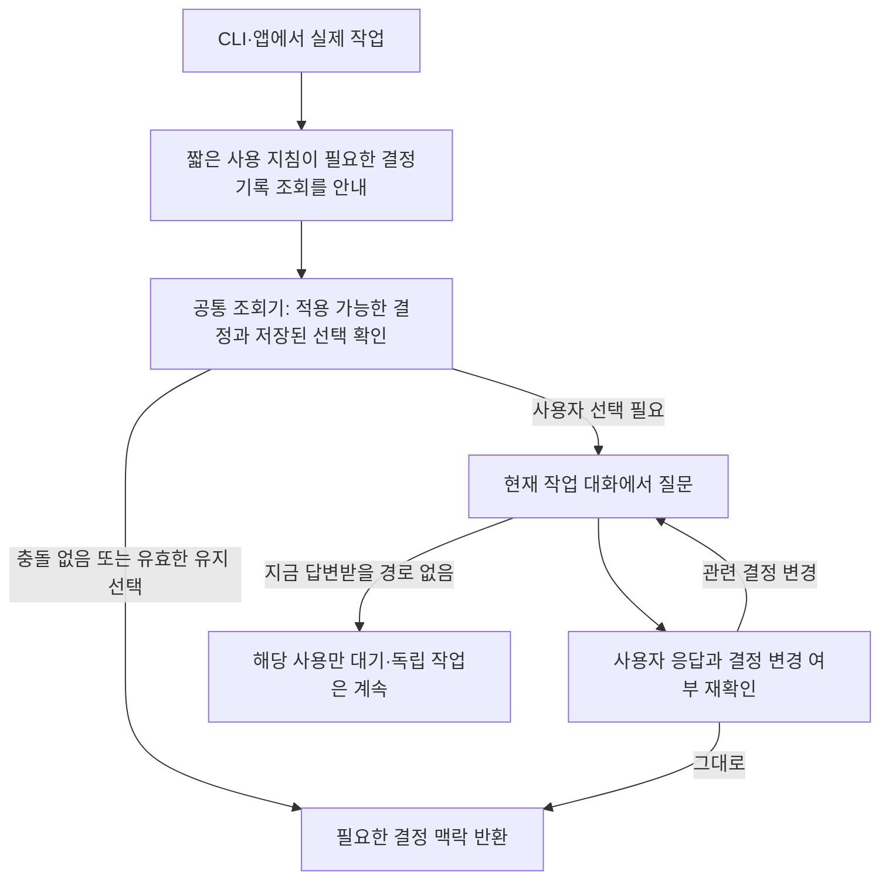

# 결정기록은 실제 작업 대화에서 묻는다

**활성화 때 전달되는 짧은 사용 지침이 조회할 때를 알려주고, 공통 조회기가 충돌을 판정하며,
현재 작업 중인 CLI·앱이 사용자에게 질문한다.** 이 세 역할을 기본 구조로 정한다.
Hook은 이 경로를 보조한다. Studio는 자료를 관리하고 상태를 확인하는 곳이다.

이 문서는 판단 근거와 검증 범위를 남기는 연구·검토 기록이다. 현재 설계 규칙은
[SSOT S05·S06](2026-09-15T1026--35c75ca--consolidated-design-ssot.md#s06-consumer-interaction)에 통합했다.
이번 작업은 설계 변경이며 실제 결정 조회기나 호스트 연결의 구현·검증 완료를 뜻하지 않는다.

## 무엇이 잘못됐나

이전 목업은 Studio의 `참고하기` 버튼으로 충돌 선택 창을 열었다. 이는
**자료를 관리하는 시점**과 **그 자료를 실제 판단에 적용하는 시점**을 섞었다.
사용자는 코딩이나 회계 작업을 하는 도중에 결정기록을 필요로 한다.
그때 Studio를 다시 열어 결정을 고르게 하면 작업 맥락이 끊긴다.
업무 요청이 처음부터 주어져도 질문은 그 요청을 받은 작업 호스트에서 한다.

서로 다른 ADR을 비교하거나 과거 결정을 읽는 일에는 적용 선택이 필요하지 않다.
상충하는 결정 중 하나를 이번 답변이나 행동에 적용하려 할 때 사용자 선택이 필요하다.
지침·지식자료의 기본 적용 순서인 레포 → 개인 → 팀은 그대로다.

## 가장 작은 구성

| 구성 | 맡길 일 | 맡기지 않을 일 |
| --- | --- | --- |
| 짧은 지침과 연결된 가이드 | 결정 맥락이 필요한 상황 인식, 조회기 호출, 예전 내용을 다시 적용할 때 재확인 | 모든 결정 본문을 시작 때 넣기, 지침만으로 사용 차단을 보장하기 |
| 공통 결정 조회기 | 관련 결정 비교, 유효한 선택 재사용, 질문·응답·재개 상태와 변경 무효화 | 호스트별로 별도 선택 저장소 만들기, 모델이 사용자를 대신해 선택하기 |
| 작업 호스트 연결부 | 현재 CLI·앱에서 질문 표시, 실제 응답 확인, 같은 사용 이어가기 | Studio로 보내기, 일반 도구 실행 승인을 결정 선택으로 간주하기 |
| 선택적 Hook | 지원되는 시작·압축 후 안내, 정확히 식별한 사용 요청의 보조 검사 | 모든 생각 감시, 매 도구 호출마다 묻기, 별도 터미널 입력창 열기 |

조회기는 로컬 라이브러리로 만들고 CLI/API와 필요한 MCP 연결부가 함께 사용한다.
MCP도 로컬 stdio로 연결할 수 있으므로 질문 기능 때문에 중앙 서버나 GitHub를
필수로 둘 이유가 없다. 이는 agent-bios의 배치 결정이며 외부 모델 자체의 오프라인
실행을 보장한다는 뜻은 아니다.

개인·레포·팀의 Instructions를 하나도 선택하지 않았어도 결정기록은 쓸 수 있어야
한다. 따라서 이 짧은 지침은 선택한 업무 지침의 내용이 아니라, 결정 조회 기능을
명시적으로 활성화할 때 연결부가 전달하는 사용 안내로 둔다. 관리 화면에서 자료를
골랐다는 이유만으로 주입하지 않으며, 기존 전역 지침 원문을 늘리지도 않는다.

실제 질문은 예를 들어 다음 정도다. 문구와 선택 표시 방식은 작업 호스트가 맡는다.

> 재시도 횟수를 정하려는데, 레포 결정은 2회이고 팀 결정은 3회입니다.
> 이번에는 어느 쪽을 따를까요? 다른 방식을 직접 정해도 됩니다.
> 이 선택을 관련 결정이 바뀔 때까지 유지할지, 사용할 때마다 물을지도 정해주세요.

사용자가 이미 `항상 묻기`를 선택했고 관련 결정이 그대로라면 다음에는 적용할
내용만 묻는다. 같은 조회의 재시도·페이지 이동·연결 복구는 새 질문을 만들지 않는다.
관련 결정 하나라도 바뀌면 유지된 선택과 방식을 함께 무효화한다. 대기 중 바뀌어도
예전 질문의 답을 그대로 적용하지 않는다. 이 수명 규칙은 이전 설계와 같다.

## 질문을 전달할 방식의 우선순위

**1. 실제 지원이 확인된 호스트의 입력 요청 기능을 우선한다.** MCP form
elicitation처럼 소비 도구가 현재 클라이언트에 입력을 요청하는 방식이면 가장 직접적이다.
선택과 keep/ask를 같은 요청에 담고, 사용자 응답 후 같은 사용을 이어간다.

**2. 그 기능이 없으면 같은 대화에서 묻는다.** 호스트의 질문 도구 또는 일반
대화를 사용한다. 단, 연결부가 실제 사용자 메시지·응답을 확인할 수 있어야 한다.
에이전트가 도구 인자에 `user_confirmed=true`라고 적은 것은 사용자 답이 아니다.
별도 계정이나 전자서명 체계를 만드는 대신 기존 로컬 사용자와 호스트의 응답
이벤트 경계를 사용한다. 이는 협력하는 도구 사이의 출처 확인이며 OS 소유자에
대한 변조 방지나 사람임을 암호학적으로 증명하는 체계가 아니다.

**3. 응답을 받을 수 없으면 그 사용을 대기시킨다.** 질문과 사용 ID를 저장하고,
나중에 사용자가 작업 대화로 돌아오면 이어간다. 무인 실행이어도 유효한 유지
선택은 재확인 후 쓸 수 있다. 새 선택이 필요한 부분만 대기하고 독립 작업은 계속한다.
답을 기다리는 동안 저장소 잠금을 잡아두지 않는다.

질문 취소·무응답·시간 초과·자동 답변은 선택이 아니다. 특히 호스트가 자동으로
채운 입력과 실제 사용자 입력을 구별할 수 없는 경로는 새 선택을 검증한 경로로
인정하지 않는다. 이 조건을 만족하는 다른 대화 경로를 쓰거나 대기를 유지한다.

## 공식 문서에서 확인한 범위

확인일은 2026-09-15다. Context7으로 라이브러리를 먼저 식별·조회하고,
OpenAI Docs 도구와 공식 문서 원문으로 관련 기능을 확인했다.

| 대상 | 문서상 근거 | 설계에 미치는 영향 |
| --- | --- | --- |
| Claude Code | MCP 입력 요청과 CLI의 form 대화를 제공한다. SDK의 `AskUserQuestion`은 실제 앱의 입력 처리가 필요하다. [MCP 문서](https://code.claude.com/docs/en/mcp#respond-to-mcp-elicitation-requests), [사용자 입력](https://code.claude.com/docs/en/agent-sdk/user-input#handle-clarifying-questions) | 기본 후보는 작업 도구의 native 입력 요청이다. 모든 Desktop·IDE·SDK 앱의 동일 지원을 추정하지 않는다. |
| Claude Code Hook | command hook에 controlling TTY가 없으며 async는 현재 실행을 차단하지 않는다. Elicitation 관련 hook은 응답을 자동 생성·변경할 수 있다. [Hook 입출력](https://code.claude.com/docs/en/hooks#hook-input-and-output), [Elicitation](https://code.claude.com/docs/en/hooks#elicitation) | Hook에서 직접 터미널 질문창을 열지 않는다. `accept` 응답만으로 사람이 골랐다고 단정하지 않는다. |
| Codex | app-server에 `mcpServer/elicitation/request`가 있고, `tool/requestUserInput`은 실험적이다. 질문 요청에는 자동 처리 시간 설정도 있을 수 있다. [App Server](https://learn.chatgpt.com/docs/app-server#approvals) | 질문 전달 수단은 있으나 특정 앱을 외부 도구가 임의로 제어할 수 있다는 뜻은 아니다. 실제 사용 경로와 사용자 응답 출처를 확인한다. |
| Codex Hook | PreToolUse의 `deny`·문맥 추가는 지원하지만 `permissionDecision: "ask"`는 미지원이며 호출이 계속된다. async는 실행을 차단하지 못한다. [Hooks](https://learn.chatgpt.com/docs/hooks#pretooluse) | Claude와 같은 이벤트 이름이어도 동작을 복사하지 않는다. Hook 성공 여부에 공통 조회기의 판정을 맡기지 않는다. |
| MCP | 최신 문서는 2026-07-28로 연결된다. form 지원을 선언한 클라이언트에만 요청하며 입력 필요 결과·재시도로 답을 전달한다. 이전 2025-11-25는 서버 요청 형태다. [현재 명세](https://modelcontextprotocol.io/specification/2026-07-28/client/elicitation), [이전 명세](https://modelcontextprotocol.io/specification/2025-11-25/client/elicitation) | 공통 질문 상태는 전송 방식과 분리한다. 구현할 클라이언트의 실제 프로토콜·기능을 P01/P10에서 고정한다. 모든 세대 지원은 요구하지 않는다. |

일반 도구 실행 허용과 결정기록 선택은 다른 의미다. 도구 실행을 허용했다고
“레포의 2회를 선택하고 다음에도 유지한다”는 답을 받은 것은 아니다. 반대로
결정 선택이 파일 변경·외부 전송·팀 발행 권한을 새로 만들지도 않는다.

## 현재 코드에서 재사용할 것과 없는 것

- [SURFACES.md](../../SURFACES.md)는 이미 초기 지침, 작업 context, MCP, hook을
  구분하고 지침 전달과 실행 증거의 차이를 명시한다. 이 구분을 유지한다.
- [instructions_session.py](../../compose/instructions_session.py)에는 선택한
  native 세션·자식의 Instructions 전달과 hook carrier가 있다. 현재 hook 등록·발견
  증거를 미래 결정 질문의 실행 증거로 쓰지 않는다.
- [instructions_app.py](../../compose/instructions_app.py)의 `AppSessions.use`는
  선택한 Instructions 본문을 현재 작업 context로 반환한다. 현재 bridge에는
  일반 결정 질문·응답 API가 없다. [bridge](../../compose/app_bridge/scripts/bridge.py)의
  좁은 호출 경계를 확장할 때 공통 owner를 연결한다.
- [instructions_understand.py](../../compose/instructions_understand.py)의 실제 사용자 턴 확인은 제한된 튜토리얼
  선례다. 이를 범용 사용자 응답 수집기가 구현되어 있다는 근거로 확대하지 않는다.

기존 Instructions 전달기를 K/M의 권한 높은 지침 주입기로 바꾸지 않는다.
지침은 조회 절차를 안내하고, 결정 본문은 출처·조건을 가진 참고자료로 전달한다.

## 남겨두는 한계와 구현 검증

이미 context에 있는 문장을 모델이 다시 떠올리는 순간은 일반 Hook으로 관찰할
수 없다. 따라서 공통 조회기를 거친 사용의 정확성을 검증하고, 그 밖의 의미적
준수는 지침과 실제 관찰의 범위로 남긴다. 이를 숨기기 위해 모든 행동을 감시하는
전역 통제 장치를 추가하지 않는다. 실제 우회 문제가 반복되면 그 경로만 보완한다.

P03은 영속 상태, P05는 결정 집합·수명주기, P06은 적용 판정,
**P10은 실제 호스트 질문·응답·재개**, P11은 관리 화면을 맡는다.
실제 호스트에서 native 입력, 일반 대화, 입력 경로 없음, hook 꺼짐,
답변 중 결정 변경, 압축·자식·예전 context 재사용을 각각 검증한다.
문서 검사·가상 목업은 이 실제 호스트 검증을 대신하지 않는다.

별도 질문 서버, 새로운 앱 전체, URL 승인 페이지, 범용 hook 감시기는 제외한다.
실제 지원 대상에서 현재 대화에 질문을 전달할 수 없는 문제가 확인될 때에만
해당 호스트 연결부를 다시 검토한다.
