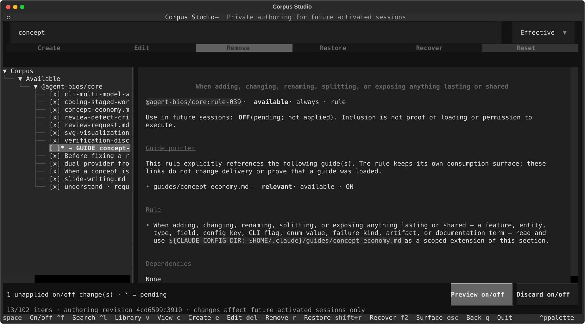

# agent-bios

**Claude Code와 Codex에서 사용할 개인 지침 라이브러리와 실행 도구입니다.**

지침을 직접 읽고 고치며, CLI 세션과 Codex 앱 작업마다 무엇을 사용할지 선택합니다.
기존 전역 지침 파일은 보존합니다.

[빠른 시작](#빠른-시작) · [Corpus Studio](#내-지침-라이브러리) · [작동 방식](#세션은-어떻게-작동하나) · [Understand!](#규칙의-이유-이해하기) · [문서](#문서) · [English](../README.md)



*0.18.0의 실제 Studio 화면입니다. Textual을 켜고 기본 corpus만 사용한
격리된 테스트 환경에서 캡처했습니다.*

영문이 배포 정본이며, 이 한글 문서는 참고용입니다. 설치되거나 모델에게 로드되지 않습니다.

## 내 작업에 맞는 지침 만들기

agent-bios는 규칙·가이드·절차로 이루어진 기본 라이브러리, **corpus**를 제공합니다.
어떤 내용을 자신의 작업환경에 사용할지는 사용자가 정합니다.

| 하고 싶은 일 | 제공하는 기능 |
| --- | --- |
| 지침의 내용 확인 | 문서 탐색·검색과 규칙에서 가이드로 이동하는 링크 |
| 작업 방식에 맞게 수정 | 기본 항목 편집, 개인 항목 생성, 소비방식 선택 |
| 사용할 항목 선택 | 내용을 삭제하지 않는 개별 켜기·끄기 |
| 기본 상태로 복원 | 기본 내용 복원, 개인 항목 복구, 전체 초기화 미리보기 |

호스트 CLI를 대체하거나 모델을 학습시키는 도구는 아닙니다.
모델이 모든 지침을 따른다고 보장하지도 않습니다.

## 빠른 시작

아래 설치 흐름은 **이 저장소의 소스**를 사용합니다. 공개된 npm 패키지
`agent-bios@0.18.0`에는 여기서 설명하는 대화형 설치와 내장 터미널 UI가 없습니다.
[설정과 준비 사항](../docs/setup.md)을 참고하세요.

### Codex 앱에서

설치할 컴퓨터의 로컬 작업을 열고 다음 한 줄을 보내세요.

```text
https://github.com/kangminlee-maker/agent-bios 설치해줘
```

에이전트가 [INSTALL.md](../INSTALL.md)에 따라 소스의 특정 리비전을 준비하고,
English·한국어·日本語 중 사용할 언어를 묻습니다. 설치할 의존성, corpus 사용 안 함
또는 특정 corpus, 앱 연결, 기존 지침 파일 캡처를 선택하고 적용할 내용을 확인합니다.
로컬 경로를 직접 적거나 Codex CLI를 따로 설치할 필요는 없습니다.

등록한 명령이 앱에 나타나면 `$agent-bios`로 설정과 라이브러리를 관리할 수 있습니다.
현재 작업에 corpus를 넣으려면 사용할 corpus를 명시해서 요청하세요.
설치하거나 Studio를 여는 것만으로는 작업에 지침이 추가되지 않습니다.
[앱에서 사용·끄기·개인 지침 가져오기 →](../docs/setup.md#use-corpus-in-a-codex-app-task)

### 터미널에서

**macOS 또는 Linux**, **Bash**, **Python 3.11 이상**이 필요합니다.
이 저장소의 **Code** 메뉴에서 복제 명령을 복사하거나 소스를 내려받으세요.
받은 저장소 폴더에서 터미널을 열고 실행합니다.

```bash
bash install.sh install
```

English·한국어·日本語를 지원하는 설치 화면이 열립니다. 검증된 Textual 런타임이
내장되어 있어 UI를 따로 설치할 필요가 없습니다. 사용할 의존성과 corpus를 고르세요.
[전체 설정 안내 →](../docs/setup.md)

CLI 세션을 실행하려면 해당 호스트 CLI를 설치·인증한 뒤, 작업할 프로젝트에서 실행합니다.

```bash
"$HOME/.local/bin/agent-launch" claude
```

Codex CLI 세션은 마지막 인자를 `codex`로 바꾸면 됩니다.

1. Builder 프리셋이나 **Custom**을 선택합니다.
2. 모델·리뷰·권한을 확인합니다. **일부 프리셋은 권한 우회를 요청**하므로 프로젝트에 맞게 선택하세요.
3. 세션을 시작합니다. 호스트 기본 설정으로 시작하려면 **Software Engineer / Vanilla**를 선택합니다.

런처의 **Corpus Studio**에서 라이브러리를 살펴볼 수 있습니다. 소스 설치는
`agent-launch`를 준비하며, 관리 명령은 보관한 소스 폴더에서
`bash install.sh <command>`로 실행합니다. 전역 `agent-bios`는 다른 npm 버전일 수 있습니다.
상세 문서의 `agent-bios`는 선택한 소스의 CLI를 가리키는 짧은 표기입니다.

일반 `claude`·`codex` 명령에는 corpus가 자동 추가되지 않습니다.
선택적인 [zsh 셸 연결](../docs/advanced-launch.md#optional-shell-connection)을 켜면
인자 없는 대화형 명령을 런처로 연결할 수 있습니다. 기존 전역 설치가 있다면
[마이그레이션 안내](../docs/recovery.md#ownership-and-legacy-migration)를 먼저 확인하세요.

## 내 지침 라이브러리

런처의 **Corpus Studio**를 선택하거나 소스 폴더에서 `bash install.sh corpus`를 실행합니다.
앱의 `$agent-bios`도 대화로 같은 라이브러리를 관리합니다.

- **커서 이동 즉시 읽기:** 목록에서 항목을 옮기면 Enter 없이 오른쪽 문서가 바뀝니다.
  방향키로 검색창·버튼·목록·문서 사이도 이동할 수 있습니다.
- **가이드 연결 확인:** 명시적인 가이드 참조에는 **→ GUIDE**가 표시됩니다.
  연결 문서와 현재 소비방식·상태를 확인할 수 있습니다.
- **개별 켜기·끄기:** 목록에서 **Space**를 누릅니다.
  `[x]`는 켜짐, `[ ]`는 꺼짐, `*`는 아직 적용하지 않은 선택입니다.
- **미리 보고 적용:** 여러 항목을 바꾼 뒤 **Preview on/off → Apply**로 함께 적용합니다.
  일반 편집도 원본 변경 여부를 확인하는 미리보기·적용 절차를 거칩니다.

**사용 여부**와 **소비방식**은 별개입니다. 선택한 핵심 규칙은 `always`,
가이드는 `relevant`, 요청형 절차는 `requested`일 수 있습니다.
훅·에이전트의 native 실행에는 별도 동의와 어댑터가 필요합니다.

개별 켜기·끄기는 기본 도메인·core 선택보다 우선합니다.
꺼도 내용과 개인 수정은 남고 학습할 수도 있습니다.
업데이트 후에도 선택은 유지되며, 전체 초기화는 설치 기본 선택으로 돌아갑니다.

[상세 조작·키보드 이동·소비방식·기본 가이드 →](../docs/corpus.md)

## 세션은 어떻게 작동하나

**라이브러리 → 선택과 개인 수정 → 고정본 → 설정된 세션**

설치는 agent-bios 소유 경로에 릴리즈와 기준 상태를 보관합니다.
설정된 런처가 선택한 내용을 호스트에 맞게 구성합니다.
나중에 수정한 내용은 이후 고정본에 반영되고, 관리되는 CLI 세션 재개는 기록된 고정본을 찾습니다.
앱 작업은 별도로 선택한 고정본을 도구의 응답으로 받습니다. 앱에서 사용을 꺼도
이미 대화에 들어간 내용이 지워지지는 않습니다.

활성 세션에서도 **사용자의 기존 전역 지침은 기본적으로 함께 로드**됩니다.
전역 파일을 덮어쓰지 않는 것과 로드하지 않는 것은 다릅니다.
지원되는 Claude 버전에는 전역 문서 제외 옵션이 있지만, 현재 Codex 어댑터에는 없습니다.
프로젝트 지침과 이전 대화 내용은 별도입니다.

[저장 경로·세션 고정·검증 범위 →](../docs/session-model.md)

## 규칙의 이유 이해하기

런처의 **Understand!**에서 학습할 묶음을 선택합니다.
파일을 하나씩 외우는 대신 규칙의 목적·배경·장단점·한계를 문답으로 이해합니다.

학습이 이어지는 동안 설명 말미에 관련 질문을 하나씩 하고 답을 기다립니다.
문서에 적힌 근거와 추론을 구분하며, 일시정지·종료 요청을 따릅니다.

예를 들어 모호함을 다루는 규칙이라면 이렇게 물을 수 있습니다.

*“이 모호함이 해소되면 다음 행동에서 무엇이 달라지나요?”*

규칙이 언제 도움이 되고 어디까지 유효한지 이해하는 것이 목적입니다.
모델을 훈련하는 기능이 아니며, 개인 발견의 저장에는 사용자 확인이 필요합니다.

[학습 세션과 개인 발견 →](../docs/understand.md)

## 통제할 수 있는 범위

- 기본 설치는 전역 지침·호스트 탐색 디렉터리·훅 설정을 덮어쓰지 않습니다.
  기존 전역 설치의 정리는 별도 마이그레이션입니다.
- 체크박스를 켜도 native 실행 동의·신뢰·권한을 우회하지 않습니다.
- `agent-bios verify`는 저장된 내용과 관리 파일을 검사합니다.
  `activation: unverified`는 모델이 읽었다는 증명이 아니라는 뜻입니다.
  인증된 세션 재개와 일부 native 연동은 [미검증 범위](../docs/session-model.md#verification-and-limits)가 남아 있습니다.
- 마이그레이션·초기화는 미리보기를 확인한 뒤 적용합니다.
  소유권 충돌이 난 파일을 설치를 위해 임의로 삭제하지 마세요.

## 문서

| 필요한 내용 | 문서 |
| --- | --- |
| 설치·앱 연결·기존 지침 가져오기 | [설정](../docs/setup.md) |
| corpus 편집·선택·복원 | [Corpus](../docs/corpus.md) |
| 고정본·저장·검증 범위 | [세션 모델](../docs/session-model.md) |
| 설치 충돌·마이그레이션·초기화 | [복구](../docs/recovery.md) |
| 프리셋·셸 연결·전역 지침·native 기능·리뷰 | [실행 설정](docs/advanced-launch.md) |
| 학습과 발견 저장 | [Understand!](../docs/understand.md) |
| 도구와 버전 | [의존성](../DEPENDENCIES.md) |
| 저장소 개발 | [기여 안내](CONTRIBUTING.md) — checkout 필요 |

상세 운영 문서는 영문이 기준입니다. 명령은 `agent-bios help`와
`agent-bios corpus --help`에서 확인할 수 있습니다.
소스 참고: [전달 표면](../SURFACES.md), [네트워크 계약](../ENDPOINTS.md), [용어](../LEXICON.md).

## 다른 환경에서 사용하기

`(private)` 표시와 환경별 의존성을 검토하세요. 개인 수정은 Studio에 보관할 수 있고,
배포 기본값 자체를 바꿀 때는 [소스 수정 절차](CONTRIBUTING.md)를 따릅니다.

## 포함 범위

패키지는 지침과 실행 도구를 포함합니다. 개인 corpus 상태·학습 기록·세션 고정 정보·
자격증명·호스트 설정은 포함하지 않습니다.

## 라이선스

[MIT](../LICENSE).
