===== FILE mattpocock/skills::CLAUDE.md | stars=187816 followers=33148 lang=Shell bytes=3297 =====

Skills are organized into bucket folders under `skills/`:

- `engineering/` — daily code work
- `productivity/` — daily non-code workflow tools
- `misc/` — kept around but rarely used, not promoted
- `personal/` — tied to my own setup, not promoted
- `in-progress/` — drafts not yet ready to ship
- `deprecated/` — no longer used

Every skill in `engineering/` or `productivity/` (the **promoted** buckets) must have a reference in the top-level `README.md` and an entry in `.claude-plugin/plugin.json`'s `skills` array (the Claude Code plugin ships exactly the promoted set). Skills in `misc/`, `personal/`, `in-progress/`, and `deprecated/` must not appear in either.

The repo is also its own single-plugin Claude Code marketplace: `.claude-plugin/marketplace.json` lists the one `mattpocock-skills` plugin. When bumping the release version, keep `.claude-plugin/plugin.json`'s `version` in sync with `package.json`'s — Claude uses the plugin `version` to decide when installed users see an update. Run `claude plugin validate . --strict` after touching either manifest. Why a Claude plugin but not (yet) a Codex one lives in [.agents/adr/0002-ship-as-a-claude-code-plugin.md](./.agents/adr/0002-ship-as-a-claude-code-plugin.md).

Each skill entry in the top-level `README.md` must link the skill name to its `SKILL.md`.

Each bucket folder has a `README.md` that lists every skill in the bucket with a one-line description, with the skill name linked to its `SKILL.md`. The promoted buckets' `README.md`s and the top-level `README.md` group entries into **User-invoked** and **Model-invoked**; non-promoted bucket `README.md`s (`misc/`, `personal/`) use a flat list.

Skills in `engineering/` and `productivity/` also have a human-facing docs page at `docs/<bucket>/<skill-name>.md` (the docs tree mirrors those two bucket folders under `skills/`). The published URL is `https://aihero.dev/skills-<skill-name>` regardless of bucket — the docs path is repo organisation only. When you add, rename, or change the behaviour of a skill in `engineering/` or `productivity/`, create or re-sync its docs page following [.agents/writing-docs.md](./.agents/writing-docs.md). Skills in the non-promoted buckets (`misc/`, `personal/`, `in-progress/`, `deprecated/`) get **no** docs page.

Every `SKILL.md` is either user-invoked (`disable-model-invocation: true` plus `policy.allow_implicit_invocation: false` in `agents/openai.yaml`, reachable only by the human) or model-invoked (model- or user-reachable). See [.agents/invocation.md](./.agents/invocation.md).

[`ask-matt`](./skills/engineering/ask-matt/SKILL.md) is the router that maps every user-reachable skill and how they relate. The same trigger that re-syncs a docs page applies to it: whenever you add, rename, remove, or change how a user-reachable skill fits the flows, re-read `ask-matt`'s `SKILL.md` and update it so the map stays accurate — a new skill it never mentions, or a stale one it still routes to, is a router that lies.

To (re)link every skill into the local harness skill directories (`~/.claude/skills`, `~/.agents/skills`), run `scripts/link-skills.sh`. Each entry is a symlink into this repo, so a `git pull` keeps installed skills current; re-run the script after adding, removing, or renaming a skill.


===== FILE f/prompts.chat::CLAUDE.md | stars=166348 followers=11261 lang=HTML bytes=2328 =====

# CLAUDE.md

> Quick reference for Claude Code when working on prompts.chat

## Project Overview

**prompts.chat** is a social platform for AI prompts built with Next.js 16 App Router, React 19, TypeScript, and PostgreSQL/Prisma. It allows users to share, discover, and collect prompts.

For detailed agent guidelines, see [AGENTS.md](AGENTS.md).

## Quick Commands

```bash
# Development
npm run dev              # Start dev server at localhost:3000
npm run build            # Production build (runs prisma generate)
npm run lint             # Run ESLint

# Database
npm run db:migrate       # Run Prisma migrations
npm run db:push          # Push schema changes
npm run db:studio        # Open Prisma Studio
npm run db:seed          # Seed database

# Type checking
npx tsc --noEmit         # Check TypeScript types
```

## Key Files

| File | Purpose |
|------|---------|
| `prompts.config.ts` | Main app configuration (branding, theme, auth, features) |
| `prisma/schema.prisma` | Database schema |
| `src/lib/auth/index.ts` | NextAuth configuration |
| `src/lib/db.ts` | Prisma client singleton |
| `messages/*.json` | i18n translation files |

## Project Structure

```
src/
├── app/              # Next.js App Router pages
│   ├── (auth)/       # Login, register
│   ├── api/          # API routes
│   ├── prompts/      # Prompt CRUD pages
│   └── admin/        # Admin dashboard
├── components/       # React components
│   ├── ui/           # shadcn/ui base components
│   └── prompts/      # Prompt-related components
└── lib/              # Utilities and config
    ├── ai/           # OpenAI integration
    ├── auth/         # NextAuth setup
    └── plugins/      # Auth and storage plugins
```

## Code Patterns

- **Server Components** by default, `"use client"` only when needed
- **Translations:** Use `useTranslations()` or `getTranslations()` from next-intl
- **Styling:** Tailwind CSS with `cn()` utility for conditional classes
- **Forms:** React Hook Form + Zod validation
- **Database:** Prisma client from `@/lib/db`

## Before Committing

1. Run `npm run lint` to check for issues
2. Add translations for any user-facing text
3. Use existing UI components from `src/components/ui/`
4. Never commit secrets (use `.env`)


===== FILE garrytan/gstack::AGENTS.md | stars=124250 followers=13069 lang=TypeScript bytes=7725 =====

# gstack — AI Engineering Workflow

gstack is a collection of SKILL.md files that give AI agents structured roles for
software development. Each skill is a specialist: CEO reviewer, eng manager,
designer, QA lead, release engineer, debugger, and more.

## Available skills

Skills live in `.agents/skills/` (or `~/.claude/skills/gstack/` on Claude Code).
Invoke them by name (e.g., `/office-hours`).

### Plan-mode reviews

| Skill | What it does |
|-------|-------------|
| `/office-hours` | Start here. Reframes your product idea before you write code. |
| `/plan-ceo-review` | CEO-level review: find the 10-star product in the request. |
| `/plan-eng-review` | Lock architecture, data flow, edge cases, and tests. |
| `/plan-design-review` | Rate each design dimension 0-10, explain what a 10 looks like. |
| `/plan-devex-review` | DX-mode review: TTHW, magical moments, friction points, persona traces. |
| `/plan-tune` | Self-tune AskUserQuestion sensitivity per question. |
| `/autoplan` | One command runs CEO → design → eng → DX review. |
| `/design-consultation` | Build a complete design system from scratch. |
| `/spec` | Turn vague intent into a precise, executable spec in five phases. Files a GitHub issue, optionally spawns a Claude Code agent in a fresh worktree, and lets `/ship` close the source issue on merge. |

### Implementation + review

| Skill | What it does |
|-------|-------------|
| `/review` | Pre-landing PR review. Finds bugs that pass CI but break in prod. |
| `/codex` | Second opinion via OpenAI Codex. Review, challenge, or consult modes. |
| `/investigate` | Systematic root-cause debugging. No fixes without investigation. |
| `/design-review` | Live-site visual audit + fix loop with atomic commits. |
| `/design-shotgun` | Generate multiple AI design variants, comparison board, iterate. |
| `/design-html` | Generate production-quality Pretext-native HTML/CSS. |
| `/devex-review` | Live developer experience audit (TTHW measured against the real flow). |
| `/qa` | Open a real browser, find bugs, fix them, re-verify. |
| `/qa-only` | Same methodology as /qa but report only — no code changes. |
| `/scrape` | Pull data from a web page. First call prototypes; codified call runs in ~200ms. |
| `/skillify` | Codify the most recent successful `/scrape` flow into a permanent browser-skill. |

### Release + deploy

| Skill | What it does |
|-------|-------------|
| `/ship` | Run tests, review, push, open PR. Workspace-aware version queue. |
| `/land-and-deploy` | Merge the PR, wait for CI and deploy, verify production health. |
| `/canary` | Post-deploy monitoring loop using the browse daemon. |
| `/landing-report` | Read-only dashboard for the workspace-aware ship queue. |
| `/document-release` | Update all docs to match what you just shipped. |
| `/document-generate` | Generate Diataxis docs (tutorial / how-to / reference / explanation) from code. |
| `/setup-deploy` | One-time deploy config detection (Fly.io, Render, Vercel, etc.). |
| `/gstack-upgrade` | Update gstack to the latest version. |

### Operational + memory

| Skill | What it does |
|-------|-------------|
| `/context-save` | Save working context (git state, decisions, remaining work). |
| `/context-restore` | Resume from a saved context, even across Conductor workspaces. |
| `/learn` | Manage what gstack learned across sessions. |
| `/retro` | Weekly retro with per-person breakdowns and shipping streaks. |
| `/health` | Code quality dashboard (type checker, linter, tests, dead code). |
| `/benchmark` | Performance regression detection (page load, Core Web Vitals). |
| `/benchmark-models` | Cross-model benchmark for skills (Claude, GPT, Gemini side-by-side). |
| `/cso` | OWASP Top 10 + STRIDE security audit. |
| `/setup-gbrain` | Set up gbrain for cross-machine session memory sync. |
| `/sync-gbrain` | Keep gbrain current with this repo's code; refresh agent search guidance in CLAUDE.md. |

### Browser + agent integration

| Skill | What it does |
|-------|-------------|
| `/browse` | Headless browser — real Chromium, real clicks, ~100ms/command. |
| `/open-gstack-browser` | Launch the visible GStack Browser with sidebar + stealth. |
| `/setup-browser-cookies` | Import cookies from your real browser for authenticated testing. |
| `/pair-agent` | Pair a remote AI agent (OpenClaw, Codex, etc.) with your browser. |

### iOS QA — drive real iPhones over USB or Tailscale (v1.43.0.0+)

| Skill | What it does |
|-------|-------------|
| `/ios-qa` | Live-device iOS QA via USB CoreDevice tunnel + embedded StateServer. Optionally exposes the device over Tailscale so remote agents can drive it. |
| `/ios-fix` | Autonomous iOS bug fixer with regression snapshot capture. |
| `/ios-design-review` | Designer's-eye QA on a real iPhone — 10-dimension Apple HIG rubric. |
| `/ios-clean` | Convenience: strip DebugBridge + #if DEBUG wiring before a Release build. |
| `/ios-sync` | Regenerate the iOS debug bridge against the latest upstream templates. |

Companion CLIs (run on the Mac that's plugged into the device):

| Command | What it does |
|---------|-------------|
| `gstack-ios-qa-daemon` | Mac-side broker. Loopback by default; `--tailnet` adds a Tailscale-facing listener with capability tiers and audit logging. |
| `gstack-ios-qa-mint` | Owner-grant CLI for the tailnet allowlist (`grant`/`revoke`/`list`). |
| `gstack-ios-qa-regen` | Regenerate the canonical local DebugBridge package and typed accessors (`--app-source` / `--bridge-dir`). |

End-to-end walkthrough: [docs/howto-ios-testing-with-gstack.md](docs/howto-ios-testing-with-gstack.md).

### Safety + scoping

| Skill | What it does |
|-------|-------------|
| `/careful` | Warn before destructive commands (rm -rf, DROP TABLE, force-push). |
| `/freeze` | Lock edits to one directory. Hard block, not just a warning. |
| `/guard` | Activate both careful + freeze at once. |
| `/unfreeze` | Remove directory edit restrictions. |
| `/make-pdf` | Turn any markdown file into a publication-quality PDF. |
| `/diagram` | English in, diagram out: mermaid source + editable .excalidraw + SVG/PNG, offline. |

## Build commands

```bash
bun install              # install dependencies
bun test                 # run free tests (no API spend)
bun run test:windows     # curated Windows-safe subset (runs on windows-latest)
bun run build            # generate docs + compile binaries
bun run gen:skill-docs   # regenerate SKILL.md files from templates
bun run skill:check      # health dashboard for all skills
```

## Platform support

- **macOS** + **Linux**: full test suite supported.
- **Windows**: curated Windows-safe subset runs on `windows-latest` via the
  `windows-free-tests` CI job. Setup script (`./setup`) requires Git Bash or
  MSYS today; native PowerShell support is a future expansion. The `bin/gstack-paths`
  helper resolves state roots through `CLAUDE_PLUGIN_DATA` / `GSTACK_HOME` so plugin
  installs work on every platform.

## Key conventions

- SKILL.md files are **generated** from `.tmpl` templates. Edit the template, not the output.
- Run `bun run gen:skill-docs --host codex` to regenerate Codex-specific output.
- The browse binary provides headless browser access. Use `$B <command>` in skills.
- Safety skills (careful, freeze, guard) use inline advisory prose — always confirm before destructive operations.
- State paths resolve via `bin/gstack-paths` (sourced via `eval "$(...)"`). Honors `GSTACK_HOME`, `CLAUDE_PLUGIN_DATA`, `CLAUDE_PLANS_DIR`.
- The `claude` CLI binary resolves via `browse/src/claude-bin.ts` (`Bun.which()` + `GSTACK_CLAUDE_BIN` override). Set `GSTACK_CLAUDE_BIN=wsl` plus `GSTACK_CLAUDE_BIN_ARGS='["claude"]'` to run Claude through WSL on Windows.


===== FILE electron/electron::CLAUDE.md | stars=122186 followers=None lang=C++ bytes=9910 =====

# Electron Development Guide

## Running node_modules binaries

**Never use `npx`.** It is considered dangerous because it can silently fetch and execute arbitrary packages from the registry. Always run binaries through one of these safer mechanisms instead:

1. **Preferred** — spawn the executable directly from `node_modules/.bin/<tool>` (or the platform equivalent on Windows). This is what `script/lint.js` does for `oxlint`.
2. **Acceptable** — invoke via `yarn <tool>` or `yarn run <tool>`, which resolves to the locally installed version without the registry fallback that `npx` performs.

This rule applies to shell commands you run yourself and to any scripts you author or modify in this repo.

## Project Overview

Electron is a framework for building cross-platform desktop applications using web technologies. It embeds Chromium for rendering and Node.js for backend functionality.

## Directory Structure

```text
electron/                 # This repo (run `e` commands here)
├── shell/               # Core C++ application code
│   ├── browser/         # Main process implementation (107+ API modules)
│   ├── renderer/        # Renderer process code
│   ├── common/          # Shared code between processes
│   ├── app/             # Application entry points
│   └── services/        # Node.js service integration
├── lib/                 # TypeScript/JavaScript library code
│   ├── browser/         # Main process JS (47 API implementations)
│   ├── renderer/        # Renderer process JS
│   └── common/          # Shared JS modules
├── patches/             # Patches for upstream dependencies
│   ├── chromium/        # ~159 patches to Chromium
│   ├── node/            # ~48 patches to Node.js
│   └── ...              # Other targets (v8, boringssl, etc.)
├── spec/                # Test suite (1189+ TypeScript test files)
├── docs/                # API documentation and guides
├── build/               # Build configuration
├── script/              # Build and automation scripts
└── chromium_src/        # Chromium source overrides
../                      # Parent directory is Chromium source
```

## Build Tools Setup

Electron uses `@electron/build-tools` for development. The `e` command is the primary CLI.

**Installation:**

```bash
npm i -g @electron/build-tools
```

**Configuration location:** `~/.electron_build_tools/configs/`

## Essential Commands

### Configuration Management

| Command | Purpose |
|---------|---------|
| `e init <name> --root=<path> --bootstrap testing` | Create new build config and sync |
| `e use <name>` | Switch to a different build configuration |
| `e show current` | Display active configuration name |
| `e show configs` | List all available configurations |

### Build & Development Loop

| Command | Purpose |
|---------|---------|
| `e sync` | Fetch/update all source code and apply patches |
| `e sync --3` | Sync with 3-way merge (required for Chromium upgrades) |
| `e build` | Build Electron (runs GN + Ninja) |
| `e build -k 999` | Build and continue on errors (up to 999) |
| `e build -t <target>` | Build specific target (e.g., `electron:node_headers`) |
| `e start` | Run the built Electron executable |
| `e start --version` | Verify Electron launches and print version |
| `e test` | Run the test suite |
| `e debug` | Run Electron in debugger (lldb on macOS, gdb on Linux) |

### Patch Management

| Command | Purpose |
|---------|---------|
| `e patches <target>` | Export patches for a target (chromium, node, v8, etc.) |
| `e patches all` | Export all patches from all targets |
| `e patches --list-targets` | List available patch targets |

## Typical Development Workflow

```bash
# 1. Ensure you're on the right config
e show current

# 2. Sync to get latest code
e sync

# 3. Make your changes in shell/ or lib/ or ../

# 4. Build
e build

# 5. Test your changes (Leave the user to do this, don't run these commands unless asked)
e start
e test

# 6. If you modified patched files in Chromium:
cd ..  # Go to Chromium repo
git add <files>
git commit -m "description of change"
cd electron
e patches chromium  # Export the patch
```

## Patches System

Electron patches upstream dependencies (Chromium, Node.js, V8, etc.) to add features or modify behavior.

**How patches work:**

```text
patches/{target}/*.patch  →  [e sync --3]  →  target repo commits
                          ←  [e patches]   ←
```

**Patch configuration:** `patches/config.json` maps patch directories to target repos.

**Key rules:**

- Fix existing patches 99% of the time rather than creating new ones
- Preserve original authorship in TODO comments
- Never change TODO assignees (`TODO(name)` must retain original name)
- Each patch file includes commit message explaining its purpose

**Creating/modifying patches:**

1. Make changes in the target repo (e.g., `../` for Chromium)
2. Create a git commit
3. Run `e patches <target>` to export

**Fixing patch conflicts on an existing PR:**

If asked to fix a patch conflict on a branch that already has an open PR, check the PR's failed **Apply Patches** CI run for an `update-patches` artifact before running `e sync` locally. CI has already performed the 3-way merge and exported the resolved patch diff — applying it is much faster than a full local sync.

```bash
# Find the failed Apply Patches run for the PR and download the artifact
gh run list --repo electron/electron --branch <pr-branch> --workflow "Apply Patches" --limit 1
gh run download <run-id> --repo electron/electron --name update-patches

# Apply the CI-generated fix, then push
git am update-patches.patch
git push
```

If no artifact exists (e.g. the 3-way merge itself failed), fall back to `e sync --3` and resolve manually.

## Testing

**Test location:** `spec/` directory

**Running tests:**

```bash
e test                    # Run full test suite
```

**Test frameworks:** Mocha, Chai, Sinon

## Build Configuration

**GN build arguments:** Located in `build/args/`:

- `testing.gn` - Debug/testing builds
- `release.gn` - Release builds
- `all.gn` - Common arguments for all builds

**Main build file:** `BUILD.gn`

**Feature flags:** `buildflags/buildflags.gni`

## Chromium Upgrade Workflow

When working on the `roller/chromium/main` branch to upgrade Chromium activate the "Electron Chromium Upgrade" skill.

## Node.js Upgrade Workflow

When working on the `roller/node/main` branch to upgrade Node.js activate the "Electron Node.js Upgrade" skill.

## Pull Requests

PR bodies must always include a `Notes:` section as the **last line** of the body. This is a consumer-facing release note for Electron app developers — describe the user-visible fix or change, not internal implementation details. Use `Notes: none` if there is no user-facing change.

### PR Labeling (write-access only)

When the user has write access to `electron/electron`, add these labels when creating PRs:

**Semver label** — one of:

- `semver/none` — build changes, refactors, CI, or anything with no end-user impact
- `semver/patch` — backwards-compatible bug fixes
- `semver/minor` — backwards-compatible new functionality
- `semver/major` — incompatible API changes

**Backport target labels** — add `target/{N}-x-y` for each supported release branch the change should land on. Default policy:

- **Bug fixes** — backport to all active release lines _except the oldest_
- **Security fixes** — backport to all active release lines _including the oldest_
- **Features (semver/minor) and breaking changes (semver/major)** — no backport labels; main-only by default

To find which release branches are active, check label colors — active `target/*` labels use color `#ad244f`, older/EOL ones use `#ededed`:

```bash
gh label list --repo electron/electron --search target/ --json name,color --jq '.[] | select(.color == "ad244f") | .name'
```

## Code Style

**C++:** Follows Chromium style, enforced by clang-format
**TypeScript/JavaScript:** [oxlint](https://oxc.rs/docs/guide/usage/linter) configuration in `.oxlintrc.json`

**Linting:**

```bash
npm run lint              # Run all linters
npm run lint:js           # Run oxlint over all JS/TS/MJS sources
npm run lint:clang-format # C++ formatting
npm run lint:api-history  # Validate API history YAML blocks in docs
```

## Key Files

| File | Purpose |
|------|---------|
| `BUILD.gn` | Main GN build configuration |
| `DEPS` | Dependency versions and checkout paths |
| `patches/config.json` | Patch target configuration |
| `filenames.gni` | Source file lists by platform |
| `package.json` | Node.js dependencies and scripts |

## Environment Variables

| Variable | Purpose |
|----------|---------|
| `GN_EXTRA_ARGS` | Additional GN arguments (useful in CI) |
| `ELECTRON_RUN_AS_NODE=1` | Run Electron as Node.js |

## Useful Git Commands for Chromium

```bash
# Find CL that changed a file
cd ..
git log --oneline -10 -- {file}
git blame -L {start},{end} -- {file}

# Look for Chromium CL reference in commit
git log -1 {commit_sha}  # Find "Reviewed-on:" line

# Find which patch affects a file
grep -l "filename.cc" patches/chromium/*.patch
```

## CI/CD

GitHub Actions workflows in `.github/workflows/`:

- `build.yml` - Main build workflow
- `pipeline-electron-lint.yml` - Linting
- `pipeline-segment-electron-test.yml` - Testing

## Common Issues

**Patch conflict during sync:**

- Use `e sync --3` for 3-way merge
- Check if file was renamed/moved upstream
- Verify patch is still needed

**Build error in patched file:**

- Find the patch: `grep -l "filename" patches/chromium/*.patch`
- Match existing patch style (#if 0 guards, BUILDFLAG conditionals, etc.)

**Remote build issues:**

- Try `e build --no-remote` to build locally
- Check reclient/siso configuration in your build config


===== FILE vllm-project/vllm::AGENTS.md | stars=87138 followers=None lang=Python bytes=5654 =====

# Agent Instructions for vLLM

> These instructions apply to **all** AI-assisted contributions to `vllm-project/vllm`.
> Breaching these guidelines can result in automatic banning.

## 1. Contribution Policy (Mandatory)

### Duplicate-work checks

Before proposing a PR, run these checks:

```bash
gh issue view <issue_number> --repo vllm-project/vllm --comments
gh pr list --repo vllm-project/vllm --state open --search "<issue_number> in:body"
gh pr list --repo vllm-project/vllm --state open --search "<short area keywords>"
```

- If an open PR already addresses the same fix, do not open another.
- If your approach is materially different, explain the difference in the issue.

### No low-value busywork PRs

Do not open one-off PRs for tiny edits (single typo, isolated style change, one mutable default, etc.). Mechanical cleanups are acceptable only when bundled with substantive work.

### Accountability

- Pure code-agent PRs are **not allowed**. A human submitter must understand and defend the change end-to-end.
- The submitting human must review every changed line and run relevant tests.
- PR descriptions for AI-assisted work **must** include:
    - Why this is not duplicating an existing PR.
    - Test commands run and results.
    - Model evaluation results when the change affects output, accuracy, or serving.
    - Clear statement that AI assistance was used.

### Fail-closed behavior

If work is duplicate/trivial busywork, **do not proceed**. Return a short explanation of what is missing.

---

## 2. Development Workflow

- **Never use system `python3` or bare `pip`/`pip install`.** All Python commands must go through `uv` and `.venv/bin/python`.

### Environment setup

```bash
# Install `uv` if you don't have it already:
curl -LsSf https://astral.sh/uv/install.sh | sh

# Always use `uv` for Python environment management:
uv venv --python 3.12
source .venv/bin/activate

# Always make sure `pre-commit` and its hooks are installed:
uv pip install -r requirements/lint.txt
pre-commit install
```

### Installing dependencies

```bash
# If you are only making Python changes:
VLLM_USE_PRECOMPILED=1 uv pip install -e . --torch-backend=auto

# If you are also making C/C++ changes:
uv pip install -e . --torch-backend=auto
```

### Tests

> Requires [Environment setup](#environment-setup) and [Installing dependencies](#installing-dependencies).

```bash
# Install test dependencies (use cuda.in on non-x86_64):
uv pip install -r requirements/test/cuda.in

# Run a specific test file:
.venv/bin/python -m pytest tests/path/to/test_file.py -v
```

When adding tests:

- **Design before you write.** Answer four questions first: what is the module
  for, what is its I/O contract, what failure am I guarding against, and what is
  the cheapest level that catches it (unit over integration over e2e)?
- **Reuse before create.** Extend existing test files, `conftest.py` fixtures, and
  helpers; add a new file only when no nearby suite fits.
- **Test behavior with intent.** Assert observable outcomes through public APIs;
  state why in the name or docstring. Skip trivial wiring; flaky tests are worse
  than no tests.
- **Keep it minimal.** One behavior per test and the smallest setup that
  triggers it; if the test diff dwarfs the code change, cut scope.
- **No one-off kernel benchmarks in `tests/`.** Put kernel perf work in
  `benchmarks/kernels/`; prove correctness in existing pytest suites.
- **Run model evals for model-affecting changes.** Search `tests/evals/` or use
  `vllm bench` and include results in the PR — do not wait for reviewers to ask.

For model-specific requirements, see
[`docs/contributing/model/tests.md`](docs/contributing/model/tests.md).

### Running linters

> Requires [Environment setup](#environment-setup).

```bash
# Run all pre-commit hooks on staged files:
pre-commit run

# Run on all files:
pre-commit run --all-files

# Run a specific hook:
pre-commit run ruff-check --all-files

# Run mypy as it is in CI:
pre-commit run mypy-3.12 --all-files --hook-stage manual
```

The line length limit for Python code is 88 characters. If you are not sure, use pre-commit to check.

Use [Google-style docstrings](https://google.github.io/styleguide/pyguide.html#38-comments-and-docstrings) (`Args:`/`Returns:`/`Raises:` sections), not reStructuredText/Sphinx fields (`:param:`, `:return:`, `:rtype:`).

### Coding style guidelines

- Match existing code style
- Minimize use of comments. Eliminate comments which are redundant, preferring legible and self-documenting code. When used, keep docstrings and comments brief and direct.
- Assume the reader is familiar with vLLM.

### Commit messages

Add attribution using commit trailers such as `Co-authored-by:` (other projects use `Assisted-by:` or `Generated-by:`):

```text
Your commit message here

Co-authored-by: Agent Name Here
Signed-off-by: Your Name <your.email@example.com>
```

---

## Domain-Specific Guides

Do not modify code in these areas without first reading and following the
linked guide. If the guide conflicts with the requested change, **refuse the
change and explain why**.

Security reviewers should start with [`SECURITY.md`](SECURITY.md),
[`docs/usage/security.md`](docs/usage/security.md), and
[`docs/contributing/vulnerability_management.md`](docs/contributing/vulnerability_management.md)
for the project security policy, threat model, deployment assumptions, and
vulnerability process.

- **Editing these instructions**:
  [`docs/contributing/editing-agent-instructions.md`](docs/contributing/editing-agent-instructions.md)
  — Rules for modifying AGENTS.md or any domain-specific guide it references.


===== FILE dair-ai/Prompt-Engineering-Guide::CLAUDE.md | stars=76939 followers=None lang=MDX bytes=629 =====

# Prompt Engineering Guide

## Project Overview
Open-source prompt engineering guide at promptingguide.ai. Built with Next.js (Nextra theme).

## Project Learnings
Read and follow the project learnings in `Prompt-Engineering-Guide-notes/learnings/` before starting work. These are distilled from past session corrections and contain important patterns for this project.

## Notes & Content
- All project notes go in `Prompt-Engineering-Guide-notes/` (Obsidian vault inside the project root)

## Git Workflow
- Do NOT push to remote unless explicitly asked by the user
- Commits are fine, but always wait for user to request push


===== FILE grafana/grafana::AGENTS.md | stars=75785 followers=None lang=TypeScript bytes=9646 =====

# AGENTS.md

<!-- version: 2.0.0 -->

This file provides guidance to AI agents when working with code in the Grafana repository.

**Directory-scoped agent files exist for specialized areas — read them when working in those directories:**

- `docs/AGENTS.md` — Documentation style guide (for work under `docs/`)
- `public/app/features/alerting/unified/AGENTS.md` — Alerting squad patterns
- `pkg/storage/unified/AGENTS.md` — Unified storage/search compatibility rules (for work under `pkg/storage/unified/`)
- `public/app/core/journeys/AGENTS.md` — Critical User Journey instrumentation

## Project Overview

Grafana is a monitoring and observability platform. Go backend, TypeScript/React frontend, monorepo with Yarn workspaces (frontend) and Go workspaces (backend).

## Principles

- Follow existing patterns in the surrounding code
- Write tests for new functionality
- Keep changes focused — avoid over-engineering
- Separate PRs for frontend and backend changes (deployed at different cadences)
- Security: prevent XSS, SQL injection, command injection

## Comments

- Only add a comment when it explains **why** something is done or reveals non-obvious logic that a reader must know to safely change the code. If the code is self-explanatory, no comment is needed.
- Never include links (Slack, GitHub, Jira, etc.) in code comments.

## Human Review Gates

Before running `git push`, stop and get explicit human approval. When changes are ready, show a summary of changes and wait for instruction. "Open a PR" in a task description is intent, not permission to push without review.

## Commands

### Build & Run

```bash
make run                          # Backend with hot reload (localhost:3000, admin/admin)
make build-backend                # Backend only
yarn start                        # Frontend dev server (watches for changes)
yarn build                        # Frontend production build
```

### Test

```bash
# Backend
go test -run TestName ./pkg/services/myservice/   # Specific test
make test-go-unit                                  # All unit tests
make test-go-integration                           # Integration tests

# Frontend
yarn test path/to/file                             # Specific file
yarn test -t "pattern"                             # By name pattern
yarn test -u                                       # Update snapshots

# E2E
yarn e2e:playwright path/to/test.spec.ts           # Specific test
```

### Lint & Format

```bash
make lint-go                      # Go linter
yarn lint                         # ESLint
yarn lint:fix                     # ESLint auto-fix
yarn prettier:write               # Prettier auto-format
yarn typecheck                    # TypeScript check
```

### Code Generation

```bash
make gen-go                       # Wire DI (after changing service init)
make gen-cue                      # CUE schemas (after changing kinds/)
make gen-apps                     # App SDK apps
make swagger-gen                  # OpenAPI/Swagger specs
make gen-feature-toggles          # Feature flags (pkg/services/featuremgmt/)
make i18n-extract                 # i18n strings
make update-workspace             # Go workspace (after adding modules)
```

### Dev Environment

```bash
yarn install --immutable                          # Install frontend deps
make devenv sources=influxdb        # Start backing services
make devenv-down                                  # Stop backing services
make lefthook-install                             # Pre-commit hooks
```

## Architecture

### Backend (`pkg/`)

| Directory         | Purpose                                                     |
| ----------------- | ----------------------------------------------------------- |
| `pkg/api/`        | HTTP API handlers and routes                                |
| `pkg/services/`   | Business logic by domain (alerting, dashboards, auth, etc.) |
| `pkg/server/`     | Server init and Wire DI setup (`wire.go`)                   |
| `pkg/tsdb/`       | Time series database query backends                         |
| `pkg/plugins/`    | Plugin system and loader                                    |
| `pkg/infra/`      | Logging, metrics, database access                           |
| `pkg/middleware/` | HTTP middleware                                             |
| `pkg/setting/`    | Configuration management                                    |

**Patterns**: Wire DI (regenerate with `make gen-go`), services implement interfaces in same package, business logic in `pkg/services/<domain>/` not in API handlers, database via `sqlstore`, plugin communication via gRPC/protobuf.

### Frontend (`public/app/`)

| Directory              | Purpose                                               |
| ---------------------- | ----------------------------------------------------- |
| `public/app/core/`     | Shared services, components, utilities                |
| `public/app/features/` | Feature code by domain (dashboard, alerting, explore) |
| `public/app/plugins/`  | Built-in plugins (many are Yarn workspaces)           |
| `public/app/types/`    | TypeScript type definitions                           |
| `public/app/store/`    | Redux store configuration                             |

**Patterns**: Redux Toolkit with slices (not old Redux), function components with hooks, Emotion CSS-in-JS via `useStyles2`, RTK Query for data fetching, React Testing Library for tests.

### Shared Packages (`packages/`)

`@grafana/data` (data structures), `@grafana/ui` (components), `@grafana/runtime` (runtime services), `@grafana/schema` (CUE-generated types), `@grafana/scenes` (dashboard framework).

### Backend Apps (`apps/`)

Standalone Go apps using Grafana App SDK: `apps/dashboard/`, `apps/folder/`, `apps/alerting/`.

### Plugin Workspaces

These built-in plugins require separate build steps: `azuremonitor`, `loki`, `mysql`, `grafana-testdata-datasource`.

Build a specific plugin: `yarn workspace @grafana-plugins/<name> dev`

## Key Notes

- **Wire DI**: Backend service init changes require `make gen-go`. Wire catches circular deps at compile time.
- **CUE schemas**: Dashboard/panel schemas in `kinds/` generate both Go and TS code via `make gen-cue`.
- **Feature toggles**: Defined in `pkg/services/featuremgmt/`, auto-generate code. Run `make gen-feature-toggles` after changes.
- **Go workspace**: Defined in `go.work`. Run `make update-workspace` when adding Go modules.
- **Build tags**: `oss` (default), `enterprise`, `pro`.
- **Config**: Defaults in `conf/defaults.ini`, overrides in `conf/custom.ini`.
- **Database migrations**: Live in `pkg/services/sqlstore/migrations/`. Test with `make devenv sources=postgres_tests,mysql_tests` then `make test-go-integration-postgres`.
- **CI sharding**: Backend tests use `SHARD`/`SHARDS` env vars for parallelization.
- **Service compatibility**: Unified storage/search (`pkg/storage/unified/`) can be deployed as separate services at a different cadence than the Grafana API layer. Changes spanning API-layer callers and `pkg/storage/unified/` must be backwards compatible in both directions — see `pkg/storage/unified/AGENTS.md`.

## Cursor Cloud specific instructions

### Prerequisites

- **Node.js** — version pinned in `.nvmrc` (check that file for the exact version). Installed via nvm and set as the nvm default. **PATH gotcha:** the infra injects `/exec-daemon/node` ahead of nvm, so the plain non-login shell may resolve `node` to an older version — check it satisfies the `engines` range in `package.json` (it does today, so builds/tests work), but it is not the pinned version. Login shells (tmux sessions, `bash -lc '...'`) get the pinned version because `~/.bashrc` prepends the nvm bin. Run `yarn` / `yarn start` / `jest` / webpack via a login shell (tmux or `bash -lc`) to use the pinned Node.
- **Go** — version pinned in `go.mod` (check that file for the exact version), installed at `/usr/local/go` and symlinked to `/usr/local/bin/go`. The distro `/usr/bin/go` is older; `/usr/local/bin` wins in PATH so `go` resolves correctly. If `go.mod` bumps Go, reinstall a matching toolchain into `/usr/local/go`.
- **Yarn** via corepack — version pinned by `package.json` `packageManager` (check that field for the exact version). Run `corepack enable` if `yarn` is not found. `.yarnrc.yml` sets `enableScripts: false`, so dependency build/lifecycle scripts are disabled by default.
- **GCC** required for CGo/SQLite compilation of the backend.
- Repos in this environment live under `/agent/repos/<repo>` (e.g. `/agent/repos/grafana`); this is a multi-repo workspace, not the single `~/grafana` layout described in `grafana-enterprise/AGENTS.md`.

### Running services

- **Backend**: `make run` — builds and starts Grafana backend with hot-reload (air) on `localhost:3000`. Default login: `admin`/`admin`. First build takes ~3 minutes due to debug symbols (`-gcflags all=-N -l`); subsequent hot-reload rebuilds are faster.
- **Frontend**: `yarn start` — starts webpack dev server that watches for changes. The backend proxies to it. First compile takes ~45s.
- No external databases required — Grafana uses embedded SQLite by default.

### Testing gotchas

- **Frontend tests**: The `yarn test` script includes `--watch` by default. Always use `yarn jest --no-watch` or add `--watchAll=false` to run tests once and exit.
- **Backend tests**: Some packages (e.g. `pkg/api/`) have slow test compilation (~2 min) due to large dependency graphs. Use targeted test runs with `-run TestName` where possible.
- All standard build/test/lint commands are documented in the Commands section above.


===== FILE abi/screenshot-to-code::AGENTS.md | stars=73445 followers=1947 lang=Python bytes=3383 =====

# Project Agent Instructions

Python environment:

- Always use the backend Poetry virtualenv (`backend-py3.10`) for Python commands.
- Preferred invocation: `cd backend && poetry run <command>`.
- If you need to activate directly, use Poetry to discover it in the current environment:
  - `cd backend && poetry env activate` (then run the `source .../bin/activate` command it prints)

Testing policy:

- Always run backend tests after every code change: `cd backend && poetry run pytest`.
- Always run type checking after every code change: `cd backend && poetry run pyright`.
- Type checking policy: no new warnings in changed files (`pyright`).

## Frontend

- Frontend: `cd frontend && pnpm lint`

If changes touch both, run both sets.

## Prompt formatting

- Prefer triple-quoted strings (`"""..."""`) for multi-line prompt text.
- For interpolated multi-line prompts, prefer a single triple-quoted f-string over concatenated string fragments.

# Hosted

The hosted version is on the `hosted` branch. The `hosted` branch connects to a saas backend, which is a seperate codebase at ../screenshot-to-code-saas

## Cursor Cloud specific instructions

Dependencies are refreshed automatically on startup (`poetry install` in `backend/`, `pnpm install` in `frontend/`); no manual install is needed.
Cursor Cloud environment setup should run `bash /agent/repos/screenshot-to-code/scripts/cursor-cloud-install.sh`; the script changes to the repo root before installing so it works regardless of the startup working directory.

Services (see `README.md` for the canonical commands):
- Backend (FastAPI + WebSocket): from `backend/`, `poetry run uvicorn main:app --reload --port 7001`.
- Frontend (Vite/React): from `frontend/`, `pnpm dev` → open `http://localhost:5173`. The Vite dev server binds to `localhost` only, so use `http://localhost:5173`, not `http://127.0.0.1:5173` (the latter refuses the connection).
- Frontend talks to the backend over a WebSocket (`VITE_WS_BACKEND_URL`, default `ws://127.0.0.1:7001`); generation streams over that socket, other routes are plain HTTP.

Non-obvious caveats:
- `poetry` is installed under `~/.local/bin` and is on PATH for interactive shells (`.bashrc`) but not necessarily for non-interactive scripts; use the full path `~/.local/bin/poetry` if `poetry` is not found.
- The Poetry virtualenv resolves to Python 3.12 (named like `backend-...-py3.12`), not 3.10 — `pyproject.toml` pins `^3.10`, which 3.12 satisfies. Just use `poetry run`.
- Core feature (screenshot → code) requires at least one LLM key: set `OPENAI_API_KEY`, `ANTHROPIC_API_KEY`, or `GEMINI_API_KEY` in `backend/.env` (restart backend after editing) or in the in-app Settings dialog. Without a key, generation fails fast with a "No OpenAI, Anthropic, or Gemini API key" message. `REPLICATE_API_KEY` (image gen/edit) only works via `backend/.env`, not the UI.
- Playwright Chromium is pre-installed for the optional "Screenshot preview" tool; Settings shows it as "Available".
- `pnpm install` prints an "Ignored build scripts (esbuild, puppeteer)" warning — this is harmless; Vite build/dev and tests work without approving builds.
- `cd frontend && pnpm lint` currently reports pre-existing errors (e.g. `@typescript-eslint/no-explicit-any` in `generateCode.ts`) because lint runs with `--max-warnings 0`; these are baseline issues, not environment problems.


===== FILE DIYgod/RSSHub::AGENTS.md | stars=45400 followers=15894 lang=TypeScript bytes=8314 =====

## Review guidelines

### Route Configuration

1. **Example Format**: The `example` field must start with `/` and be a working RSSHub route path (e.g., `/example/route`), not a full URL or source website URL.

2. **Route Name**: Do NOT repeat the namespace name in the route name. The namespace is already defined in `namespace.ts`.

3. **Radar Source Format**: Use relative paths without `https://` prefix in `radar[]. source`. Example: `source: ['www.example.com/path']` instead of `source: ['https://www.example.com/path']`.

4. **Radar Target**: The `radar[].target` must match the route path. If the source URL does not contain a path parameter, do not include it in the target.

5. **Namespace URL**: In `namespace.ts`, the `url` field should NOT include the `https://` protocol prefix.

6. **Single Category**: Provide only ONE category in the `categories` array, not multiple.

7. **Unnecessary Files**: Do NOT create separate `README.md` or `radar.ts` files. Put descriptions in `Route['description']` and radar rules in `Route['radar']`.

8. **Legacy Router**: Do NOT add routes to `lib/router.js` - this file is deprecated.

9. **Features Accuracy**: Set `requirePuppeteer: true` only if your route actually uses Puppeteer. Do not mismatch feature flags.

10. **Maintainer GitHub ID**: The `maintainers` field must contain valid GitHub usernames. Verify that the username exists before adding it.

### Code Style

11. **Naming Convention**: Use `camelCase` for variable names in JavaScript/TypeScript. Avoid `snake_case` (e.g., use `videoUrl` instead of `video_url`).

12. **Type Imports**: Use `import type { ... }` for type-only imports instead of `import { ... }`.

13. **Import Sorting**: Keep imports sorted. Run autofix if linter reports import order issues.

14. **Unnecessary Template Literals**: Do not use template literals when simple strings suffice (e.g., use `'plain string'` instead of `` `plain string` ``).

15. **Avoid Loading HTML Twice**: Do not call `load()` from cheerio multiple times on the same content. Reuse the initial `$` object.

16. **Async/Await in Close**: When closing Puppeteer pages/browsers, use `await page.close()` and `await browser.close()` instead of non-awaited calls.

17. **No Explicit Null**: No need to explicitly set a property to `null` if it does not exist - just omit it.

18. **Valid Item Properties**: Only use properties defined in [lib/types. ts](https://github.com/DIYgod/RSSHub/blob/master/lib/types.ts). Custom properties like `avatar`, `bio` will be ignored by RSSHub.

19. **String Methods**: Use `startsWith()` instead of `includes()` when checking if a string begins with a specific prefix.

20. **Simplify Code**: Combine multiple conditional assignments into single expressions using `||` or `??` operators when appropriate.

### Data Handling

21. **Use Cache**: Always [cache](https://docs.rsshub.app/joinus/advanced/use-cache) the returned results when fetching article details in a loop using `cache.tryGet()`.

22. **Description Content**: The `description` field should contain ONLY the main article content. Do NOT include `title`, `author`, `pubDate`, or tags in `description` - they have their own dedicated fields.

23. **Category Field**: Extract tags/categories from articles and place them in the `category` field, not in `description`.

24. **pubDate Field**: Always include `pubDate` when the source provides date/time information. Use the `parseDate` utility function.

25. **No Fake Dates**: Do NOT use `new Date()` as a fallback for `pubDate`. If no date is available, leave it undefined. See [No Date documentation](https://docs.rsshub.app/joinus/advanced/pub-date#no-date).

26. **No Title Trimming**: Do not manually trim or truncate titles. RSSHub core handles title processing automatically.

27. **Unique Links**: Ensure each item's `link` is unique as it will be used as `guid`. Avoid fallback URLs that could cause duplicate `guid` values.

28. **Human-Readable Links**: The feed `link` field should point to a human-readable webpage URL, NOT an API endpoint URL.

### API and Data Fetching

29. **Prefer APIs Over Scraping**: When the target website has an API (often found by scrolling pages or checking network requests), use the API endpoint instead of HTML scraping.

30. **JSON Parsing**: When using `ofetch`, `JSON.parse` is automatically applied. Do not manually decode JSON escape sequences like `\u003C`.

31. **No Page Turning**: RSS feeds should only request the first page of content. Do not implement pagination parameters for users.

32. **Use Common Parameters**: Use RSSHub's built-in common parameters like [`limit`](https://docs.rsshub.app/guide/parameters#limit-entries) instead of implementing custom query parameters for limiting entries.

33. **No Custom Query Parameters**: Avoid using querystring parameters for route configuration. Use path parameters (`:param`) instead.

34. **No Custom Filtering**: Do not implement custom tag/category filtering in routes. Users can apply filtering using [common parameters](https://docs.rsshub.app/guide/parameters).

35. **Avoid Dynamic Hashes**: If an API requires a hash that changes across builds, extract it dynamically from the webpage rather than hardcoding it.

36. **User-Agent**: Use RSSHub's built-in [User-Agent](https://github.com/DIYgod/RSSHub/blob/master/lib/config.ts#L494) (`config.trueUA`) when making requests that need realistic browser headers.

### Media and Enclosures

37. **Valid MIME Types**: The `enclosure_type` must be a valid MIME type as defined in RFC specifications. For example, `video/youtube` is NOT valid - use actual video file URLs with proper types like `video/mp4`.

38. **Direct Media URLs**: `enclosure_url` must point directly to downloadable media files (e.g., `.mp4`, `.mp3`), not to web pages containing media.

39. **Video Poster**: Use the HTML5 `<video>` element's `poster` attribute for video thumbnails instead of adding separate `` elements.

40. **No Referrer Policy in Routes**: Do not add `referrerpolicy` attributes to images/videos - RSSHub middleware handles this automatically.

### Puppeteer Usage

41. **Limit Request Types**: Do not allow every type of request through Puppeteer. Explicitly provide a list of allowed request types (e.g., `document`) to avoid wasting resources on images, scripts, etc.

42. **Use Selectors, Not Delays**: Do not use fixed `setTimeout` delays. Use `page.waitForSelector()` instead to wait for specific elements.

43. **Avoid Multiple Sessions**: Do not call Puppeteer inside `Promise.all()` loops - this creates multiple browser sessions and dramatically increases resource usage.

44. **Do Not Bypass Empty Checks**: Do not return empty arrays with custom messages to bypass RSSHub's [internal checks](https://github.com/DIYgod/RSSHub/blob/master/lib/middleware/parameter. ts#L72) for empty items. This makes it hard for users and maintainers to know if a feed is broken.

### Default Values and Examples

45. **Preserve Default Values**: Do not change documented default values for existing route parameters unless the current default is broken.

46. **Preserve Working Examples**: Do not modify existing route examples unless they no longer work.

47. **Route Parameters**: The `parameters` object keys must match the actual path parameters defined in the route path. Do not add non-existent parameters.

### Error Handling

48. **Error Messages**: Use clear, actionable error messages that help users understand what went wrong.

49. **Resolve All Review Comments**: Before requesting re-review, ensure ALL previous review comments are addressed, not just some of them.

### Code Organization

50. **Move Functions Up**: Move function definitions to the highest possible scope. Avoid defining functions inside loops or callbacks when they can be defined at module level.

51. **No Await in Loops**: Avoid using `await` inside loops when possible. Use `Promise.all()` with proper concurrency control instead.

52. **Check URL Validity**: Before using URLs from config files or namespaces, verify they don't return 404 errors.

53. **Comments Language**: Write code comments in English for consistency and accessibility.

54. **Parentheses in Arrow Functions**: Always use parentheses around arrow function parameters, even for single parameters.


===== FILE danny-avila/LibreChat::CLAUDE.md | stars=41267 followers=1233 lang=TypeScript bytes=9647 =====

# LibreChat

## Project Overview

LibreChat is a monorepo with the following key workspaces:

| Workspace | Language | Side | Dependency | Purpose |
|---|---|---|---|---|
| `/api` | JS (legacy) | Backend | `packages/api`, `packages/data-schemas`, `packages/data-provider`, `@librechat/agents` | Express server — minimize changes here |
| `/packages/api` | **TypeScript** | Backend | `packages/data-schemas`, `packages/data-provider` | New backend code lives here (TS only, consumed by `/api`) |
| `/packages/data-schemas` | TypeScript | Backend | `packages/data-provider` | Database models/schemas, shareable across backend projects |
| `/packages/data-provider` | TypeScript | Shared | — | Shared API types, endpoints, data-service — used by both frontend and backend |
| `/client` | TypeScript/React | Frontend | `packages/data-provider`, `packages/client` | Frontend SPA |
| `/packages/client` | TypeScript | Frontend | `packages/data-provider` | Shared frontend utilities |

The source code for `@librechat/agents` (major backend dependency, same team) is at `/home/danny/agentus`.

---

## Workspace Boundaries

- **All new backend code must be TypeScript** in `/packages/api`.
- Keep `/api` changes to the absolute minimum (thin JS wrappers calling into `/packages/api`).
- Database-specific shared logic goes in `/packages/data-schemas`.
- Frontend/backend shared API logic (endpoints, types, data-service) goes in `/packages/data-provider`.
- Build data-provider from project root: `npm run build:data-provider`.

---

## Code Style

### Naming and File Organization

- **Single-word file names** whenever possible (e.g., `permissions.ts`, `capabilities.ts`, `service.ts`).
- When multiple words are needed, prefer grouping related modules under a **single-word directory** rather than using multi-word file names (e.g., `admin/capabilities.ts` not `adminCapabilities.ts`).
- The directory already provides context — `app/service.ts` not `app/appConfigService.ts`.

### Structure and Clarity

- **Never-nesting**: early returns, flat code, minimal indentation. Break complex operations into well-named helpers.
- **Functional first**: pure functions, immutable data, `map`/`filter`/`reduce` over imperative loops. Only reach for OOP when it clearly improves domain modeling or state encapsulation.
- **No dynamic imports** unless absolutely necessary.

### DRY

- Extract repeated logic into utility functions.
- Reusable hooks / higher-order components for UI patterns.
- Parameterized helpers instead of near-duplicate functions.
- Constants for repeated values; configuration objects over duplicated init code.
- Shared validators, centralized error handling, single source of truth for business rules.
- Shared typing system with interfaces/types extending common base definitions.
- Abstraction layers for external API interactions.

### Iteration and Performance

- **Minimize looping** — especially over shared data structures like message arrays, which are iterated frequently throughout the codebase. Every additional pass adds up at scale.
- Consolidate sequential O(n) operations into a single pass whenever possible; never loop over the same collection twice if the work can be combined.
- Choose data structures that reduce the need to iterate (e.g., `Map`/`Set` for lookups instead of `Array.find`/`Array.includes`).
- Avoid unnecessary object creation; consider space-time tradeoffs.
- Prevent memory leaks: careful with closures, dispose resources/event listeners, no circular references.

### Backend Database Performance

- On request startup and first page load paths, watch for serial database reads.
  Multiple round trips to MongoDB can add significant latency when the database
  is far from the app server.
- Prefer passing already-loaded request/user/config data through helper
  functions instead of re-reading the same user, role, tenant, or principal data.
- When two reads are independent, start them in parallel and gate the response
  on the authorization or validation result before returning data.
- Keep authorization, permission, and tenant checks semantically identical when
  parallelizing reads. Speculative reads must remain scoped to the authenticated
  user or tenant and must not write to the response before validation succeeds.

### Type Safety

- **Never use `any`**. Explicit types for all parameters, return values, and variables.
- **Limit `unknown`** — avoid `unknown`, `Record<string, unknown>`, and `as unknown as T` assertions. A `Record<string, unknown>` almost always signals a missing explicit type definition.
- **Don't duplicate types** — before defining a new type, check whether it already exists in the project (especially `packages/data-provider`). Reuse and extend existing types rather than creating redundant definitions.
- Use union types, generics, and interfaces appropriately.
- All TypeScript and ESLint warnings/errors must be addressed — do not leave unresolved diagnostics.

### Comments and Documentation

- Write self-documenting code; no inline comments narrating what code does.
- JSDoc only for complex/non-obvious logic or intellisense on public APIs.
- Single-line JSDoc for brief docs, multi-line for complex cases.
- Avoid standalone `//` comments unless absolutely necessary.

### Import Order

Imports are organized into three sections:

1. **Package imports** — sorted shortest to longest line length (`react` always first).
2. **`import type` imports** — sorted longest to shortest (package types first, then local types; length resets between sub-groups).
3. **Local/project imports** — sorted longest to shortest.

Multi-line imports count total character length across all lines. Consolidate value imports from the same module. Always use standalone `import type { ... }` — never inline `type` inside value imports.

### JS/TS Loop Preferences

- **Limit looping as much as possible.** Prefer single-pass transformations and avoid re-iterating the same data.
- `for (let i = 0; ...)` for performance-critical or index-dependent operations.
- `for...of` for simple array iteration.
- `for...in` only for object property enumeration.

---

## Frontend Rules (`client/src/**/*`)

### Localization

- All user-facing text must use `useLocalize()`.
- Only update English keys in `client/src/locales/en/translation.json` (other languages are automated externally).
- Semantic key prefixes: `com_ui_`, `com_assistants_`, etc.

### Components

- TypeScript for all React components with proper type imports.
- Semantic HTML with ARIA labels (`role`, `aria-label`) for accessibility.
- Group related components in feature directories (e.g., `SidePanel/Memories/`).
- Use index files for clean exports.

### Data Management

- Feature hooks: `client/src/data-provider/[Feature]/queries.ts` → `[Feature]/index.ts` → `client/src/data-provider/index.ts`.
- React Query (`@tanstack/react-query`) for all API interactions; proper query invalidation on mutations.
- QueryKeys and MutationKeys in `packages/data-provider/src/keys.ts`.

### Data-Provider Integration

- Endpoints: `packages/data-provider/src/api-endpoints.ts`
- Data service: `packages/data-provider/src/data-service.ts`
- Types: `packages/data-provider/src/types/queries.ts`
- Use `encodeURIComponent` for dynamic URL parameters.

### Performance

- Prioritize memory and speed efficiency at scale.
- Cursor pagination for large datasets.
- Proper dependency arrays to avoid unnecessary re-renders.
- Leverage React Query caching and background refetching.

---

## Development Commands

| Command | Purpose |
|---|---|
| `npm run smart-reinstall` | Install deps (if lockfile changed) + build via Turborepo |
| `npm run reinstall` | Clean install — wipe `node_modules` and reinstall from scratch |
| `npm run backend` | Start the backend server |
| `npm run backend:dev` | Start backend with file watching (development) |
| `npm run build` | Build all compiled code via Turborepo (parallel, cached) |
| `npm run frontend` | Build all compiled code sequentially (legacy fallback) |
| `npm run frontend:dev` | Start frontend dev server with HMR (port 3090, requires backend running) |
| `npm run build:data-provider` | Rebuild `packages/data-provider` after changes |

- Node.js: v24.16.0
- Database: MongoDB
- Backend runs on `http://localhost:3080/`; frontend dev server on `http://localhost:3090/`

---

## Testing

- Framework: **Jest**, run per-workspace.
- Run tests from their workspace directory: `cd api && npx jest <pattern>`, `cd packages/api && npx jest <pattern>`, etc.
- Frontend tests: `__tests__` directories alongside components; use `test/layout-test-utils` for rendering.
- Cover loading, success, and error states for UI/data flows.

### Philosophy

- **Real logic over mocks.** Exercise actual code paths with real dependencies. Mocking is a last resort.
- **Spies over mocks.** Assert that real functions are called with expected arguments and frequency without replacing underlying logic.
- **MongoDB**: use `mongodb-memory-server` for a real in-memory MongoDB instance. Test actual queries and schema validation, not mocked DB calls.
- **MCP**: use real `@modelcontextprotocol/sdk` exports for servers, transports, and tool definitions. Mirror real scenarios, don't stub SDK internals.
- Only mock what you cannot control: external HTTP APIs, rate-limited services, non-deterministic system calls.
- Heavy mocking is a code smell, not a testing strategy.

---

## Formatting

Fix all formatting lint errors (trailing spaces, tabs, newlines, indentation) using auto-fix when available. All TypeScript/ESLint warnings and errors **must** be resolved.


===== FILE Yeachan-Heo/oh-my-claudecode::docs/CLAUDE.md | stars=38067 followers=4671 lang=TypeScript bytes=4936 =====

<!-- OMC:START -->
<!-- OMC:VERSION:4.15.7 -->

# oh-my-claudecode - Intelligent Multi-Agent Orchestration

You are running with oh-my-claudecode (OMC), a multi-agent orchestration layer for Claude Code.
Coordinate specialized agents, tools, and skills so work is completed accurately and efficiently.

<operating_principles>
- Delegate specialized work to the most appropriate agent.
- Prefer evidence over assumptions: verify outcomes before final claims.
- Choose the lightest-weight path that preserves quality.
- Consult official docs before implementing with SDKs/frameworks/APIs.
</operating_principles>

<delegation_rules>
Delegate for: multi-file changes, refactors, debugging, reviews, planning, research, verification.
Work directly for: trivial ops, small clarifications, single commands.
Route code to `executor` (use `model=opus` for complex work). Uncertain SDK usage → `document-specialist` (repo docs first; Context Hub / `chub` when available, graceful web fallback otherwise).
</delegation_rules>

<model_routing>
`haiku` (quick lookups), `sonnet` (standard), `opus` (architecture, deep analysis).
Direct writes OK for: `~/.claude/**`, `.omc/**`, `.claude/**`, `CLAUDE.md`, `AGENTS.md`.
</model_routing>

<skills>
Invoke via `/oh-my-claudecode:<name>`. Trigger patterns auto-detect keywords.
Tier-0 workflows include `autopilot`, `ultrawork`, `ralph`, `team`, and `ralplan`.
Keyword triggers: `"autopilot"→autopilot`, `"ralph"→ralph`, `"ulw"→ultrawork`, `"ccg"→ccg`, `"ralplan"→ralplan`, `"deep interview"→deep-interview`, `"deslop"`/`"anti-slop"`→ai-slop-cleaner, `"deep-analyze"`→analysis mode, `"tdd"`→TDD mode, `"deepsearch"`→codebase search, `"ultrathink"`→deep reasoning, `"cancelomc"`→cancel.
Team orchestration is explicit via `/team`.
Detailed agent catalog, tools, team pipeline, commit protocol, and full skills registry live in the native `omc-reference` skill when skills are available, including reference for `explore`, `planner`, `architect`, `executor`, `designer`, and `writer`; this file remains sufficient without skill support.
</skills>

<verification>
Verify before claiming completion. Size appropriately: small→haiku, standard→sonnet, large/security→opus.
If verification fails, keep iterating.
</verification>

<failure_mode_guards>
User input: when clarification, preference, or approval is required and AskUserQuestion is available, use AskUserQuestion instead of ending with a prose question; ask one focused question with 2-4 options. Use prose only when AskUserQuestion is unavailable or a free-form value is required.
Session/worktree continuity: before editing after resume/compaction or inside a linked worktree, re-check `git status --short --branch`, current cwd, and relevant `.omc/state/` or `.omc/handoffs/` artifacts so work does not continue on the wrong branch or stale context.
No fake completion: TODO-style placeholder notes, `test.skip`/`.only`, stub tests, and unimplemented branches are blockers, not evidence. Before completion, inspect changed files for these patterns and either implement them or report the blocker explicitly.
</failure_mode_guards>

<execution_protocols>
Broad requests: explore first, then plan. 2+ independent tasks in parallel. `run_in_background` for builds/tests.
Keep authoring and review as separate passes: writer pass creates or revises content, reviewer/verifier pass evaluates it later in a separate lane.
Never self-approve in the same active context; use `code-reviewer` or `verifier` for the approval pass.
Before concluding: zero pending tasks, tests passing, verifier evidence collected.
</execution_protocols>

<hooks_and_context>
Hooks inject `<system-reminder>` tags. Key patterns: `hook success: Success` (proceed), `[MAGIC KEYWORD: ...]` (invoke skill), `The boulder never stops` (ralph/ultrawork active).
Persistence: `<remember>` (7 days), `<remember priority>` (permanent).
Kill switches: `DISABLE_OMC`, `OMC_SKIP_HOOKS` (comma-separated).
</hooks_and_context>

<cancellation>
`/oh-my-claudecode:cancel` ends execution modes. Cancel when done+verified or blocked. Don't cancel if work incomplete.
</cancellation>

<worktree_paths>
State root: `.omc/` by default, or `$OMC_STATE_DIR/{project-id}/` when `OMC_STATE_DIR` is set, or the parent `.omc/` when a `.omc-workspace` marker anchors a multi-repo workspace. Runtime state includes `.omc/state/`, `.omc/state/sessions/{sessionId}/`, `.omc/notepad.md`, `.omc/project-memory.json`, `.omc/plans/`, `.omc/research/`, `.omc/logs/`, `.omc/artifacts/`, `.omc/handoffs/`, and `.omc/ultragoal/`. These are ignored operational artifacts by default; `.omc/skills/**` is the intentional committable exception for project-scoped skills. In linked git worktrees, local `.omc/` state is removed with the worktree unless centralized via `OMC_STATE_DIR`.
</worktree_paths>

## Setup

Say "setup omc" or run `/oh-my-claudecode:omc-setup`.

<!-- OMC:END -->


===== FILE onevcat/Kingfisher::AGENTS.md | stars=24377 followers=15865 lang=Swift bytes=3905 =====

# CLAUDE.md

This file provides guidance to Claude Code (claude.ai/code) when working with code in this repository.

## Documentation

You can find the complete documentation for this project in the `docs/` directory. It describes the architecture, build system, development practices and more in detail the the project.

There is also a minimal, LLM-friendly version of the documentation in `README-LLM.md`. You can refer to the file if you need a quick overview of the project without going through the entire documentation.

## Build and Development Commands

### Primary Build System
This project uses **Fastlane** for primary build automation. Key commands:

```bash
# Install dependencies
bundle install

# Run all tests across platforms (iOS, macOS, tvOS, watchOS)
bundle exec fastlane tests

# Run specific platform tests
bundle exec fastlane test destination:"platform=iOS Simulator,name=iPhone 16"

# Build for specific platform
bundle exec fastlane build destination:"platform=iOS Simulator,name=iPhone 16"

# Lint CocoaPods spec and Swift Package Manager
bundle exec fastlane lint
```

### Release Process
```bash
# Full release workflow (tests, linting, versioning, GitHub release, CocoaPods push)
bundle exec fastlane release version:X.X.X
```

## Architecture Overview

@docs/architecture.md

Kingfisher is a modular image loading and caching library with clear separation of concerns:

### Core Components Flow
1. **KingfisherManager** (`Sources/General/KingfisherManager.swift`) - Central coordinator
2. **ImageDownloader** (`Sources/Networking/ImageDownloader.swift`) - Network layer
3. **ImageCache** (`Sources/Cache/ImageCache.swift`) - Dual-layer caching (memory + disk)
4. **ImageProcessor** (`Sources/Image/ImageProcessor.swift`) - Image transformation pipeline

### Key Architectural Patterns
- **Protocol-oriented design** with `KingfisherCompatible` protocol
- **Namespace wrapper pattern** - All functionality accessed via `.kf` property
- **Builder pattern** - `KF.url()...` method chaining
- **Options pattern** - `KingfisherOptionsInfo` for configuration

### Module Structure
```
Sources/
├── General/           # Core managers, options, data providers
├── Networking/        # Download, prefetch, session management  
├── Cache/            # Multi-layer caching system
├── Image/            # Processing, filters, formats, transitions
├── Extensions/       # UIKit/AppKit/SwiftUI integration
├── SwiftUI/         # SwiftUI-specific components
├── Utility/         # Helper utilities and extensions
└── Views/           # Custom UI components
```

### Integration Points
- **UIKit**: Extensions for `UIImageView`, `UIButton` via `.kf` namespace
- **SwiftUI**: `KFImage` and `KFAnimatedImage` components
- **Cross-platform**: Extensive conditional compilation for iOS/macOS/tvOS/watchOS/visionOS

## Platform Support
- **UIKit/AppKit**: iOS 13.0+ / macOS 10.15+ / tvOS 13.0+ / watchOS 6.0+ / visionOS 1.0+
- **SwiftUI**: iOS 14.0+ / macOS 11.0+ / tvOS 14.0+ / watchOS 7.0+ / visionOS 1.0+
- **Swift**: 5.9+ (with Swift 6 strict concurrency support)

## Testing

### Test Structure
- **Location**: `Tests/KingfisherTests/`
- **Framework**: XCTest with custom `KingfisherTestHelper`
- **Network mocking**: Uses Nocilla dependency for HTTP stubbing
- **Test assets**: `dancing-banana.gif`, `single-frame.gif`

### Running Tests
```bash
# All platforms (preferred)
bundle exec fastlane tests

# Single platform via destination
bundle exec fastlane test destination:"platform=iOS Simulator,name=iPhone 15"
```

## Documentation System

Provides a DocC-based documentation for framework users:

- **DocC integration** with comprehensive tutorials and API docs
- **Location**: `Sources/Documentation.docc/`
- **Online**: Swift Package Index hosted documentation
- **Tutorials**: Both UIKit and SwiftUI getting started guides available

===== FILE tursodatabase/turso::AGENTS.md | stars=23421 followers=None lang=Rust bytes=7302 =====

# Turso Agent Guidelines

SQLite rewrite in Rust. 40+ crate workspace.

## Quick Reference

```bash
cargo build                    # build. never build with --release
cargo test                     # rust unit/integration tests
cargo fmt                      # format (required)
cargo clippy --workspace --all-features --all-targets -- --deny=warnings  # lint
cargo run -q --bin tursodb -- -q # run the interactive cli. never run with --release

make test                      # TCL compat + sqlite3 + extensions + MVCC
make test-single TEST=foo.test # single TCL test
make -C sqlite/conformance run-rust ARGS='--snapshot-filter __never__'  # sqltest runner (preferred for new tests)
CI=1 make -C sqlite/conformance run-rust  # use only if snapshot tests are required

scripts/diff.sh "SQL" [label]  # compare sqlite3 vs tursodb output
```

## Testing

### Running Tests

- `cargo test` - Rust unit and integration tests
- `make test` - broad compatibility suite (TCL, sqlite3, extensions, MVCC)
- `make test-single TEST=foo.test` - single legacy TCL test
- `make -C sqlite/conformance run-rust ARGS='--snapshot-filter __never__'` - preferred `.sqltest` runner for new coverage
- `CI=1 make -C sqlite/conformance run-rust` - only when snapshot tests are required

### Test Organization

Default: add coverage to the narrowest existing test harness that can express the bug. Prefer extending an existing test file or directory over creating a new one.

- `sqlite/conformance/sqlite-sqltests/` - preferred for SQL conformance coverage. These tests run the same scenario against both Turso and SQLite, so use them first for parser, planner, executor, and SQL semantics work that fits the `.sqltest` DSL.
- `tests/integration/` - primary fallback when the behavior cannot be expressed cleanly in `.sqltest`. Put API-level regressions, multi-connection orchestration, storage assertions, injected failures, timeout behavior, and other Rust-driven scenarios here.
- `sqlite/conformance/upstream/` - imported upstream SQLite golden tests. Do not modify these for Turso behavior changes; use them as fixed compatibility coverage, and only touch them for intentional upstream sync or harness maintenance.
- `postgres/conformance/pg-sqltests/` - `.sqltest` coverage for the PostgreSQL frontend, run via `make -C postgres/conformance run` (spawns a tursopg server per test and drives it over the wire protocol). Only assert behavior real PostgreSQL also exhibits, so the corpus stays valid for differential runs.
- `testing/cli_tests/` - CLI-focused Python coverage for shell behavior and end-to-end command workflows.
- `tests/fuzz/` - minimized fuzz regressions and targeted edge cases that are easier to keep as Rust tests.
- `testing/simulator/` and `testing/concurrent-simulator/` - deterministic concurrency, scheduling, and failure-injection coverage for state-machine and I/O correctness.
- `testing/differential-oracle/` and `testing/stress/` - differential and long-running stress tooling. Use these for deeper investigation or specialized validation, not as the first stop for a focused regression test.

## Structure

```
limbo/
├── core/           # Database engine (translate/, storage/, vdbe/, io/, mvcc/)
├── sqlite/
│   └── parser/     # SQL parser (lexer, AST, grammar)
├── cli/            # tursodb CLI (REPL, MCP server, sync server)
├── bindings/       # Python, JS, Java, .NET, Go, Rust
├── extensions/     # crypto, regexp, csv, fuzzy, ipaddr, percentile
├── testing/        # simulator/, concurrent-simulator/, differential-oracle/
├── sync/           # engine/, sdk-kit/ (Turso Cloud sync)
├── sdk-kit/        # High-level SDK abstraction
└── tools/          # dbhash utility
```

## Where to Look

| Task | Location | Notes |
|------|----------|-------|
| Query execution | `core/vdbe/execute.rs` | 12k LOC bytecode interpreter |
| SQL compilation | `core/translate/` | AST → bytecode, optimizer in `optimizer/` |
| B-tree/pages | `core/storage/btree.rs` | 10k LOC, SQLite-compatible format |
| WAL/durability | `core/storage/wal.rs` | Write-ahead log, checkpointing |
| SQL parsing | `sqlite/parser/src/parser.rs` | 11k LOC recursive descent |
| Add extension | `extensions/core/` | ExtensionApi, scalar/aggregate/vtab traits |
| Add binding | `bindings/` | PyO3, NAPI, JNI, FRB, CGO patterns |
| Deterministic tests | `testing/simulator/` | Fault injection, differential testing |
| New SQL tests | `sqlite/conformance/sqlite-sqltests/` | `.sqltest` format preferred |
| Quick sqlite3 diff | `scripts/diff.sh` | Compare sqlite3 vs tursodb output for a query |
| MVCC testing REPL | `cli/mvcc_repl.rs` | Multi-conn concurrent txn testing REPL        |

## Guides

- **[Testing](docs/agent-guides/testing.md)** - test types, when to use, how to write
- **[Code Quality](docs/agent-guides/code-quality.md)** - correctness rules, Rust patterns, comments
- **[Debugging](docs/agent-guides/debugging.md)** - bytecode comparison, logging, sanitizers
- **[PR Workflow](docs/agent-guides/pr-workflow.md)** - commits, CI, dependencies
- **[Transaction Correctness](docs/agent-guides/transaction-correctness.md)** - WAL, checkpointing, concurrency
- **[Storage Format](docs/agent-guides/storage-format.md)** - file format, B-trees, pages
- **[Async I/O Model](docs/agent-guides/async-io-model.md)** - IOResult, state machines, re-entrancy
- **[MVCC](docs/agent-guides/mvcc.md)** - experimental multi-version concurrency (WIP)

## Commit Messages

Use an optional component scope followed by a lowercase imperative summary with
no trailing period:

```text
[scope: ]<imperative summary>

<why the change is needed and what invariant or bug it addresses>

<non-obvious implementation details or tradeoffs, if needed>

Tests: <relevant validation, if useful>

Fixes #1234
```

For example: `core/mvcc: preserve B-tree cleanup markers in commit logs`.
Explain intent rather than narrating the diff. Omit the body only when the
subject fully explains a trivial change. Conventional Commit prefixes such as
`feat(scope):` are not required. See [CONTRIBUTING.md](CONTRIBUTING.md) for a
complete example.

## Benchmark Naming

- Criterion benchmark functions must use `#[turso_macros::codspeed_criterion_benchmark]` so stable and nightly CodSpeed runs get distinct benchmark names.
- Divan benchmark functions must use `#[turso_macros::divan_bench]` for the same stable/nightly naming behavior.

## Core Principles

1. **Correctness paramount.** Production DB, not a toy. Crash > corrupt
2. **SQLite compatibility.** Compare bytecode with `EXPLAIN`
3. **Every change needs a test.** Must fail without change, pass with it
4. **Assert invariants.** Don't silently fail. Don't hedge with if-statements
5. **Own your regressions.** If tests fail after your change, they are your regressions. Debug them directly. Never stash/revert to "check if they fail on main" — that wastes time and is categorically banned.
6. **Validate your hypotheses.**: If you suspect a given cause for a bug, validate it and provide incontrovertible evidence. NEVER make unearned assumptions.

## CI Note

Running in GitHub Action? Max-turns limit in `.github/workflows/claude.yml`. OK to push WIP and continue in another action. Stay focused, avoid rabbit holes.


===== FILE wasp-lang/wasp::CLAUDE.md | stars=18595 followers=None lang=TypeScript bytes=3161 =====

# Wasp Monorepo

Wasp is a full-stack web framework that compiles TypeScript config (`main.wasp.ts`) files into React + Node.js applications. The compiler is written in Haskell.

## Repository Structure

- `waspc/` — Haskell compiler, CLI, and LSP server (the core of Wasp)
  - `src/` — Main compiler library (Analyzer, Generator, AppSpec, Psl)
  - `cli/src/` — CLI commands (start, build, new, deploy, etc.)
  - `data/packages/` — TypeScript packages called by the CLI when compiling projects as FFI
  - `data/Generator/libs/` — TypeScript libraries embedded into generated project code
  - `data/Generator/templates/` — Mustache templates for code generation
  - `e2e-tests/` — Golden file snapshot tests
  - `run` — **Main development script** (run `./run` with no args to see all commands)
- `wasp-app-runner/` — Node.js CLI for running Wasp apps in e2e tests
- `web/` — Documentation website (Docusaurus), deployed to wasp.sh
- `examples/` — Tutorial and example apps (kitchen-sink, waspello, etc.)
- `scripts/` — Monorepo-level build/packaging scripts

## Build & Development

All waspc development commands run from the `waspc/` directory via the `./run` script. Run `./run` with no arguments to see the full list of available commands (build, test, format, lint, etc.).

Key things to know:

- Two-phase build: TS packages in `data/packages/` and libs in `data/Generator/libs/` compile first, then Haskell (which embeds them). Use `./run build` for the full build.
- Run the dev CLI with `./run wasp-cli <args>`.
- Toolchain versions are specified in `mise.toml`.

## Code Conventions

### Haskell

- Simple, readable Haskell — no complicated features. See `CONTRIBUTING.md`.
- Default extensions are listed in `waspc/waspc.cabal`.
- CamelCase for types/modules, camelCase for functions/values.
- Qualified imports preferred.
- Formatting: Ormolu (`./run check:ormolu` / `./run format:ormolu`). Linting: HLint (`./run hlint`, config in `waspc/.hlint.yaml`).
- Tests use `tasty` + `hspec` + `QuickCheck`, mirroring source module paths with a `Test` suffix.

### TypeScript/JavaScript

- Prettier-formatted (config in `prettier.config.mjs`). Check/fix with `./run check:prettier` / `./run format:prettier`.
- camelCase for files/functions, PascalCase for components/types.

### Architecture

- TypeScript config (`main.wasp.ts`) is read by `Wasp.Project.WaspFile.TypeScript` → **AppSpec** (IR) → **Generator** produces React/Node.js code. The **Analyzer** derives entity declarations from the Prisma schema.
- Code generation uses a file draft system and Mustache templates in `data/Generator/templates/`.

## Important Rules

- **E2E snapshots** (`waspc/e2e-tests/test-outputs/snapshots/`) must never be manually edited. Regenerate them by running `cd waspc && ./run build && ./run test:waspc:e2e:accept-all`.
- **Documentation**: Only edit `web/docs/` (the latest version). Do not modify `web/versioned_docs/` — those are auto-generated snapshots of previous versions.
- **Pull requests**: Always use the repo's `PULL_REQUEST_TEMPLATE.md`. Never delete any checkbox from the template — leave irrelevant ones unchecked.


===== FILE javascript-obfuscator/javascript-obfuscator::CLAUDE.md | stars=16166 followers=None lang=TypeScript bytes=45256 =====

# JavaScript Obfuscator - Project Documentation

## Project Overview

**JavaScript Obfuscator** is a powerful, enterprise-grade code obfuscation tool for JavaScript and Node.js applications. It transforms readable JavaScript code into a protected, difficult-to-understand format while maintaining full functionality. The project is widely used for protecting intellectual property and preventing reverse engineering.

- **Version**: 5.0.0
- **Author**: Timofei Kachalov (@sanex3339)
- **License**: BSD-2-Clause
- **Repository**: https://github.com/javascript-obfuscator/javascript-obfuscator
- **Homepage**: https://obfuscator.io/
- **Node Requirement**: >=18.0.0

## Key Features

### Core Obfuscation Techniques

1. **Variable & Function Renaming**: Replaces identifiable names with cryptic hexadecimal or mangled identifiers
2. **String Extraction & Encryption**: Moves string literals to an encoded array with base64/rc4 encryption
3. **Dead Code Injection**: Inserts non-functional code blocks to confuse static analysis
4. **Control Flow Flattening**: Restructures code flow using switch statements to obscure logic
5. **Code Transformations**: Multiple AST-level transformations including:
   - Boolean literal obfuscation
   - Number to expression conversion
   - Object key transformation
   - Template literal transformation
   - Property renaming (safe/unsafe modes)

### Advanced Protection Features

- **Self-Defending Code**: Code that breaks when beautified or modified
- **Debug Protection**: Anti-debugging mechanisms to prevent DevTools usage
- **Domain Lock**: Restricts code execution to specific domains/subdomains
- **Console Output Disabling**: Removes console.* functionality
- **Unicode Escape Sequences**: Additional string obfuscation layer

## Architecture Overview

### Technology Stack

- **Language**: TypeScript 4.9.5
- **Parser**: Acorn 8.8.2 (ES3-ES2020 support)
- **Code Generator**: @javascript-obfuscator/escodegen 2.3.0
- **AST Traversal**: @javascript-obfuscator/estraverse 5.4.0
- **DI Framework**: InversifyJS 7.10.8
- **Testing**: Mocha 10.4.0 + Chai 4.3.7
- **Build System**: Webpack 5.75.0

### Project Structure

```
javascript-obfuscator/
├── src/                              # Source code
│   ├── JavaScriptObfuscator.ts      # Main obfuscator class
│   ├── JavaScriptObfuscatorFacade.ts # Public API facade
│   ├── JavaScriptObfuscatorCLIFacade.ts # CLI interface
│   ├── ASTParserFacade.ts           # AST parsing wrapper
│   │
│   ├── analyzers/                    # Code analysis components
│   │   ├── calls-graph-analyzer/    # Function call graph analysis
│   │   ├── scope-analyzer/          # Variable scope analysis
│   │   ├── string-array-storage-analyzer/ # String array optimization
│   │   ├── number-numerical-expression-analyzer/
│   │   └── prevailing-kind-of-variables-analyzer/
│   │
│   ├── node-transformers/            # AST transformation pipeline
│   │   ├── AbstractNodeTransformer.ts
│   │   ├── NodeTransformersRunner.ts
│   │   ├── converting-transformers/ # Node type conversions
│   │   ├── control-flow-transformers/ # Control flow flattening
│   │   ├── dead-code-injection-transformers/ # Dead code generation
│   │   ├── finalizing-transformers/ # Post-processing transforms
│   │   ├── initializing-transformers/ # Pre-processing transforms
│   │   ├── preparing-transformers/  # Preparation phase
│   │   ├── rename-identifiers-transformers/ # Variable renaming
│   │   ├── rename-properties-transformers/ # Property renaming
│   │   ├── simplifying-transformers/ # Code simplification
│   │   └── string-array-transformers/ # String array handling
│   │
│   ├── code-transformers/            # Code-level (not AST) transformers
│   │   ├── AbstractCodeTransformer.ts
│   │   ├── CodeTransformersRunner.ts
│   │   └── CodeTransformerNamesGroupsBuilder.ts
│   │
│   ├── custom-code-helpers/          # Injectable code helpers
│   │   ├── common/                   # Global variable templates
│   │   ├── console-output/          # Console disabling templates
│   │   ├── debug-protection/        # Anti-debugging templates
│   │   ├── domain-lock/             # Domain restriction templates
│   │   ├── self-defending/          # Self-defense templates
│   │   └── string-array/            # String array wrapper templates
│   │
│   ├── custom-nodes/                 # Custom AST node generators
│   │   ├── control-flow-flattening-nodes/
│   │   ├── dead-code-injection-nodes/
│   │   ├── object-expression-keys-transformer-nodes/
│   │   └── string-array-nodes/
│   │
│   ├── container/                    # Dependency injection
│   │   ├── InversifyContainerFacade.ts
│   │   ├── ServiceIdentifiers.ts
│   │   └── modules/                 # DI module definitions
│   │
│   ├── options/                      # Configuration system
│   │   ├── Options.ts
│   │   ├── OptionsNormalizer.ts
│   │   ├── validators/              # Option validation
│   │   ├── normalizer-rules/        # Option normalization
│   │   └── presets/                 # Obfuscation presets
│   │
│   ├── storages/                     # Data storage components
│   │   ├── string-array-transformers/
│   │   ├── control-flow-transformers/
│   │   ├── custom-code-helpers/
│   │   └── identifier-names-cache/
│   │
│   ├── node/                         # AST node utilities
│   │   ├── NodeGuards.ts            # Type guards
│   │   ├── NodeFactory.ts           # Node creation
│   │   ├── NodeAppender.ts          # Node insertion
│   │   ├── NodeStatementUtils.ts
│   │   └── NodeUtils.ts
│   │
│   ├── generators/                   # Name/value generators
│   │   ├── identifier-names-generators/
│   │   └── string-array-index-nodes-generators/
│   │
│   ├── utils/                        # Utility functions
│   │   ├── RandomGenerator.ts
│   │   ├── ArrayUtils.ts
│   │   ├── CryptUtils.ts
│   │   ├── LevelledTopologicalSorter.ts
│   │   └── Utils.ts
│   │
│   ├── cli/                          # CLI utilities
│   │   ├── sanitizers/              # Input sanitizers
│   │   └── utils/                   # File handling
│   │
│   ├── enums/                        # Enumerations
│   ├── interfaces/                   # TypeScript interfaces
│   ├── types/                        # Type definitions
│   ├── constants/                    # Constants
│   ├── decorators/                   # Decorators
│   └── logger/                       # Logging system
│
├── test/                             # Test suite
│   ├── functional-tests/            # Feature tests
│   ├── unit-tests/                  # Unit tests
│   ├── performance-tests/           # Performance benchmarks
│   └── index.spec.ts
│
├── webpack/                          # Build configurations
│   ├── webpack.node.config.js
│   └── webpack.browser.config.js
│
├── dist/                             # Compiled output
│   ├── index.js                     # Node.js bundle
│   └── index.browser.js             # Browser bundle
│
├── bin/                              # CLI executable
│   └── javascript-obfuscator
│
└── typings/                          # TypeScript declarations
```

## Core Workflow

### Obfuscation Pipeline

The obfuscation process follows a multi-stage pipeline defined in `JavaScriptObfuscator.ts`:

```
1. Code Transformation Stage: PreparingTransformers
   └─> Raw code preprocessing (e.g., hashbang handling)

2. AST Parsing
   └─> Parse source code into ESTree-compliant AST using Acorn

3. Node Transformation Stages (sequential):
   ├─> Initializing
   │   └─> Initial AST setup, parentification, metadata
   ├─> Preparing
   │   └─> Scope analysis, obfuscating guards, identifier collection
   ├─> DeadCodeInjection (optional)
   │   └─> Insert dead code blocks
   ├─> ControlFlowFlattening (optional)
   │   └─> Flatten control flow with switch statements
   ├─> RenameProperties (optional)
   │   └─> Rename object properties
   ├─> Converting
   │   └─> Transform nodes (literals, expressions, etc.)
   ├─> RenameIdentifiers
   │   └─> Rename variables and functions
   ├─> StringArray
   │   └─> Extract strings to array, add wrappers
   ├─> Simplifying (optional)
   │   └─> Simplify and merge statements
   └─> Finalizing
       └─> Final cleanup, directive placement

4. Code Generation
   └─> Generate obfuscated code using escodegen

5. Code Transformation Stage: FinalizingTransformers
   └─> Post-processing on generated code

6. Source Map Generation (optional)
   └─> Create source maps for debugging
```

### Dependency Injection Architecture

The project uses **InversifyJS v7** for dependency injection, providing:

- **Modularity**: Clean separation of concerns
- **Testability**: Easy mocking and testing
- **Flexibility**: Runtime configuration of transformers
- **Scalability**: Easy addition of new transformers

All components are registered in container modules located in `src/container/modules/`.

**Key Changes in InversifyJS v7:**
- Container modules now use `ContainerModuleLoadOptions` instead of separate `bind`, `unbind`, etc. parameters
- `getNamed`, `getTagged`, etc. are replaced by `get(serviceId, { name: ... })` or `get(serviceId, { tag: ... })`
- `load()` and `unload()` are now async, with `loadSync()` and `unloadSync()` alternatives for synchronous operations
- Types like `Context`, `Newable`, `Factory` are now directly exported instead of through `interfaces` namespace
- Custom metadata and middleware features have been removed

## Key Components Deep Dive

### 1. JavaScriptObfuscator (Main Engine)

**Location**: `src/JavaScriptObfuscator.ts`

The core orchestrator that:
- Manages the complete obfuscation pipeline
- Coordinates code and node transformers
- Handles AST parsing and code generation
- Integrates with logger and random generator

**Key Methods**:
- `obfuscate(sourceCode: string): IObfuscationResult` - Main entry point
- `parseCode()` - AST parsing with Acorn
- `transformAstTree()` - Applies transformation stages
- `generateCode()` - Code generation with escodegen

### 2. Node Transformers

**Location**: `src/node-transformers/`

Each transformer implements `INodeTransformer` interface with:
- `getVisitor(stage): IVisitor | null` - Returns visitor for specific stage
- `transformNode(node, parent): Node` - Transforms individual AST node

**Key Transformers**:

- **StringArrayTransformer**: Extracts string literals to centralized array
- **BooleanLiteralTransformer**: Converts true/false to `!![]` and `![]`
- **NumberToNumericalExpressionTransformer**: Converts numbers to expressions
- **BlockStatementControlFlowTransformer**: Implements control flow flattening
- **DeadCodeInjectionTransformer**: Injects dead code blocks
- **RenamePropertiesTransformer**: Renames object properties
- **ScopeIdentifiersTransformer**: Renames variables based on scope

### 3. Analyzers

**Location**: `src/analyzers/`

- **CallsGraphAnalyzer**: Builds function call dependency graph
- **ScopeAnalyzer**: Analyzes variable scopes using eslint-scope
- **StringArrayStorageAnalyzer**: Optimizes string array storage
- **PrevailingKindOfVariablesAnalyzer**: Determines var/let/const usage
- **NumberNumericalExpressionAnalyzer**: Analyzes numeric expressions

### 4. Custom Code Helpers

**Location**: `src/custom-code-helpers/`

Injectable runtime helpers that provide:
- **String Array Decoders**: Base64/RC4 decoding functions
- **Debug Protection**: Anti-debugging wrapper code
- **Domain Lock**: Domain validation code
- **Self-Defending**: Code integrity checks
- **Console Output Disable**: Console method replacements

### 5. Options System

**Location**: `src/options/`

Sophisticated configuration system with:
- **Validation**: Using class-validator decorators
- **Normalization**: Automatic option interdependency handling
- **Presets**: Default, low, medium, and high obfuscation presets
- **Type Safety**: Full TypeScript support

**Key Option Categories**:
- Code output (compact, target)
- String transformations (stringArray*, splitStrings)
- Control flow (controlFlowFlattening, deadCodeInjection)
- Naming (identifierNamesGenerator, renameGlobals, renameProperties)
- Protection (selfDefending, debugProtection, domainLock)
- Advanced (numbersToExpressions, simplify, transformObjectKeys)

## Important Patterns and Conventions

### 1. Visitor Pattern

Transformers use the visitor pattern for AST traversal:

```typescript
interface IVisitor {
    enter?: (node: Node, parent: Node) => Node | VisitorOption;
    leave?: (node: Node, parent: Node) => Node | VisitorOption;
}
```

### 2. Initializable Pattern

Many components implement `IInitializable` for lazy initialization:

```typescript
interface IInitializable {
    initialize(...args: any[]): void;
}
```

Managed via `@Initializable()` decorator.

### 3. Stage-Based Processing

Both code and node transformers operate in stages:

**Code Transformation Stages**:
- PreparingTransformers
- FinalizingTransformers

**Node Transformation Stages**:
- Initializing
- Preparing
- DeadCodeInjection
- ControlFlowFlattening
- RenameProperties
- Converting
- RenameIdentifiers
- StringArray
- Simplifying
- Finalizing

### 4. Factory Pattern

Extensive use of factories for object creation:
- `TObfuscationResultFactory`
- Custom node factories
- Identifier name generators

### 5. Storage Pattern

Centralized storages for shared data:
- String array storage
- Custom code helpers storage
- Identifier names cache storage
- Control flow transformers storage

## CLI Usage

**Location**: `bin/javascript-obfuscator`, `src/JavaScriptObfuscatorCLIFacade.ts`

### Basic Commands

```bash
# Obfuscate single file
javascript-obfuscator input.js --output output.js

# Obfuscate directory
javascript-obfuscator ./src --output ./dist

# Use configuration file
javascript-obfuscator input.js --config config.json

# High obfuscation preset
javascript-obfuscator input.js --options-preset high-obfuscation
```

### CLI Features

- Automatic identifier prefix for multiple files
- Glob pattern exclusions
- Source map support
- Identifier names cache (cross-file consistency)
- Progress logging

## API Usage

### Basic Obfuscation

```javascript
const JavaScriptObfuscator = require('javascript-obfuscator');

const obfuscationResult = JavaScriptObfuscator.obfuscate(
    `
    var foo = 'Hello World';
    console.log(foo);
    `,
    {
        compact: true,
        controlFlowFlattening: true
    }
);

console.log(obfuscationResult.getObfuscatedCode());
console.log(obfuscationResult.getSourceMap());
console.log(obfuscationResult.getIdentifierNamesCache());
```

### Multiple Files

```javascript
const sourceCodesObject = {
    'file1.js': 'var foo = 1;',
    'file2.js': 'var bar = 2;'
};

const obfuscationResults = JavaScriptObfuscator.obfuscateMultiple(
    sourceCodesObject,
    options
);
```

### Identifier Names Cache (Cross-File Consistency)

```javascript
// First file
const result1 = JavaScriptObfuscator.obfuscate(code1, {
    identifierNamesCache: {},
    renameGlobals: true
});
const cache = result1.getIdentifierNamesCache();

// Second file using same cache
const result2 = JavaScriptObfuscator.obfuscate(code2, {
    identifierNamesCache: cache,
    renameGlobals: true
});
```

## Browser Support

The project includes a browser build at `dist/index.browser.js` that can be used in web environments:

```html
<script src="https://cdn.jsdelivr.net/npm/javascript-obfuscator/dist/index.browser.js"></script>
<script>
    const obfuscationResult = JavaScriptObfuscator.obfuscate(code, options);
</script>
```

**Note**: No eval() in `browser-no-eval` target.

## Build System

### Webpack Configuration

- **Node.js build**: `webpack/webpack.node.config.js`
  - Target: CommonJS module
  - External dependencies: node_modules
  - Output: `dist/index.js`

- **Browser build**: `webpack/webpack.browser.config.js`
  - Target: UMD module
  - Bundled dependencies
  - Output: `dist/index.browser.js`

### Build Scripts

```bash
# Production build
npm run build

# Development watch mode
npm run watch

# Build TypeScript typings
npm run build:typings

# Linting
npm run eslint
```

## Testing

### Test Structure

**Location**: `test/`

- **Functional tests**: Feature-level tests for transformers and options
- **Unit tests**: Component-level tests
- **Performance tests**: Memory and speed benchmarks

### Running Tests

#### Quick Start

```bash
# Install dependencies first
npm install
# or
yarn install

# Run all tests (includes dev test, coverage, and memory performance)
npm test
# or
yarn test
```

#### Individual Test Commands

```bash
# Run full test suite (test:dev + test:mocha-coverage + test:mocha-memory-performance). This is slow.
npm run test:full
yarn run test:full

# Run Mocha tests only (no coverage)
npm run test:mocha
yarn run test:mocha

# Run tests with coverage report
npm run test:mocha-coverage
yarn run test:mocha-coverage

# Generate detailed coverage report (after running test:mocha-coverage)
npm run test:mocha-coverage:report
yarn run test:mocha-coverage:report

# Run memory performance tests (tests memory constraints)
npm run test:mocha-memory-performance
yarn run test:mocha-memory-performance

# Run development test (custom dev test file)
npm run test:dev
yarn run test:dev

# Run compile performance test
npm run test:devCompilePerformance
yarn run test:devCompilePerformance

# Run runtime performance test
npm run test:devRuntimePerformance
yarn run test:devRuntimePerformance
```

#### Test Details

**test:full**
- Runs the complete test suite
- Includes: development tests, coverage tests, and memory performance tests
- This is what runs when you execute `npm test`

**test:mocha**
- Runs all Mocha tests from `test/index.spec.ts`
- Uses ts-node for TypeScript execution
- No code coverage reporting

**test:mocha-coverage**
- Runs Mocha tests with NYC (Istanbul) code coverage
- Allocates up to 4GB memory (`--max-old-space-size=4096`)
- Generates coverage reports (text-summary by default)
- Use `test:mocha-coverage:report` to generate detailed lcov report

**test:mocha-memory-performance**
- Tests obfuscator memory usage under constraints
- Allocates only 280MB memory to test memory efficiency
- Located at: `test/performance-tests/JavaScriptObfuscatorMemory.spec.ts`

**test:dev**
- Custom development test script
- Located at: `test/dev/dev.ts`
- Useful for quick testing during development

### Test Configuration Files

- **`.mocharc.json`**: Mocha test runner configuration
- **`.nycrc.json`**: NYC (Istanbul) coverage tool configuration
- **TypeScript**: Uses ts-node for direct TS execution without compilation

### Running Specific Test Files

You can run individual test files or groups of tests for faster iteration during development.

#### Basic Command Format

```bash
npx mocha --require ts-node/register --require source-map-support/register <path-to-test-file>
```

#### Common Examples

```bash
# Run a specific test file by exact path
npx mocha --require ts-node/register --require source-map-support/register test/functional-tests/options/Options.spec.ts

# Run CLI tests
npx mocha --require ts-node/register --require source-map-support/register test/functional-tests/cli/JavaScriptObfuscatorCLI.spec.ts

# Run a specific analyzer test
npx mocha --require ts-node/register --require source-map-support/register test/functional-tests/analyzers/calls-graph-analyzer/CallsGraphAnalyzer.spec.ts

# Run scope analyzer tests
npx mocha --require ts-node/register --require source-map-support/register test/functional-tests/analyzers/scope-analyzer/ScopeAnalyzer.spec.ts

# Run string array tests
npx mocha --require ts-node/register --require source-map-support/register test/functional-tests/custom-code-helpers/string-array/StringArrayCodeHelper.spec.ts

# Run self-defending code tests
npx mocha --require ts-node/register --require source-map-support/register test/functional-tests/custom-code-helpers/self-defending/SelfDefendingCodeHelper.spec.ts
```

#### Pattern Matching

Use glob patterns to run multiple related test files:

```bash
# Run all options-related tests
npx mocha --require ts-node/register --require source-map-support/register "test/functional-tests/options/**/*.spec.ts"

# Run all analyzer tests
npx mocha --require ts-node/register --require source-map-support/register "test/functional-tests/analyzers/**/*.spec.ts"

# Run all string array related tests
npx mocha --require ts-node/register --require source-map-support/register "test/functional-tests/**/*StringArray*.spec.ts"

# Run all control flow tests
npx mocha --require ts-node/register --require source-map-support/register "test/functional-tests/**/*ControlFlow*.spec.ts"

# Run all node transformer tests
npx mocha --require ts-node/register --require source-map-support/register "test/functional-tests/node-transformers/**/*.spec.ts"

# Run all unit tests only
npx mocha --require ts-node/register --require source-map-support/register "test/unit-tests/**/*.spec.ts"

# Run all functional tests only
npx mocha --require ts-node/register --require source-map-support/register "test/functional-tests/**/*.spec.ts"
```

#### Running Tests by Category

The test suite is organized into these main categories:

**Functional Tests** (`test/functional-tests/`):
```bash
# Options tests
npx mocha --require ts-node/register --require source-map-support/register "test/functional-tests/options/**/*.spec.ts"

# Analyzers tests
npx mocha --require ts-node/register --require source-map-support/register "test/functional-tests/analyzers/**/*.spec.ts"

# Node transformers tests
npx mocha --require ts-node/register --require source-map-support/register "test/functional-tests/node-transformers/**/*.spec.ts"

# Code transformers tests
npx mocha --require ts-node/register --require source-map-support/register "test/functional-tests/code-transformers/**/*.spec.ts"

# Custom code helpers tests
npx mocha --require ts-node/register --require source-map-support/register "test/functional-tests/custom-code-helpers/**/*.spec.ts"

# Storage tests
npx mocha --require ts-node/register --require source-map-support/register "test/functional-tests/storages/**/*.spec.ts"

# CLI tests
npx mocha --require ts-node/register --require source-map-support/register "test/functional-tests/cli/**/*.spec.ts"

# Generator tests
npx mocha --require ts-node/register --require source-map-support/register "test/functional-tests/generators/**/*.spec.ts"

# Main obfuscator tests
npx mocha --require ts-node/register --require source-map-support/register "test/functional-tests/javascript-obfuscator/**/*.spec.ts"

# Issue regression tests
npx mocha --require ts-node/register --require source-map-support/register "test/functional-tests/issues/**/*.spec.ts"
```

**Unit Tests** (`test/unit-tests/`):
```bash
# All unit tests
npx mocha --require ts-node/register --require source-map-support/register "test/unit-tests/**/*.spec.ts"

# Options unit tests
npx mocha --require ts-node/register --require source-map-support/register "test/unit-tests/options/**/*.spec.ts"

# Utils unit tests
npx mocha --require ts-node/register --require source-map-support/register "test/unit-tests/utils/**/*.spec.ts"

# Node utilities unit tests
npx mocha --require ts-node/register --require source-map-support/register "test/unit-tests/node/**/*.spec.ts"
```

**Performance Tests** (`test/performance-tests/`):
```bash
# Memory performance tests
npx mocha --require ts-node/register --require source-map-support/register test/performance-tests/JavaScriptObfuscatorMemory.spec.ts
```

#### Using Mocha Options with Individual Tests

```bash
# Run with grep to filter by test description
npx mocha --require ts-node/register --require source-map-support/register test/functional-tests/options/Options.spec.ts --grep "compact"

# Run and show slow tests
npx mocha --require ts-node/register --require source-map-support/register test/functional-tests/options/Options.spec.ts --reporter spec

# Run with timeout override (default is 10000ms)
npx mocha --require ts-node/register --require source-map-support/register test/functional-tests/options/Options.spec.ts --timeout 20000

# Run with bail (stop on first failure)
npx mocha --require ts-node/register --require source-map-support/register "test/functional-tests/**/*.spec.ts" --bail

# Run and watch for changes
npx mocha --require ts-node/register --require source-map-support/register test/functional-tests/options/Options.spec.ts --watch

# Run with specific reporter
npx mocha --require ts-node/register --require source-map-support/register test/functional-tests/options/Options.spec.ts --reporter json
```

#### Creating Test Aliases (Optional)

For convenience, you can add these aliases to your `package.json` scripts:

```json
{
  "scripts": {
    "test:options": "mocha --require ts-node/register --require source-map-support/register 'test/functional-tests/options/**/*.spec.ts'",
    "test:analyzers": "mocha --require ts-node/register --require source-map-support/register 'test/functional-tests/analyzers/**/*.spec.ts'",
    "test:transformers": "mocha --require ts-node/register --require source-map-support/register 'test/functional-tests/node-transformers/**/*.spec.ts'",
    "test:unit": "mocha --require ts-node/register --require source-map-support/register 'test/unit-tests/**/*.spec.ts'",
    "test:functional": "mocha --require ts-node/register --require source-map-support/register 'test/functional-tests/**/*.spec.ts'"
  }
}
```

Then run with:
```bash
npm run test:options
npm run test:analyzers
npm run test:transformers
```

#### Tips for Running Individual Tests

1. **Use quotes around glob patterns** to prevent shell expansion:
   ```bash
   # Good
   npx mocha "test/**/*.spec.ts"

   # Bad (shell will expand the pattern)
   npx mocha test/**/*.spec.ts
   ```

2. **Use --grep to run specific test cases** within a file:
   ```bash
   npx mocha --require ts-node/register test/functional-tests/options/Options.spec.ts --grep "should enable compact"
   ```

3. **Use --bail to stop on first failure** when debugging:
   ```bash
   npx mocha --require ts-node/register "test/**/*.spec.ts" --bail
   ```

4. **Check the exit code** to verify test success in scripts:
   ```bash
   npx mocha --require ts-node/register test/functional-tests/options/Options.spec.ts && echo "Tests passed!"
   ```

5. **Combine with watch mode** for TDD workflow:
   ```bash
   npx mocha --require ts-node/register test/functional-tests/options/Options.spec.ts --watch --reporter min
   ```

## Linting

### Running ESLint

#### Quick Start

```bash
# Lint all TypeScript files in src/
npm run eslint
yarn run eslint
```

This runs: `eslint src/**/*.ts`

#### Linting Individual Files

You can lint specific files or directories for faster feedback during development.

**Basic Command Format:**
```bash
npx eslint <path-to-file-or-directory>
```

**Common Examples:**

```bash
# Lint a specific file
npx eslint src/JavaScriptObfuscator.ts

# Lint the main facade file
npx eslint src/JavaScriptObfuscatorFacade.ts

# Lint a specific transformer
npx eslint src/node-transformers/converting-transformers/StringArrayTransformer.ts

# Lint a specific analyzer
npx eslint src/analyzers/calls-graph-analyzer/CallsGraphAnalyzer.ts

# Lint options file
npx eslint src/options/Options.ts

# Lint a custom code helper
npx eslint src/custom-code-helpers/string-array/StringArrayCodeHelper.ts

# Lint container files
npx eslint src/container/InversifyContainerFacade.ts
```

#### Linting Multiple Files or Directories

```bash
# Lint entire src directory
npx eslint src/

# Lint all files in a specific subdirectory
npx eslint src/node-transformers/

# Lint all analyzers
npx eslint src/analyzers/

# Lint all transformers
npx eslint src/node-transformers/**/*.ts

# Lint all options-related files
npx eslint src/options/

# Lint all custom code helpers
npx eslint src/custom-code-helpers/

# Lint all utils
npx eslint src/utils/

# Lint CLI files
npx eslint src/cli/

# Lint container modules
npx eslint src/container/

# Lint storage files
npx eslint src/storages/
```

#### Using Glob Patterns

```bash
# Lint all TypeScript files in src (same as npm run eslint)
npx eslint "src/**/*.ts"

# Lint all transformer files
npx eslint "src/**/*Transformer.ts"

# Lint all analyzer files
npx eslint "src/**/*Analyzer.ts"

# Lint all storage files
npx eslint "src/**/*Storage.ts"

# Lint all helper files
npx eslint "src/**/*Helper.ts"

# Lint all files containing "String" in the name
npx eslint "src/**/*String*.ts"

# Lint all files in node-transformers subdirectories
npx eslint "src/node-transformers/**/*.ts"
```

#### Auto-fixing Issues

ESLint can automatically fix many issues:

```bash
# Auto-fix all files in src/
npx eslint src/**/*.ts --fix

# Auto-fix a specific file
npx eslint src/JavaScriptObfuscator.ts --fix

# Auto-fix specific directory
npx eslint src/node-transformers/ --fix

# Auto-fix with glob pattern
npx eslint "src/analyzers/**/*.ts" --fix

# Auto-fix only safe fixes (no potentially breaking changes)
npx eslint src/JavaScriptObfuscator.ts --fix --fix-type suggestion,layout
```

#### Checking Specific Rules

```bash
# Show only errors (no warnings)
npx eslint src/JavaScriptObfuscator.ts --quiet

# Check specific rule only
npx eslint src/JavaScriptObfuscator.ts --rule 'no-console: error'

# Disable specific rules for a file check
npx eslint src/JavaScriptObfuscator.ts --rule 'no-console: off'

# Output format options
npx eslint src/JavaScriptObfuscator.ts --format stylish  # Default
npx eslint src/JavaScriptObfuscator.ts --format json     # JSON output
npx eslint src/JavaScriptObfuscator.ts --format compact  # Compact output
npx eslint src/JavaScriptObfuscator.ts --format unix     # Unix style
```

#### Getting Detailed Information

```bash
# Show more details about errors
npx eslint src/JavaScriptObfuscator.ts --format stylish

# List all files that would be linted (dry-run)
npx eslint src/ --debug 2>&1 | grep "Processing"

# Show timing information for rules
npx eslint src/JavaScriptObfuscator.ts --debug

# Get statistics about linting
npx eslint src/ --format json | jq '.[] | {file: .filePath, errors: .errorCount, warnings: .warningCount}'
```

#### Linting by Component

Organized by project structure:

**Core Files:**
```bash
npx eslint src/JavaScriptObfuscator.ts
npx eslint src/JavaScriptObfuscatorFacade.ts
npx eslint src/ASTParserFacade.ts
```

**Node Transformers:**
```bash
# All node transformers
npx eslint src/node-transformers/

# Converting transformers
npx eslint src/node-transformers/converting-transformers/

# Control flow transformers
npx eslint src/node-transformers/control-flow-transformers/

# String array transformers
npx eslint src/node-transformers/string-array-transformers/

# Rename transformers
npx eslint src/node-transformers/rename-identifiers-transformers/
npx eslint src/node-transformers/rename-properties-transformers/
```

**Analyzers:**
```bash
# All analyzers
npx eslint src/analyzers/

# Specific analyzers
npx eslint src/analyzers/calls-graph-analyzer/
npx eslint src/analyzers/scope-analyzer/
npx eslint src/analyzers/string-array-storage-analyzer/
```

**Options System:**
```bash
# All options files
npx eslint src/options/

# Core options
npx eslint src/options/Options.ts
npx eslint src/options/OptionsNormalizer.ts

# Validators
npx eslint src/options/validators/

# Presets
npx eslint src/options/presets/
```

**Custom Code Helpers:**
```bash
# All helpers
npx eslint src/custom-code-helpers/

# String array helpers
npx eslint src/custom-code-helpers/string-array/

# Debug protection helpers
npx eslint src/custom-code-helpers/debug-protection/

# Self-defending helpers
npx eslint src/custom-code-helpers/self-defending/
```

**Utilities:**
```bash
# All utils
npx eslint src/utils/

# Specific utils
npx eslint src/utils/RandomGenerator.ts
npx eslint src/utils/ArrayUtils.ts
npx eslint src/utils/CryptUtils.ts
```

#### Integrating with Git

```bash
# Lint only staged files (useful for pre-commit)
git diff --cached --name-only --diff-filter=ACM | grep '\.ts$' | xargs npx eslint

# Lint files changed in current branch
git diff --name-only master | grep '\.ts$' | xargs npx eslint

# Lint files changed in last commit
git diff HEAD~1 --name-only | grep '\.ts$' | xargs npx eslint
```

#### Creating Lint Aliases (Optional)

Add these to your `package.json` scripts for convenience:

```json
{
  "scripts": {
    "lint": "eslint src/**/*.ts",
    "lint:fix": "eslint src/**/*.ts --fix",
    "lint:transformers": "eslint src/node-transformers/**/*.ts",
    "lint:analyzers": "eslint src/analyzers/**/*.ts",
    "lint:options": "eslint src/options/**/*.ts",
    "lint:utils": "eslint src/utils/**/*.ts",
    "lint:quiet": "eslint src/**/*.ts --quiet",
    "lint:staged": "git diff --cached --name-only --diff-filter=ACM | grep '\\.ts$' | xargs eslint"
  }
}
```

Then run with:
```bash
npm run lint:transformers
npm run lint:analyzers
npm run lint:fix
```

### ESLint Configuration

**Location**: `.eslintrc.js`

The project uses:
- **@typescript-eslint**: TypeScript-specific linting rules
- **eslint-plugin-import**: Import/export validation
- **eslint-plugin-jsdoc**: JSDoc comment validation
- **eslint-plugin-no-null**: Prevents null usage (prefer undefined)
- **eslint-plugin-prefer-arrow**: Enforces arrow functions
- **eslint-plugin-unicorn**: Additional code quality rules

**Ignored files**: `.eslintignore`

#### Viewing Current ESLint Config

```bash
# Print effective configuration for a file
npx eslint --print-config src/JavaScriptObfuscator.ts

# List all rules being applied
npx eslint --print-config src/JavaScriptObfuscator.ts | grep rules -A 1000
```

### Code Quality Checks

```bash
# Run full build (includes webpack, eslint, and tests)
npm run build
yarn run build

# The build script runs:
# 1. webpack:prod (production build)
# 2. eslint (linting)
# 3. test (full test suite)
```

### Tips for Effective Linting

1. **Lint before committing**: Always run linting before creating commits
   ```bash
   npx eslint src/ && git commit -m "Your message"
   ```

2. **Use --fix cautiously**: Review changes before committing auto-fixes
   ```bash
   npx eslint src/MyFile.ts --fix
   git diff  # Review changes
   ```

3. **Focus on errors first**: Use `--quiet` to see only errors
   ```bash
   npx eslint src/ --quiet
   ```

4. **Lint specific files during development**: Don't lint everything when working on one file
   ```bash
   npx eslint src/node-transformers/MyNewTransformer.ts
   ```

5. **Check exit code**: Useful in scripts and CI/CD
   ```bash
   npx eslint src/ || echo "Linting failed!"
   ```

## Development Workflow

### Setting Up Development Environment

```bash
# 1. Clone the repository
git clone https://github.com/javascript-obfuscator/javascript-obfuscator.git
cd javascript-obfuscator

# 2. Install dependencies
npm install
# or
yarn install

# 3. Install Husky hooks (for pre-commit checks)
npm run prepare
# or
yarn run prepare
```

### Development Commands

```bash
# Start development mode with watch (auto-recompile on changes)
npm start
# or
npm run watch
# or
yarn run watch

# Build for production
npm run webpack:prod
yarn run webpack:prod

# Build TypeScript type definitions
npm run build:typings
yarn run build:typings

# Full build (webpack + eslint + tests)
npm run build
yarn run build
```

### Pre-commit Hooks

The project uses **Husky** for git hooks:

- **pre-commit**: Automatically runs `npm run build` before each commit
  - Ensures code compiles
  - Ensures linting passes
  - Ensures all tests pass

**Configuration**: `.husky/` directory

### Development Tips

1. **Use watch mode during development**:
   ```bash
   npm run watch
   ```
   This rebuilds automatically when you save files.

2. **Run specific tests during development**:
   ```bash
   npm run test:dev
   ```
   Faster than full test suite.

3. **Check linting before committing**:
   ```bash
   npm run eslint
   ```
   Fix issues before the pre-commit hook runs.

4. **Test memory usage**:
   ```bash
   npm run test:mocha-memory-performance
   ```
   Ensure your changes don't cause memory issues.

5. **Generate coverage reports**:
   ```bash
   npm run test:mocha-coverage
   npm run test:mocha-coverage:report
   ```
   Check test coverage in the generated `coverage/` directory.

## Performance Considerations

### Impact on Code Size

- **Default**: ~15-30% increase
- **Dead Code Injection**: Up to 200% increase
- **String Array**: 20-50% increase
- **Control Flow Flattening**: 30-80% increase

### Runtime Performance

- **No obfuscation**: Baseline
- **Low preset**: ~10-20% slower
- **Medium preset**: ~30-50% slower
- **High preset**: ~50-80% slower

### Optimization Tips

1. Use **thresholds** to apply transformations selectively:
   - `controlFlowFlatteningThreshold`
   - `deadCodeInjectionThreshold`
   - `stringArrayThreshold`

2. Avoid obfuscating:
   - Third-party libraries
   - Polyfills
   - Large vendor bundles

3. Use **seed** option for reproducible builds

4. Enable **simplify** for better performance (enabled by default)

## Security Considerations

### What It Protects

- Makes reverse engineering harder
- Prevents casual code inspection
- Protects string literals and algorithms
- Adds anti-debugging measures
- Can lock code to specific domains

### What It Doesn't Protect

- Determined attackers with time and tools
- Network traffic and API endpoints
- Runtime behavior analysis
- Secrets embedded in code (use environment variables!)

### Best Practices

1. **Never obfuscate secrets**: Use environment variables or secure vaults
2. **Combine with other protections**: Minification, HTTPS, CSP headers
3. **Test thoroughly**: Obfuscation can introduce subtle bugs
4. **Monitor performance**: High obfuscation impacts runtime speed
5. **Use source maps carefully**: Keep them private for debugging

## Conditional Comments

Control obfuscation for specific code sections:

```javascript
var foo = 1;
// javascript-obfuscator:disable
var bar = 2; // This won't be obfuscated
// javascript-obfuscator:enable
var baz = 3;
```

## Integration with Build Tools

### Webpack

Use [webpack-obfuscator](https://github.com/javascript-obfuscator/webpack-obfuscator) plugin

### Gulp

Use [gulp-javascript-obfuscator](https://github.com/javascript-obfuscator/gulp-javascript-obfuscator)

### Rollup

Use [rollup-plugin-javascript-obfuscator](https://github.com/javascript-obfuscator/rollup-plugin-javascript-obfuscator)

### Grunt

Use [grunt-contrib-obfuscator](https://github.com/javascript-obfuscator/grunt-contrib-obfuscator)

## Common Issues and Solutions

### Issue: Code breaks after obfuscation

**Solutions**:
- Add function/variable names to `reservedNames`
- Add strings to `reservedStrings`
- Use `renamePropertiesMode: 'safe'` instead of 'unsafe'
- Disable `renameProperties` if safe mode doesn't work
- Check for dynamic property access like `obj[dynamicKey]`

### Issue: Performance is too slow

**Solutions**:
- Use lower obfuscation preset
- Reduce threshold values
- Disable `controlFlowFlattening` and `deadCodeInjection`
- Use `target: 'browser-no-eval'` if applicable

### Issue: Code size is too large

**Solutions**:
- Disable `deadCodeInjection`
- Reduce `stringArrayWrappersCount`
- Use lower `stringArrayThreshold`
- Disable `unicodeEscapeSequence`

### Issue: Source maps not working

**Solutions**:
- Ensure `sourceMap: true` in options
- Set correct `sourceMapMode` ('inline' or 'separate')
- Specify `inputFileName` when using NodeJS API
- Use `sourceMapSourcesMode: 'sources-content'` for embedded source

### Issue: Domain lock not working

**Solutions**:
- Don't use with `target: 'node'`
- Test in actual browser environment
- Check domain format (`.example.com` for all subdomains)
- Ensure `domainLockRedirectUrl` is set

## Extension Points

### Adding Custom Transformers

1. Create transformer class extending `AbstractNodeTransformer`
2. Implement `getVisitor()` and `transformNode()` methods
3. Register in appropriate module (`src/container/modules/node-transformers/`)
4. Add to transformer list in `JavaScriptObfuscator.ts`
5. Add to `NodeTransformer` enum

### Adding Custom Options

1. Add property to `IOptions` interface
2. Add validation decorator in `Options.ts`
3. Add normalizer rule if needed in `options/normalizer-rules/`
4. Add preset values if applicable

### Adding Custom Code Helpers

1. Create helper group extending `AbstractCustomCodeHelperGroup`
2. Create template files in `custom-code-helpers/[group]/templates/`
3. Register in `CustomCodeHelpersModule`
4. Add to `CustomCodeHelper` enum

## TypeScript Configuration

### Main Config

**Location**: `tsconfig.json`

- **Target**: ES2018
- **Module**: CommonJS
- **Strict mode**: Enabled
- **Decorators**: Enabled (experimental)
- **Emit decorator metadata**: Enabled

### Special Configs

- `tsconfig.browser.json`: Browser-specific settings
- `tsconfig.node.json`: Node.js-specific settings
- `tsconfig.typings.json`: Type declarations generation

## Dependencies Overview

### Production Dependencies

- **@javascript-obfuscator/escodegen**: Modified escodegen for code generation
- **@javascript-obfuscator/estraverse**: Modified estraverse for AST traversal
- **acorn**: JavaScript parser (ES3-ES2020)
- **inversify**: Dependency injection container
- **eslint-scope**: Scope analysis (from ESLint)
- **class-validator**: Options validation
- **chance**: Random data generation
- **commander**: CLI argument parsing
- **chalk**: Terminal colors
- **md5**: Hashing for identifiers

### Development Dependencies

- **TypeScript**: Type system and compiler
- **Webpack**: Module bundler
- **Mocha + Chai**: Testing framework
- **NYC**: Code coverage
- **ESLint**: Code linting
- **Sinon**: Test mocking

## Contributing

**Location**: `CONTRIBUTING.md`, `CODE_OF_CONDUCT.md`

1. Fork the repository
2. Create feature branch
3. Write tests for new features
4. Ensure all tests pass
5. Follow existing code style (ESLint)
6. Submit pull request

## Versioning and Releases

- Follows semantic versioning (SemVer)
- Changelog maintained in `CHANGELOG.md`
- Precommit hooks run build and tests (Husky)
- Automated CI/CD via GitHub Actions

## Support and Community

- **GitHub Issues**: Bug reports and feature requests
- **GitHub Discussions**: Questions and general discussion
- **GitHub Sponsors**: Direct sponsorship

## License

**BSD-2-Clause License**

Copyright (C) 2016-2026 Timofei Kachalov

See `LICENSE.BSD` for full license text.

## Project Statistics

- **First Release**: 2016
- **Language**: TypeScript (~90% of codebase)
- **Test Coverage**: Extensive functional and unit test suite
- **Supported JavaScript Versions**: ES3, ES5, ES2015-ES2019, partial ES2020
- **Downloads**: Widely used in production applications
- **Maintenance**: Actively maintained

## Resources

- **Main Repository**: https://github.com/javascript-obfuscator/javascript-obfuscator
- **Online Tool**: https://obfuscator.io
- **NPM Package**: https://www.npmjs.com/package/javascript-obfuscator
- **Documentation**: In README.md and inline code comments

---

## Quick Reference: File Locations

| Component | Primary Location |
|-----------|------------------|
| Main Obfuscator | `src/JavaScriptObfuscator.ts` |
| Public API | `src/JavaScriptObfuscatorFacade.ts` |
| CLI | `bin/javascript-obfuscator`, `src/JavaScriptObfuscatorCLIFacade.ts` |
| Options | `src/options/Options.ts` |
| Transformers | `src/node-transformers/` |
| Analyzers | `src/analyzers/` |
| DI Container | `src/container/InversifyContainerFacade.ts` |
| Tests | `test/` |
| Build Config | `webpack/` |
| Distribution | `dist/` |

## Quick Reference: Key Enums

- **CodeTransformationStage**: PreparingTransformers, FinalizingTransformers
- **NodeTransformationStage**: Initializing, Preparing, DeadCodeInjection, ControlFlowFlattening, RenameProperties, Converting, RenameIdentifiers, StringArray, Simplifying, Finalizing
- **OptionsPreset**: default, low-obfuscation, medium-obfuscation, high-obfuscation
- **StringArrayEncoding**: none, base64, rc4
- **IdentifierNamesGenerator**: hexadecimal, mangled, mangled-shuffled, dictionary
- **RenamePropertiesMode**: safe, unsafe
- **Target**: browser, browser-no-eval, node


===== FILE juice-shop/juice-shop::AGENTS.md | stars=13550 followers=None lang=TypeScript bytes=10549 =====

# AI Agent Guidelines for OWASP Juice Shop

This document is the **primary authoritative source** of context for all AI assistants (Claude, GitHub Copilot, Codeium, Continue.dev, Junie, etc.) contributing to OWASP Juice Shop. It provides comprehensive guidelines to maintain code quality, security, and adherence to project standards.

## Project Overview

- **Project**: OWASP Juice Shop - an intentionally insecure web application for security training
- **Primary Languages**: TypeScript, JavaScript, Angular (frontend)
- **Key Technologies**: Node.js (22–25 with 24 being the default), Express, SQLite/Sequelize, MongoDB/MarsDB, Angular 21.x
- **Testing**: Node.js built-in test runner (server unit tests), Supertest (API integration), Vitest (frontend unit tests), Cypress (E2E tests)
- **Code Style**: JS Standard Style (enforced via ESLint)
- **Repository**: [juice-shop/juice-shop](https://github.com/juice-shop/juice-shop)

## Key Files and Directories

- `app.ts` / `server.ts` - Application entry points
- `lib/` - Utility functions and libraries (including `lib/startup/` for initialization)
- `routes/` - Express route handlers
- `models/` - Sequelize data models (SQLite)
- `data/` - Data creation and management (`data/static/` for challenges, users, codefixes)
- `views/` - Server-rendered templates (Handlebars `.hbs` and Pug `.pug`)
- `test/server/` - Server unit tests (Node.js built-in test runner)
- `test/api/` - API integration tests (Node.js built-in test runner + Supertest)
- `frontend/src/` - Angular frontend code (tests use Vitest)
- `cypress/` - E2E tests (Cypress)
- `rsn/` - Refactoring Safety Net scripts and cache
- `config/` - Configuration files (YAML, multiple themed configs like `ctf.yml`, `default.yml`)
- `i18n/` - Internationalization files (do NOT modify directly)
- `ftp/` - Files served via the simulated FTP directory
- `monitoring/` - Grafana dashboard config
- `.github/workflows/` - CI/CD pipelines
- `encryptionkeys/` - Encryption key files

## Important Constraints

1. **Security Context**: This project contains intentional vulnerabilities for training. New vulnerabilities must be approved by maintainers and well-documented.
2. **Challenge Development**: Consult maintainers before creating new challenges. AI-generated challenges risk being duplicate, unsolvable, or dysfunctional.
3. **Code Changes and RSN**: When modifying challenge-related code, the Refactoring Safety Net must pass.
4. **Dependency Updates**: Verify compatibility with `package.json` and `frontend/package.json`.
5. **Translation Modifications**: Use [Crowdin](https://crowdin.com/project/owasp-juice-shop), not direct file editing.

## Recommended Use Cases

### ✅ Good Use Cases

- **Code Analysis**: Understanding existing code structure and patterns
- **Refactoring**: Improving code quality while maintaining functionality
- **Test Writing**: Creating unit, integration, and e2e tests
- **Bug Fixing**: Identifying and resolving issues
- **Documentation**: Writing clear comments and documentation

### ⚠️ Use with Caution

- **Challenge Development**: Consult with maintainers before creating new challenges.
- **Security Vulnerabilities**: Ensure AI-suggested vulnerabilities are intentional and appropriate for the project.
- **Dependencies**: Verify any suggested package updates for compatibility.
- **Architecture Changes**: Discuss major structural changes with maintainers first.

## Essential Guidelines

### 1. Clean Up AI-Generated Noise

**Required** per CONTRIBUTING.md rule #6: Remove unnecessary AI-generated content before submitting PRs.

**Remove**:
- Verbose comments explaining obvious code
- Generic placeholder comments
- Overly detailed docstrings for simple functions
- Repetitive explanations, `console.log` statements

**Keep**:
- Meaningful comments for complex logic
- Challenge hints and metadata
- Security-relevant documentation

### 2. Code Style Compliance

Always run ESLint before committing (unless only `REFERENCES.md` or `SOLUTIONS.md` were modified):
```bash
npm run lint
```
The AI should suggest code following [JS Standard Style](http://standardjs.com/), but always verify.

### 3. Testing Requirements

For any code changes (unless only `REFERENCES.md` or `SOLUTIONS.md` were modified):
- **Unit/Integration Tests**: New features and changes should have tests.
- **E2E Tests**: Required for new/modified challenges.
- **RSN (Refactoring Safety Net)**: Required when modifying existing code that is part of a coding challenge (see the [verify-rsn-fix skill](./.ai/skills/verify-rsn-fix/SKILL.md) for details).
- **Run Tests Locally**:
  ```bash
  npm test                    # Runs frontend, server, and api tests
  npm run test:frontend       # Frontend unit tests (Vitest)
  npm run test:server         # Server unit tests only (Node.js built-in test runner)
  npm run test:api            # API integration tests (Node.js built-in test runner + Supertest)
  npm start & npm run test:e2e  # E2E tests (Cypress)
  npm run rsn                 # Refactoring Safety Net
  ```

### 4. Commit Sign-off

All commits must be signed off (DCO):
```bash
git commit -s -m "Your commit message"
```

### 5. Branch and PR Strategy

- Work on `develop` branch-based feature branches.
- Keep PRs focused on a single scope.
- Reference related issues in PR descriptions.

## Development Workflow

### 1. Understanding the Codebase
Ask the AI to:
- Explain specific components or patterns.
- Identify where to implement new features.
- Trace code execution paths.

### 2. Implementation
Ask the AI to:
- Generate initial implementation.
- Suggest test cases.
- Review for security implications.

### 3. Quality Assurance
Before committing:
1. Remove AI-generated noise.
2. Run `npm run lint` (unless only `REFERENCES.md` or `SOLUTIONS.md` were modified).
3. Run relevant test suites.
4. If you modified code that is part of a coding challenge, run `npm run rsn`.
5. Manually verify functionality.
6. Check for unintended changes.

### 4. Documentation
Ask the AI to:
- Write clear commit messages.
- Draft PR descriptions.
- Document complex logic.

## Anti-Patterns to Avoid

❌ **Don't**: Accept AI suggestions blindly without understanding them.
✅ **Do**: Review and understand all AI-generated code.

❌ **Don't**: Submit PRs with verbose AI-generated comments.
✅ **Do**: Clean up and keep only meaningful comments.

❌ **Don't**: Skip testing because AI "seems confident".
✅ **Do**: Always run the full test suite.

❌ **Don't**: Use AI for contribution farming or trivial changes.
✅ **Do**: Make meaningful contributions that add value.

❌ **Don't**: Let AI modify translations directly.
✅ **Do**: Use [Crowdin](https://crowdin.com/project/owasp-juice-shop) for translations.

## Example: Implementing a Bug Fix

1. **Analyze**: Ask the AI to analyze the issue.
2. **Locate**: Locate the problematic code.
3. **Implement**: Implement the fix with the AI's help.
4. **Test**: Generate tests and run the suite.
5. **RSN**: Run `npm run rsn` if the fix affects code used in a coding challenge.
6. **Sign-off**: Clean up and commit with sign-off (`git commit -s`).

## Quality Checklist

Before submitting a PR:

- [ ] Code follows JS Standard Style (ESLint passes)
- [ ] AI-generated noise removed
- [ ] Tests added/updated and passing
- [ ] RSN check passing (if modified code relevant for a coding challenge)
- [ ] Manual testing completed
- [ ] Commits are signed off
- [ ] PR based on `develop` branch
- [ ] Single, focused scope
- [ ] All CI checks passing

## Refactoring Safety Net (RSN)

When modifying existing code that is part of a coding challenge, you must run the RSN to ensure code snippet and fix option files remain consistent:

```bash
npm run rsn
```

- **If RSN fails**: Review the listed differences.
- If changes are intentionally part of the coding challenge, update the differences cache: `npm run rsn:update`.
- **IMPORTANT**: Utilize the [verify-rsn-fix skill](./.ai/skills/verify-rsn-fix/SKILL.md).
- When refactoring source code that is part of a challenge snippet, manually apply the same changes to the corresponding codefix files in `data/static/codefixes/` to maintain consistency.

## Getting Help

- **Authoritative Guide**: [AGENTS.md](./AGENTS.md)
- **Contribution Guidelines**: [CONTRIBUTING.md](./CONTRIBUTING.md)
- **Project Documentation**: [pwning.owasp-juice.shop](https://pwning.owasp-juice.shop/)
- **Community**: GitHub issues and discussions.

## Skills

- [add-reference skill](./.ai/skills/add-reference/SKILL.md): Instructions for adding new blog posts, talks, or other references to `REFERENCES.md`
- [add-solution skill](./.ai/skills/add-solution/SKILL.md): Instructions for adding new hacking guides, videos, or tools to `SOLUTIONS.md`
- [create-m3-theme skill](./.ai/skills/create-m3-theme/SKILL.md): Instructions for creating new Angular Material M3 themes
- [generate-release-notes skill](./.ai/skills/generate-release-notes/SKILL.md): Instructions for generating release notes.
- [verify-challenge skill](./.ai/skills/verify-challenge/SKILL.md): Instructions for verifying new challenges fulfill all project requirements and metadata
- [verify-rsn-fix skill](./.ai/skills/verify-rsn-fix/SKILL.md): Instructions for identifying and fixing broken RSN caused by code changes

## Verification of Agent Context

To verify that an AI agent (like GitHub Copilot or Claude) is correctly using this context, you can use the following test prompts:

1. **Check Primary Guidelines**: "What are the security constraints for developing new challenges in this project? Refer to the primary agent guidelines."
   - *Expected Result*: The agent should summarize constraints from the "Important Constraints" section of this file.
2. **Check Skill Discovery**: "How do I fix a break in the Refactoring Safety Net (RSN)? Is there a skill for this?"
   - *Expected Result*: The agent should point to the `verify-rsn-fix` skill located in `./.ai/skills/verify-rsn-fix/SKILL.md`.
3. **Check Skill Content**: "Show me the checklist for verifying a new challenge."
   - *Expected Result*: The agent should find and display the content from `./.ai/skills/verify-challenge/checklists/challenge-checklist.md`.

## Remember

AI agents are productivity tools for enhancing development. You (or the person reviewing the PR) are responsible for the quality, correctness, and security of all contributions. Always review AI-generated code critically, test thoroughly, and follow the project's guidelines.

---

**Last Updated**: April 2026


===== FILE digoal/blog::CLAUDE.md | stars=8531 followers=3283 lang=HTML bytes=5178 =====

# CLAUDE.md

This file provides guidance to Claude Code (claude.ai/code) when working with code in this repository.

## Repository Overview

This is **digoal's personal technical blog** (德哥), primarily focused on PostgreSQL, database technologies, AI/ML, and personal insights ("德说" series). The repository contains ~5000+ markdown blog posts and has ~8.3k GitHub stars.

## Repository Structure

```
blog/
├── YYYYMM/              # Blog posts organized by year-month (e.g., 202604/)
│   └── YYYYMMDD_NN.md   # Blog files: date + optional sequence number (_01, _02...)
├── class/               # 36 category index files (1.md to 36.md)
│   ├── 1.md  (应用开发)
│   ├── 2.md  (日常维护)
│   ├── 7.md  (问题诊断与性能优化)
│   └── ... (35 categories total)
├── me/                  # Author biography
├── pic/                 # Images
├── pdf/                 # PDF files
├── backup/              # Backup files
├── old_blogs_from_163/  # Pre-2018 migrated articles from 163 blog
├── generate_readme.sh   # Regenerates README.md from all blog posts
└── README.md            # Auto-generated index of all posts
```

## File Naming Convention

- **Blog posts**: `YYYYMM/YYYYMMDD_NN.md`
  - Example: `202604/20260413_01.md`
  - Multiple posts on same day use `_02`, `_03`, etc.
- **Category files**: `class/N.md` (1-36, each representing a topic category)

## Blog Post Format

Standard header in each blog post:
```markdown
# Title

### 作者
digoal

### 标签
[tag1] [tag2] ...

### 分类
[category reference]

### 日期
YYYY-MM-DD
```

## Key Topics Covered

- PostgreSQL (PG) - features, optimization,内核源码, extensions
- PolarDB, Greenplum, OceanBase, DuckDB
- Vector databases (pgvector, Milvus, VectorChord)
- AI/ML integration with databases
- "德说" (德哥's personal insights on tech, economics, philosophy)
- Database security, HA, performance tuning
- Database source code learning series (源码入门学习)

## Adding New Content

1. **New blog post**: Create file in appropriate `YYYYMM/` folder
2. **New category**: Add to `class/N.md` following existing pattern
3. **Update README**: Run `./generate_readme.sh` (in blog root)

## Scripts

- `generate_readme.sh` - Scans all blog posts and regenerates README.md with chronological index
- `class/get_class.sh` - Extracts category information from posts
- `class/ins_tag.sh` / `class/del_tag.sh` - Tag management utilities

## Important Notes

- The `197001/` folder contains pre-2018 migrated articles (163 blog era)
- Most articles are in Chinese
- Posts from 2024+ cover PostgreSQL 19 previews, AI + database integration
- Source code learning series are stored as multi-article collections (e.g., `202510/20251016_11.md`)

# CLAUDE.md

Behavioral guidelines to reduce common LLM coding mistakes. Merge with project-specific instructions as needed.

**Tradeoff:** These guidelines bias toward caution over speed. For trivial tasks, use judgment.

## 1. Think Before Coding

**Don't assume. Don't hide confusion. Surface tradeoffs.**

Before implementing:
- State your assumptions explicitly. If uncertain, ask.
- If multiple interpretations exist, present them - don't pick silently.
- If a simpler approach exists, say so. Push back when warranted.
- If something is unclear, stop. Name what's confusing. Ask.

## 2. Simplicity First

**Minimum code that solves the problem. Nothing speculative.**

- No features beyond what was asked.
- No abstractions for single-use code.
- No "flexibility" or "configurability" that wasn't requested.
- No error handling for impossible scenarios.
- If you write 200 lines and it could be 50, rewrite it.

Ask yourself: "Would a senior engineer say this is overcomplicated?" If yes, simplify.

## 3. Surgical Changes

**Touch only what you must. Clean up only your own mess.**

When editing existing code:
- Don't "improve" adjacent code, comments, or formatting.
- Don't refactor things that aren't broken.
- Match existing style, even if you'd do it differently.
- If you notice unrelated dead code, mention it - don't delete it.

When your changes create orphans:
- Remove imports/variables/functions that YOUR changes made unused.
- Don't remove pre-existing dead code unless asked.

The test: Every changed line should trace directly to the user's request.

## 4. Goal-Driven Execution

**Define success criteria. Loop until verified.**

Transform tasks into verifiable goals:
- "Add validation" → "Write tests for invalid inputs, then make them pass"
- "Fix the bug" → "Write a test that reproduces it, then make it pass"
- "Refactor X" → "Ensure tests pass before and after"

For multi-step tasks, state a brief plan:
```
1. [Step] → verify: [check]
2. [Step] → verify: [check]
3. [Step] → verify: [check]
```

Strong success criteria let you loop independently. Weak criteria ("make it work") require constant clarification.

---

**These guidelines are working if:** fewer unnecessary changes in diffs, fewer rewrites due to overcomplication, and clarifying questions come before implementation rather than after mistakes.


===== FILE TheCraigHewitt/seomachine::CLAUDE.md | stars=7282 followers=None lang=Python bytes=4950 =====

# CLAUDE.md

This file provides guidance to Claude Code (claude.ai/code) when working with code in this repository.

## Project Overview

SEO Machine is an open-source Claude Code workspace for creating SEO-optimized blog content. It combines custom commands, specialized agents, and Python-based analytics to research, write, optimize, and publish articles for any business.

## Setup

```bash
pip install -r data_sources/requirements.txt
```

API credentials are configured in `data_sources/config/.env` (GA4, GSC, DataForSEO, WordPress). GA4 service account credentials go in `credentials/ga4-credentials.json`.

## Commands

All commands are defined in `.claude/commands/` and invoked as slash commands:

- `/research [topic]` - Keyword/competitor research, generates brief in `research/`
- `/write [topic]` - Create full article in `drafts/`, auto-triggers optimization agents
- `/rewrite [topic]` - Update existing content, saves to `rewrites/`
- `/optimize [file]` - Final SEO polish pass
- `/analyze-existing [URL or file]` - Content health audit
- `/performance-review` - Analytics-driven content priorities
- `/publish-draft [file]` - Publish to WordPress via REST API
- `/article [topic]` - Simplified article creation
- `/cluster [topic]` - Build complete topic cluster strategy with pillar + supporting articles + linking map
- `/priorities` - Content prioritization matrix
- `/research-serp`, `/research-gaps`, `/research-trending`, `/research-performance`, `/research-topics` - Specialized research commands
- `/research-ai-citations [topic]` - AI citation audit: generates prompts, clusters them, audits which sources AI cites
- `/repurpose [file]` - Adapts article for LinkedIn, Medium, Reddit, Quora distribution
- `/landing-write`, `/landing-audit`, `/landing-research`, `/landing-publish`, `/landing-competitor` - Landing page commands

## Architecture

### Command-Agent Model

**Commands** (`.claude/commands/`) orchestrate workflows. **Agents** (`.claude/agents/`) are specialized roles invoked by commands. After `/write`, these agents auto-run: SEO Optimizer, Meta Creator, Internal Linker, Keyword Mapper.

Key agents: `content-analyzer.md`, `seo-optimizer.md`, `meta-creator.md`, `internal-linker.md`, `keyword-mapper.md`, `editor.md`, `headline-generator.md`, `cro-analyst.md`, `performance.md`, `cluster-strategist.md`.

### Python Analysis Pipeline

Located in `data_sources/modules/`. The Content Analyzer chains:
1. `search_intent_analyzer.py` - Query intent classification
2. `keyword_analyzer.py` - Density, distribution, stuffing detection
3. `content_length_comparator.py` - Benchmarks against top 10 SERP results
4. `readability_scorer.py` - Flesch Reading Ease, grade level
5. `seo_quality_rater.py` - Comprehensive 0-100 SEO score

### Data Integrations

- `google_analytics.py` - GA4 traffic/engagement data
- `google_search_console.py` - Rankings and impressions
- `dataforseo.py` - SERP positions, keyword metrics
- `data_aggregator.py` - Combines all sources into unified analytics
- `wordpress_publisher.py` - Publishes to WordPress with Yoast SEO metadata

### Opportunity Scoring

`opportunity_scorer.py` uses 8 weighted factors: Volume (25%), Position (20%), Intent (20%), Competition (15%), Cluster (10%), CTR (5%), Freshness (5%), Trend (5%).

## Running Python Scripts

```bash
# Research & analysis scripts (run from repo root)
python3 research_quick_wins.py
python3 research_competitor_gaps.py
python3 research_performance_matrix.py
python3 research_priorities_comprehensive.py
python3 research_serp_analysis.py
python3 research_topic_clusters.py
python3 research_trending.py
python3 seo_baseline_analysis.py
python3 seo_bofu_rankings.py
python3 seo_competitor_analysis.py

# Test API connectivity
python3 test_dataforseo.py
```

## Content Pipeline

`topics/` (ideas) → `research/` (briefs) → `drafts/` (articles) → `review-required/` (pending review) → `published/` (final)

Rewrites go to `rewrites/`. Landing pages go to `landing-pages/`. Audits go to `audits/`. Repurposed content goes to `repurposed/`.

## Context Files

`context/` contains brand guidelines that inform all content generation:
- `brand-voice.md` - Tone, messaging pillars
- `style-guide.md` - Grammar, formatting standards
- `seo-guidelines.md` - Keyword and structure rules
- `internal-links-map.md` - Key pages for internal linking
- `features.md` - Product features
- `competitor-analysis.md` - Competitive intelligence
- `cro-best-practices.md` - Conversion optimization guidelines
- `ai-citation-targets.md` - Directories/platforms where your brand should be cited by AI tools
- `reddit-strategy.md` - Reddit engagement strategy for AI SEO and community visibility

## WordPress Integration

Publishing uses the WordPress REST API with a custom MU-plugin (`wordpress/seo-machine-yoast-rest.php`) that exposes Yoast SEO fields. Articles are published in WordPress block format (HTML comments in Markdown files).


===== FILE max-sixty/worktrunk::CLAUDE.md | stars=6000 followers=1293 lang=Rust bytes=25797 =====

# Worktrunk Development Guidelines

## Quick Start

```bash
cargo run -- hook pre-merge --yes   # all tests + lints (runs automatically in wt merge)
```

Claude Code web: run `task setup-web` first. Test commands, isolation, and coverage investigation: `tests/CLAUDE.md`.

## Project Status

Maturing mode: a growing user base, so balance clean design with compatibility.

- External-interface breaks need justification (a real improvement, not cleanup); prefer deprecation warnings over silent breaks.
- **Protected interfaces:** config file format (`wt.toml`, user config) and CLI flags/arguments. Everything else (internal APIs, output formatting, log locations) is flexible.
- No Rust library compatibility concerns (CLI tool only).
- MSRV: latest stable − 1, bumped during weekly tend maintenance (`running-tend` skill).

## Terminology

Use consistently in docs, help text, and code comments:

- **main worktree** — the original git directory (from clone/init); bare repos have none
- **linked worktree** — created via `git worktree add` (git's term)
- **primary worktree** — the "home" worktree: main worktree for normal repos, default-branch worktree for bare repos
- **default branch** — the branch (main, master, …), not "main branch"
- **target** — destination for merge/rebase/push ("merge target"). Never use "target" for worktrees; say "worktree"

## Skills

Load relevant skills before starting; reload when scope changes mid-session. Project-local skills in `.claude/skills/`:

- `writing-user-outputs` — before editing code that calls `warning_message`, `hint_message`, `error_message`, `info_message`, `eprintln`, `println`, or otherwise produces user-visible strings (CLI help, progress UI, snapshots).
- `running-tend` — operating in CI or writing tend workflows.
- `release` — cutting a release.

## Worktree Model

- Worktrees are **addressed by branch name**, not filesystem path.
- Each worktree maps to **exactly one branch**.
- **Never retarget an existing worktree** to a different branch; create/switch/remove instead. (Sole exception: `wt step promote`, experimental, exchanges branches between two worktrees.)

## Documentation

Behavior changes require doc updates. `src/cli/mod.rs` (`after_long_help` plus clap attributes) is the PRIMARY SOURCE for command pages; their rendered mirrors in `docs/content/` and `skills/worktrunk/reference/` are generated, as is all of `plugins/worktrunk/skills/` — but both directories also hold hand-edited primaries (non-command docs in `docs/content/`, skill-only pages like `shell-integration.md` in the reference dir), so check which file is primary in the sync taxonomy before editing. Ask: "does `--help` still describe what the code does?" `cargo test --test integration test_docs_are_in_sync` checks doc sync; editing help text (`after_long_help`, `about`, arg docs) also changes the rendered `--help` snapshots, which that test leaves untouched — `cargo insta test --accept -- --test integration "test_help"` regenerates them (the pre-merge hook runs both). Sync taxonomy, help-text authoring (three render contexts, link text, config-TOML blocks): `docs/CLAUDE.md`.

## Plugin Layout

Per-tool layout and path resolution (Claude/Codex/Gemini), the convention-only Claude manifest, the Codex inline-hooks rationale, the generated plugin-skills mirror, the accepted `wt-switch-create` tradeoff, and `test_plugin_layout_is_consolidated`: `plugins/worktrunk/CLAUDE.md`.

## Data Safety

Never risk data loss without explicit user consent. A failed command that preserves data beats a "successful" one that silently destroys work.

- **Prefer failure over silent loss** — if an operation might destroy untracked files, uncommitted changes, or user data, fail with an error.
- **Explicit consent for destructive ops** — force-removing data (e.g. `--force` on remove) requires the user to explicitly request it.
- **No implicit destructive side effects** — never silently delete/overwrite as a side effect of an unrelated operation; make cleanup a separate explicit action the user chooses.
- **Favor the failing variant on races** — `git reset --keep` (fails if tracked files were modified) over `--hard`; `git checkout --merge` over `--force`. If no safer variant exists, document the risk inline.
- **Time-of-check vs time-of-use** — be conservative when there's a gap between the safety check and the operation. `wt merge` verifies clean before rebasing, but files could appear before cleanup — don't force-remove during cleanup.
- **Replace files, never truncate them** — `fs::write` truncates before it writes, so a crash mid-write leaves the file empty. Every write to a file worktrunk can't put back (rc files, shell wrappers, `config.toml`, `approvals.toml`, another tool's `settings.json`) goes through `utils::write_atomically`, which renames a sibling temp file over the target; the spec on that function covers symlinks, mode, and what a rename costs. Regenerable content (the cache, the `-vv` diagnostic report) keeps the plain write.

Full inventory: FAQ [What files does Worktrunk create?](docs/content/faq.md#what-files-does-worktrunk-create) and [What can Worktrunk delete?](docs/content/faq.md#what-can-worktrunk-delete). Review new code that changes this surface against those sections.

## Command Execution Principles

### All Commands Through `shell_exec::Cmd`

Every external command goes through `shell_exec::Cmd` for consistent debug logging (`$ git status [worktree-name]`) and `[wt-trace]` timing. Never call `cmd.output()` directly. For git, prefer `Repository::run_command()` (wraps `Cmd` with worktree context). `Cmd` has four execution modes — `run` (capture), `stream` (inherit stdio), `delayed_stream` (buffer then stream to stderr, for slow ops like `git worktree add`), and `pipe_into` (two-stage pipe). Pipe stdin via `.stdin_bytes(...)`.

```rust
Cmd::new("git").args(["status", "--porcelain"]).current_dir(&wt).context("worktree-name").run()?;
Cmd::new("gh").args(["pr", "list"]).run()?;  // no context for standalone tools
```

**The `[wt-trace]` command record has one emitter: `CommandTrace` in `src/trace/emit.rs`.** The grammar lives there too (don't hand-write `log::debug!("[wt-trace] …")`). `CommandTrace::{complete,fail}` are the only callers of the private `command_completed`/`command_errored` writers, so a subprocess is either traced through the guard or produces no command record. Most spawns get this for free via `Cmd`. A few spawn sites have I/O shapes `Cmd` can't model and construct a `CommandTrace` directly: the concurrent-command runner (`output/concurrent.rs`), pipeline steps (`commands/run_pipeline.rs`), `wt step tether`, and the fsmonitor daemon launch. **Any new spawn site that runs an in-process command must construct a `CommandTrace` (start it just before spawn; `complete(success)` after wait, `fail(err)` on spawn/wait error)** — otherwise the command shows up as an unattributed gap in `wt-perf timeline`. The guard is `#[must_use]` and trips a debug-build assertion if dropped unresolved, so a forgotten `complete`/`fail` fails tests rather than silently going untraced. Detached background children (`commands/process.rs`) and interactive helpers (pagers, shell probes) are intentionally untraced — they outlive the invocation or aren't part of its timeline.

### Git-Discovery Env Vars Follow Who Chose the Cwd

Git resolves `GIT_DIR`/`GIT_WORK_TREE` (and the rest of `INHERITED_GIT_PATH_VARS`) before walking up from the cwd, so an inherited value silently overrides a child's working directory. **Any spawn site that relocates a user command into a `wt`-chosen worktree — hooks, `wt step for-each`, the `--execute` no-integration fallback — must scrub these vars** (`Cmd::scrub_git_discovery_env` or `scrub_git_discovery_env_vars`); children running in the user's own context (aliases, `commit.generation`) and `wt`'s internal git plumbing keep the inherited context (absolutized). Full site classification and rationale: `scrub_git_discovery_env_vars` in `src/shell_exec.rs`.

### Real-time Output Streaming

Stream command output line-by-line rather than buffering. Responsiveness is a priority.

### Structured Output Over Error-Message Parsing

Prefer exit codes / `--porcelain` / `--json` over parsing human-readable messages, which break on locale, version, and rewording changes. `git merge-base` exit codes encode meaning (0 found, 1 no common ancestor, 128 invalid ref) — branch on `status.code()`, not message text.

| Tool | Fragile | Structured |
|------|---------|------------|
| `git diff` | `--stat` (localized) | `--numstat`, `--shortstat` (`(+)`/`(-)` hardcoded) |
| `git status` | default | `--porcelain=v2` |
| `git merge-base` | error messages | exit codes |
| `gh` / `glab` | default | `--json` |

When no structured alternative exists, document the fragility inline.

### Network Access

worktrunk is local-first: the network is touched only when the user asked for it, and only where reaching the wire directly serves that request. **One detection helper is exempt:** the *first* `Repository::default_branch()` per repo may fall through to `git ls-remote`; the result caches in `worktrunk.default-branch` and every later call is local. No other detection helper may add a similar fallback.

Why: silent "lookup" paths that walk to the wire (alias dispatch, hook context build, recovery) stall commands the user wouldn't expect to do network work, worst on a fresh clone. The `default_branch()` bootstrap keeps a fresh clone usable while bounding the exception to one helper firing at most once per repo.

**Network never blocks the first write.** Fast output to the terminal is the priority (Real-time Output Streaming, above): every command paints from local data first, then network-derived detail streams in progressively behind it. A command that can't render its first frame until `gh` or `git fetch` returns is the failure mode, worst on a fresh clone or a slow link. Before adding an accessor that could reach the wire (`gh`, `glab`, `git fetch`, `git ls-remote`, HTTP), confirm it renders progressively and never gates the first paint. A synchronous hot path like a shell prompt is stricter: it must not reach the wire at all, even progressively. `wt list statusline` is not such a path despite running on every prompt, because Claude Code consumes its output asynchronously.

**The picker is the most forgiving home for network work, because its lifetime is bounded by the user, not the job.** It paints immediately, the user browses, and a slow forge call streams into the rows whenever it arrives; if the user picks first, the picker's exit cancels the unfinished request (`shell_exec::cancel_background_commands`), so its latency never costs anything. A run-to-completion command is less forgiving: `wt list` renders progressively but still cannot *finish* until every task returns, so a slow `gh` call extends the command the user is waiting on. Prefer the picker for live forge data, and fetch it there progressively.

What currently reaches the wire:

- `wt list --full`, `wt list statusline` — CI status; also plain `wt list` (any format) when `[list] columns` names `ci`, which forces the column (and its fetch) on without `--full`
- `wt switch` (interactive picker, no target) — per-row CI status, primed from the local cache then fetched live and streamed into the rows; once a row's CI fetch surfaces an open PR/MR, a per-row background `gh pr view <n> --json comments` (`glab api …/notes` on GitLab) fills that row's `comments` preview tab — the same fetch a `--prs` row makes, spawned once per row from `progressive_handler` (see `picker::prs::spawn_comments_fetch`). The `comments` tab is the only PR data fetched lazily here; `pr` rides the CI call and `log` is the local `git log`
- generating a branch summary with a `commit.generation` command
- generating a commit message with a `commit.generation` command
- `wt switch pr:<n>`, `wt switch mr:<n>` — host API to resolve the PR/MR, then `git fetch` of its branch
- `wt switch --prs` — one `gh pr list` / `glab mr list` to populate the interactive picker (streamed in after the frame paints), then a per-row background `gh pr view <n> --json comments` (`glab api …/notes` on GitLab) to fill each row's `comments` preview tab, plus a `gh pr view <n> --json commits` / `glab api …/commits` for the `log` tab **only when the head commit isn't already local** — a `--prs` row whose `headRefOid`/`sha` resolves in the object store renders the `log` tab from a local `git log` with no network (off the pool, once per row when the rows land — see `picker::prs::spawn_pr_previews`)
- `wt config show --full` — version check against GitHub
- the first `Repository::default_branch()` per repo — `git ls-remote` (above)

### Signal Handling: Ctrl-C Cancels the Current Command

When a child process exits from a signal (SIGINT, SIGTERM), every loop in the foreground execution path MUST abort rather than continue to the next iteration. This applies to worktree loops (`wt step for-each`), hook pipelines, alias steps, concurrent groups, and any future code running multiple child processes in sequence.

Why: wt installs a `signal_hook` SIGINT/SIGTERM handler so it can forward signals to child process groups before exiting cleanly. As a side effect wt itself does not die from the user's Ctrl-C — only the current child does. Without this policy a single Ctrl-C against `wt merge` would charge through the remaining hook steps, with `FailureStrategy::Warn` silently swallowing each interrupt.

- Signal-derived child exits surface structurally: stream mode (`Cmd::stream`) as `WorktrunkError::ChildProcessExited { signal: Some(sig), .. }`, capture mode (`Cmd::run`) as `CommandError { signal: Some(sig), .. }`. These fields are the structured channel — never sniff `code >= 128` or parse error messages.
- Detect via `err.interrupt_signal()` (the `worktrunk::git::ErrorExt` trait). When it returns `Some(signal)`, propagate as `WorktrunkError::Interrupted { signal, hint }` and break the loop. `Interrupted` exits `128 + signal` (130 SIGINT, 143 SIGTERM) and renders once, at exit, per shell convention: silent for SIGINT (the terminal echoed `^C`), `Terminated` for SIGTERM — the line the shell would print if wt weren't trapping the signal. `hint` carries an optional recovery line for state the interrupt left behind (e.g. a mid-rebase worktree).
- In capture mode only SIGINT/SIGTERM classify as interrupts. Capture children get no forwarding or escalation, and their captured output would be discarded by the silent exit — so a child killed by any other signal (a crash, an OOM kill) surfaces as a visible error instead. Stream mode counts any signal: output already streamed to the terminal, and user-initiated kills are normalized upstream to the originating SIGINT/SIGTERM (`seen_signal` in `shell_exec`, the concurrent runner's originating-signal override).
- The check happens **before** any `FailureStrategy` branch — Warn must NOT swallow signal-derived errors.
- `handle_command_error` in `src/commands/command_executor.rs` enforces this for hook and alias pipelines (foreground and concurrent groups); `for_each.rs` enforces it for the worktree loop. New code that loops over child processes calls `.interrupt_signal()` on per-iteration errors and breaks.

### Project Commands Run Only After Approval

**Policy:** project-defined commands (`pre-*` / `post-*` hooks, `[aliases]`, `--execute` bodies from project config) are arbitrary code shipped in a repo the user may have just cloned, so they run only after the approval system (`Approvals` plus `approve_command_batch` / `approve_or_skip` in `src/commands/command_approval.rs`) clears them. Never build a code path that runs project commands without that gate. A context that can't prompt (a TUI mid-render, a background recovery path) consults the approval state read-only and runs only the already-approved subset: `commands::picker::do_removal` builds the plan via `HookPlan::approve_readonly` (no prompt).

**Why:** the gate is the only thing between `git clone && wt switch` and a `post-switch` hook running `curl … | sh`. A "we already validated the operation, so run the hooks too" shortcut turns every command that touches project config into remote code execution.

**Implementation:** the operation-driven hooks (`pre-merge`, `post-merge`, `pre-remove`, `post-remove`, `post-switch`, `pre-start`, `post-start`) are gated *before* a state mutation and run *after* it, so a second config read could select an unapproved command. `src/commands/hook_plan.rs` closes this structurally: each gate (`wt remove` / `wt merge` / `wt step prune` / `wt switch`) selects the command set once into an immutable `ApprovedHookPlan` (`HookPlan::approve`); the executor consumes only that value via `execute_planned_hook` / `register_planned` and holds no `ProjectConfig` to re-derive from, so re-selection is a compile error, not a review check. An empty plan (`--no-hooks`, declined, or no project config) runs nothing. The adjacent hooks with no gate→exec mutation (`pre-commit`, `post-commit`, `pre-switch`, `wt hook <type>`, aliases) still resolve config at invocation via `execute_hook` / `HookAnnouncer::register`. See `src/commands/hook_plan.rs` and the `commands::hooks` module spec.

## Hook Output Logs

`.git/wt/logs/` layout — per-branch and repo-wide log paths, plus the `sanitize_for_filename` filename rule: the `HookLog` spec in `src/commands/process.rs`. The top-level file-vs-directory split that `wt config state` walks: the "Log layout invariant" in `src/commands/config/state.rs`.

## Coverage

**`codecov/patch` gates the merge, not the design.** Write the change the design calls for, then deal with the check. A predicted red patch is never a reason to shelve or water down an improvement, and neither the code nor the tests get contorted to move the number. The patch target is `auto` (the base commit's project coverage), so a handful of missed lines flips a small patch red, and a refactor that only relocates existing uncovered lines pulls their misses in without changing behavior.

**NEVER merge a PR with failing `codecov/patch` without explicit user approval.** It is marked "not required" in GitHub but still gates merge. On PR heads codecov posts **check runs** (codecov GitHub App), not commit statuses: poll with `gh pr checks <number>` or the check-runs API; the combined-status API (`/commits/<sha>/status`) never shows them, and the check run lands a few minutes after the `code-coverage` job finishes. On failure, close the gap where it's real — write tests, or delete code that's genuinely unused (a specialized error handler where falling through to the general one suffices; never a rarely-reached backstop that's load-bearing). Where it isn't real — misses that predate the change, or a path with no deterministic trigger — push the change and ask before merging, handing over the arithmetic: which lines, why they can't be covered, what the patch percentage comes to. Coverage runs include `--features shell-integration-tests` (CI `code-coverage` and local `task coverage`) — don't dismiss failures by claiming the feature is off. Investigation commands, moved-line false positives, and the "N functions mismatched" warning: `tests/CLAUDE.md`.

## Benchmarks & Traces

`cargo bench --bench list <filter>` (Criterion takes a positional substring filter; there's no `--skip`). `cargo run -p wt-perf -- timeline -- <args>` traces one `wt` invocation. Real-repo benchmarks clone rust-lang/rust on first run. Benchmarks run as a standalone scheduled workflow (`.github/workflows/benchmarks.yaml`, daily cron plus `workflow_dispatch`), not on PRs, so they never gate a merge; only `test (linux|macos|windows)` block it. Filter map, expected numbers, and trace queries: `benches/CLAUDE.md`.

## Code Quality

### Use Existing Dependencies

Check `Cargo.toml` before hand-rolling a utility:

| Need | Use | Not |
|------|-----|-----|
| Path normalization | `path_slash::PathExt::to_slash_lossy()` | `.to_string_lossy().replace('\\', "/")` |
| Shell escaping | `shell_escape::unix::escape()` | manual quoting |
| ANSI colors | `color_print::cformat!()` | raw escape codes |
| Template var detection | `minijinja::undeclared_variables(false)` | regex/substring on `{{ var }}` |

### Other

- **Don't suppress warnings** with `#[allow(dead_code)]` — delete the code or add `// TODO(topic): used by <upcoming work>`.
- **System docstrings** — complex systems (state machines, cached state, cross-module coordination, non-obvious invalidation) get a module-level spec docstring (purpose, key decisions, contracts, invariants); keep it current. Exemplar: `commands/list/collect/mod.rs`.
- **No test code in library code** — no `#[cfg(test)]` convenience methods on library types; tests call the real API or define their own helpers.
- **Multiline strings** — plain literals with real embedded newlines (`r#"…"#` to avoid escaping `"`); never `\` continuation (silently strips following whitespace) or `concat!()`. Place long constants at module level.

## Error Handling

`anyhow` with context. `bail!` for business-logic errors (dirty worktree, missing branch, invalid state); `.context()` for wrapping I/O and external-command failures. Never `.expect()` / `.unwrap()` in a function returning `Result` — use `?`, `bail!`, or return an error.

## Config Deprecation

All config deprecation lives in one layer: pre-deserialization TOML migration in `src/config/deprecation.rs`. `migrate_content()` rewrites deprecated patterns into canonical form before serde parses; `check_and_migrate()` reuses it, and additionally detects patterns and emits per-process-deduped warnings (the user materializes migrations via `wt config update`). **Never silently drop an old config key** — that's a silent behavior change for users; migrate it.

Every deprecation is one row in the `DEPRECATION_RULES` table: a single idempotent function that rewrites the pattern AND returns the `DeprecationKind`s for what it changed — there is no separate detection function, so detection and migration share one predicate and cannot drift. Detection runs the same functions against a scratch copy of the document (progressively, so a rule sees earlier rules' rewrites); the invariant for warning rules is **a warning fires exactly when `wt config update` would change the file**, pinned by `test_warning_fires_iff_update_changes` — add new edge cases to its battery. The row variant decides when the rewrite applies: `Structural` rewrites on every load; `UpdateOnly` only via `wt config update`, for deprecated forms that still work at runtime; `Silent` rewrites on every load with no warning — its function signature has no channel for a kind, which is what scopes the invariant to `Structural` and `UpdateOnly`; `PendingDefault` adopts a default a future release switches — `wt config update` writes the upcoming value (currently `[list] json-schema = 2`), inert while the system config layer defines the key — update-pass only, scoped to the config kind that owns the key, and excluded from load warnings by `is_pending_default`: it satisfies the same iff at the surface that reads the setting, where the `wt list` JSON nag fires exactly when update would write. Table order is both the warning-emission order and the migration order. Each `DeprecationKind` carries its own display payload, so `format_deprecation_warnings()` is one match over the kinds. A config that can't be rewritten safely (a malformed value, an occupied destination key) is left untouched and unwarned — serde's type or unknown-field error is the messaging; an empty deprecated section is also left alone, with no message at all (it contributes no config). Adding a deprecation: (1) one idempotent migrate-and-report function; (2) a `DeprecationKind` variant plus its match arm in `format_deprecation_warnings()`; (3) a `DEPRECATION_RULES` row; (4) for a removed top-level section, add a `DeprecatedSection` to `DEPRECATED_SECTION_KEYS` (canonical key plus display form) so `warn_unknown_fields` defers to the deprecation messaging and suggests the correct config file. A silently-migrated rename (e.g. `pre-create` → `pre-start`) is a `Silent` row with no variant. Renaming a field within a section follows the same shape via a TOML-level rename function (see `migrate_negated_bool`); the struct never needs the old field since migration precedes serde.

## Adding CLI Commands

Recipe, help-text placement, and flag-description conventions: `src/commands/CLAUDE.md`.

## Accessor Function Naming

| Prefix | Returns | Side effects | Absent → | Example |
|--------|---------|--------------|----------|---------|
| (bare noun) | `Option<T>` / `T` | none (may cache) | None/default | `config()`, `switch_previous()` |
| `set_*` | `Result<()>` | writes state | errors | `set_config()` |
| `require_*` | `Result<T>` | none | errors | `require_branch()` |
| `fetch_*` | `Result<T>` | network I/O | errors | `fetch_pr_info()` |
| `load_*` | `Result<T>` | file I/O | errors | `load_project_config()` |

No `get_*` — bare nouns follow Rust stdlib convention.

## Repository Caching

`Repository` caches read-only values via `Arc<RepoCache>` (cloning shares it). What is and isn't cached, the `list_worktrees()` post-mutation invariant, the two storage patterns, and the in-memory-`RepoCache`-vs-persistent-`sha_cache` decision (cheap-and-hot → in-memory get-or-create; expensive → disk; both → in-memory front over disk back): the `# Caching` section in `src/git/repository/mod.rs`.

## Releases

Use the `release` skill (version bump, changelog, crates.io publish, GitHub release).


===== FILE cloudflare/agents::docs/AGENTS.md | stars=5312 followers=None lang=TypeScript bytes=3202 =====

# AGENTS.md — docs/

User-facing documentation for the Agents SDK monorepo. Each package owns the directory under `docs/` matching its unscoped package name. These markdown files are manually synced to [developers.cloudflare.com/agents/](https://developers.cloudflare.com/agents/) where applicable.

## Diátaxis framework

We follow [Diátaxis](https://diataxis.fr/) to keep docs focused. Every doc should have a clear primary type:

| Type          | Purpose                  | Reader's need | Examples in this folder                                                                         |
| ------------- | ------------------------ | ------------- | ----------------------------------------------------------------------------------------------- |
| **Tutorial**  | "Follow along and learn" | Learning      | `getting-started.md`, `adding-to-existing-project.md`                                           |
| **How-to**    | "Solve a specific task"  | A goal        | `email.md`, `webhooks.md`, `human-in-the-loop.md`, `cross-domain-authentication.md`, migrations |
| **Reference** | "Look up the API"        | Information   | `agent-class.md`, `callable-methods.md`, `client-sdk.md`, `state.md`, `configuration.md`        |

The fourth Diátaxis type — **explanation** ("understand why") — lives in `/design`, not here. If you're writing about _why_ something was designed a certain way, put it there. If you're writing about _how to use_ something, it belongs here.

### Picking the right type

- **New API or feature?** Start with **reference** (signature, params, return types, behaviour) plus a concise example.
- **Multi-step workflow?** Write a **how-to** guide (goal-oriented steps, assumes the reader already understands the basics).
- **Onboarding flow?** Write a **tutorial** (learning-oriented, step-by-step, the reader follows along).
- **Don't hybridise** — a single doc can include a short example in a reference page, but if you're writing a 20-step walkthrough inside a reference doc, it should be a separate how-to.

## Upstream sync

There is no automated sync workflow. Changes here must be manually ported to `cloudflare/cloudflare-docs` (the `src/content/docs/agents/` folder). When updating docs here, also update the corresponding `.mdx` file in cloudflare-docs.

## Writing style

- Write for SDK users, not contributors — assume the reader is building something with the Agents SDK
- Be concrete: code snippets over prose, real examples over abstract descriptions
- No contractions (Cloudflare style guide requirement — "do not" not "don't")
- Use TypeScript for all code examples
- Link within a package directory using relative paths (`./state.md`)
- Link across package directories with an absolute repository URL, and name the installed package path in prose when relevant

## Adding a new doc

1. Write the markdown file in the directory owned by its package
2. Add it to that package's `index.md`
3. If it documents a design decision, consider whether a companion entry in `/design` is warranted

## TODO backlog

`agents/index.md` has entries marked `TODO` — these are known gaps. When filling one, remove the TODO marker and follow the steps above.


===== FILE streamlabs/desktop::CLAUDE.md | stars=4833 followers=None lang=TypeScript bytes=7408 =====

# CLAUDE.md

Guidance for AI agents working in this repository. Keep this file lean — it loads
into every session. Deep architecture lives in `ARCHITECTURE.md` (read it when a
change touches the window/service/state/IPC model).

This is **Streamlabs Desktop** (`slobs-client`): an Electron live‑streaming app
built on OBS. Large, old, and mid‑migration on two fronts (Vue → React for UI,
Vuex → Realm/React for state), with several non‑obvious invariants. Read the
relevant service before editing it; prefer targeted reads over broad assumptions.

## Commands

Package manager is **Yarn Berry (3.1.1)** — never use `npm`.

| Task | Command | Notes |
| --- | --- | --- |
| Lint + format | `yarn eslint` | Prettier runs *through* ESLint (`eslint-plugin-prettier`). `eslint --fix` formats. |
| Typecheck | `yarn typecheck` | **Fast self-verify.** `tsc --noEmit` for the app + React. Use this to check changes instead of a full build or the e2e suite. |
| Iterative dev build | `yarn watch` | Webpack watch; use this while developing. |
| One‑shot dev build | `yarn compile` | Slow: clears `bundles/media` and rebuilds everything. Don't run casually. |
| Run the app | `yarn start` | Launches Electron against the last build. |
| Single test file | `yarn test:file <path>` | Compiles tests, runs one file. |
| Full test suite | `yarn test` | **Heavy/slow e2e** — see Testing below. Don't run unless asked. |

For a fast type check without a full build, run **`yarn typecheck`** — it runs
`tsc --noEmit` for the non‑React app (`tsconfig.json`) and for `app/components-react`
(its stricter config, `strictNullChecks: true`). This is the quickest way to verify
your changes; reserve `yarn compile` and the e2e suite for when you actually need
them. (The build still typechecks via `ts-loader`; tests compile via `tsc -p test`.)

## Code style

- TypeScript, formatted by Prettier via ESLint. **Don't memorize the rules** —
  let `yarn eslint` (`--fix`) apply them, and match the surrounding file.
- `strictNullChecks` is **intentionally OFF** globally. Do **not** enable it
  repo‑wide. A subset of files opts in via `strict-null-check-files/` +
  `SLOBS_STRICT_NULLS`; only add to that set deliberately.

## Architecture in one screen

Multi‑window Electron app. Every window runs the *same* JS bundle but plays a
different role:

- **worker** — invisible, persistent renderer that runs the **entire services
  layer**. All service methods actually execute here.
- **main** — the primary UI window.
- **child** — kept warm in the background for things like Source Properties.
- plus transient **one‑off** windows (projectors, pop‑outs), apps, webviews.

The UI windows (main, child, one‑off) **don't run services** — they call them
remotely. A call from any non‑worker window is sent to the **Electron main
process** (`main.js`), which forwards it to the **worker** window, then routes the
result back to the originating window. Note: the *main process* (`main.js`, Node)
is the router — **not** the *main window*, which is just another UI client.

**Services** (`app/services/`) are strict singletons holding all domain logic.
Normal application code reaches a service through the `@Inject()` decorator. They're
registered in `app/app-services.ts`.

## State — know which mechanism to use

State management is **mid‑migration**. For new code, choose by scope:

- **UI‑only state** → React state (`useState` / hooks), local to the component.
- **Service state that must sync across windows/processes** → **Realm**
  (`RealmObject` / `RealmService` in `app/services/realm.ts`), which replicates
  across all processes. React reads it via `app/components-react/hooks/realm.ts`.

Much existing service state still lives in **Vuex** via `StatefulService<TState>`
(read through `this.state`, mutated only via `@mutation()` methods). You'll
maintain it where it already exists, but **don't reach for Vuex for new state.**

See `ARCHITECTURE.md` for the full model and the *why* behind the sharp edges.

## Hard rules (these are easy to get wrong)

1. **Vuex mutations are pure.** When editing an existing `StatefulService`, a
   `@mutation()` method may touch only `this.state` and its own arguments — no side
   effects, no calling other services, no async. In dev a Proxy enforces this and
   throws (`app/services/core/stateful-service.ts:49`).
2. **Calling a service from a UI window — pick the right form:**
   - `Service.actions.method()` — **default**. Async, fire‑and‑forget, returns
     `void`.
   - `Service.actions.return.method()` — async **with** a return value (resolves
     when the worker finishes). Use sparingly.
   - `Service.method()` (omit `.actions`) — **synchronous**; it blocks the calling
     UI process and logs a console warning. Avoid except where absolutely
     necessary — it degrades the user experience.
   - Reads: use `views` (Vuex) or read Realm objects directly.
3. **Register new services** in `app/app-services.ts` — it's hand‑maintained, not
   generated. A service that isn't registered won't resolve.
4. **New UI is React.** Functional components + hooks only, in
   `app/components-react/` (`.tsx`). Vue (`app/components/`, `.vue`) is legacy and
   frozen — only touch it to migrate a component to React.
5. **Don't edit generated/build output:** `bundles/`, `*.g.less`, `updater/build/`,
   `dist/`, `test-dist/`, `docs/dist/`.
6. **Honor in‑code warnings.** Respect `DO NOT CALL` / `@warning` markers — e.g.
   `app/services/sources/sources.ts` `updatePropertiesManagerSettingsInStore`,
   and the deprecated method in `app/services/video.ts`.

## Conventions

- Filenames map to classes: `foo-bar.ts` → `class FooBarService`.
- Common decorators: `@Inject()` (DI), `@mutation()` (Vuex mutation),
  `@InitAfter('OtherService')` (ordered init), `@InheritMutations()`.
- Service lifecycle hooks: `init()` (once per app) → `mounted()` (once per window)
  → `afterInit()`.
- Cross‑service / cross‑window events use **RxJS** `Subject`s.

## Testing

Tests are **integration/e2e via WebdriverIO** — they launch the real Electron app
and drive it, run **serially**, and are slow. They are not fast unit tests. Run a
single file with `yarn test:file <path>` when iterating; avoid the full `yarn test`
suite (and `yarn package`) unless explicitly asked.

## Where things live

| Path | What |
| --- | --- |
| `main.js` | Electron main process: windows, IPC routing, updater, logging. |
| `app/app.ts` | Renderer bootstrap (services, i18n, Sentry). |
| `app/app-services.ts` | Central service registry. |
| `app/services/` | All services (domain logic). |
| `app/services/core/` | Service base, `StatefulService`, DI, mutations. |
| `app/services/realm.ts` | Realm‑backed cross‑process state. |
| `app/services-manager.ts` | Service instantiation + IPC proxying. |
| `app/services/api/internal-api-client.ts` | Client side of cross‑window service calls. |
| `app/store/` | Vuex store + cross‑window mutation sync (legacy). |
| `app/components-react/` | React UI (current). |
| `app/components/` | Vue UI (legacy). |
| `test/` | e2e/stress/screen/performance tests + helpers. |

## Useful env vars (dev)

`SLOBS_REPORT_TO_SENTRY`, `SLOBS_PRODUCTION_DEBUG` (open dev tools on start),
`SLOBS_CACHE_DIR`, `SLOBS_FORCE_AUTO_UPDATE`, `SLOBS_STRICT_NULLS`. See README for
the full list.


===== FILE VectifyAI/OpenKB::AGENTS.md | stars=3174 followers=None lang=Python bytes=2569 =====

# AGENTS.md — OpenKB map for coding agents

OpenKB compiles raw documents into an interlinked wiki knowledge base using
LLMs (vectorless retrieval via PageIndex). This repo is developed **agent-first**:
humans steer, agents execute. Optimize changes for agent legibility.

## Read next
- `docs/golden-principles.md` — mechanical rules to follow (enforced where possible).
- `docs/internal/superpowers/{specs,plans}/` — design history & plans *(maintainer-local, not in git)*.
- `README.md` — user-facing overview and commands.

## Dev commands
- Install: `pip install -e ".[dev]"`  (or `uv sync --extra dev` — plain `uv sync` skips the dev tools)
- Run CLI: `openkb <command>`  (entry point: `openkb.cli:cli`)
- Test: `pytest`
- Lint/format/types: `ruff check .` · `ruff format .` · `mypy openkb`

## Module map (openkb/)
- `cli.py` — Click CLI entry point & command wiring *(large; see tech-debt)*.
- `config.py` — config loading/validation (LiteLLM passthrough, env).
- `converter.py` — document → markdown conversion (markitdown).
- `url_ingest.py` — fetch & ingest URLs (trafilatura).
- `images.py` — figure/image extraction & handling.
- `indexer.py` — PageIndex tree indexing for long docs.
- `mutation.py` — crash-safe, serial KB mutations.
- `locks.py` — atomic writes / file locking (`atomic_write_text`, portalocker).
- `state.py` — run/session state tracking.
- `frontmatter.py` — YAML frontmatter round-trip (OKF).
- `schema.py` — page/content schema constants & helpers.
- `lint.py` — structural wiki lint (broken links, orphans, index sync).
- `tree_renderer.py`, `visualize.py`, `watcher.py` — rendering / graph / file watch.
- `agent/compiler.py` — LLM wiki compiler *(large; see tech-debt)*.
- `agent/linter.py` — semantic (LLM) wiki lint (contradictions, gaps, staleness).
- `agent/chat.py`, `agent/chat_session.py` — chat over the wiki *(chat.py large)*.
- `agent/query.py` — one-off query generator.
- `agent/tools.py` — shared wiki read/write tool functions used by query/linter (and by chat indirectly via `query.build_chat_agent`).
- `agent/skills.py`, `agent/skill_runner.py`, `skill/` — Skill Factory.
- `deck/`, `templates/`, `prompts/` — deck output, templates, prompt assets.

## Hard invariants
- Deps are pinned **exactly** (supply-chain caution). Vet before bumping.
- Wiki writes go through `locks.py` / `mutation.py` (never ad-hoc).
- Modules stay < 800 lines (`tests/test_file_size.py`); grandfathered files are in tech-debt.
- Keep this file a short map — put depth in `docs/`.


===== FILE keon/browser-control::AGENTS.md | stars=3121 followers=3077 lang=Rust bytes=1950 =====

# browser-control agent guide

Use this project as a tiny browser pipe, not an agent framework.

Quick loop:

```bash
browser-control launch about:blank
export BROWSER_CONTROL_CDP_URL=http://127.0.0.1:9222
browser-control open https://example.com
browser-control inspect    # compact title/url/text/headings/actions/links
browser-control snapshot   # observe also works
browser-control click @e1
browser-control eval 'document.title'
browser-control events
browser-control network
browser-control console
browser-control cdp Browser.getVersion
```

Rules:
- Use `snapshot` before ref actions.
- Use `inspect` first when you need compact page text + candidate links/actions.
- Use refs for simple actions, selectors/coordinates when needed.
- Use `--wait N` on `click`/`fill` for late-rendered elements; `wait-element` for explicit polling.
- Use `press ctrl+a` / `press cmd+shift+t` style combos; editing combos (select-all/copy/paste/undo) work headless and on macOS.
- Use `scroll --at x,y` for inner scrollable containers; plain `scroll` for the window.
- Use `screenshot --full` for full-page captures; `click --clicks 2` / `--button right` for double/context clicks.
- `page-info` reports a pending `{dialog}` instead of hanging; clear it with `dialog accept|dismiss`.
- `eval` accepts top-level `return` (auto-wrapped in an IIFE).
- Use `eval` or `cdp` as the raw escape hatch.
- Use `events`, `network`, and `console` when diagnosing flaky waits/pages.
- Use `--frame <target-id|url-substring>` on `eval`, `click`, or `fill` for OOPIF/frame targets.
- Put reusable scripts in `.browser-control/scripts`.
- Verify with `text`, `eval`, `screenshot`, or raw CDP before saying done.
- Check `.browser-control/traces/*` after failures.
- Short env aliases `BU_CDP_WS` and `BU_CDP_URL` are accepted.

Lifecycle:

```bash
browser-control stop     # stop browser launched by browser-control
browser-control reload   # same minimal lifecycle reset
```


===== FILE yichengchen/ATV-Bilibili-demo::AGENTS.md | stars=3101 followers=2394 lang=Swift bytes=8372 =====

## Project Overview

tvOS (Apple TV) client for the BiliBili video streaming platform. Written in Swift 5.0+, targeting tvOS 16.0+. Unsigned IPA builds are distributed via GitHub Releases (nightly tag).

## Build Commands

```bash
# Build for tvOS Simulator
fastlane build_simulator

# Build unsigned IPA for Apple TV
fastlane build_unsign_ipa
```

There is no test suite. Build verification happens through the Xcode project. Use Xcode directly for development and debugging.

## Architecture

The app uses a layered architecture with a factory-based navigation system:

**Entry Point:** `AppDelegate.swift` checks login state and routes to either `LoginViewController` (QR code auth) or `BLTabBarViewController`.

**Module Layer** (`BilibiliLive/Module/`) — Feature-specific view controllers:
- `Tabbar/` — Root navigation; `BLTabBarViewController` uses `TabBarPageFactory` to create tab VCs dynamically based on user-customizable ordering
- `Live/` — Live stream playback with `LiveDanMuProvider` for real-time danmaku over WebSocket + Brotli decompression
- `Personal/` — User account, search, follows, history, settings, tab customization
- `ViewController/` — Feed, hot, favorites, rankings
- `DLNA/` — UPnP Digital Media Renderer (`BiliBiliUpnpDMR`) for casting

**Component Layer** (`BilibiliLive/Component/`) — Reusable subsystems:
- `Player/` — `CommonPlayerViewController` is the base player. `BilibiliVideoResourceLoaderDelegate` implements custom MPEG-DASH resource loading (fetches manifests, parses SIDX segments, rewrites URLs for AVPlayer)
- `Video/` — `VideoPlayerViewController` + `VideoPlayerViewModel` for regular video; `VideoDanmuProvider` + `VideoDanmuFilter` for video danmaku; `MaskProvider/` for danmaku anti-blocking
- `Feed/` — `FeedCollectionViewController` / `FeedCollectionViewCell` for content discovery grids
- `CommonPlayer/` — Local SPM package with shared player utilities

**Request Layer** (`BilibiliLive/Request/`) — All API communication:
- `WebRequest.swift` — Core HTTP layer (Alamofire-based)
- `WebRequest+WbiSign.swift` — Request signing extension
- `ApiRequest.swift` — Endpoint definitions, token refresh, MD5 signing, error handling (code `-101` = token expired)
- `dm.pb.swift` / `dmView.pb.swift` — Protobuf models for danmaku
- `CookieManager.swift` — Session/cookie persistence

**Account Management:** `AccountManager.swift` handles multi-account state and session tokens.

**Vendor:** `DanmakuKit/` (danmaku rendering engine), `PocketSVG/` (SVG parsing).

## Key Dependencies (SPM)

- `Alamofire` — HTTP networking
- `SwiftyJSON` — JSON parsing
- `SwiftProtobuf` — Danmaku protocol buffers
- `Kingfisher` — Image caching
- `SnapKit` — Auto-layout
- `CocoaLumberjack` / `CocoaLumberjackSwift` — Logging
- `CocoaAsyncSocket` — TCP/UDP for DLNA
- `Gzip` — Compression
- `Swifter` (custom fork) — HTTP server for casting receiver

## Reusable UI Components (`Component/View/`)

All interactive cells and buttons are built for tvOS focus engine — expect scale/parallax animations on focus as a baseline.

**`BLButton`** — Base `UIControl` with blur background and focus-driven parallax + shadow. Use `onPrimaryAction` callback instead of `addTarget`.
- **`BLCustomButton`** — Adds image + title label below, `isOn` toggle state, three image states (default / on / highlighted). IBDesignable.
- **`BLCustomTextButton`** — Text-only variant; changes color on focus. Carries an optional `object: Any?` for associated data.

**`BLMotionCollectionViewCell`** — Base `UICollectionViewCell` providing parallax tilt + scale-on-focus. All feed/settings cells subclass this. Override `setup()` for layout and set `scaleFactor` for zoom intensity.
- **`BLSettingLineCollectionViewCell`** — Horizontal card, 40pt font, exposes `makeLayout()` static method returning a ready-made `NSCollectionLayoutSection` (70pt height, 0.9 group width).
- **`BLTextOnlyCollectionViewCell`** — Dark blur card, centered multi-line label. scaleFactor = 1.15.

**`BLOverlayView`** — Gradient overlay for feed cards. Call `configure(_ overlay: DisplayOverlay)` with left/right `DisplayOverlayItem` arrays (SF Symbol icon + text) and an optional colored badge. Used inside `FeedCollectionViewCell`.

## Feed System (`Component/Feed/`)

**`FeedCollectionViewController`** — Generic paginated feed controller backed by `UICollectionViewDiffableDataSource`.

Key points for subclassing / use:
- Items conform to **`DisplayData`** protocol: `title`, `ownerName`, `pic` (required); `avatar`, `date`, `overlay: DisplayOverlay?` (optional).
- Use **`AnyDispplayData`** (type-erased wrapper) to mix heterogeneous `DisplayData` types in one feed.
- Set `displayDatas` to replace content (auto-deduplicates); call `appendData(displayData:)` for pagination.
- Auto-triggers `loadMore` callback when <12 items remain.
- Attach a `customHeaderConfig: FeedHeaderConfig` for section headers.
- Override `FeedDisplayStyle` per instance: `.large` (3 cols), `.normal` (4 cols), `.sideBar` (3 cols narrow).

**`StandardVideoCollectionViewController`** — Preferred base class for any video list screen. Generic over `PlayableData` (= `DisplayData` + `aid`/`cid`). Override `request(page:) async` to supply data; the base class handles pagination, 60-minute auto-reload, and navigation to `VideoDetailViewController` on selection. Adjust `reloadInterval` if needed.

**`FeedCollectionViewCell`** — 16:9 image card with `BLOverlayView`, optional avatar, `MarqueeLabel` title (auto-scrolls when focused), creator + date line. Images loaded via Kingfisher at 360×202. Set `onLongPress` for context menus.

## Player Plugin Architecture (`Component/Player/`)

**`CommonPlayerViewController`** wraps `AVPlayerViewController` and owns a list of `CommonPlayerPlugin` objects.

```swift
playerVC.addPlugin(plugin: MyPlugin())
playerVC.updateMenus()   // rebuilds AVPlayerViewController info panel menus from all plugins
```

**`CommonPlayerPlugin`** protocol — all methods have empty default implementations, so adopt only what you need:

| Method | When called |
|---|---|
| `playerDidLoad(playerVC:)` | Player container appeared |
| `playerDidChange(player:)` | AVPlayer instance swapped |
| `playerItemDidChange(playerItem:)` | New AVPlayerItem loaded |
| `playerWillStart` / `playerDidStart` | Playback begins |
| `playerDidPause` / `playerDidEnd` / `playerDidFail` | State transitions |
| `playerDidCleanUp` | Player teardown |
| `addViewToPlayerOverlay(container:)` | Add UI on top of video |
| `addMenuItems(current:)` | Contribute items to info panel menu |

**Existing plugins** (all in `Component/Player/`):

| Plugin | Purpose |
|---|---|
| `URLPlayPlugin` | Sets up AVPlayer from URL with custom HTTP headers; `isLive` flag disables stall recovery |
| `DanmuViewPlugin` | Renders danmaku via `DanmakuKit`; requires a `DanmuProviderProtocol`; adds menu items for visibility, duration (4/6/8s), AI filter level |
| `SpeedChangerPlugin` | Playback speed (0.5×–2×) with pitch correction; persists to `Settings.mediaPlayerSpeed` |
| `SponsorSkipPlugin` | Fetches SponsorBlock segments; two modes: auto-jump (5s preview) or manual tip button |
| `MaskViewPlugin` | Delivers pixel buffers for danmaku anti-blocking masks via `MaskProvider` |
| `DebugPlugin` | Overlay with bitrate, stall count, dropped frames; toggled via info panel menu |

**Settings** (`Settings.swift`) — Global user preferences accessed via `@UserDefault` / `@UserDefaultCodable` property wrappers. Observable values (e.g. `Defaults.shared.$showDanmu`) integrate with Combine for reactive UI.

## Important Patterns

- **DASH Playback:** `BilibiliVideoResourceLoaderDelegate` intercepts `bilibili://` scheme URLs registered with AVPlayer, fetches real DASH manifests from Bilibili API, and serves segments. This is the core of video playback quality selection.
- **Danmaku:** Video danmaku uses Protobuf (`dm.pb.swift`); live danmaku uses a custom WebSocket protocol with Brotli-compressed payloads parsed in `LiveDanMuProvider`.
- **Request Signing:** API calls require both MD5 signing (`ApiRequest`) and WBI signing (`WebRequest+WbiSign`). Unsigned requests will fail with auth errors.
- **Tab Customization:** Tab order is stored in `UserDefaults` and read by `BLTabBarViewController` via the factory pattern at launch.


===== FILE CarGuo/GSYGithubAPP::AGENTS.md | stars=2489 followers=8032 lang=JavaScript bytes=5012 =====

# AGENTS.md — GSYGithubApp AI 协作守则

> 该文件是面向 AI 协作（Trae / Cursor / Copilot 等）和团队成员的统一入口。
> 所有 AI 在改动本仓库前 **必须** 先阅读本文件以及 [harness/README.md](./harness/README.md)。

## 1. 项目速览
- **应用**：GSYGithubApp，跨平台 GitHub 客户端（React Native）。
- **当前栈**：React Native `0.80.2`、React `19.1.0`、Redux + redux-thunk、React Navigation v7、Realm 20、Hermes、新架构（Fabric + TurboModules）已开启。
- **入口**：[index.js](./index.js) → [App.js](./App.js) → [AppNavigator.js](./app/navigation/AppNavigator.js)。
- **原生壳**：Android 见 [android/app/build.gradle](./android/app/build.gradle)，iOS 见 [ios/Podfile](./ios/Podfile)。
- **历史路由**：[app/router.js](./app/router.js) 仅作历史参考，实际路由是 React Navigation。

## 2. AI 工程化目录
所有架构 / 需求 / 决策 / 测试 / 回归 / 升级手册都沉淀在 [harness/](./harness)：

| 域 | 路径 | 说明 |
|---|---|---|
| 总入口 | [harness/README.md](./harness/README.md) | 工程化总览 |
| 架构 | [harness/architecture/](./harness/architecture) | 系统架构、模块、数据流、原生桥 |
| 需求 | [harness/requirements/](./harness/requirements) | 按域拆分的功能需求 |
| 决策 | [harness/decisions/](./harness/decisions) | ADR（Architecture Decision Records） |
| 迭代 | [harness/iteration/](./harness/iteration) | AI 改动日志、版本节奏 |
| 测试 | [harness/testing/](./harness/testing) | 测试矩阵、Jest/RNTL/E2E/手工 |
| 回归 | [harness/regression/](./harness/regression) | release-gate checklist |
| 手册 | [harness/playbooks/](./harness/playbooks) | RN 升级、依赖升级等 SOP |

## 3. AI 改动 SOP（强制）
1. **先读再改**：开工前阅读相关 [harness/architecture](./harness/architecture)、[harness/requirements](./harness/requirements) 与历史 [harness/iteration/CHANGELOG-AI.md](./harness/iteration/CHANGELOG-AI.md)。
2. **写计划**：复杂任务先用 TodoWrite 列计划，并参照 [harness/playbooks](./harness/playbooks) 的现成 SOP。
3. **小步快跑**：单次改动尽量聚焦一个模块；跨层改动需写 ADR 放入 [harness/decisions](./harness/decisions)。
4. **沉淀测试**：
   - 纯逻辑（utils/dao/store）→ Jest 单测，路径 `__tests__/unit/<module>.test.js`。
   - UI 组件 → React Native Testing Library，路径 `__tests__/components/<Page>.test.js`。
   - 关键链路 → E2E 用例，沉淀到 [harness/testing/e2e/](./harness/testing/e2e) 与 `e2e/`。
   - 无法自动化的操作 → 写入 [harness/testing/manual/](./harness/testing/manual) 的 Markdown 用例。
5. **写日志**：完成后追加一条记录到 [harness/iteration/CHANGELOG-AI.md](./harness/iteration/CHANGELOG-AI.md)。
6. **过 gate**：发布或合并前跑完 [harness/regression/checklist.md](./harness/regression/checklist.md)。
7. **打 tag 前必跑 release 包验证（v5.0.0 硬规矩）**：任何 `git tag` + `git push origin <tag>` 触发 CI 发版前，必须先在本地完整跑过 [harness/regression/checklist.md §8](./harness/regression/checklist.md)（patch 体检 + `assembleRelease` 装机闭环 + **混淆/R8 场景**）。禁止"先打 tag 让 CI 兜底"——CI 默认走 bundleRelease 会静默吞 patch / 资源 / autolinking / R8 错误，导致 tag 已挂出却无可发资产。混淆开启时尤其关键：R8 删类/改名/反射剥离的崩溃只在 release 运行时暴露。

## 4. 编码与风格
- 模块顺序：先看相邻同类文件再下笔，沿用既有 import / 命名 / 缩进风格。
- 不主动加注释；除非 PRD 或排错强需求，否则保留代码原貌。
- 不引入未在 [package.json](./package.json) 中或本仓库 patches 中存在的库；新增依赖必须先写 ADR。
- **依赖版本红线（强约束）**：升级 / 新增依赖时只能采用 **发布时间 ≥ 15 天** 的版本；AI 不直接编辑 [package.json](./package.json)，必须由人工执行 `npm install`。
- 涉及原生改动时，必须在 [harness/playbooks/upgrade-rn.md](./harness/playbooks/upgrade-rn.md) 同步章节里登记。

## 5. 安全与隐私
- 不要提交 `app/config/ignoreConfig.js`（Github client_id/secret）。
- 不要在日志或测试快照里写入用户 token、cookie。
- iOS 隐私清单见 [ios/GSYGithubApp/PrivacyInfo.xcprivacy](./ios/GSYGithubApp/PrivacyInfo.xcprivacy)，新增三方 SDK 时同步更新。

## 6. 常用命令
```bash
npm install            # 安装依赖（自动跑 patch-package）
npm start              # Metro
npm run android        # 跑 Android
npm run ios            # 跑 iOS
npm test               # Jest（单测 + 快照）
npm run lint           # ESLint
```

## 7. 升级与里程碑
当前正在推进 **React Native 0.80 → 0.85** 升级，详细计划与进度见
[harness/playbooks/rn-0.85-upgrade-plan.md](./harness/playbooks/rn-0.85-upgrade-plan.md)。


===== FILE postgres-ai/database-lab-engine::CLAUDE.md | stars=2480 followers=None lang=Go bytes=9498 =====

# CLAUDE.md

This file provides guidance to Claude Code (claude.ai/code) when working with code in this repository.

## Architecture Overview
### Core Components
1. **Backend code** (`engine/`)
   1.1. **Entry Points** (`cmd/`)
2. **Frontend code** (`ui/`)

### Notable patterns
- **Source-detection logic** lives in `engine/internal/retrieval/probe/`. The `Propose` orchestrator returns a structured `ProposedConfig` consumed by both the `/admin/probe-source` HTTP handler and the `dblab local-install` CLI (`engine/cmd/cli/commands/localinstall/`). Extend probe rules there, not in `tools/db/pg.go`.
- **Config projection** (`engine/pkg/models/configuration.go` + `engine/pkg/util/projection/`) walks only top-level struct fields with single flat `proj:"..."` paths — no recursion into nested structs. The `RetrievalMode` field on `ConfigProjection` carries no `proj:` tag because it's a synthetic field injected by `projectedAdminConfig` after `StoreJSON`; the request-side dispatcher reads it directly from the incoming JSON map. A projection field for a key that is **not pre-seeded** in the config scaffold (e.g. `connectionString`) needs the `,createKey` tag — `projection.Set` silently skips a missing leaf without it.
- **Mode-aware config writes**: `applyProjectedAdminConfig` dispatches on the synthetic `retrievalMode`, and `guardModeFields` enforces a per-mode allow-list of populated fields so logical-only fields cannot leak into a physical config (and vice-versa).
- **Source connection-string passthrough**: when `logicalDump.options.source.connectionString` is set it wins over the discrete `connection.*` fields. `logical/connstring.go` (`withDatabase`, `sourcePgxConfig`) preserves every libpq option (sslmode, connect_timeout, …) end-to-end into `pg_dump` (`-d <conninfo>`) and the engine's own pgx connections to the **source** (`getDBList`, `dbSourceActivity`). The password is always injected separately — never embedded in the string. Restore paths target the local container and must never receive it.
- **Engine-side image resolution**: `probe/registry.go` resolves a glibc-aware docker image by querying the live registries (Docker Hub for the generic image, GitLab for managed-provider SE images) with a per-repo TTL cache and a `go:embed` offline snapshot (`images_fallback.json`). Resolution never hard-fails or hangs: fresh cache → live fetch (bounded) → last good cache → embedded snapshot → provider default `<repo>:<major>`. Tag selection (`imageselect.go`) is pure and unit-tested; the `Registry` is built once on `Server`.

## Testing Before Pushing

**Always run tests before pushing.** If tests fail, do not push. Fix the failing tests first. Only skip this if the user explicitly says to ignore test failures.

## Build/Test/Lint Commands
- Build all components: `cd engine && make build`
- Lint code: `cd engine && make run-lint`
- Run unit tests: `cd engine && make test`
- Run integration tests: `cd engine && make test-ci-integration`
- Run a specific test: `cd engine && GO111MODULE=on go test -v ./path/to/package -run TestName`
- Run UI: `cd ui && pnpm start:ce` (Community Edition) or `pnpm start:platform`

## Code Style Guidelines
- Go code follows "Effective Go" and "Go Code Review Comments" guidelines
- Use present tense and imperative mood in commit messages
- Limit first commit line to 72 characters
- All Git commits must be signed
- Format Go code with `cd engine && make fmt`
- Use error handling with pkg/errors
- Follow standard Go import ordering
- Group similar functions together
- Error messages should be descriptive and actionable
- UI uses pnpm for package management

## Important Backend Workflow Notes

- Always run tests, linter and normalize comments BEFORE committing anything
- Run formatting, code generation, linting and testing on completion
- Never commit without running completion sequence
- Run tests and linter after making significant changes to verify functionality
- IMPORTANT: Never put into commit message any mention of Claude or Claude Code
- IMPORTANT: Never include "Test plan" sections in PR descriptions
- Do not add comments that describe changes, progress, or historical modifications
- Comments should only describe the current state and purpose of the code, not its history or evolution
- After important functionality added, update README.md accordingly
- When merging master changes to an active branch, make sure both branches are pulled and up to date first
- Don't leave commented out code in place
- Avoid multi-level nesting
- Avoid multi-level ifs, never use else if
- Never use goto
- Avoid else branches if possible
- Write tests in compact form by fitting struct fields to a single line (up to 130 characters)
- Before any significant refactoring, ensure all tests pass and consider creating a new branch
- When refactoring, editing, or fixing failed tests:
    - Do not redesign fundamental parts of the code architecture
    - If unable to fix an issue with the current approach, report the problem and ask for guidance
    - Focus on minimal changes to address the specific issue at hand
    - Preserve the existing patterns and conventions of the codebase

## Backend Code Style Guidelines

### Import Organization
- Organize imports in the following order:
    1. Standard library packages first (e.g., "fmt", "context")
    2. A blank line separator
    3. Third-party packages
    4. A blank line separator
    5. Project imports (e.g., "gitlab.com/postgres-ai/database-lab/v3/pkg/*")
- Example:
  ```go
  import (
      "context"
      "fmt"
      "net/http"

      "github.com/docker/docker/api/types"
      "github.com/gorilla/mux"

      "gitlab.com/postgres-ai/database-lab/v3/pkg/util/branching"
  )
  ```

### Error Handling
- Return errors to the caller rather than using panics
- Use descriptive error messages that help with debugging
- Use error wrapping: `fmt.Errorf("failed to process request: %w", err)`
- Check errors immediately after function calls
- Return early when possible to avoid deep nesting

### Variable Naming
- Use descriptive camelCase names for variables and functions
- Good: `notFoundHandler`, `requestContext`, `userID`
- Bad: `not_found_handler`, `x`, `temp1`
- Be consistent with abbreviations (e.g., `httpClient` not `HTTPClient`)
- Local scope variables can be short (e.g., "lmt" instead of "orderLimit")
- Use constants for magic numbers and strings
- Use meaningful names for constants and enums

### Function Parameters
- Group related parameters together logically
- Use descriptive parameter names that indicate their purpose
- Consider using parameter structs for functions with many (4+) parameters
- If function returns 3 or more results, consider wrapping in Result/Response struct
- If function accepts 3 or more input parameters, consider wrapping in Request/Input struct (but never add context to struct)

### Documentation
- All exported functions, types, and methods must have clear godoc comments
- Begin comments with the name of the element being documented
- Include usage examples for complex functions
- Document any non-obvious behavior or edge cases
- All comments should be lowercase, except for godoc public functions and methods
- IMPORTANT: all comments except godoc comments must be lowercase, test messages must be lowercase, log messages must be lowercase

### Code Structure
- Keep code modular with focused responsibilities
- Limit file sizes to 300-500 lines when possible
- Group related functionality in the same package
- Use interfaces to define behavior and enable mocking for tests
- Keep code minimal and avoid unnecessary complexity
- Don't keep old functions for imaginary compatibility
- Interfaces should be defined on the consumer side (idiomatic Go)
- Aim to pass interfaces but return concrete types when possible
- Consider nested functions when they simplify complex functions

### Code Layout
- Keep cyclomatic complexity under 30
- Function size preferences:
    - Aim for functions around 50-60 lines when possible
    - Don't break down functions too small as it can reduce readability
    - Maintain focus on a single responsibility per function
- Keep lines under 130 characters when possible
- Avoid if-else chains and nested conditionals:
    - Never use long if-else-if chains; use switch statements instead
    - Prefer early returns to reduce nesting depth
    - Extract complex conditions into separate boolean functions or variables
    - Use context structs or functional options instead of multiple boolean flags

### Testing
- Write thorough tests with descriptive names (e.g., `TestRouter_HandlesMiddlewareCorrectly`)
- Prefer subtests or table-based tests, using Testify
- Use table-driven tests for testing multiple cases with the same logic
- Test both success and error scenarios
- Mock external dependencies to ensure unit tests are isolated and fast
- Aim for at least 80% code coverage
- Keep tests compact but readable
- If test has too many subtests, consider splitting it to multiple tests
- Never disable tests without a good reason and approval
- Important: Never update code with special conditions to just pass tests
- Don't create new test files if one already exists matching the source file name
- Add new tests to existing test files following the same naming and structuring conventions
- Don't add comments before subtests, t.Run("description") already communicates what test case is doing
- Never use godoc-style comments for test functions


===== FILE crbnos/carbon::AGENTS.md | stars=2283 followers=None lang=TypeScript bytes=11511 =====

# Carbon — Agent Guidelines

Carbon is a manufacturing ERP/MES/QMS. It contains apps for ERP, MES, academy, and starter.

## Always

- Check the Task Router below before research or coding; a single task may match multiple rows — read all relevant guides.
- Use the closest package/module `AGENTS.md` for local architecture, imports, and validation commands.
- Follow `.claude/rules/` for subsystem-specific conventions (auto-loaded via `paths:` frontmatter).
- Read `.ai/lessons.md` before non-trivial changes to avoid known pitfalls.
- Preserve behavior unless the user or a spec explicitly asks for a behavior change.
- Keep changes minimal, focused, and integrated through real call sites.
- Use existing components — grep `packages/react/src/` and `apps/erp/app/components/` before writing UI.
- Enter plan mode for non-trivial tasks (3+ steps or architectural decisions).
- Use subagents liberally to keep the main context window clean.
- Run `pnpm run generate:types` after schema/migration changes, BEFORE typechecking.
- Never claim work is complete without running verification commands. Evidence before assertions — run the command, read the output, then state the result.

## Ask First

- Ask before reducing scope, changing architecture, changing public contracts, or adding production dependencies.
- Ask before changing database schema in production-critical tables.
- Ask before modifying authentication, RBAC, or multi-tenancy logic.
- Ask before touching multiple modules in a way not covered by an existing spec.

## Never

- Never use `npm` — always `pnpm`.
- Never expose cross-tenant data or skip `companyId` scoping.
- Never hand-edit generated DB types (`@carbon/database` types).
- Never scatter service/models files — one `{module}.service.ts` and one `{module}.models.ts` per module.
- Never rebuild the database to test changes — wait for the user.
- Never commit credentials, tokens, or private keys.

## Validation Commands

Choose the smallest relevant set for the change:

```bash
pnpm exec turbo run typecheck --filter=<pkg>   # TypeScript (scoped — whole-repo typecheck OOMs)
pnpm run lint                # Biome linting
pnpm run test                # Unit tests
pnpm run build               # Full build
pnpm db:migrate:new <name>   # Create new migration
pnpm db:migrate              # Apply pending migrations
pnpm run generate:types      # Regenerate DB types (after migrations)
```

## Task Router — Where to Find Detailed Guidance

IMPORTANT: Before any research or coding, match the task to this table. A single task often maps to **multiple rows** — read **all** matching guides before starting.

| Task | Guide |
|------|-------|
| **Database & Schema** | |
| Creating a database migration | `.claude/rules/workflow-database-migration.md` |
| Database conventions (tables, RLS, multi-tenancy) | `.claude/rules/conventions-database.md` |
| Database access patterns (clients, Kysely, RPCs) | `.claude/rules/database-patterns.md` |
| Migration SQL patterns (enums, views, triggers) | `.claude/rules/database-migration-patterns.md` |
| Working with the database package | `packages/database/AGENTS.md` |
| **Server & Services** | |
| Writing service functions | `.claude/rules/conventions-services.md` |
| Authentication, RBAC, permissions | `.claude/rules/authentication-system.md` + `packages/auth/AGENTS.md` |
| Background jobs and events (Inngest) | `.claude/rules/event-system.md` + `packages/jobs/AGENTS.md` |
| Adding an edge function | `.claude/rules/workflow-edge-function.md` |
| Adding event handlers | `.claude/rules/workflow-event-system.md` |
| **UI & Forms** | |
| Building forms (ValidatedForm + zod) | `.claude/rules/conventions-forms.md` + `packages/form/AGENTS.md` |
| UI components and conventions | `.claude/rules/conventions-ui.md` + `packages/react/AGENTS.md` |
| i18n / translations (Lingui) | `.claude/rules/i18n-lingui-system.md` + `packages/locale/AGENTS.md` |
| Flash messages and toasts | `.claude/rules/flash-system.md` |
| Document templates / customizer | `.claude/rules/document-template-customizer.md` |
| **Domain Modules** | |
| Purchasing (POs, receipts, conversion factors) | `.claude/rules/purchasing-conversion-factors.md` + `modules/purchasing/AGENTS.md` |
| Inventory (lots, bins, adjustments) | `.claude/rules/inventory-system.md` + `modules/inventory/AGENTS.md` |
| Production (work orders, scheduling, routings) | `.claude/rules/scheduling-data-structures.md` + `modules/production/AGENTS.md` |
| MES (shop floor, job operations) | `.claude/rules/mes-job-operation-ui.md` |
| Quality (inspections, NCRs, CAPAs) | `modules/quality/AGENTS.md` |
| Sales (quotes, orders) | `.claude/rules/quote-discount-system.md` + `modules/sales/AGENTS.md` |
| Accounting (GL, journal entries) | `.claude/rules/accounting-sync-handlers.md` + `modules/accounting/AGENTS.md` |
| Items / Parts / BOM | `.claude/rules/material-tables.md` + `modules/items/AGENTS.md` |
| Issues (NCR, CAPA, ECO, RMA) | `.claude/rules/issue-module.md` |
| Traceability / lot tracking | `.claude/rules/traceability-model.md` |
| Revision system | `.claude/rules/revision-system.md` |
| Kanban | `.claude/rules/kanban-system.md` |
| Fixed assets | `.claude/rules/fixed-asset-lifecycle.md` |
| Risk register | `.claude/rules/risk-register-module.md` |
| **Infrastructure** | |
| PDF generation | `.claude/rules/pdf-generation-patterns.md` + `packages/documents/AGENTS.md` |
| Printing system | `.claude/rules/printing-system.md` + `packages/printing/AGENTS.md` |
| CSV import/export | `.claude/rules/csv-import-system.md` + `.claude/rules/table-csv-export.md` |
| Billing / Stripe | `.claude/rules/billing-system.md` + `packages/stripe/AGENTS.md` |
| Deployment (SST) | `.claude/rules/sst-deployment-infrastructure.md` |
| Audit log system | `.claude/rules/audit-log-system.md` |
| Shipments / receipts UI | `.claude/rules/shipments-receipts-ui-patterns.md` |
| AI chat / SDK | `.claude/rules/chat-ai-sdk-info.md` |
| In-app agent knowledge base (docs → agent) | `.claude/rules/agent-knowledge-base.md` |
| **Integrations** | |
| Jira integration | `.claude/rules/jira-integration.md` |
| Linear integration | `.claude/rules/linear-integration.md` |
| Xero API / webhooks | `.claude/rules/xero-api-contact-structure.md` + `.claude/rules/xero-webhooks.md` |
| Redis (shared dev) | `.claude/rules/dev-shared-redis.md` |
| **Architecture** | |
| General coding conventions | `.claude/rules/coding-conventions.md` |
| Project overview | `.claude/rules/project-overview.md` |
| Customer/supplier DB schema | `.claude/rules/customer-supplier-database-schema.md` |
| User/employee/job relationships | `.claude/rules/user-employee-job-relationships.md` |
| Company backup/restore | `.claude/rules/company-backup-restore.md` |
| Environment configuration | `.claude/rules/environment-configuration.md` |
| MCP tools reference | `.claude/rules/mcp-tools-reference.md` |
| Adding a new module | `.ai/docs/module-conventions.md` |
| Creating/refreshing an AGENTS.md | `.claude/skills/create-agents-md/SKILL.md` |
| **Design Specs** | |
| Check existing specs before building | `.ai/specs/` + `.ai/specs/implemented/` |
| Writing a new spec | `.claude/skills/spec-writing/SKILL.md` |
| **Workflows** | |
| Skills index — pipelines + all skills | `.claude/skills/README.md` |
| Competitor research for a feature | `.claude/skills/research/SKILL.md` |
| Feature pipeline (research→spec→plan→execute) | `.claude/skills/feature/SKILL.md` |
| Stress-test a plan or design (grill interview) | `.claude/skills/grill/SKILL.md` |
| Implementation plan from a spec | `.claude/skills/plan/SKILL.md` |
| Execute an approved plan | `.claude/skills/execute/SKILL.md` |
| Bug fix: root-cause analysis (read-only) | `.claude/skills/root-cause/SKILL.md` |
| Bug fix: runtime instrumentation | `.claude/skills/debugging-difficult-bugs/SKILL.md` |
| Bug fix: end-to-end pipeline (diagnose → fix → verify → commit) | `.claude/skills/fix/SKILL.md` |
| Pre-commit verification gate | `.claude/skills/check-and-commit/SKILL.md` |
| Feature build (doer→gate→judge loop) | `.claude/skills/conductor/SKILL.md` |
| Browser-verify a feature | `.claude/skills/test/SKILL.md` |
| Repo audit → handoff plans | `.claude/skills/improve/SKILL.md` |
| Review your own branch before PR | `.claude/skills/self-review/SKILL.md` |

## Core Principles

- **Simplicity First:** Make every change as simple as possible. Minimize code impact.
- **No Laziness:** Identify root causes. Avoid temporary fixes. Senior developer standards.
- **Minimal Impact:** Touch only what is necessary. Avoid introducing new bugs.
- **Demand Elegance:** For non-trivial changes, pause and ask whether there is a more elegant solution.

## Workflow Orchestration

### Plan First

- Enter plan mode for any non-trivial task (3+ steps or architectural decisions).
- If something goes wrong, stop and re-plan immediately.
- Write implementation plans to `.ai/plans/{date}-{slug}.md` with checkable progress items (run logs go in `.ai/runs/`).

### Subagent Strategy

- Use subagents liberally to keep the main context window clean.
- Offload research, exploration, and parallel analysis to subagents.
- One task per subagent to ensure focused execution.

### Verification Before Done

- Never declare a task complete without proving it works.
- Ask: "Would a staff engineer approve this?"
- Run tests, check build, demonstrate correctness.

### Self-Improvement Loop

- After corrections, update `.ai/lessons.md` with the `Context → Problem → Rule → Applies to` format.
- Review lessons at the start of each session when relevant to the task.

## Architecture Quick Reference

- **Monorepo**: pnpm workspaces + Turborepo
- **Framework**: React Router v7 (NOT Remix), flat routes via `remix-flat-routes`
- **Database**: Supabase (Postgres) with RLS, typed via `@carbon/database` + Kysely
- **Background jobs**: Inngest (NOT Trigger.dev), via `@carbon/jobs`
- **Apps**: `erp` (main), `mes` (shop floor), `academy` (training), `starter` (example)
- **Packages**: 23 under `packages/` — auth, database, lib, react, form, documents, jobs, notifications, config, env, checks, harness, dev, stripe, ee, tiptap, locale, glossary, utils, kv, printing, onboarding, logger
- **Multi-tenancy**: every table has `companyId` + composite PK `("id", "companyId")`
- **IDs**: `id('prefix')` default in SQL
- **Imports**: `~/*` → app code; `@carbon/*` → workspace packages

## ERP Module Layout

```
apps/erp/app/modules/{module}/
├── {module}.models.ts    # zod validators + derived types
├── {module}.service.ts   # Supabase/Kysely data operations
├── {module}.server.ts    # server-only helpers (optional)
├── types.ts              # shared types (optional)
├── index.ts              # barrel re-export
└── ui/                   # feature components
```

MES is lighter: services in `apps/mes/app/services/`, components in `apps/mes/app/components/`.

## Rules (`.claude/rules/`)

Internal technical context for each subsystem lives in `.claude/rules/` (the source of truth, tracked in git) and is copied to `.codex/rules/` by `install-skills.sh`. Claude Code auto-loads rules via `paths:` frontmatter when you work in matching areas. Update the relevant rule when you learn something durable about a subsystem. The source of truth is always the code and schema first.

## Browser Automation

With the user's permission, use the `/auth` and `/test` skill to verify fixes.


===== FILE natemcmaster/CommandLineUtils::CLAUDE.md | stars=2273 followers=1466 lang=C# bytes=6959 =====

# CLAUDE.md

This file provides guidance to Claude Code (claude.ai/claude-code) when working with this repository.

## Project Overview

**McMaster.Extensions.CommandLineUtils** is a .NET library for building command-line applications. It simplifies parsing command-line arguments, validating user inputs, and generating help text. This is a fork of Microsoft.Extensions.CommandLineUtils.

- **Package:** `McMaster.Extensions.CommandLineUtils` on NuGet
- **Targets:** .NET 6.0+
- **Status:** Stable/maintenance mode (no major features planned)
- **License:** Apache 2.0

## Build Commands

```bash
# Full build with tests (recommended)
./build.ps1

# CI mode (enforces formatting checks)
./build.ps1 -ci

# Build only
dotnet build

# Run tests
dotnet test

# Build sample projects
dotnet build docs/samples/samples.sln

# Generate documentation locally
./docs/generate.ps1
./docs/generate.ps1 -Serve  # with local preview
```

Build outputs (NuGet packages) go to `/artifacts/`.

## Project Structure

```
src/
  CommandLineUtils/           # Main library
    Attributes/               # Attribute-based API ([Option], [Argument], etc.)
    Conventions/              # Convention system for processing attributes
    Validation/               # Validation framework
    IO/                       # Console I/O abstractions (IConsole)
    HelpText/                 # Help text generation
    Internal/                 # Parsing engine, value parsers
    Utilities/                # ArgumentEscaper, Prompt, DotNetExe
  Hosting.CommandLine/        # Microsoft.Extensions.Hosting integration

test/
  CommandLineUtils.Tests/     # xUnit tests for main library
  Hosting.CommandLine.Tests/  # xUnit tests for hosting package

docs/
  samples/                    # 20+ example projects demonstrating various patterns
```

## Two APIs

**1. Attribute-based API:**
```csharp
public class Program
{
    public static int Main(string[] args)
        => CommandLineApplication.Execute<Program>(args);

    [Option(Description = "The subject")]
    public string Subject { get; } = "world";

    private void OnExecute() { /* command logic */ }
}
```

**2. Builder API:**
```csharp
var app = new CommandLineApplication();
app.HelpOption();
var subject = app.Option("-s|--subject <SUBJECT>", "desc", CommandOptionType.SingleValue);
app.OnExecute(() => { /* command logic */ });
return app.Execute(args);
```

## Key Patterns

- **Conventions:** Extensible `IConvention` implementations process attributes and wire up behavior
- **Validation:** Three approaches - attribute validators (`[Required]`, `[FileExists]`), fluent API (`.IsRequired()`, `.Accepts()`), and `OnValidate()` methods
- **Console abstraction:** `IConsole` interface enables testing; use `PhysicalConsole` for real I/O
- **Response files:** Support for `@filename` syntax to read arguments from files

## Code Style

- 4-space indentation
- Nullable reference types enabled
- Warnings treated as errors
- Code style enforced in build (`EnforceCodeStyleInBuild=true`)
- Run `dotnet format` to auto-fix formatting before committing

## Testing

Uses xUnit with FluentAssertions and Moq. Convention tests inherit from `ConventionTestBase` and use `Create<T>()` factory method.

```bash
# Quick test run (may not catch all issues)
dotnet test --collect:"XPlat Code Coverage"

# Full validation (REQUIRED before committing)
pwsh -File build.ps1
```

**IMPORTANT:** Always run the full `build.ps1` script before committing changes. `dotnet test` alone may pass while the full build fails due to:
- Sample project compilation issues
- Source generator output problems
- Integration test failures
- Code coverage requirements

The build script runs the complete validation pipeline including tests, samples, and packaging.

## Development Workflow

**Test-Driven Development:** When implementing new features or fixing bugs, prefer writing tests first:

1. Write a failing test that demonstrates the desired behavior or reproduces the bug
2. Run the test to confirm it fails as expected
3. Implement the minimum code needed to make the test pass
4. Run the **full build script** (`pwsh -File build.ps1`) to verify the fix
5. Refactor if needed while keeping tests green

This approach ensures code correctness, prevents regressions, and validates that tests actually catch the issues they're meant to detect. The test suite already has good coverage and patterns to follow.

## Pull Requests

When asked to fix an issue or implement a change via GitHub, follow this workflow:

1. Create a branch with the `claude/` prefix (e.g., `claude/fix-null-ref`, `claude/issue-123`). Never push directly to `main`.
2. Make the changes, following the TDD approach described above when applicable.
3. Run `pwsh -File build.ps1` to validate the full build passes before pushing.
4. Push the branch and open a PR.
5. Link the PR to the relevant issue using `Fixes #N` in the PR body.
6. Keep PRs focused — only change what's needed to address the issue. Don't refactor surrounding code or add unrelated improvements.

## Commit Guidelines

**IMPORTANT:** Use Conventional Commit format for all commit messages. This ensures consistency and enables automated changelog generation.

**Format:** `<type>[optional scope]: <description>`

**Common types:**
- `feat:` New feature or enhancement
- `fix:` Bug fix
- `docs:` Documentation changes only
- `test:` Adding or updating tests
- `refactor:` Code changes that neither fix bugs nor add features
- `perf:` Performance improvements
- `chore:` Build scripts, dependencies, tooling

**Examples:**
```
feat: add support for nested subcommands
fix: resolve null reference in argument parser
docs: update getting started guide
test: add coverage for validation attributes
refactor: simplify help text generation logic
```

**Multi-line commits:** For complex changes, use a blank line followed by a detailed body:
```
fix: resolve race condition in async command execution

The ExecuteAsync method was not properly awaiting disposal of
resources, leading to intermittent failures in concurrent scenarios.
Added proper async/await pattern and additional test coverage.
```

**Skipping CI:** For commits that don't require CI validation (documentation, README updates, comment changes), add `[ci skip]` on its own line in the commit body. **IMPORTANT:** Never include `[ci skip]` in the first line of the commit message.

```
docs: update installation instructions

[ci skip]
```

```
docs: fix typo in API documentation

[ci skip]
```

This prevents unnecessary CI builds and saves resources for changes that don't affect code functionality.

## Release Management

Release notes are managed in two places:
1. **`src/CommandLineUtils/releasenotes.props`** - XML format for NuGet's `<PackageReleaseNotes>`
2. **`CHANGELOG.md`** - Markdown format for GitHub

The `/prepare-release` skill automates release note generation by analyzing git history and formatting changes appropriately.


===== FILE PVE-Tools/PVE-Tools-9::CLAUDE.md | stars=2004 followers=None lang=JavaScript bytes=9789 =====

# PVE Tools Pro -- 项目总览

## 项目愿景

PVE Tools Pro 是一个面向 Proxmox VE 9.x 的交互式 Bash 运维工具集。目标是把高频、易错、需要大量人工检查的 PVE 运维动作收口为一个更清晰的菜单驱动工具，配合更严格的校验和更明确的高风险提示，降低误操作概率。

**官网**: https://pve.u3u.icu | **仓库**: https://github.com/PVE-Tools/PVE-Tools-9

## 架构总览

项目已完成模块化重构（v9.0.0），从单一 430KB 脚本拆分为基础设施层（lib/）与功能模块层（src/modules/），通过 build.sh 组装为单文件发布，用户侧零感知。

- **入口层**: `PVE-Tools.sh`（169 行）-- 本地开发时 source lib/ + src/modules/；远程 curl 运行时自动下载 dist/ 构建产物或逐个下载源码模块。
- **基础设施层**: `lib/` -- 全局变量(config.sh)、日志/UI/备份/GRUB(core.sh)、网络检测/镜像选择(network.sh)、运行时守卫(runtime.sh)。
- **功能模块层**: `src/modules/` -- 10 个子目录对应主菜单 1-10 项，每个子目录内按功能拆分文件（init.sh 为菜单入口）。
- **构建系统**: `build.sh` 按顺序拼接 lib/*.sh + src/modules/**/*.sh 为 `dist/PVE-Tools.sh`；`dev.sh` 直接 source 全部源码供开发调试。
- **辅助工具集**: `Tools/` 集成来自 tteck 社区的 13 个系统维护脚本。
- **插件市场**: `Modules/` 提供第三方脚本的自动发现与执行框架。
- **CI/CD**: `.github/workflows/` 提供 release、beta-release、pr-validation 三条流水线。

## 模块结构图

```mermaid
graph TD
    ROOT["PVE Tools Pro (根)"] --> MAIN["PVE-Tools.sh<br/>入口脚本 169行"]
    ROOT --> LIB["lib/<br/>基础设施层"]
    ROOT --> SRC["src/modules/<br/>功能模块层"]
    ROOT --> TOOLS["Tools/"]
    ROOT --> MODS["Modules/"]
    ROOT --> DOCS["Docs/"]
    ROOT --> GHA[".github/"]
    ROOT --> BUILD["build.sh + dev.sh<br/>构建与开发入口"]

    LIB --> LIBC["config.sh<br/>全局变量/镜像/URL"]
    LIB --> LIBCORE["core.sh<br/>颜色/日志/UI/备份/GRUB"]
    LIB --> LIBNET["network.sh<br/>网络检测/镜像选择"]
    LIB --> LIBRUN["runtime.sh<br/>root守卫/调试/PVE检测"]

    SRC --> M01["01-optimization<br/>日常优化与通知"]
    SRC --> M02["02-sources<br/>软件源与系统升级"]
    SRC --> M03["03-boot-kernel<br/>启动与内核管理"]
    SRC --> M04["04-gpu-passthrough<br/>硬件直通与显卡"]
    SRC --> M05["05-vm-container<br/>虚拟机运维与导入"]
    SRC --> M06["06-networking<br/>宿主机网络与防火墙"]
    SRC --> M07["07-storage-disk<br/>存储与磁盘维护"]
    SRC --> M08["08-tools-about<br/>诊断工具与项目信息"]
    SRC --> M09["09-security<br/>安全中心"]
    SRC --> M10["10-third-party<br/>第三方工具"]

    TOOLS --> T1["系统配置: 5个脚本"]
    TOOLS --> T2["容器管理: 3个脚本"]
    TOOLS --> T3["系统维护: 4个脚本"]
    TOOLS --> T4["监控: 1个脚本"]

    MODS --> P1["install-zsh.sh"]
    MODS --> P2["VGPU/*.so"]

    GHA --> W1["workflows/<br/>release/beta/PR"]

    click ROOT "./CLAUDE.md" "返回根文档"
    click LIB "./lib/CLAUDE.md" "查看 lib 模块文档"
    click SRC "./src/CLAUDE.md" "查看 src 模块文档"
    click TOOLS "./Tools/CLAUDE.md" "查看 Tools 模块文档"
    click MODS "./Modules/CLAUDE.md" "查看 Modules 模块文档"
    click GHA "./.github/CLAUDE.md" "查看 CI/CD 模块文档"
```



## 模块索引

| 模块路径 | 语言 | 职责 | 入口文件 | 文档 |
|---|---|---|---|---|
| `/` (根) | Bash | 入口脚本，本地/远程模块加载 | `PVE-Tools.sh` (169行) | `README.md` |
| `lib/` | Bash | 基础设施层：全局变量、日志、UI、网络、运行时 | `config.sh`, `core.sh`, `network.sh`, `runtime.sh` | [lib/CLAUDE.md](./lib/CLAUDE.md) |
| `src/modules/` | Bash | 功能模块层：10 个子模块，对应主菜单 1-10 | 各 `*/init.sh` | [src/CLAUDE.md](./src/CLAUDE.md) |
| `Tools/` | Bash | 第三方系统维护脚本集（13个） | 各 `.sh` 文件 | [Tools/CLAUDE.md](./Tools/CLAUDE.md) |
| `Modules/` | Bash/二进制 | 插件市场与模块 | `install-zsh.sh`, `VGPU/*.so` | [Modules/CLAUDE.md](./Modules/CLAUDE.md) |
| `Docs/` | Markdown | 补充文档与重构计划 | `future-guide.md`, `重构计划-PVE-Tools模块化拆分.md` | -- |
| `.github/` | YAML | CI/CD 工作流与 Issue 模板 | `workflows/*.yml` | [.github/CLAUDE.md](./.github/CLAUDE.md) |

## 技术栈

| 层面 | 技术 | 版本/说明 |
|---|---|---|
| 运行环境 | Proxmox VE 9.x (Debian 13 Trixie) | 要求 root 权限 |
| 主脚本语言 | GNU Bash | 模块化源码；通过 build.sh 组装为单文件分发 |
| 构建系统 | bash + find + sort | `build.sh` 顺序拼接 lib/ -> src/modules/ -> dist/PVE-Tools.sh |
| 开发模式 | bash dev.sh | 直接 source 全部源文件，无需构建 |
| CI/CD | GitHub Actions | release / beta-release / PR validation |
| 编译工具 | shc | 将 dist/PVE-Tools.sh 编译为二进制（仅 release 流程） |
| 许可证 | GPL-3.0 | 详见 `LICENSE` |

## 运行与开发

### 用户使用

```bash
# Cloudflare 短域名（推荐）
bash <(curl -sSL https://pve.u3u.icu/PVE-Tools.sh)

# 中国大陆网络
bash <(curl -sSL https://ghfast.top/raw.githubusercontent.com/PVE-Tools/PVE-Tools-9/main/PVE-Tools.sh)

# 本地开发
bash dev.sh
```

### 开发工作流

```bash
# 改代码 -> 直接运行验证
bash dev.sh

# 确认改好了 -> 构建单文件
bash build.sh

# 验证构建产物
bash dist/PVE-Tools.sh

# 静态检查
bash -n PVE-Tools.sh
bash -n dist/PVE-Tools.sh
shellcheck -f gcc PVE-Tools.sh
shellcheck -f gcc dist/PVE-Tools.sh
```

### 构建原理

`build.sh` 按以下固定顺序拼接：
1. `lib/config.sh` -- 全局变量定义（必须最先加载）
2. `lib/core.sh` -- 日志/UI/备份/GRUB（依赖 config.sh 中的变量）
3. `lib/network.sh` -- 网络检测/镜像选择
4. `lib/runtime.sh` -- 运行时守卫/main()函数
5. `src/modules/**/*.sh` -- 按路径名排序（`sort -z`），确保 init.sh 先于同目录其他文件加载

### CI/CD 流水线

- **PR 合并到 main/beta**: 触发 shellcheck、Bash 语法检查、版本一致性校验、安全扫描。
- **推送版本标签 (v*.*.*)**: 触发 Release 工作流，先执行 `bash build.sh` 构建，再用 shc 编译二进制，自动生成 GitHub Release。
- **推送 beta/alpha 标签**: 触发 Beta Release 工作流。

## 测试策略

| 类型 | 方式 | 说明 |
|---|---|---|
| 语法检查 | `bash -n PVE-Tools.sh`、`bash -n dist/PVE-Tools.sh` | CI 中强制通过 |
| 静态分析 | `shellcheck -f gcc PVE-Tools.sh` | CI 中强制通过，需额外关注多文件 source 模式 |
| 版本一致性 | 比较脚本内 `CURRENT_VERSION` 与 `VERSION` 文件 | CI 中强制通过 |
| 安全扫描 | 检测 `eval`/`source` 使用 | CI 中告警 |
| 功能测试 | 手动在 PVE 9.x 环境验证 | 无自动化 E2E 测试 |

**注意**: 本项目目前没有自动化单元测试或集成测试。所有功能验证依赖人工在真实或模拟的 PVE 9.x 环境中测试。模块化后，建议在每次 PR 时同时验证 `bash dev.sh` 和 `bash build.sh && bash dist/PVE-Tools.sh` 的行为一致性。

## 编码规范

### Bash 脚本规范

- Shebang: `#!/bin/bash`
- 版权声明: 每个文件头部包含 `# SPDX-License-Identifier: GPL-3.0-only` 和 `# Copyright (C) 2026 Ciriu Networks`
- 缩进: 4 空格
- 函数命名: `snake_case`（如 `vm_validate_new_vmid`、`host_network_get_bridges`）
- 变量命名: `UPPER_SNAKE`（全局配置常量）、`lower_case`（局部变量）
- 颜色: 通过 `setup_colors()` 统一管理 ANSI 颜色变量，兼容 `NO_COLOR` 环境变量
- 日志: 使用统一日志函数 `log_info`、`log_warn`、`log_error`、`log_step`、`log_success`、`log_tips`
- UI: 使用 `UI_BORDER`、`UI_DIVIDER`、`UI_HEADER`、`UI_FOOTER` 统一边框风格
- 风险控制: 高风险写入操作必须使用 `confirm_high_risk_action()` 要求输入确认词
- 配置备份: 修改系统配置文件前调用 `backup_file()` 自动备份到 `/var/backups/pve-tools/`
- 幂等性: GRUB 参数等配置通过专用幂等管理函数修改，支持增删查
- 日志文件: 所有操作记录到 `/var/log/pve-tools.log`
- 模块加载: `lib/` 按 config -> core -> network -> runtime 固定顺序加载；`src/modules/` 按文件名排序

## AI 使用指引

- **模块理解**: 优先阅读各模块的 `CLAUDE.md` 而非直接扫描源代码。
- **入口分析**: `PVE-Tools.sh` 仅 169 行，可完整阅读。核心逻辑为 `pve_tools_entry_source_tree()` 和 `pve_tools_entry_prepare_remote_tree()`。
- **基础设施分析**: `lib/core.sh` 包含所有日志/UI/备份/GRUB 函数（约 500 行）；`lib/runtime.sh` 包含 `main()` 函数（约 235 行）。
- **功能模块分析**: `src/modules/` 下每个子目录的 `init.sh` 为菜单入口函数，其他文件为具体功能实现。
- **忽略的构建产物**: `dist/`、`node_modules/`、`.vitepress/dist/`、`.vitepress/cache/` 均被 `.gitignore` 忽略且不参与分析。
- **二进制文件**: `Modules/VGPU/*.so` 只记录路径，不读取内容。
- **已移除模块**: `Web/` 目录及其 VitePress 文档站已于本次重构中移除。

## 变更记录 (Changelog)

| 日期 | 变更 | 来源 |
|---|---|---|
| 2026-07-08 | 重大更新：项目模块化重构完成。430KB 单文件拆分为 lib/ (4文件) + src/modules/ (10子模块, ~60文件)。新增 build.sh/dev.sh 构建系统。Web/ 目录已移除。更新全部 CLAUDE.md 文档体系。 | claude-init 架构师（自适应版） |
| 2026-04-28 | 初始化 CLAUDE.md 体系（根 + Web + Tools + Modules） | claude-init 架构师（自适应版） |


===== FILE RSamaium/RPG-JS::AGENTS.md | stars=1629 followers=None lang=TypeScript bytes=324 =====

View content of CONTRIBUTING.md

If released, switch to the next beta version (except for the physic package). On npm, the latest version should be this beta version. Publish in remote repo because Github Action have CI. You really do need to update the changeset so that you can keep track of the corrections and additions.

===== FILE JaKooLit/Debian-Hyprland::AGENTS.md | stars=1383 followers=2190 lang=Shell bytes=5451 =====

# AGENTS.md

This file provides guidance to WARP (warp.dev) when working with code in this repository.

## Repo essentials
- Active development happens on the `development` branch; fork or branch from there as documented in `CONTRIBUTING.md`.
- `README.md`, `Debian-Hyprland-Install-Upgrade.md`, and `HOWTO-Install-NVIDIA-drivers-in-Debian.md` explain supported Debian targets (Trixie/SID+), prerequisites (non-root execution, `deb-src`/`non-free` enabled), and NVIDIA caveats—mirror those expectations in new docs.
- Pull requests must use `.github/PULL_REQUEST_TEMPLATE.md` and honor `COMMIT_MESSAGE_GUIDELINES.md`; tests or dry-runs are expected before requesting review.

## Architecture overview
- `install.sh` is the interactive orchestrator: it validates APT sources, enforces non-root execution, loads `hypr-tags.env`, then calls component installers via `execute_script`. Options (GTK themes, NVIDIA, dotfiles, SDDM, etc.) are either selected interactively or injected through `--preset <file>`; TTY-friendly mode is `--tty`.
- `install-scripts/` contains one script per dependency (e.g., `00-dependencies.sh`, `hyprwire.sh`, `hyprland.sh`, `nvidia.sh`). Every script sources `install-scripts/Global_functions.sh`, which defines logging, apt helpers, `BUILD_ROOT`/`SRC_ROOT`, and spinner output. Scripts respect `DRY_RUN=1`, inherit tags such as `HYPRLAND_TAG`, and write detailed logs to `Install-Logs/`.
- `hypr-tags.env` centralizes the Hyprland stack versions. Setting a value to `auto`/`latest` allows tag refreshers to overwrite it; pinned versions stay untouched. These values are exported before every module run.
- `refresh-hypr-tags.sh` and `update-hyprland.sh` manage tag drift and rebuilds without rerunning the full installer. They back up `hypr-tags.env`, fetch GitHub release tags (using `curl`/`jq`), and propagate them to installers.
- `dry-run-build.sh` reuses the same module scripts with `DRY_RUN=1` to compile-only and summarize PASS/FAIL per module—useful for CI or before merging risky changes.
- Root scripts at the top level (`auto-install.sh`, `update-hyprland.sh`, `dry-run-build.sh`, `uninstall.sh`, `preset.sh`) should always be invoked from repo root; per README the module scripts will fail if you `cd install-scripts`.
- `assets/` bundles patches (`0001-fix-hyprland-compile-issue.patch`, `0002-start-hyprland-no-nixgl.patch`), packaged deps (e.g., `libglaze`), and config seeds (zsh themes, GTK/Thunar profiles) consumed by optional installers.

## Key workflows & commands
### Fresh install / rebuild
```bash
git clone --depth=1 -b development https://github.com/JaKooLit/Debian-Hyprland.git ~/Debian-Hyprland
cd ~/Debian-Hyprland
chmod +x install.sh
./install.sh                        # interactive whiptail flow
./install.sh --tty --preset preset.sh  # non-interactive preset run
./install.sh --build-trixie --force-reinstall  # force compatibility shims + apt reinstalls
```
- Run as an unprivileged user; the script escalates with `sudo` as needed. Ensure `deb-src`, `non-free`, and `non-free-firmware` are enabled before starting or let the script fix them when prompted.

### Updating the Hyprland stack only
```bash
./update-hyprland.sh --dry-run --with-deps                  # compile-only sanity check
./update-hyprland.sh --install --with-deps --only hyprland,hyprutils
./update-hyprland.sh --fetch-latest --force-update --install
./update-hyprland.sh --set HYPRLAND=v0.53.4 --dry-run
./update-hyprland.sh --fetch-latest --via-helper --dry-run  # delegates to dry-run-build.sh for summary
```
- Use this script after upgrading Debian releases (e.g., Trixie → Forky) as highlighted in `README.md`. `--with-deps` re-runs `install-scripts/00-dependencies.sh`; `--only/--skip` constrain the module list; `--build-trixie` injects compatibility patches when required.

### Dry-run, testing, and single-module work
```bash
./dry-run-build.sh --with-deps                  # full stack compile test
./dry-run-build.sh --only hyprlang,hyprutils
DRY_RUN=1 ./install-scripts/hyprland.sh         # targeted compile-only run
./install-scripts/hyprwire.sh                   # install a single dependency (from repo root)
```
- All module logs land in `Install-Logs/*.log`; review those when diagnosing failures. For CI, fail the pipeline if any module result is `FAIL` in the dry-run summary.

### Tag maintenance
```bash
./refresh-hypr-tags.sh                   # updates only auto/latest entries
FORCE=1 ./refresh-hypr-tags.sh           # override pinned tags
./refresh-hypr-tags.sh --force-update
cat hypr-tags.env                        # inspect current pins
```
- Keep `hypr-tags.env` under version control—changes should be deliberate and reviewed. `refresh-hypr-tags.sh` and `update-hyprland.sh --fetch-latest` both create `hypr-tags.env.bak-YYYYMMDD-HHMMSS` backups automatically.

## Contribution workflow reminders
- Follow `CONTRIBUTING.md`: branch from `development`, keep PRs focused, and update docs when behavior changes.
- Include dry-run or install logs (`Install-Logs/...`) when fixing installer issues; reviewers expect evidence of successful builds.
- If you touch module ordering or add a new component, update `install.sh` (sequence + option), `update-hyprland.sh` (`DEFAULT_MODULES`), and `dry-run-build.sh` (`DEFAULT_MODULES`) to prevent drift.
- When documenting new options, cross-link the relevant HOWTO/README sections so end users see the guidance surfaces described above.


===== FILE PaulRBerg/prb-math::CLAUDE.md | stars=1005 followers=2057 lang=Solidity bytes=2393 =====

# PRBMath

Solidity library for advanced fixed-point math with signed (SD59x18) and unsigned (UD60x18) 18-decimal types.

## Stack

- Solidity 0.8.30
- Foundry (forge build, forge test, forge fmt)
- Bun for package management
- Prettier, Solhint for formatting/linting

## Structure

```
src/
  Common.sol          # Shared utilities (mulDiv, exp2, log2, pow, sqrt)
  SD59x18.sol         # Signed 59.18 fixed-point type
  UD60x18.sol         # Unsigned 60.18 fixed-point type
  SD1x18.sol          # Signed 1.18 (compact)
  UD2x18.sol          # Unsigned 2.18 (compact)
  SD21x18.sol         # Signed 21.18 (medium)
  UD21x18.sol         # Unsigned 21.18 (medium)
  sd59x18/            # SD59x18 operations (math, conversions, helpers)
  ud60x18/            # UD60x18 operations (math, conversions, helpers)
  casting/            # Type casting between formats
test/
  unit/               # Unit tests
  fuzz/               # Fuzz tests
  utils/              # Test utilities
```

## Commands

- `bun run build` - Build with Forge
- `bun run test` - Run tests (`forge test`)
- `bun run full-check` - Prettier + Solhint + Forge format check
- `bun run full-write` - Auto-fix all formatting issues

## Development

After generating or updating code:

1. Run `bun run full-check` to verify
2. If errors, run `bun run full-write` to auto-fix
3. Fix remaining issues manually

Install dependencies: `bun install` or `bun install -d <pkg>` for dev deps.

## Code Style

- Use user-defined value types (SD59x18, UD60x18) for type safety
- Free functions over library pattern
- Custom errors over require strings
- NatSpec comments on public functions
- Line length: 132 chars
- 4-space tabs
- Bracket spacing enabled

## Fixed-Point Formats

| Type    | Signed | Integer Digits | Decimals |
| ------- | ------ | -------------- | -------- |
| SD59x18 | Yes    | 59             | 18       |
| UD60x18 | No     | 60             | 18       |
| SD1x18  | Yes    | 1              | 18       |
| UD2x18  | No     | 2              | 18       |
| SD21x18 | Yes    | 21             | 18       |
| UD21x18 | No     | 21             | 18       |

## Testing

```bash
forge test                           # Run all tests
forge test --match-test testFoo      # Run specific test
forge test --match-contract Exp2     # Run tests in contract
FOUNDRY_PROFILE=ci forge test        # CI profile with more fuzz runs
```


===== FILE MagicCube/agentara::CLAUDE.md | stars=489 followers=1496 lang=TypeScript bytes=825 =====

---
project: Agentara
---

> All documents should be written in simple and concise English.

@docs/overview.md

## Notes

- Use `bun check` to type-check and lint your code after you finish writing.
- Always use `logger` or `createLogger` from `@/shared` for logging. Never use `console.log`/`console.error` directly.
- Always import from `@/shared` directly, not from sub-paths like `@/shared/messaging` or `@/shared/utils`. The barrel export covers everything.
  - For example, instead of `import { logger } from "@/shared/logging"`, use `import { logger } from "@/shared"`.
- Use `context7` when you're working with `bunqueue`.
- IMPORTANT: No more Korean, I'm Chinese!
- When adding a new page, always check `web/src/components/app-breadcrumb.tsx` and `web/src/components/app-sidebar.tsx` to add the route and nav entry.


===== FILE remorses/lintcn::AGENTS.md | stars=93 followers=1037 lang=Go bytes=2075 =====

# lintcn

## tsgolint fork

lintcn uses `remorses/tsgolint` (forked from `oxc-project/tsgolint`).

The fork adds on top of upstream:
1. `internal/runner/runner.go` — new file with `Run(rules, args)` entry point
2. `internal/rule_tester/snapshot.go` — added `TSGOLINT_SNAPSHOT_CWD` env var.
   When `TSGOLINT_SNAPSHOT_CWD=true`, snapshots are stored relative to
   `os.Getwd()` (the test package directory) instead of relative to snapshot.go.
   Default behavior is unchanged — tsgolint's own snapshots stay in
   `internal/rule_tester/__snapshots__/`.

User rules must set `TSGOLINT_SNAPSHOT_CWD=true` when running `go test` so
snapshots land in `.lintcn/<rule>/__snapshots__/` instead of the cached
tsgolint source directory.

When writing Go rule tests, prefer readable multi-line raw strings for TypeScript
snippets instead of dense one-line `Code` strings. Keep the test input shaped
like real source so snapshots and future edits stay easy to read.

After updating Go rule snapshots, always read the snapshot file back to verify
the diagnostic wording and highlighted ranges before finishing the task.

The `prefer-object-params` warning is meant for reusable definitions only:
function declarations, named/assigned lambdas, methods, and constructors with 3+
positional parameters should prefer a single object parameter, but inline
callbacks passed directly at the use site are allowed.

User rules import from `internal/rule`, `internal/utils` etc. — same paths
as tsgolint's own code. The Go workspace allows this because the user module
name is a child path: `github.com/typescript-eslint/tsgolint/lintcn-rules`.

## updating tsgolint

Two constants in `src/cache.ts`:

- `DEFAULT_TSGOLINT_VERSION` — commit hash from `remorses/tsgolint`
- `TYPESCRIPT_GO_COMMIT` — base commit from `microsoft/typescript-go`
  (before patches). Changes only when upstream updates its submodule.

To sync: merge upstream into fork, push, update both constants, clear
`~/.cache/lintcn`, rebuild, test.

typescript-go is managed by tsgolint — never fork it independently.


===== FILE nunomaduro/whyphp.dev::CLAUDE.md | stars=52 followers=9267 lang=Blade bytes=14154 =====

<laravel-boost-guidelines>
=== foundation rules ===

# Laravel Boost Guidelines

The Laravel Boost guidelines are specifically curated by Laravel maintainers for this application. These guidelines should be followed closely to enhance the user's satisfaction building Laravel applications.

## Foundational Context
This application is a Laravel application and its main Laravel ecosystems package & versions are below. You are an expert with them all. Ensure you abide by these specific packages & versions.

- php - 8.4.16
- laravel/framework (LARAVEL) - v12
- laravel/prompts (PROMPTS) - v0
- laravel/mcp (MCP) - v0
- laravel/pint (PINT) - v1
- laravel/sail (SAIL) - v1
- pestphp/pest (PEST) - v4
- phpunit/phpunit (PHPUNIT) - v12

## Conventions
- You must follow all existing code conventions used in this application. When creating or editing a file, check sibling files for the correct structure, approach, naming.
- Use descriptive names for variables and methods. For example, `isRegisteredForDiscounts`, not `discount()`.
- Check for existing components to reuse before writing a new one.

## Verification Scripts
- Do not create verification scripts or tinker when tests cover that functionality and prove it works. Unit and feature tests are more important.

## Application Structure & Architecture
- Stick to existing directory structure - don't create new base folders without approval.
- Do not change the application's dependencies without approval.

## Frontend Bundling
- If the user doesn't see a frontend change reflected in the UI, it could mean they need to run `npm run build`, `npm run dev`, or `composer run dev`. Ask them.

## Replies
- Be concise in your explanations - focus on what's important rather than explaining obvious details.

## Documentation Files
- You must only create documentation files if explicitly requested by the user.


=== boost rules ===

## Laravel Boost
- Laravel Boost is an MCP server that comes with powerful tools designed specifically for this application. Use them.

## Artisan
- Use the `list-artisan-commands` tool when you need to call an Artisan command to double check the available parameters.

## URLs
- Whenever you share a project URL with the user you should use the `get-absolute-url` tool to ensure you're using the correct scheme, domain / IP, and port.

## Tinker / Debugging
- You should use the `tinker` tool when you need to execute PHP to debug code or query Eloquent models directly.
- Use the `database-query` tool when you only need to read from the database.

## Reading Browser Logs With the `browser-logs` Tool
- You can read browser logs, errors, and exceptions using the `browser-logs` tool from Boost.
- Only recent browser logs will be useful - ignore old logs.

## Searching Documentation (Critically Important)
- Boost comes with a powerful `search-docs` tool you should use before any other approaches. This tool automatically passes a list of installed packages and their versions to the remote Boost API, so it returns only version-specific documentation specific for the user's circumstance. You should pass an array of packages to filter on if you know you need docs for particular packages.
- The 'search-docs' tool is perfect for all Laravel related packages, including Laravel, Inertia, Livewire, Filament, Tailwind, Pest, Nova, Nightwatch, etc.
- You must use this tool to search for Laravel-ecosystem documentation before falling back to other approaches.
- Search the documentation before making code changes to ensure we are taking the correct approach.
- Use multiple, broad, simple, topic based queries to start. For example: `['rate limiting', 'routing rate limiting', 'routing']`.
- Do not add package names to queries - package information is already shared. For example, use `test resource table`, not `filament 4 test resource table`.

### Available Search Syntax
- You can and should pass multiple queries at once. The most relevant results will be returned first.

1. Simple Word Searches with auto-stemming - query=authentication - finds 'authenticate' and 'auth'
2. Multiple Words (AND Logic) - query=rate limit - finds knowledge containing both "rate" AND "limit"
3. Quoted Phrases (Exact Position) - query="infinite scroll" - Words must be adjacent and in that order
4. Mixed Queries - query=middleware "rate limit" - "middleware" AND exact phrase "rate limit"
5. Multiple Queries - queries=["authentication", "middleware"] - ANY of these terms


=== php rules ===

## PHP

- Always use curly braces for control structures, even if it has one line.

### Constructors
- Use PHP 8 constructor property promotion in `__construct()`.
    - <code-snippet>public function __construct(public GitHub $github) { }</code-snippet>
- Do not allow empty `__construct()` methods with zero parameters.

### Type Declarations
- Always use explicit return type declarations for methods and functions.
- Use appropriate PHP type hints for method parameters.

<code-snippet name="Explicit Return Types and Method Params" lang="php">
protected function isAccessible(User $user, ?string $path = null): bool
{
    ...
}
</code-snippet>

## Comments
- Prefer PHPDoc blocks over comments. Never use comments within the code itself unless there is something _very_ complex going on.

## PHPDoc Blocks
- Add useful array shape type definitions for arrays when appropriate.

## Enums
- Typically, keys in an Enum should be TitleCase. For example: `FavoritePerson`, `BestLake`, `Monthly`.


=== laravel/core rules ===

## Do Things the Laravel Way

- Use `php artisan make:` commands to create new files (i.e. migrations, controllers, models, etc.). You can list available Artisan commands using the `list-artisan-commands` tool.
- If you're creating a generic PHP class, use `php artisan make:class`.
- Pass `--no-interaction` to all Artisan commands to ensure they work without user input. You should also pass the correct `--options` to ensure correct behavior.

### Database
- Always use proper Eloquent relationship methods with return type hints. Prefer relationship methods over raw queries or manual joins.
- Use Eloquent models and relationships before suggesting raw database queries
- Avoid `DB::`; prefer `Model::query()`. Generate code that leverages Laravel's ORM capabilities rather than bypassing them.
- Generate code that prevents N+1 query problems by using eager loading.
- Use Laravel's query builder for very complex database operations.

### Model Creation
- When creating new models, create useful factories and seeders for them too. Ask the user if they need any other things, using `list-artisan-commands` to check the available options to `php artisan make:model`.

### APIs & Eloquent Resources
- For APIs, default to using Eloquent API Resources and API versioning unless existing API routes do not, then you should follow existing application convention.

### Controllers & Validation
- Always create Form Request classes for validation rather than inline validation in controllers. Include both validation rules and custom error messages.
- Check sibling Form Requests to see if the application uses array or string based validation rules.

### Queues
- Use queued jobs for time-consuming operations with the `ShouldQueue` interface.

### Authentication & Authorization
- Use Laravel's built-in authentication and authorization features (gates, policies, Sanctum, etc.).

### URL Generation
- When generating links to other pages, prefer named routes and the `route()` function.

### Configuration
- Use environment variables only in configuration files - never use the `env()` function directly outside of config files. Always use `config('app.name')`, not `env('APP_NAME')`.

### Testing
- When creating models for tests, use the factories for the models. Check if the factory has custom states that can be used before manually setting up the model.
- Faker: Use methods such as `$this->faker->word()` or `fake()->randomDigit()`. Follow existing conventions whether to use `$this->faker` or `fake()`.
- When creating tests, make use of `php artisan make:test [options] {name}` to create a feature test, and pass `--unit` to create a unit test. Most tests should be feature tests.

### Vite Error
- If you receive an "Illuminate\Foundation\ViteException: Unable to locate file in Vite manifest" error, you can run `npm run build` or ask the user to run `npm run dev` or `composer run dev`.


=== laravel/v12 rules ===

## Laravel 12

- Use the `search-docs` tool to get version specific documentation.
- Since Laravel 11, Laravel has a new streamlined file structure which this project uses.

### Laravel 12 Structure
- No middleware files in `app/Http/Middleware/`.
- `bootstrap/app.php` is the file to register middleware, exceptions, and routing files.
- `bootstrap/providers.php` contains application specific service providers.
- **No app\Console\Kernel.php** - use `bootstrap/app.php` or `routes/console.php` for console configuration.
- **Commands auto-register** - files in `app/Console/Commands/` are automatically available and do not require manual registration.

### Database
- When modifying a column, the migration must include all of the attributes that were previously defined on the column. Otherwise, they will be dropped and lost.
- Laravel 11 allows limiting eagerly loaded records natively, without external packages: `$query->latest()->limit(10);`.

### Models
- Casts can and likely should be set in a `casts()` method on a model rather than the `$casts` property. Follow existing conventions from other models.


=== pint/core rules ===

## Laravel Pint Code Formatter

- You must run `vendor/bin/pint --dirty` before finalizing changes to ensure your code matches the project's expected style.
- Do not run `vendor/bin/pint --test`, simply run `vendor/bin/pint` to fix any formatting issues.


=== pest/core rules ===

## Pest
### Testing
- If you need to verify a feature is working, write or update a Unit / Feature test.

### Pest Tests
- All tests must be written using Pest. Use `php artisan make:test --pest {name}`.
- You must not remove any tests or test files from the tests directory without approval. These are not temporary or helper files - these are core to the application.
- Tests should test all of the happy paths, failure paths, and weird paths.
- Tests live in the `tests/Feature` and `tests/Unit` directories.
- Pest tests look and behave like this:
<code-snippet name="Basic Pest Test Example" lang="php">
it('is true', function () {
    expect(true)->toBeTrue();
});
</code-snippet>

### Running Tests
- Run the minimal number of tests using an appropriate filter before finalizing code edits.
- To run all tests: `php artisan test`.
- To run all tests in a file: `php artisan test tests/Feature/ExampleTest.php`.
- To filter on a particular test name: `php artisan test --filter=testName` (recommended after making a change to a related file).
- When the tests relating to your changes are passing, ask the user if they would like to run the entire test suite to ensure everything is still passing.

### Pest Assertions
- When asserting status codes on a response, use the specific method like `assertForbidden` and `assertNotFound` instead of using `assertStatus(403)` or similar, e.g.:
<code-snippet name="Pest Example Asserting postJson Response" lang="php">
it('returns all', function () {
    $response = $this->postJson('/api/docs', []);

    $response->assertSuccessful();
});
</code-snippet>

### Mocking
- Mocking can be very helpful when appropriate.
- When mocking, you can use the `Pest\Laravel\mock` Pest function, but always import it via `use function Pest\Laravel\mock;` before using it. Alternatively, you can use `$this->mock()` if existing tests do.
- You can also create partial mocks using the same import or self method.

### Datasets
- Use datasets in Pest to simplify tests which have a lot of duplicated data. This is often the case when testing validation rules, so consider going with this solution when writing tests for validation rules.

<code-snippet name="Pest Dataset Example" lang="php">
it('has emails', function (string $email) {
    expect($email)->not->toBeEmpty();
})->with([
    'james' => 'james@laravel.com',
    'taylor' => 'taylor@laravel.com',
]);
</code-snippet>


=== pest/v4 rules ===

## Pest 4

- Pest v4 is a huge upgrade to Pest and offers: browser testing, smoke testing, visual regression testing, test sharding, and faster type coverage.
- Browser testing is incredibly powerful and useful for this project.
- Browser tests should live in `tests/Browser/`.
- Use the `search-docs` tool for detailed guidance on utilizing these features.

### Browser Testing
- You can use Laravel features like `Event::fake()`, `assertAuthenticated()`, and model factories within Pest v4 browser tests, as well as `RefreshDatabase` (when needed) to ensure a clean state for each test.
- Interact with the page (click, type, scroll, select, submit, drag-and-drop, touch gestures, etc.) when appropriate to complete the test.
- If requested, test on multiple browsers (Chrome, Firefox, Safari).
- If requested, test on different devices and viewports (like iPhone 14 Pro, tablets, or custom breakpoints).
- Switch color schemes (light/dark mode) when appropriate.
- Take screenshots or pause tests for debugging when appropriate.

### Example Tests

<code-snippet name="Pest Browser Test Example" lang="php">
it('may reset the password', function () {
    Notification::fake();

    $this->actingAs(User::factory()->create());

    $page = visit('/sign-in'); // Visit on a real browser...

    $page->assertSee('Sign In')
        ->assertNoJavascriptErrors() // or ->assertNoConsoleLogs()
        ->click('Forgot Password?')
        ->fill('email', 'nuno@laravel.com')
        ->click('Send Reset Link')
        ->assertSee('We have emailed your password reset link!')

    Notification::assertSent(ResetPassword::class);
});
</code-snippet>

<code-snippet name="Pest Smoke Testing Example" lang="php">
$pages = visit(['/', '/about', '/contact']);

$pages->assertNoJavascriptErrors()->assertNoConsoleLogs();
</code-snippet>
</laravel-boost-guidelines>


===== FILE AgriciDaniel/planckatron-claude-code::CLAUDE.md | stars=25 followers=2164 lang=PowerShell bytes=4282 =====

# Planckatron v2.2 - Claude Code Instructions

When the user says **"Planckatron"**, **"activate Planckatron"**, or **"start Planckatron"**, you must:

1. **Display the splash screen:**

```
                       ·  *  ·
                        ▌▐▌▐
                   ██████████████
                 ██              ██
                 █  ▓▓▓▓  ▓▓▓▓  █
                 ██     ○○     ██
                   ██████████████

           ╔══════════════════════════╗
           ║    P L A N C K A T R O N ║
           ║  Quantum Agentic System  ║
           ╚══════════════════════════╝

    ┌────────────────────────────────────────┐
    │  3 Team Leads → Unlimited Mini-Agents  │
    │  Zero Conflicts → Maximum Speed        │
    └────────────────────────────────────────┘

    BUILD ANYTHING:
    ◆ Apps   → dashboards, landing pages, portals
    ◆ APIs   → REST, GraphQL, microservices
    ◆ Tools  → CLI, scripts, automations
    ◆ Agents → AI workflows, LLM pipelines

    What's the plan?
```

2. **Enter Planckatron Orchestrator mode** and follow `.planckatron/SKILL.md`

3. **Detect project type** or use AskUserQuestion to ask

4. **Wait for the user** to describe what they want to build

---

## Visual Outputs

When planning, use ASCII flow diagrams:

```
REQUEST: "Build [feature]"
    |
    v
+--------+     +--------+     +--------+
| ALPHA  |     |  BETA  |     | GAMMA  |
| models |     | service|     | routes |
+---+----+     +---+----+     +---+----+
    |              |              |
    v              v              v
 +--+--+        +--+--+        +--+--+
 |a-1  |        |b-1  |        |g-1  |
 |a-2  |        |b-2  |        |g-2  |
 +-----+        +-----+        +-----+
```

For progress, use boards:

```
+------------------+------------------+------------------+
|     ALPHA        |      BETA        |     GAMMA        |
+------------------+------------------+------------------+
| [*] models/user  | [*] userService  | [ ] routes/user  |
| [*] models/post  | [ ] postService  | [ ] routes/post  |
| [ ] schemas      | [ ] middleware   | [ ] controllers  |
+------------------+------------------+------------------+
  2/3 complete       1/3 complete       0/3 pending
```

---

## Architecture

```
              ORCHESTRATOR
                   |
     +-------------+-------------+
     |             |             |
     v             v             v
 +-------+     +-------+     +-------+
 | ALPHA |     | BETA  |     | GAMMA |
 +---+---+     +---+---+     +---+---+
     |             |             |
  +--+--+       +--+--+       +--+--+
  |a1|a2|       |b1|b2|       |g1|g2|
  +--+--+       +--+--+       +--+--+
```

---

## Project Types

| Command | Type |
|---------|------|
| `Planckatron` | Auto-detect |
| `Planckatron frontend` | UI |
| `Planckatron backend` | API |
| `Planckatron fullstack` | Full |
| `Planckatron automation` | CLI |
| `Planckatron agentic` | AI |

---

## Zone Assignments

```
+----------+----------------+----------------+----------------+
|   TYPE   |     ALPHA      |     BETA       |     GAMMA      |
+----------+----------------+----------------+----------------+
| frontend | layout, styles | components     | pages          |
| backend  | models, schema | services       | routes         |
| fullstack| api, server    | components     | pages          |
| agentic  | agents, memory | tools, prompts | orchestrator   |
+----------+----------------+----------------+----------------+
```

---

## Execution Rules

1. **Spawn Team Leads in PARALLEL** - All 3 Task calls in ONE message
2. **Team Leads spawn mini-agents** - For complex subtasks
3. **Use AskUserQuestion** - For choices and approvals
4. **Show progress boards** - Visual task tracking
5. **Zone ownership** - No file conflicts

---

## Custom Zones

```
"Build with:
- ALPHA: src/a/**
- BETA: src/b/**
- GAMMA: src/c/**"
```


===== FILE TennyZhuang/iter-chunks::AGENTS.md | stars=20 followers=1531 lang=Rust bytes=2534 =====

# Repository Guidelines

## Project Structure & Module Organization
The crate is small: `src/lib.rs` contains the `IterChunks` trait, the `Chunks` adapter, and inline `#[cfg(test)]` suites. Workspace metadata and feature flags live in `Cargo.toml`, while `rustfmt.toml` pins formatting behavior. There are no asset folders; documentation belongs in `README.md` and rustdoc comments directly beside the code they explain.

## Build, Test, and Development Commands
- `cargo check` verifies the library compiles quickly against Rust 1.85+.
- `cargo test` (or `cargo test --lib`) runs the lending-iterator scenarios in `src/lib.rs` and must be clean before every push.
- `cargo clippy --no-deps` enforces lint hygiene; fix or allow lints explicitly when behavior is intentional.
- `cargo fmt` applies the repo's formatting rules; the CI equivalent is `cargo fmt -- --check`.
- `cargo doc --no-deps --open` builds local API docs so you can verify examples and public comments render correctly.

## Coding Style & Naming Conventions
Follow standard Rust 2024 defaults: four-space indentation, `snake_case` for items, and `UpperCamelCase` for types and traits. Keep implementations small and prefer helper functions over long blocks. Run `cargo fmt` so doc comments stay wrapped and normalized per `rustfmt.toml`. All new APIs need rustdoc examples (see `IterChunks::chunks`) that compile via doctests.

## Testing Guidelines
Unit tests live next to the code that they cover; create additional `#[cfg(test)] mod tests` blocks if new modules appear. Name tests after the behavior under examination (e.g., `test_chunks_resumable`). Every change should extend the happy-path chunks loop test plus edge cases such as zero-length slices or resumable iterators. Use `cargo test -- --nocapture` when debugging to see assertion context. Favor concise fixtures and leverage iterators or generators over manual vectors for clarity.

## Commit & Pull Request Guidelines
Recent history mixes Conventional Commits (`feat: implement size_hint`) with release labels (`release: v0.2.2`, `Release 0.3.0`); stay consistent by using imperative summaries under 60 characters, preferring `feat:`, `fix:`, or `docs:` prefixes. Reference issue numbers or PR IDs in the body when applicable. Pull requests should include: a problem statement, a short testing summary (`cargo test`, `cargo clippy`), and screenshots or doc preview links if the change touches documentation. Keep diffs focused and call out any follow-up work so reviewers can prioritize accordingly.


===== FILE jetsonhacks/searxng-search::AGENTS.md | stars=8 followers=3403 lang=Python bytes=2333 =====

# AGENTS.md

This repository is a practical walk through of building a SearXNG-based search tool from first principles.

This file is the operational guide for coding agents working in this repository.

## Goals

- Install and uninstall SearXNG cleanly
- Restart a local SearXNG install after the container has stopped or been pruned
- Demonstrate SearXNG search from Python
- Expose search through MCP
- Demonstrate OpenAI-compatible tool calling
- Show integration with OpenClaw
- Add a project-owned search skill

## Constraints

- Keep the project agent-agnostic until the OpenClaw example phase
- Do not introduce packaging or distribution machinery unless explicitly requested
- Prefer simple, readable Python and shell scripts
- Keep functions small and easy to inspect
- Favor structured output over prose when writing tool code
- Add clear error handling
- Do not make unrelated changes

## Workflow

- Work one focused phase at a time
- Prefer small diffs
- Explain what was changed and how it was validated
- Keep `dev/Status.md` up to date when project phases change or important implementation decisions are made
- Preserve the learning value of the repository; do not hide important steps behind unnecessary abstractions

## Coding Style

### Shell scripts
- Use `bash`
- Use `set -euo pipefail`
- Add comments for non-obvious sections
- Print clear status and error messages

### Python
- Target readability first
- Use standard library where practical
- Add docstrings for public functions
- Prefer explicit argument parsing and explicit error handling

## Documentation Style

- Keep documentation direct and practical
- Write for readers who want to understand how the system works
- Avoid marketing language
- Keep the project grounded in first principles
- Keep `docs/` user-facing
- Keep `dev/` for development artifacts such as plans, status, feature specs, and ADRs

## Current Priority

The initial implementation phases are complete.

Current maintenance priority:
- Keep documentation aligned with the implemented code
- Keep examples small, inspectable, and easy to validate
- Preserve the distinction between core search behavior, MCP boundaries, OpenAI-compatible examples, OpenClaw integration, and skill guidance
- Update `dev/Status.md` when important implementation or documentation decisions change


===== FILE mike-north/formspec::CLAUDE.md | stars=6 followers=2007 lang=TypeScript bytes=14019 =====

# CLAUDE.md

This file provides guidance to Claude Code (claude.ai/code) when working with code in this repository.

## Architecture orientation

Read these before making non-trivial changes:

- [`formspec.cml`](./formspec.cml) — the formal bounded-context model (Context Mapper Language). Authoritative source for which package owns what role and which packages may depend on which.
- [`BOUNDED_CONTEXTS.md`](./BOUNDED_CONTEXTS.md) — reader-friendly companion to the CML.
- [`GLOSSARY.md`](./GLOSSARY.md) — project vocabulary. Use these terms verbatim.
- [`docs/000-principles.md`](./docs/000-principles.md) — architectural principles every change must respect.

## Build & Development Commands

```bash
# Install dependencies
pnpm install

# Build all packages (must build before running tests)
pnpm run build

# Clean all build artifacts
pnpm run clean

# Run all tests across packages
pnpm run test

# Run e2e tests
pnpm run test:e2e

# Run tests in a specific package
pnpm --filter @formspec/dsl run test

# Run tests in watch mode (in a package directory)
cd packages/dsl && pnpm exec vitest

# Type checking
pnpm run typecheck

# Linting
pnpm run lint
pnpm run lint:fix

# Formatting
pnpm run format:check
pnpm run format

# API Extractor (validate public API surface)
pnpm run api-extractor        # Validate mode - fails if api-report/ doesn't match the current build output (compares to what's on disk, not to git; see below for how CI checks the committed state)
pnpm run api-extractor:local  # Dev mode - updates report files; also runs as the last step of every package's `build`

# Generate markdown API docs
pnpm run api-documenter

# ESLint plugin docs
pnpm --filter @formspec/eslint-plugin run fix:eslint-docs
pnpm --filter @formspec/eslint-plugin run check:eslint-docs
```

CI enforces that committed `api-report/*.api.md` files match the public API: since `pnpm run build` already regenerates them in place via `api-extractor:local`, running plain `pnpm run api-extractor` afterward would trivially pass. Instead, `.github/workflows/ci.yml` runs `git diff --exit-code -- 'packages/*/api-report/*.api.md'` right after the build step, failing the job if that regeneration produced changes the PR didn't commit — i.e. public API drift shipped without an api-report update.

## Architecture Overview

FormSpec is a TypeScript monorepo for defining type-safe forms that compile to JSON Schema and JSON Forms UI Schema. See [ARCHITECTURE.md](./ARCHITECTURE.md) for comprehensive documentation.

### Package Dependency Graph

```
formspec (umbrella — re-exports everything)
    ├── @formspec/core     (shared type definitions: FormElement, Field types, etc.)
    ├── @formspec/dsl      (chain DSL builder functions: field.*, group, when, formspec)
    ├── @formspec/build    (schema generators + static analysis pipeline)
    └── @formspec/runtime  (resolver helpers: defineResolvers)

@formspec/analysis         (shared comment-tag analysis — depends on @formspec/core)
@formspec/cli              (CLI tool — depends on @formspec/build/internals and @formspec/config)
@formspec/dsl-policy       (private internal DSL-policy types/defaults/validators — depends on @formspec/core)
@formspec/eslint-plugin    (ESLint rules — depends on @formspec/analysis, @formspec/build, @formspec/config, @formspec/core; bundles private DSL-policy helpers)
@formspec/config           (formspec.config.ts loader + policy compatibility re-exports — depends on @formspec/core; bundles private DSL-policy helpers)
@formspec/validator        (JSON Schema validation — @cfworker/json-schema)
@formspec/ts-plugin        (TypeScript plugin + composable semantic service — reference implementation inside tsserver, depends on @formspec/analysis)
@formspec/language-server  (reference LSP implementation — thin presentation layer over composable helpers, depends on @formspec/analysis, @formspec/config, and @formspec/core)
@formspec/e2e             (workspace for end-to-end tests and benchmarks)
```

`@formspec/config` is internally split into two responsibility areas:
**loading** (`src/loading/` — `FileSystem` adapter, `loadFormSpecConfig`,
path resolution) and **application** (`src/application/` — config types,
`defineFormSpecConfig`, default values, DSL-policy interop). The public API
surface is unchanged; the split is internal-only and codifies which concerns
live where for future contributors.

### Key Concepts

1. **Chain DSL**: Builder functions (`field.*`, `group`, `when`, `formspec`) with full type inference
2. **Type Inference**: Schema types are inferred from form definitions — use `InferFormSchema<typeof form>`
3. **Groups vs Objects**: `group()` is UI-only organization (flat schema); `field.object()` creates nested data
4. **Conditionals**: `when(is("field", "value"), ...)` controls UI visibility but all fields remain in schema
5. **Dynamic Fields**: `field.dynamicEnum()` for runtime-fetched options; resolver functions defined via `defineResolvers()`
6. **TSDoc Constraints**: Tags like `/** @minimum 0 */` produce constraint nodes in the Canonical IR; they propagate through nested class types
7. **Canonical IR**: All form definitions pass through an intermediate representation before schema generation
8. **Hybrid Tooling**: `@formspec/ts-plugin` exposes the reusable semantic service that works against a host TypeScript program; the shipped tsserver plugin and `@formspec/language-server` are reference implementations built on those lower-level APIs. Embedding hosts import the package root:
   CommonJS/`require` resolves to `./index.cjs`, ESM/`import` resolves to `./dist/index.js`, and `docs/004-tooling.md` §2.7 is the normative embedding guide.
9. **Description Semantics**: Summary text becomes JSON Schema `description`; `@description` is intentionally unsupported; `@remarks` is carried separately as metadata

### Build Order

Packages must build in dependency order. The root `pnpm run build` handles this automatically. For manual builds:

1. `@formspec/core` (no deps)
2. `@formspec/dsl-policy` (depends on core)
3. `@formspec/dsl`, `@formspec/runtime`, `@formspec/config`, `@formspec/analysis` (depend on core; config also depends on DSL policy)
4. `@formspec/build` (depends on core, analysis, config at runtime; peer dep on typescript)
5. `@formspec/cli`, `@formspec/eslint-plugin` (depend on build/config/analysis; ESLint also depends on DSL policy)
6. `@formspec/ts-plugin` (depends on analysis, core)
7. `@formspec/language-server` (depends on analysis, config, core)
8. `formspec` (umbrella, depends on core, dsl, build, runtime)
9. `@formspec/e2e` (depends on many/all packages)

### Entry Points

`@formspec/build` has three entry points:

- `@formspec/build` — Public API: `buildFormSchemas`, `writeSchemas`, `generateSchemas`, `generateSchemasFromClass`, `generateSchemasFromProgram`, `buildMixedAuthoringSchemas`
- `@formspec/build/browser` — Browser-safe subset for chain-DSL and IR work (no Node.js fs/path)
- `@formspec/build/internals` — Unstable internal APIs used by the CLI and monorepo tooling

## Testing

- **Runtime tests**: Vitest — `pnpm --filter @formspec/dsl run test`
- **Type tests**: tsd — `pnpm --filter @formspec/dsl run test:types`
- **ESLint rule tests**: RuleTester via Vitest — `pnpm --filter @formspec/eslint-plugin run test`
- **E2E tests**: `pnpm run test:e2e`
- Type test files go in `tests/*.test-d.ts`
- Static analysis pipeline tests use fixture files in `tests/fixtures/`
- The `@formspec/build` package must be built before its tests run (`pnpm run build && vitest run`)

## Releasing

Uses Changesets for versioning. All `@formspec/*` packages are version-linked.

```bash
pnpm changeset              # Add a changeset for your changes
pnpm run version            # Apply changesets (CI usually does this)
pnpm run release            # Build and publish (CI usually does this)
```

## Code Conventions

- Use `as const` on enum option arrays: `field.enum("status", ["draft", "sent"] as const)`
- Prefix unused variables with underscore: `const _unused = ...`
- No `esModuleInterop` or `allowSyntheticDefaultImports` in tsconfig (library compatibility)
- TSDoc constraint tags (`/** @minimum 0 @maximum 100 */`) are extracted via static AST analysis
- Do not use `@description`; use summary text before block tags and `@remarks` for programmatic notes
- API Extractor manages public API surface for library packages — commit `api-report/` files

## Evolving the public API

Per **PP14 — Deprecation over breaking changes** in [`docs/000-principles.md`](./docs/000-principles.md), prefer additive deprecation over outright removal when changing public APIs. When renaming, restructuring, or removing a public surface (TypeScript exports, ESLint rule IDs, configuration keys), add the new form, keep the old form as a deprecated alias that delegates to the new form, land the deprecation in a minor or patch release, and only remove the alias in a major release. Use `@deprecated` JSDoc tags on TypeScript exports, `meta.deprecated: true` plus `meta.replacedBy` on ESLint rules, and runtime warnings on configuration keys. Major releases should be mechanical — they remove deprecated aliases and dead deprecation-support code, not introduce new behavior. Exceptions (zero-user APIs, security/correctness fixes, `@alpha`/`@beta` churn) must be documented in the changeset. When proposing API changes — including in PR descriptions and design issues — explicitly state the chosen evolution strategy and, if breaking, justify the exception.

## Supported TypeScript versions

FormSpec packages with a `typescript` peer-dep declare `>=5.7.3 <7`. The CI matrix in `.github/workflows/ci.yml` exercises:

- the workspace's pinned TS major (currently 6.x — required, blocking),
- the previous stable major (5.x — experimental, non-blocking regression coverage),
- the `beta` and nightly dist-tags (experimental, non-blocking).

The matrix derives the `experimental` flag from a major-version mismatch with the workspace's pinned TS major, so non-default majors are informational rather than gating. Once a TS major has had time to soak through real usage, we promote it to required by bumping the workspace's `devDependencies.typescript`.

### TypeScript test matrix

- **Tier 1 (per-PR):** full pipeline against latest of each supported TypeScript major. `.github/workflows/ci.yml` computes these rows through `typescript-matrix` and runs them through `typescript-versions`. The matrix always emits a stable, non-experimental row for the workspace's pinned major (derived from root `package.json`'s `devDependencies.typescript`, e.g. `6.x`), resolving the latest stable release of that major directly from npm at run time — independent of where the `latest`/`beta` dist-tags happen to point. This row's job name, `Test (TypeScript <pinnedMajor>.x)`, is the required branch-protection status check; a deliberate pinned-major bump renames it automatically, and the repo ruleset's required context must be updated to match in the same change. The `latest` dist-tag row is only added when it resolves below TypeScript 7 and its major differs from the pinned major, so it never duplicates the pinned-major row. Other supported majors remain informational until promoted.
- **Tier 2 (per-PR, experimental):** full pipeline against pre-release tracks such as `beta` and `6.x nightly`. These rows are intentionally non-blocking so upstream pre-release drift does not block regular FormSpec work.
- **Tier 3 (weekly cron, informational):** typecheck-only smoke against the latest patch of every supported TypeScript minor. `.github/workflows/typescript-minor-smoke.yml` derives rows from `packages/analysis/package.json`, runs `pnpm run build && pnpm run typecheck`, and opens or comments on a `tier-3-ts-smoke-failure` tracking issue rather than blocking PRs.
- **TS 7 (`tsgo`):** separate experimental coverage, tracked in [#449](https://github.com/mike-north/formspec/issues/449). `.github/workflows/ci.yml` installs `@typescript/native-preview@beta` in the dedicated non-blocking `Test (TypeScript 7.0 native preview)` job.

Patch-level matrix coverage is intentionally out of scope. TypeScript patches are bug-fix releases, and dist-tag drift on `latest` already exercises patch-level movement.

TypeScript 7.x is the Go rewrite with a substantively different API surface. FormSpec is not opting into official TS 7 support until a future deliberate migration, and we do not test TS 7 through dist-tag drift. The `tsgo` job is native-preview coverage only; the workflow comments own the temporary compatibility details for existing TS 6 tooling.

For changes that touch TypeScript compiler API imports, TypeScript package dependencies, TypeScript-version CI, or TS 7 `tsgo` failures, load the supplemental guide in [`docs/typescript-compiler-compatibility.md`](./docs/typescript-compiler-compatibility.md). Do not load it for ordinary feature work that does not affect those areas.

### TypeScript compiler API quirks across majors

When code reaches into TypeScript's compiler API (`ts.Type`, `ts.Symbol`, `ts.TypeChecker`, etc.), be aware that some internals are not part of the public API contract and shift between majors. The most common pitfall:

- **`ts.TypeFlags` numeric values were renumbered between TS 5.x and TS 6.x.** Always reference flags by enum member (`type.flags & ts.TypeFlags.Null`), never by hardcoded number (`type.flags & 65536`). See [`packages/eslint-plugin/src/utils/type-utils.ts`](packages/eslint-plugin/src/utils/type-utils.ts) for a full table and rationale.
- `pnpm run lint` runs `scripts/check-typeflags-magic-numbers.mjs`, which fails on numeric literals in `.flags` bitmasks under `packages/**/src`. Replace any violation with the named `ts.TypeFlags.*` enum member.

When in doubt, `import * as ts from "typescript"` (rather than `import type`) so enum references resolve at runtime against the host's installed TypeScript.


===== FILE palewire/cuny-jour-static-site-template::AGENTS.md | stars=5 followers=1019 lang=Svelte bytes=9160 =====

# AGENTS.md

Instructions and context for AI coding agents working in this repository. The
primary audience is AI assistants, but those assistants will often be helping
students navigate and extend this template — pitch explanations accordingly.

## About this repository

This is a SvelteKit starter template for **JOUR 73361: Coding the News**, a
course at the Craig Newmark Graduate School of Journalism at CUNY. Students
click "Use this template" on GitHub to create their own copy, then publish
data-driven stories to GitHub Pages.

- **Framework:** SvelteKit 2 with Svelte 5 (runes)
- **Build tool:** Vite 6
- **Styling:** SCSS via `vitePreprocess`
- **Adapter:** `@sveltejs/adapter-static` — the site is fully prerendered to
  plain HTML/CSS/JS
- **Hosting:** GitHub Pages, deployed by `.github/workflows/deploy.yml` on push
  to `main`
- **Docs/component gallery:** Storybook 10, published at
  `/<repo>/storybook/` alongside the main site
- **Tests:** Vitest + @testing-library/svelte in a jsdom environment

## Repository layout

```
src/
├── app.html                    HTML shell
├── app.scss                    Global styles + :root design tokens
├── lib/
│   ├── components/<Section>/   Reusable Svelte components
│   │   ├── Article/            ArticleHeader, ArticleBody, Blockquote, Byline, …
│   │   ├── Data/               BigNumber, Card, Dashboard, DatabaseHeader, Ranking*
│   │   ├── Forms/              DropdownInput, SearchInput
│   │   ├── Layout/             SiteHeader, SiteFooter
│   │   ├── Maps/               Map, MapLayer, LocatorMap, Geocoder (MapLibre GL)
│   │   ├── Media/              Image, Diptych, LottieGraphic
│   │   └── MultimediaGallery/  SlideGallery + slide types
│   ├── styles/                 SCSS partials (barrel exported)
│   │   ├── _index.scss         @forwards variables + mixins
│   │   ├── _variables.scss     Sass-only values (breakpoints)
│   │   └── _mixins.scss        mobile / tablet / desktop media queries
│   └── __mocks__/              Test-only stubs (e.g., $app/paths)
├── routes/                     SvelteKit pages (+page.svelte, +layout.svelte, …)
├── stories/<Section>/          Storybook *.stories.svelte files, mirror components/
└── tests/<Section>.test.js     Vitest files, one per component section

static/                         Served at the site root (photos, logos, favicon, …)
.github/
├── workflows/deploy.yml        Build + deploy to GitHub Pages
└── skills/                     Local agent skills (see "Agent skills" below)
```

## Conventions that agents must follow

### Svelte 5 runes only

This project uses **Svelte 5**. Always use runes:

- `let { foo } = $props()` — not `export let foo`
- `let count = $state(0)` — not a bare `let`
- `$derived(...)`, `$effect(...)`, `{@render children()}` — not slots or
  reactive `$:` statements

Do not mix Svelte 4 syntax into a Svelte 5 file.

### Import with the `$lib` alias

Always import from `$lib/...`, never with relative paths that climb out of a
directory:

```js
import Image from '$lib/components/Media/Image.svelte'; // ✅
import Image from '../../lib/components/Media/Image.svelte'; // ❌
```

The same alias works in tests (configured in `vite.config.js`).

### Respect the `base` path — **this is a common mistake**

The site is served from a subdirectory on GitHub Pages
(`https://<user>.github.io/<repo>/`). Any link or asset that starts with `/`
must be prefixed with the `base` export from `$app/paths`, or it will 404 in
production even though it works in `npm run dev`.

```svelte
<script>
  import { base } from '$app/paths';
</script>


<!-- ✅ -->
<a href="{base}/about">About</a>
<!-- ✅ -->


<!-- ❌ breaks in prod -->
```

`BASE_PATH` is set automatically by the deploy workflow; locally it is empty,
which is why the bug only surfaces after deploy. **When you add any static
asset reference or internal link, use `base`.**

### Styling uses design tokens, not hard-coded values

- Global CSS custom properties live in the `:root` block of
  [src/app.scss](src/app.scss).
- Breakpoint Sass variables and mixins live in
  [src/lib/styles/](src/lib/styles/).
- In component `<style lang="scss">` blocks, use
  `@use '$lib/styles' as *;` and apply `@include mobile { … }`,
  `@include tablet { … }`, `@include desktop { … }` instead of raw media
  queries. Use CSS custom properties (`var(--spacing-sm)`, `var(--color-accent)`,
  etc.) rather than literal colors / spacings / font sizes.

### Design tokens must stay documented

[src/stories/DesignTokens.mdx](src/stories/DesignTokens.mdx) is the canonical
reference for every design token. **Keep it in sync.** Whenever you add,
remove, or change any of the following, update `DesignTokens.mdx` in the same
change:

- A CSS custom property in the `:root` block of [src/app.scss](src/app.scss)
- A SCSS variable in [src/lib/styles/\_variables.scss](src/lib/styles/_variables.scss)
- A SCSS mixin in [src/lib/styles/\_mixins.scss](src/lib/styles/_mixins.scss)
- The barrel file [src/lib/styles/\_index.scss](src/lib/styles/_index.scss)
  (e.g., a new partial is added)

| Change                              | What to update in DesignTokens.mdx                                     |
| ----------------------------------- | ---------------------------------------------------------------------- |
| New color token                     | Add a row to the relevant color table (swatch + token + value + usage) |
| Renamed or removed token            | Remove or rename the corresponding row/entry                           |
| New spacing step                    | Add a row to the Spacing section                                       |
| New layout token                    | Add a row to the Layout table                                          |
| New border/transition/opacity token | Add a row to the relevant table                                        |
| New SCSS variable                   | Add a row to the SCSS Variables table                                  |
| New SCSS mixin                      | Add a code block to the SCSS Mixins section                            |
| Changed breakpoint value            | Update both the SCSS Variables table and the mixin descriptions        |

### Adding a component requires three pieces

Every component in `src/lib/components/<Section>/Name.svelte` **must** ship
with both of its partners:

1. **Component** — `src/lib/components/<Section>/Name.svelte`
2. **Storybook story** — `src/stories/<Section>/Name.stories.svelte`
3. **Test coverage** — an entry in `src/tests/<Section>.test.js` (one test
   file per section, not per component)

A PR that adds a new component without its story and test is incomplete. The
same applies when renaming or removing a component — update all three places.

## Before declaring work complete

Run all three, in any order:

```bash
npm run lint        # ESLint
npm run format      # Prettier (writes changes)
npm run test        # Vitest, once
```

If you started a dev server (`npm run dev`) or Storybook (`npm run storybook`),
visually verify the change in a browser before reporting success.

## Agent skills in this repo

The [.github/skills/](.github/skills/) directory contains local skill scripts
that agents should prefer over generic alternatives:

- **[browser-screenshots](.github/skills/browser-screenshots/SKILL.md)** — use
  for any screenshot, GIF, or video of a URL or local dev server. Runs via
  Playwright (`node .github/skills/browser-screenshots/scripts/capture.cjs …`).
  Do **not** use the Vercel plugin's screenshot tool — use this script.
- **[page-scroll-video](.github/skills/page-scroll-video/SKILL.md)** — scripted
  scroll-through recordings.
- **[vscode-screenshots](.github/skills/vscode-screenshots/SKILL.md)** — VS
  Code window captures for tutorial material.
- **[class-script-writing](.github/skills/class-script-writing/SKILL.md)** —
  conventions for writing the weekly class tutorial scripts.

## Deployment

`.github/workflows/deploy.yml` runs on every push to `main` and every pull
request:

1. `npm ci`
2. `npm run test`
3. `npm run build` with `BASE_PATH=/<repo-name>`
4. `npm run build-storybook` into `build/storybook/`
5. Uploads `build/` to GitHub Pages (only on `main`, not PRs)

For the deploy to work, the repo owner must set **Settings → Pages → Source**
to **GitHub Actions**.

## Helping students

When a student is stuck:

- Prefer editing `src/routes/+page.svelte` and the components under
  `src/lib/components/` — that is where their story content lives.
- Point them at the Storybook gallery (`npm run storybook`, then
  http://localhost:6006) as the canonical reference for available components
  and their props.
- Explain _why_ a change matters (base paths, design tokens, Svelte 5 runes)
  rather than just applying it silently — the goal is learning, not just a
  working site.


===== FILE bketelsen/clincus::CLAUDE.md | stars=3 followers=1389 lang=Python bytes=6767 =====

# CLAUDE.md

## Project Overview

Clincus is a CLI tool and web dashboard for managing AI coding tool sessions in Incus containers. It provides container isolation, session persistence, workspace mounting, snapshots, and resource limits.

Derived from [code-on-incus](https://github.com/mensfeld/code-on-incus). Web dashboard inspired by [wingthing](https://github.com/ehrlich-b/wingthing).

## Tech Stack

- **Backend:** Go 1.24+, Cobra CLI, TOML config
- **Frontend:** Svelte 5, Vite, TypeScript
- **Docs:** MkDocs Material (docs/ directory)
- **Build:** Makefile, GoReleaser Pro, GitHub Actions
- **Packages:** deb, rpm, apk via GoReleaser nfpms

## Repository Structure

```
cmd/clincus/       — CLI entry point
internal/cli/      — Cobra command definitions
internal/config/   — TOML config loading and defaults
internal/container/ — Incus container management
internal/session/  — Session lifecycle (setup, cleanup, naming)
internal/server/   — Web dashboard HTTP/WebSocket server
internal/health/   — Health check system
internal/image/    — Container image builder
internal/limits/   — Resource limit enforcement
internal/terminal/ — PTY/tmux bridging
internal/tool/     — AI tool abstraction (Claude, opencode, Aider)
internal/cleanup/  — Orphan resource cleanup
web/               — Svelte 5 frontend source
webui/             — go:embed wrapper for built frontend assets
scripts/           — Build scripts
tests/             — Python integration tests (pytest)
docs/              — MkDocs Material documentation site
```

## Build Commands

```bash
make build       # Build frontend + Go binary
make web         # Build Svelte frontend only
make test        # Run Go unit tests
make lint        # Run golangci-lint (requires v2)
make install     # Install to ~/.local/bin
make completions # Generate shell completions
make manpages    # Generate man pages
make docs        # Build MkDocs site
make clean       # Remove build artifacts
```

## Documentation Requirements

**Every change that affects user-facing behavior MUST update documentation:**

- **README.md** — Update if adding/removing features, changing CLI commands, or modifying quick start steps
- **docs/** — Update the relevant MkDocs pages:
  - New CLI commands/flags → `docs/reference/cli.md`
  - Config changes → `docs/reference/config.md`
  - API changes → `docs/reference/api.md`
  - New features → appropriate guide in `docs/guides/`
  - Install/setup changes → `docs/getting-started/`
- **TODO.md** — Check off completed items, add new items as discovered
- **CHANGELOG.md** is auto-generated from conventional commits by git-cliff during releases — do NOT edit manually

Do not consider a feature complete until docs are updated. Include doc updates in the same commit or PR as the code change.

## Git Workflow

**Never commit directly to `main`.** All changes must go through a feature branch and pull request:

1. Create a feature branch: `git checkout -b <type>/<short-description>` (e.g., `feat/copilot-support`, `fix/session-cleanup`)
2. Make commits using [conventional commits](https://www.conventionalcommits.org/) (`feat:`, `fix:`, `docs:`, `ci:`, `refactor:`, `test:`, etc.)
3. Push the branch and create a pull request against `main`
4. Ensure CI passes before merging

Branch naming convention: `<type>/<short-description>` where type matches the conventional commit type.

## Configuration

- User config: `~/.config/clincus/config.toml`
- Project config: `.clincus.toml` (in project root)
- System config: `/etc/clincus/config.toml`
- Env var override: `CLINCUS_CONFIG`

## Naming Conventions

- Binary name: `clincus`
- Container prefix: `clincus-` (configurable via `CLINCUS_CONTAINER_PREFIX`)
- Config directory: `~/.clincus/`
- Image alias: `clincus`
- Env var prefix: `CLINCUS_`

## Testing

- Go unit tests: `make test` (56 tests across 7 packages)
- Go integration tests: require running Incus with `clincus` image built
- Python integration tests: `pytest tests/` (require Incus + built image)
- Python linting: `ruff check tests/ && ruff format --check tests/`
- Go linting: `make lint` (golangci-lint v2 config in `.golangci.yml`)

## CI/CD

- `.github/workflows/ci.yml` — Build, test, lint on push/PR to main
- `.github/workflows/release.yml` — GoReleaser on `v*` tags
- `.github/workflows/docs.yml` — MkDocs deploy to GitHub Pages on docs changes
- golangci-lint uses v2 config format — requires `golangci-lint-action@v7` with a specific version (e.g. `version: v2.11`), not just `v2`

## Release Process

```bash
make bump  # Runs build, test, fmt, lint, then tags with svu and pushes
```

Or manually:

```bash
git tag -a v0.x.0 -m "v0.x.0 — description"
git push origin v0.x.0  # Triggers GoReleaser release workflow
```

## Verification

- After frontend/Svelte changes, run `make build` (not just `make web`) to verify the full `go:embed` integration works end-to-end
- After CI workflow changes, check that the golangci-lint version in `.github/workflows/ci.yml` matches the v2 config format — mismatches have caused repeated CI failures (e.g. `version: v2.11`, not just `v2`)
- After changes to `.gitignore` or embed directives, confirm `cmd/clincus/` is not accidentally excluded and `webui/dist/.gitkeep` is still tracked

## Web Dashboard Gotchas

- SPA routing fallback must not intercept requests for static assets (JS, CSS, images) — only serve `index.html` for non-file paths
- Containers need the `TERM` env var set for interactive sessions to work properly
- Exec commands must use the correct container user, not root by default

## Important Notes

- The `webui/dist/` directory needs a `.gitkeep` for `go:embed` — `make clean` removes built assets but the `.gitkeep` must remain tracked
- The `.gitignore` uses `/clincus` (with leading slash) to only ignore the binary at root, not the `cmd/clincus/` directory
- Do NOT rename `incus monitor` in `internal/server/ws_events.go` — that's the Incus CLI lifecycle monitoring command, not a clincus feature
## Documentation

**update documentation** After any change to source code, update relevant documentation in CLAUDE.md, README.md and the yeti/ folder. A task is not complete without reviewing and updating relevant documentation.

**yeti/ directory** The `yeti/` directory contains documentation written for AI consumption and context enhancement, not primarily for humans. Jobs like `doc-maintainer` and `issue-worker` instruct the AI to read `yeti/OVERVIEW.md` and related files for codebase context before performing tasks. Write content in this directory to be maximally useful to an AI agent understanding the codebase — detailed architecture, patterns, and decision rationale rather than user-facing guides.


===== FILE houbb/core-agent::AGENTS.md | stars=1 followers=1410 lang=Rust bytes=6923 =====

# 称呼

每次和我沟通，叫我【帅哥】

---

# 沟通规范 ⚠️ 强制遵守

**需要你向我提问时，必须使用选项列表，禁止用散文/段落罗列问题。**

- ✅ 每个选项有 label（≤15 字）+ description（解释影响）
- ✅ 使用 `multiSelect: true` 当选项互不冲突
- ✅ 推荐选项标注 `（推荐）`
- ❌ 禁止 "Q1: xxx / Q2: xxx" 这种手工编号段落式提问
- ❌ 禁止把 5 个问题写成一整段散文让我读

---

# 编码原则

1. **先想再写** — 不假设、不隐藏困惑。不确定就问，多种解读就摆出来。
2. **极简优先** — 只写解决问题的最少代码。200 行能改成 50 行就改。
3. **复用优先** — 优先复用成熟开源组件，不重复造轮子。功能决策时始终问"有没有现成的？"
4. **手术式改动** — 只改必须改的。不"顺手优化"旁边代码，不删不相关的死代码。
5. **目标驱动** — 每步定义可验证的成功标准，循环直到达标。
6. **中文编码** - 统一为 UTF-8
7. **职责分离** — 前后端代码严格拆分，单文件不超过 200~300 行，逻辑层/控制器层/视图层不混在一个文件里
---

# DB 规范

每个表必须有：`id` `create_time` `update_time` `create_user` `update_user` + 注释 + 合适索引。禁止外键。

## Apple UI 风格模式

- **Pill badge** — 小圆角(10px)、半透明背景+对应文字色：`.badge { border-radius: 10px; padding: 2px 8px; }`
- **三级按钮** — 普通(`--bg-secondary`+`--border`) → 强调(`--accent-bg`+`--accent` 边框) → 主要(`--accent` 背景+`--color-on-accent`)
- **页面 100% 宽度**，自适应容器，不硬编码 `width`
- **留白充足**，padding ≥ 12px，紧凑区域 ≥ 8px
- **层级清晰** — 标题 17px/700、正文 13px/400、辅助 11px/次要色

# 功能平衡与复用 ⚠️ 强制遵守

**不要什么都自己实现。** 在功能决策时按以下优先级评估：

1. **先用现成的** — 是否有成熟的开源组件/库可以直接复用？(npm/crates.io/Maven 等)
2. **再封装** — 开源组件不能满足？在其基础上封装一层适配层
3. **最后自研** — 确实没有合适的开源方案，才自己实现

**评估标准：**
- 核心业务逻辑 vs 通用基础设施 — 后者优先复用
- 开源组件 License 是否兼容
- 维护活跃度 & 社区生态
- 学习成本 vs 自研成本

# 代码风格

- 前端组件化，方便拓展
- 遵循已有代码风格，保持一致
- 只阅读核心相关文件，减少上下文
- **前后端代码拆分** — 单文件职责单一，不超过 200~300 行。逻辑层、控制器层、视图层严格分离，不混在一个文件里
- **可复用性优先** — 重复出现 2 次以上的逻辑提取为公共函数/组件/服务。工具函数放在 `utils/`、公共组件放在 `components/`、共享类型放在 `types/`

---

# 测试验证 ⚠️ 强制执行

单元断言测试+端到端测试

# 执行原则

- **最少干扰** — 文件变更+命令执行全部自动确认，不给用户确认
- **最短耗时** — 脑暴确认后并行实现，准确+快速
- **实现优先，统一验证** — 先实现全部功能（后端+前端+注册+i18n），最后统一跑四步验证。实现过程中不插桩运行 cargo check / vue-tsc / vite build 等验证命令，避免中断流程
- **完成后 review 3 次+小幅度优化**

# Unknowns Management

## 强制触发规则 (Hard Trigger)

**当用户提出以下任一类型的任务时，你必须先执行 Unknowns Discovery 流程，然后才能开始实现：**

- 新功能开发 / 新模块创建
- 架构设计 / 数据模型设计
- 数据库表设计或变更
- 认证、授权、安全相关代码
- 跨模块 / 跨系统改动
- 多文件、大范围改动
- 不可逆操作（如数据库迁移、删除数据）
- 用户需求中有主观描述词（"简单""好看""智能""自然"）

**这是硬性要求，不是建议。**

**执行方式（按优先级尝试）：**

1. **优先** — 调用 Skill 工具：`Skill("unknowns-discovery", "standard")`
2. **Fallback** — 如果 Skill 不可用（返回 "Unknown skill"），则手动执行 `.agents/skills/unknowns-discovery/SKILL.md` 中定义的完整流程，产出 Unknowns Report（模板在 `templates/unknowns-report.md`）。将报告内容直接输出给用户确认，确认后再进入实现。

**只有以下情况可以跳过：**
- 单行修复（typo、注释修正）
- 单文件简单 bug fix（已有明确根因）
- 纯代码解释类问题

---

Do not treat the initial request, specification, or implementation plan as a complete description of reality.

Before implementing any non-trivial change, identify the important unknowns that could alter the architecture, data model, user-visible behavior, security, compatibility, or scope of the work.

Distinguish between:

* **Known knowns**: facts confirmed by the user, codebase, tests, or documentation.
* **Known unknowns**: unresolved decisions or missing information already visible.
* **Unknown knowns**: implicit product, design, or domain expectations that have not yet been made explicit.
* **Unknown unknowns**: overlooked constraints, dependencies, edge cases, failure modes, or alternative problem definitions.

Follow these rules:

1. Do not silently convert uncertainty into an assumption.
2. Verify codebase facts by inspecting the relevant code, tests, schema, history, and adjacent modules.
3. Prioritize unknowns that are high-impact, difficult to reverse, or expensive to discover later.
4. For reversible local decisions, choose the most conservative option and record the assumption.
5. For irreversible or cross-system decisions, surface the issue before committing to an implementation direction.
6. During implementation, record material discoveries, deviations, assumptions, and unresolved risks.
7. After implementation, explain what changed, what remains uncertain, and what evidence verifies the result.
8. Convert recurring discoveries into tests, documentation, conventions, or reusable project knowledge.

For substantial features, architecture changes, ambiguous product work, migrations, or cross-module changes, run the **Unknowns Discovery** skill before implementation.


# 要求

每一次新的功能点加入，都必须真实的测试验证，尽可能的和已有的模块打通。

1）最基础的 junit5 断言测试验证，保障基本功能正确性

2）尽可能的端到端测试验证，保障整体功能正确性

3）简明扼要的使用+变更内容

# 文档更新

## 变更日志

每一次功能全部完成后，将变更压缩更新到 CHANGELOG.md 中，版本号主动询问一下用户

## README

README.md 也进行同步的更新，保持文档最新

要面向用户去写，内容足够精美+保留启动方式（方便快速体验）。

===== FILE roshanbvadassery/zopu-expo-template::AGENTS.md | stars=1 followers=1023 lang=TypeScript bytes=1855 =====

# AGENTS.md - Expo Best Practices

## Quick Start

```bash
# Clone/fetch template
cd /app/botdata/workspace
cp -r expo-template my-new-app
cd my-new-app

# Install dependencies
npm install

# Run on web
npx expo start --web
```

## Running with Tunnel (for external access)

```bash
# Start expo on a port
npx expo start --web --port 8090

# In another terminal, tunnel with HTTP2 (more reliable)
cloudflared tunnel --url http://localhost:8090 --protocol http2
```

## Common Issues & Fixes

### 1. `_reactJsxDevRuntime.jsxDEV is not a function`
- **Cause**: React 19 + Expo SDK 54 incompatibility with static rendering
- **Fix**: In `app.json`, set `"web": { "output": "single" }`

### 2. `Can't find variable: __reanimatedLoggerConfig`
- **Cause**: react-native-reanimated version mismatch
- **Fix**: Use `react-native-reanimated@~4.1.1`

### 3. Cloudflare tunnel DNS not resolving
- **Cause**: QUIC protocol UDP issues in some environments
- **Fix**: Use `--protocol http2` flag

### 4. TypeScript errors with @types/react
- **Fix**: Run `npx expo install @types/react` or use `~19.1.0`

## Dependencies That Work Together

| Package | Version |
|---------|---------|
| expo | ~54.0.0 |
| react | 19.1.0 |
| react-native | 0.81.5 |
| react-native-reanimated | ~4.1.1 |
| @types/react | ~19.1.0 |
| expo-router | ~6.0.0 |

## app.json Best Settings

```json
{
  "expo": {
    "web": {
      "output": "single",
      "favicon": "./assets/images/favicon.png"
    },
    "experiments": {
      "reactCompiler": false
    }
  }
}
```

## Tunnel Options

1. **Cloudflare (recommended)**:
   ```bash
   cloudflared tunnel --url http://localhost:8080 --protocol http2
   ```

2. **LocalTunnel**:
   ```bash
   npx localtunnel --port 8080
   ```

3. **Expo built-in**:
   ```bash
   npx expo start --web --tunnel
   ```
   (may need `npm install @expo/ngrok`)


===== FILE quii/todo-eisenhower::CLAUDE.md | stars=1 followers=1275 lang=Go bytes=14840 =====

# CLAUDE.md - Project Conventions & Architecture

## Overview
A Go TUI application for visualizing todo.txt files as an Eisenhower matrix using Charm's Bubble Tea framework.

## Architecture Philosophy

### Domain-Driven Design (DDD) with Ports & Adapters
We follow Hexagonal Architecture (Ports and Adapters), which is a key part of DDD. The domain is at the center, with ports (interfaces) defining how to interact with the outside world, and adapters implementing those ports.

**Ports**: Interfaces the domain/use cases need (e.g., `TodoSource.GetTodos()`)
**Adapters**: Concrete implementations (e.g., file system, HTTP, database, UI frameworks)

**When to create adapters:**
- ✅ When you have a port (interface) and need to implement it
  - Example: `TodoSource` port → `file.Source` adapter wraps `os.Open()`
- ❌ When you're just wrapping stdlib with no abstraction
  - Bad: Creating a wrapper around `os.Open()` that returns `io.ReadCloser` with no interface
- ✅ When stdlib already implements the port you need
  - Example: Parser works with `io.Reader` - `os.Open()` already provides this, no adapter needed

**The nuance**: If you have a port (interface), create an adapter to implement it, even if it's a thin wrapper. If you don't have a port, don't wrap unnecessarily.

We organize code around three bounded contexts:

1. **Todo Domain** (`domain/todo/`)
   - Todo entity and business rules
   - Priority, completion state, todo.txt format concerns
   - No knowledge of matrices or UI

2. **Matrix Domain** (`domain/matrix/`)
   - Eisenhower matrix logic (quadrant categorization)
   - Depends on Todo domain
   - No knowledge of UI or file formats

3. **Parser Domain** (`domain/parser/`)
   - todo.txt file format parsing/serialization
   - Converts between file format and Todo entities
   - Works with `io.Reader` - not coupled to files or any specific input source
   - No business logic, no I/O concerns

### Use Cases (`usecases/`)
- Orchestrate domain objects to fulfill application requirements
- Example: `LoadTodoMatrix` use case coordinates Parser and Matrix domains
- Keep use cases thin - domain objects do the heavy lifting
- **Use cases are the application's API** - this is the boundary main.go calls

**Use cases represent user actions, not implementation details:**
- ✅ `AddTodo()` - user adds a new todo
- ✅ `ToggleCompletion()` - user marks a todo complete/incomplete
- ✅ `ChangePriority()` - user moves a todo to different quadrant
- ❌ `SaveAllTodos()` - implementation detail (private helper)
- ❌ `FormatTodo()` - implementation detail (private helper)

**Rule of thumb**: If you can infer it from a user story ("As a user, I want to..."), it's probably a usecase. If it's about "how" the system persists or formats data, it's a private helper.

**Usecase pattern:**
```go
// Usecase shows the business intent clearly
func AddTodo(writer TodoWriter, m matrix.Matrix, description string, priority Priority) (Matrix, error) {
    // 1. Use rich domain model
    newTodo := todo.New(description, priority)
    updatedMatrix := m.AddTodo(newTodo)

    // 2. Persist changes (private helper - implementation detail)
    err := saveTodo(writer, newTodo)
    if err != nil {
        return m, err // Return original on failure
    }

    return updatedMatrix, nil
}

// Private helper handles persistence details
func saveTodo(writer TodoWriter, t todo.Todo) error {
    line := FormatTodo(t)
    return writer.SaveTodo(line)
}
```

### The main.go Stability Rule
- **main.go should be stable and rarely change**
- main.go is just wiring - it calls use cases and sets up infrastructure
- If you find yourself changing main.go for new features, it's a smell
- Business logic changes should manifest as changes to use cases, not main
- Main should only change when:
  - Adding fundamentally new commands or modes
  - Changing infrastructure concerns (CLI flags, logging setup)
  - Fundamental architectural shifts

**Example:**
```go
// Good: main.go stays stable across stories
func main() {
    filePath := getFilePath() // might change for CLI args
    matrix, err := usecases.LoadMatrix(filePath)
    // ... run UI
}

// Story 001: usecases.LoadMatrix() returns hard-coded todos
// Story 002: usecases.LoadMatrix() reads from file
// Story 003: usecases.LoadMatrix() accepts parameter
// main.go doesn't need to change - the use case evolves
```

### Adapters (`adapters/`)
- **UI Adapter** (`adapters/ui/`): Bubble Tea components and views
- **File Adapter** (`adapters/file/`): Implements `TodoSource` port using filesystem
- Dependencies point inward toward domain/use cases (Dependency Inversion)
- Adapters implement ports defined in use cases/domain

## Testing Conventions

### Test-Driven Development (TDD)
- Write tests first, always
- Red → Green → Refactor cycle
- Tests document expected behavior

### Black-Box Testing
- All tests use `_test` packages (e.g., `package todo_test`)
- Tests interact with public API only, as a consumer would
- Forces good API design
- Example: `domain/todo/todo_test.go` has `package todo_test`

### Test Organization
```
domain/todo/
  todo.go           // implementation
  todo_test.go      // package todo_test
  export_test.go    // package todo - exports internals for testing if needed
```

### Testing Bubble Tea Components
- Separate **presentation logic** from **view rendering**
- Test presentation logic in black-box tests
- Bubble Tea's `Update()` and `View()` should be thin adapters
- Example: Extract matrix layout logic into testable functions

### Acceptance Testing
- Create acceptance tests in `acceptance/` that map to Gherkin scenarios
- Test use cases with stub implementations (e.g., `StubTodoSource`)
- Use `strings.NewReader` or `bytes.Buffer` instead of real filesystem
- Each test should clearly reference its Gherkin scenario
- Acceptance tests verify stories work end-to-end at the business logic level
- We accept some risk with UI (Bubble Tea) for now, but use case tests give confidence

### CRITICAL: Use Tests to Verify Behavior, Not Manual Scripts

**The architecture is designed for testability - use it.**

❌ **NEVER** resort to:
- Writing temporary Go scripts in /tmp to test parsing
- Creating one-off test files that aren't part of the test suite
- Manual testing without writing automated tests first
- Running the full TUI app just to verify a domain or parser change

✅ **ALWAYS**:
- Write unit tests to verify behavior
- Run existing tests with `go test ./domain/parser -v`
- Add new tests to the existing test suite
- Use `strings.NewReader()` for parser tests
- Trust the architecture - it's designed to make testing easy

**Why this matters:**
1. **Token efficiency**: Writing a test is faster than writing temporary scripts
2. **Permanent artifact**: Tests document expected behavior forever
3. **Regression prevention**: Tests prevent future breakage
4. **TDD compliance**: This is what TDD means - test first, always
5. **Architecture justification**: The entire hexagonal design is for testability

**Example - Testing parser changes:**
```go
// ❌ DON'T: Create /tmp/test_parser.go
// ✅ DO: Write a unit test in domain/parser/parser_test.go

func TestParse_CreationDates(t *testing.T) {
    input := "(A) 2026-01-10 Task created on Jan 10"
    todos, err := Parse(strings.NewReader(input))

    if err != nil {
        t.Fatalf("unexpected error: %v", err)
    }

    if cd := todos[0].CreationDate(); cd == nil {
        t.Error("expected creation date to be parsed")
    } else if cd.Format("2006-01-02") != "2026-01-10" {
        t.Errorf("expected date 2026-01-10, got %s", cd.Format("2006-01-02"))
    }
}
```

**If you need to verify something works:**
1. Look for existing tests you can run
2. Write a new test if none exists
3. Run tests with `go test ./path/to/package -v`
4. Use test output to verify behavior

**Remember**: If you're reaching for a temporary script, you've abandoned TDD.

**Example:**
```go
// acceptance/story_002_test.go
func TestStory002_LoadFromHardcodedPath(t *testing.T) {
    t.Run("Scenario: Load todos from hardcoded file path", func(t *testing.T) {
        source := StubTodoSource{data: "(A) Task\n"}
        m, err := usecases.LoadMatrix(source)
        // assertions...
    })
}
```

### Test Coverage
- Focus on behavior, not implementation details
- Don't test framework code (e.g., Bubble Tea internals)
- Test edge cases and error conditions
- Use table-driven tests for multiple scenarios

## Code Organization

```
.
├── domain/
│   ├── todo/          # Todo entities and business rules
│   ├── matrix/        # Eisenhower matrix logic
│   └── parser/        # todo.txt format handling
├── usecases/          # Application use cases (define ports)
├── adapters/
│   ├── file/          # File system adapter (implements TodoSource port)
│   └── ui/            # Bubble Tea TUI components
├── acceptance/        # Acceptance tests mapping to Gherkin scenarios
├── cmd/
│   └── eisenhower/    # Main entry point (wires up adapters)
└── CLAUDE.md          # This file
```

## Linting & Code Quality

### golangci-lint Configuration
- Use `.golangci.yml` in project root
- Enable linters: `gofmt`, `goimports`, `govet`, `staticcheck`, `errcheck`, `gosimple`, `ineffassign`
- Consider: `revive`, `unparam`, `unused`, `gocritic`
- Run before committing: `golangci-lint run`

### Code Style
- Follow standard Go conventions
- Use `gofmt` and `goimports`
- Avoid naked returns
- Handle errors explicitly, no `_` discards without reason
- Prefer small, focused functions

### Architecture Enforcement

**Automated enforcement via `architecture_test.go`:**

The project uses architecture tests to enforce hexagonal architecture boundaries. These tests run automatically with `go test ./...` and will fail CI if violated.

**Enforced rules:**

1. **Domain Layer Purity** (`TestDomainLayerPurity`)
   - ❌ No imports of `adapters` packages
   - ❌ No imports of `usecases` packages
   - ❌ No infrastructure imports: `os`, `net/http`, `database/sql`
   - ✅ Can import: stdlib (except infrastructure), other domain packages

2. **Use Case Layer Purity** (`TestUseCaseLayerPurity`)
   - ❌ No imports of `adapters` packages
   - ✅ Can import: stdlib, domain packages
   - ✅ Must define ports (interfaces) for external needs

**What happens when violated:**

```bash
$ go test
--- FAIL: TestDomainLayerPurity (0.00s)
    architecture_test.go:29: Domain layer architecture violations found:

          ❌ domain/todo/bad_code.go imports forbidden package 'os'

        Domain packages must not import infrastructure or outer layers.
        Define a port (interface) instead and let adapters implement it.
```

**Why this matters:**
- Prevents accidental coupling to infrastructure
- Enforces testability (domain is pure, easy to test)
- Makes code portable (swap adapters without changing domain)
- Self-documenting architecture (tests explain the rules)

## Bubble Tea / Lipgloss Guidelines

### Learning Approach
- Bubble Tea follows Elm architecture: Model → Update → View
- Start with simple models, iterate
- Lipgloss handles styling (colors, borders, layout)

### Testing Strategy
- **Model**: Pure data structure (easy to test)
- **Update**: Pure function `Update(msg) (Model, Cmd)` (test with different messages)
- **View**: String rendering (test formatting functions separately)

### Separation of Concerns
- Keep Bubble Tea code in `adapters/ui/`
- Don't let `tea.Model` leak into domain or use cases
- Adapter translates between domain types and UI messages

## Development Workflow

### Planning Work: Small Vertical Slices
- Work in **very small vertical slices** - the smallest shippable increment
- Each slice should take one focused session to complete
- Before implementing, ask clarifying questions to understand requirements
- Use **Gherkin** (Given/When/Then) to document and communicate requirements
- Store stories in `stories/` directory

**Example of breaking down work:**
- ❌ Too large: "Load and display todos from file with custom path"
- ✅ Better approach:
  1. Story 001: Display matrix with hard-coded in-memory todos
  2. Story 002: Load todos from hard-coded file path
  3. Story 003: Accept file path as command-line argument

**Why start with hard-coded data?**
- Establishes the full application stack (TUI, domain, architecture)
- Proves the Bubble Tea rendering works
- Creates foundation for incremental enhancement
- Each step adds exactly one new capability
- Always have a working, demonstrable application

### Trunk-Based Development
- Work directly on `main` branch (no feature branches, no pull requests)
- Each commit must be releasable
- Commit frequently with working, tested code
- Never commit broken code or failing tests
- Use feature flags or incomplete-but-safe code if needed
- Each push should pass all tests and linting

**Commit discipline:**
- Small commits (one logical change)
- Each commit leaves the codebase in a working state
- Write clear commit messages explaining the "why"
- Run tests and linter before every commit

### TDD Cycle
1. **Review story** - understand acceptance criteria (Gherkin scenarios)
2. **Write failing test** (black-box, `_test` package)
3. **Run test** - confirm it fails for the right reason
4. **Write minimal code** to pass the test
5. **Run linter** - `golangci-lint run`
6. **Refactor** - improve design while tests pass
7. **Verify acceptance criteria** - ensure story scenarios pass
8. **Commit** - working, tested code

## Dependencies

- **Bubble Tea**: TUI framework (`github.com/charmbracelet/bubbletea`)
- **Lipgloss**: Styling library (`github.com/charmbracelet/lipgloss`)
- Consider: `github.com/charmbracelet/bubbles` for reusable components

## Incremental Development

- Build features iteratively
- Start with simplest version (e.g., view-only before editing)
- Each iteration should be shippable
- Refactor toward extensibility as patterns emerge

## Common Pitfalls to Avoid

- ❌ Testing implementation details instead of behavior
- ❌ Coupling domain logic to UI framework
- ❌ Fat use cases with business logic (push to domain)
- ❌ Skipping tests "just this once"
- ❌ Mocking excessively - prefer real objects in tests

## Naming Conventions

- **Domains**: Singular noun (`todo`, not `todos`)
- **Use Cases**: Verb phrase (`LoadTodoMatrix`, `ParseTodoFile`)
- **Tests**: `Test<FunctionName>` or `Test<Scenario>`
- **Interfaces**: `-er` suffix when appropriate (`Parser`, `Loader`)

## Questions & Clarifications

When uncertain:
- Default to simpler solution
- Add complexity only when needed
- Consult Go proverbs and standard library for idiomatic patterns
- Remember: "A little copying is better than a little dependency"


===== FILE bebraw/2026-job-talk::AGENTS.md | stars=0 followers=2216 lang=JavaScript bytes=8228 =====

# Repository Instructions

## Design Notes

These are durable deck-level design and workflow rules. Read and follow them before editing slides or shared slide helpers.

### Design Rules

- Use dark infoboxes sparingly as emphasis devices, not as a default panel style.
- Prefer them only for one primary box on a slide when that box carries the main claim, discussion prompt, or takeaway.
- Keep surrounding support cards light so hierarchy stays obvious and the deck does not become visually heavy.
- Limit dark infoboxes to a small set of slides across the whole presentation rather than repeating them everywhere.
- Use the aqua accent only when it carries structure.
- On light content slides, avoid decorative top-edge aqua marks when the progress bar or typography already provides enough hierarchy.
- Do not add decorative borders or frames around images or screenshots; use whitespace, scale, and cropping to separate them instead.
- Treat projected-slide typography as presentation content, not document content.
- Use Microsoft’s `18 pt` minimum as the floor for normal projected text, and use the common `30 pt` readability rule as the pressure test for whether a slide is too dense.
- Keep slide text simple and minimal.
- Prefer bullets or short sentences, and try to keep each item to one line where possible.
- Do not solve wording changes by quietly shrinking text until hierarchy weakens; if a key line needs noticeably smaller type than its peers, rewrite or split the copy instead.
- No visible content overflow is allowed: text must stay inside its own box or card, panels must stay inside the slide, and rendered content must not clip against the slide edge or progress bar.
- As a practical heuristic, keep most non-reference slides to about `7` visible lines of text or fewer; if a slide needs more, split it or move detail to `SLIDE_NOTES.md`.
- If text does not fit at a comfortable size, cut the on-slide copy and move supporting detail into `SLIDE_NOTES.md` instead of shrinking type.
- Prefer short bullets and one-sentence card bodies; the spoken explanation belongs with the presenter.
- Use `Vepsäläinen` consistently in visible slide text, notes, and references instead of `Vepsalainen`.
- Numbered references must match only slide-visible citations.
- When citations change, remove unused references and renumber the remaining set sequentially.
- When references change, validate the references slide layout explicitly: keep all entries fully above the bottom progress bar and review the rebuilt demo PDF to confirm nothing overflows or collides.
- On the references slide, keep each URL visibly attached to its citation while treating the link text as subordinate metadata: use compact wrapped labels when needed, keep the full URL as the hyperlink target, and never allow visible link text to overflow its column.
- On content slides, use `Reference:` as the standard label for source lines below charts, images, and other cited visuals; do not invent alternative labels such as `Evidence:` unless there is a specific reason.
- Non-full-bleed images must keep visible distance from surrounding content: leave whitespace to nearby headers, captions, neighboring panels, and the bottom progress bar instead of letting the image crowd them.
- Labels for diagrams and figures should read as captions attached to the visual, preferably below it, instead of floating above it where they compete with slide headings and body content.
- Figure captions and citation labels should keep a visible gap from the image itself; they should read as attached to the visual, not pressed against it.
- When a slide includes an image plus a caption, source line, or reference note, validate the gap explicitly across all such slides after edits instead of checking only the slide you just touched.
- When using charts or screenshots, reserve dedicated whitespace for captions and source lines; never place slide text on top of the image content area.
- In stacked claim or bullet panels, keep visible vertical breathing room between the panel heading and the first item, and between adjacent items; bodies should not visually crowd the next claim.
- Treat spacing as hierarchy: gaps within a group should stay visibly smaller than gaps between groups, and inter-group gaps should usually be at least about `1.5x` the intra-group gap.
- When a slide uses a framing sentence above a row of cards or panels, treat the sentence and the row as one visual block: keep a clear gap between them, and avoid placing the whole block so high that the slide reads top-heavy.
- Keep reading content left-aligned by default; reserve centered multiline text for short standalone prompts, discussion questions, or other intentionally isolated statements.
- On screenshot-led slides, prioritize screenshot scale over decorative framing.
- Build sequences must keep previously revealed content fixed in place across steps.
- Do not re-center or vertically rebalance earlier bullets, cards, or diagrams when adding later build items; anchor the shared content to consistent coordinates or use top-justified layouts with the same frame geometry across the sequence.

### Workflow Rules

- Rebuild the demo presentation after every deck change so the latest `slides/output/demo-presentation.pdf` is always ready for review.
- Do not retain orphan slide modules: every `slides/*.js` slide file must either be included in `generator/deck.js` or removed in the same change.
- Treat `text-overflow`, out-of-bounds, and layout-overlap validation failures as blocking for slide work; do not leave clipped or colliding content in the deck.
- Keep roadmap and section-summary slides in sync with the active deck structure.
- When adding, removing, or renaming a part or subsection divider, update the roadmap slide in the same change so visible deck structure does not drift.
- After changing roadmap structure, validate the outline slide visually against the current rendered page, not just text-fit checks, so spacing and rhythm stay balanced.
- Keep the outline slide visually simple: prioritize clean vertical rhythm and structural clarity over decorative accents.
- Validate vertical rhythm on rendered slides, not only in source coordinates: headings, content blocks, media, and captions should feel intentionally spaced rather than top-heavy, bottom-heavy, or unevenly compressed.
- Use vertical balance as a default heuristic on content slides: the main content block should usually sit so the gap from the title area to the top of the content feels close to the gap from the bottom of the content to the bottom progress bar; if one side reads visibly heavier, rebalance the slide instead of accepting the drift.
- Treat `vertical-balance` and `text-tight` warnings as heuristic review prompts, not automatic blockers: if the rendered slide is intentional, readable, and the whitespace is serving the composition, it is acceptable to keep the warning rather than forcing a cosmetic adjustment.
- Validate build sequences visually after edits: when two or more slides form a reveal/build, compare the rendered steps to confirm that shared items do not jump between slides.
- Keep caption, source, and reference-note spacing tight enough to read as attached metadata: the gap below a visual should usually stay smaller than the gap between major content groups, and large detached caption gaps should be treated as a layout issue.
- In stacked claim or bullet lists, keep title-to-body spacing consistent across sibling items; if one title wraps longer, adjust offsets or shorten copy instead of letting its body sit tighter than the others.
- Secondary consequence, implication, or teaching-takeaway lines must read as subordinate to the slide’s main claims: phrase them as follow-on consequences, and keep their styling lighter than the primary claim area so they do not compete for hierarchy.
- Consequence or takeaway lines placed below panels must keep explicit vertical clearance from the panels above them; never let a bottom note visually touch or overlap a card or panel edge.

For any slide or theme edit in this repository, keep `SLIDE_NOTES.md` focused on slide-specific content, narrative, and speaker-note guidance.
